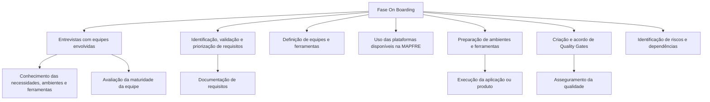

# Fase On Boarding — Documentação Reef MAPFRE

## 1. Metadados do Documento
- **Arquivo de Origem:** Não identificado no conteúdo fornecido
- **Tipo de Documento:** Procedimento
- **Domínio / Sistema:** Reef / MAPFRE
- **Público-Alvo:** Desenvolvedores, Arquitetos, Operação e equipes envolvidas no projeto
- **Data/Versão Identificada:** Não identificada

---

## 2. Resumo Executivo & Contexto de Negócio

O documento descreve a fase de **On Boarding** no contexto de documentação Reef da MAPFRE. Esta fase estabelece as condições organizacionais, técnicas e operacionais necessárias para iniciar o desenvolvimento de uma aplicação ou produto.

Durante o On Boarding, são previstas as ferramentas e plataformas necessárias para o desenvolvimento. A fase também inclui a definição de um diagrama de arquitetura de referência, a organização da equipe de desenvolvimento e a definição de acordos de equipe sob um orçamento estimado.

As atividades descritas abrangem entrevistas com equipes envolvidas, identificação e priorização de requisitos, definição de recursos e ferramentas, uso das plataformas disponíveis na MAPFRE, preparação de ambientes e ferramentas, criação de Quality Gates e identificação de riscos e dependências entre equipes.

O documento aponta para seções complementares — como **Primeiros passos**, **Plan**, **Requisitos**, **Aplicaciones**, **Backlog y Releases**, **Recursos**, **Plataformas**, **Configuración**, **Quality Gates** e **Identificar Riesgos y Dependencias** —, mas não apresenta o conteúdo detalhado dessas seções no material fornecido.

---

## 3. Arquitetura, Componentes & Tecnologias Envolvidas

O conteúdo fornecido não especifica microsserviços, tecnologias, protocolos, servidores, integrações, linguagens de programação, plataformas concretas ou ambientes nomeados. Os elementos identificados são processuais e documentais:

- **Reef:** contexto de documentação citado no cabeçalho.
- **MAPFRE:** organização/plataforma corporativa citada como fonte de plataformas disponíveis.
- **Mapfredocument:** elemento visual ou identificador exibido no documento.
- **Zeus:** item presente na navegação da página, sem descrição funcional.
- **Quality Gates:** controles de qualidade que devem ser criados e acordados.
- **Equipes envolvidas:** participantes das entrevistas, da definição de necessidades e da identificação de dependências.



> **Nota de Análise:** O documento menciona plataformas disponíveis na MAPFRE, mas não lista quais plataformas são utilizadas. Também não detalha o diagrama de arquitetura de referência que deve ser definido durante o On Boarding.

---

## 4. Regras de Negócio, Especificações Funcionais & Processos

### Processo: execução da fase de On Boarding

1. Prever ferramentas e plataformas necessárias para desenvolver o produto.
2. Definir o diagrama de arquitetura de referência.
3. Organizar a equipe de desenvolvimento.
4. Definir acordos de equipe sob um orçamento estimado.
5. Realizar entrevistas com as equipes envolvidas.
6. Identificar necessidades, ambientes e ferramentas para criação da solução.
7. Conhecer o nível de maturidade da equipe participante do projeto.
8. Identificar requisitos.
9. Documentar, validar e priorizar os requisitos identificados.
10. Definir as equipes de desenvolvimento e as ferramentas necessárias.
11. Conhecer e utilizar as plataformas disponíveis na MAPFRE.
12. Configurar e preparar todos os ambientes e ferramentas para execução da aplicação ou produto.
13. Criar e acordar Quality Gates para assegurar a qualidade da aplicação ou produto.
14. Identificar riscos e dependências entre equipes.

### Regras e critérios explicitamente apresentados

- Os requisitos devem ser **documentados**, **validados** e **priorizados**.
- A definição das equipes de desenvolvimento deve ocorrer em conjunto com a definição das ferramentas necessárias.
- Os ambientes e ferramentas devem ser configurados e preparados para a execução da aplicação ou produto.
- Os Quality Gates devem ser criados e acordados para assegurar a qualidade da aplicação ou produto.
- Riscos e dependências entre equipes devem ser identificados.
- As entrevistas iniciais devem permitir identificar necessidades, ambientes e ferramentas, além de conhecer o nível de maturidade das equipes participantes.

### Referências internas indicadas

| Atividade | Seção de detalhamento indicada |
| :--- | :--- |
| Entrevistas e avaliação de maturidade das equipes | Primeros pasos |
| Requisitos documentados, validados e priorizados | Plan, Requisitos, Aplicaciones, Backlog y Releases |
| Definição de equipes e ferramentas | Recursos |
| Plataformas disponíveis na MAPFRE | Plataformas |
| Preparação de ambientes e ferramentas | Configuración |
| Criação e acordo de controles de qualidade | Quality Gates |
| Identificação de riscos e dependências | Identificar Riesgos y Dependencias |

---

## 5. Tabelas de Parâmetros, Ambientes e Estruturas de Dados

| Item / Parâmetro | Descrição / Função | Tipo / Valores / Formato | Ambiente / Observações |
| :--- | :--- | :--- | :--- |
| Fase On Boarding | Fase inicial de previsão, organização e preparação para desenvolvimento de produto ou aplicação | Processo | Contexto Reef / MAPFRE |
| Ferramentas | Recursos necessários ao desenvolvimento do produto | Não detalhado | Devem ser previstas e definidas |
| Plataformas | Plataformas necessárias ao desenvolvimento e plataformas disponíveis na MAPFRE | Não detalhado | O documento não nomeia plataformas específicas |
| Diagrama de arquitetura de referência | Artefato arquitetural a ser definido durante o On Boarding | Diagrama | Conteúdo do diagrama não fornecido |
| Equipe de desenvolvimento | Equipe que deve ser organizada e definida | Recurso organizacional | Inclui avaliação de maturidade durante entrevistas |
| Orçamento estimado | Base sob a qual acordos de equipe são definidos | Não detalhado | Não há valores ou critérios de cálculo |
| Requisitos | Necessidades identificadas para a solução | Devem ser documentados, validados e priorizados | Referência: Plan, Requisitos, Aplicaciones, Backlog y Releases |
| Ambientes | Ambientes necessários à execução da aplicação ou produto | Não detalhado | Devem ser configurados e preparados |
| Quality Gates | Controles acordados para assegurar a qualidade | Não detalhado | Sem critérios, métricas ou ferramentas especificados |
| Riscos | Riscos identificados durante a fase | Não detalhado | Inclui riscos entre equipes |
| Dependências | Dependências entre equipes que devem ser identificadas | Não detalhado | Sem matriz de dependências apresentada |
| Owner | Responsável indicado no cabeçalho | `user:agonzalez_mapfre.com` | Conforme texto extraído |
| Lifecycle | Estado do documento | `Approved` | Conforme texto extraído |
| Source | Origem/classificação indicada | `VL` | O significado de `VL` não é detalhado |

---

## 6. Bateria de Perguntas & Respostas para RAG (FAQ Sintético)

### P1: Qual é o objetivo da fase de On Boarding no contexto Reef?
**R:** A fase de On Boarding prepara as condições necessárias para desenvolver uma aplicação ou produto. Ela prevê ferramentas e plataformas, define o diagrama de arquitetura de referência, organiza a equipe de desenvolvimento e estabelece acordos de equipe sob um orçamento estimado.

### P2: Quais atividades devem ser realizadas durante o On Boarding?
**R:** As atividades incluem entrevistar equipes envolvidas, identificar necessidades, ambientes e ferramentas, avaliar a maturidade das equipes, identificar requisitos, documentar, validar e priorizar requisitos, definir equipes e ferramentas, utilizar plataformas MAPFRE, preparar ambientes, criar Quality Gates e identificar riscos e dependências.

### P3: Como os requisitos devem ser tratados na fase de On Boarding?
**R:** Os requisitos devem ser identificados, documentados, validados e priorizados. O documento indica que essa atividade é detalhada nas seções Plan, Requisitos, Aplicaciones, Backlog y Releases.

### P4: Qual é a finalidade das entrevistas com as equipes envolvidas?
**R:** As entrevistas servem para identificar necessidades, ambientes e ferramentas necessários para a criação da solução. Elas também permitem conhecer o nível de maturidade da equipe que participará do projeto.

### P5: O documento especifica quais ferramentas ou plataformas devem ser usadas?
**R:** Não. O documento determina que ferramentas e plataformas devem ser previstas e que as plataformas disponíveis na MAPFRE devem ser conhecidas e utilizadas, mas não lista nomes de ferramentas, tecnologias ou plataformas concretas.

### P6: O que deve ser definido em relação à arquitetura durante o On Boarding?
**R:** Deve ser definido um diagrama de arquitetura de referência. O conteúdo fornecido não apresenta os componentes, camadas, integrações ou tecnologias desse diagrama.

### P7: Qual é o papel dos Quality Gates no processo descrito?
**R:** Os Quality Gates devem ser criados e acordados para assegurar a qualidade da aplicação ou produto a ser realizado. O documento não detalha critérios de aprovação, métricas, responsáveis ou ferramentas para esses controles.

### P8: Quais preparações de ambiente são exigidas antes da execução da aplicação ou produto?
**R:** Todos os ambientes e ferramentas necessários devem ser configurados e preparados para a execução da aplicação ou produto. O documento não especifica os ambientes, configurações ou procedimentos técnicos envolvidos.

### P9: Como riscos e dependências devem ser tratados?
**R:** A fase de On Boarding exige identificar qualquer tipo de risco e/ou dependência entre equipes. A atividade é referenciada pela seção Identificar Riesgos y Dependencias, cujo detalhamento não está presente no conteúdo fornecido.

### P10: Onde o documento indica que a definição de equipes e ferramentas deve ser detalhada?
**R:** A definição de equipes de desenvolvimento em conjunto com as ferramentas necessárias é referenciada pela seção Recursos.

### P11: Qual é o estado de ciclo de vida identificado para o documento?
**R:** O cabeçalho extraído apresenta o campo Lifecycle com o valor `Approved`.

### P12: Há especificação de orçamento no material fornecido?
**R:** Não. O documento afirma que os acordos de equipe são definidos sob um orçamento estimado, mas não apresenta valores, critérios de estimativa, responsáveis ou processo de aprovação orçamentária.

---

## 7. Glossário de Termos, Siglas & Conceitos-Chave

- **On Boarding:** Fase de preparação para desenvolvimento de uma aplicação ou produto, envolvendo equipes, requisitos, ferramentas, plataformas, ambientes, qualidade, riscos e dependências.
- **Reef:** Contexto ou repositório de documentação citado no título e na navegação.
- **MAPFRE:** Organização mencionada como provedora de plataformas disponíveis para utilização.
- **Quality Gates:** Controles que devem ser criados e acordados para assegurar a qualidade da aplicação ou produto.
- **Backlog:** Termo citado em referência interna (`Backlog y Releases`), sem detalhamento adicional no conteúdo.
- **Releases:** Termo citado em referência interna (`Backlog y Releases`), sem detalhamento adicional no conteúdo.
- **Lifecycle:** Campo de ciclo de vida do documento, identificado com o valor `Approved`.
- **Owner:** Campo de responsável do documento, identificado como `user:agonzalez_mapfre.com`.
- **VL:** Valor identificado no campo Source; seu significado não é detalhado no conteúdo.

---

## 8. Notas Críticas, Riscos & Limitações

- O conteúdo fornecido é uma visão resumida da fase de On Boarding e referencia diversas seções internas que não foram incluídas na extração.
- Não foram identificados nomes de tecnologias, linguagens, microsserviços, APIs, URLs, servidores, portas, repositórios, pipelines ou ferramentas específicas.
- O documento exige a definição de um diagrama de arquitetura de referência, mas não fornece o diagrama nem suas informações estruturais.
- O documento determina a criação de Quality Gates, mas não define métricas, regras de aprovação, ferramentas, responsáveis ou critérios de exceção.
- Riscos e dependências entre equipes devem ser identificados, porém não há inventário, classificação, impacto, plano de mitigação ou responsáveis no texto extraído.
- O orçamento estimado é mencionado, mas não há valores, premissas, processo de cálculo ou aprovação.
- A página 2 não contém conteúdo textual funcional identificável.

---

## 9. Conteúdo Bruto Estruturado (Referência Fiel)

```text
--- [PÁGINA 1 DE 2] ---

FASE ON BOARDING
Imagen ONBOARDING
ON BOARDING
Durante la fase de On Boarding se
lleva a cabo la previsión de las
herramientas y plataformas
necesarias para desarrollar el
producto, se dene el diagrama de
arquitectura de referencia, se
organiza el equipo de desarrollo y se
denen los acuerdos de equipo bajo
un presupuesto estimado.
Las actividades que se realizan en esta fase
son:
Celebrar entrevistas con los equipos
involucrados para identicar sus
necesidades, entornos o herramientas de
cara a la creación de la solución.
De este modo, conoceremos el nivel de
madurez del equipo que participará en el
proyecto.
Esta actividad se detalla en: Primeros
pasos
Identicar los requisitos, que deberán ser
documentados, validados y priorizados.
Esta actividad se detalla en: Plan,
Requisitos, Aplicaciones, Backlog y
Releases
Denir los equipos de desarrollo junto
con las herramientas necesarias.
Esta actividad se detalla en: Recursos
Conocer y utilizar las plataformas
disponibles en MAPFRE.
Esta actividad se detalla en: Plataformas
Congurar y preparar todos los entornos
y herramientas para la ejecución de la
aplicación / producto.
Esta actividad se detalla en: Conguración
Crear y acordar los Quality Gates que
asegurarán la Calidad de la aplicación /
producto a realizar.
Esta actividad se detalla en: Quality Gates
Identicar cualquier tipo de riesgo y/o
dependencia entre equipos.
Esta actividad se detalla en: Identicar
Riesgos y Dependencias
Documentation / DOCUMENTACIÓN Reef
DOCUMENTACIÓN Reef
Mapfredocument
DOCUMENTACIÓN Reef
Owner
user:agonzalez_mapfre.com
Lifecycle
Approved Source
 / 
 VL
Buscar Inicio Soluciones Arquitecturas APIs Componentes Cloud Documentación Zeus Reef Ayuda
ES

--- [PÁGINA 2 DE 2] ---

[Página em branco ou apenas elementos visuais/imagem]
```
