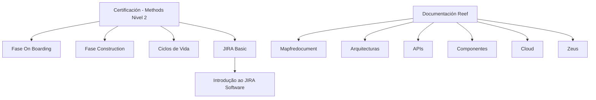

# Certificação Methods Nível 2 — Temário de Metodologia de Desenvolvimento e Documentação Reef

## 1. Metadados do Documento
- **Arquivo de Origem:** `Não identificado`
- **Tipo de Documento:** Apresentação Executiva / Material de Certificação
- **Domínio / Sistema:** Certificação Methods Nível 2; metodologia de desenvolvimento; Reef; Mapfre
- **Público-Alvo:** Desenvolvedores, Arquitetos e profissionais em certificação de metodologia
- **Data/Versão Identificada:** Não identificada

---

## 2. Resumo Executivo & Contexto de Negócio

O documento apresenta a estrutura temática da **Certificación - Methods Nivel 2**, organizada como conteúdo de capacitação associado à metodologia de desenvolvimento. O material separa o temário em três áreas: **Fase On Boarding**, **Fase Construction** e **Ciclos de Vida**.

A Fase On Boarding contém o temário correspondente à etapa de entrada na metodologia de desenvolvimento. A Fase Construction contém o temário da etapa de construção. A seção Ciclos de Vida aborda os ciclos aplicáveis dentro da mesma metodologia.

O documento também inclui uma introdução ao **JIRA Software**, identificada como “JIRA Basic”. A referência sugere que o treinamento contempla o uso inicial da ferramenta JIRA Software, mas não especifica funcionalidades, fluxos, permissões, projetos ou procedimentos operacionais.

Por fim, o conteúdo referencia a documentação **Reef**, o sistema ou área **Mapfredocument**, um proprietário identificado como `user:agonzalez_mapfre.com` e um ciclo de vida com o estado “Approved Source / VL”. O texto não detalha a relação operacional entre a certificação, a documentação Reef, Mapfredocument e os itens de navegação apresentados.

---

## 3. Arquitetura, Componentes & Tecnologias Envolvidas

| Componente / Área | Papel identificado no documento | Detalhamento disponível |
| :--- | :--- | :--- |
| Certificación - Methods Nivel 2 | Certificação ou material de capacitação em metodologia de desenvolvimento | O documento apresenta os blocos temáticos da certificação. |
| Fase On Boarding | Área temática da metodologia de desenvolvimento | O documento informa que contém o temário da fase On Boarding. |
| Fase Construction | Área temática da metodologia de desenvolvimento | O documento informa que contém o temário da fase Construction. |
| Ciclos de Vida | Área temática sobre ciclos aplicáveis à metodologia | O documento informa que contém o temário correspondente aos ciclos de vida aplicáveis. |
| JIRA Basic | Introdução à ferramenta JIRA Software | Não há detalhamento de recursos, configurações ou procedimentos. |
| Reef | Área ou repositório de documentação mencionado como “Documentation / DOCUMENTACIÓN Reef” | O documento exibe referências de navegação e ciclo de vida, sem arquitetura técnica. |
| Mapfredocument | Sistema, repositório ou contexto documental citado no material | Não há descrição funcional ou técnica adicional. |
| Zeus | Item de navegação na documentação Reef | Não há detalhamento adicional. |
| Cloud | Item de navegação na documentação Reef | Não há detalhamento adicional. |



> **Nota de Análise:** O documento não descreve integrações técnicas, protocolos, APIs, microsserviços, bancos de dados, ambientes de execução ou contratos de dados. O diagrama representa exclusivamente as relações temáticas e de navegação explicitamente apresentadas.

---

## 4. Regras de Negócio, Especificações Funcionais & Processos

### Estrutura do temário da certificação

1. **Fase On Boarding**
   - O documento indica que esta seção contém o temário da fase On Boarding.
   - A fase On Boarding está inserida na metodologia de desenvolvimento.
   - Não são informados conteúdos programáticos, critérios de conclusão, responsáveis ou entregáveis da fase.

2. **Fase Construction**
   - O documento indica que esta seção contém o temário da fase Construction.
   - A fase Construction está inserida na metodologia de desenvolvimento.
   - Não são informados conteúdos programáticos, etapas de construção, validações, ferramentas obrigatórias ou entregáveis.

3. **Ciclos de Vida**
   - O documento indica que esta seção contém o temário sobre ciclos de vida aplicáveis na metodologia de desenvolvimento.
   - Não são identificados os nomes dos ciclos de vida, suas transições, estados, condições de entrada ou critérios de saída.

4. **JIRA Basic**
   - O documento apresenta “JIRA BASIC” como conteúdo de introdução à ferramenta JIRA Software.
   - Não há descrição de projetos, issues, workflows, dashboards, permissões, campos ou automações do JIRA Software.

### Referências documentais e de ciclo de vida

- A documentação é identificada como **Documentation / DOCUMENTACIÓN Reef**.
- A documentação também referencia **Mapfredocument**.
- O campo **Owner** apresenta o valor `user:agonzalez_mapfre.com`.
- O campo **Lifecycle** apresenta os valores ou estados visíveis `Approved Source / VL`.
- O menu de navegação contém: `Buscar`, `Inicio`, `Soluciones`, `Arquitecturas`, `APIs`, `Componentes`, `Cloud`, `Documentación`, `Zeus`, `Reef` e `Ayuda`.
- O idioma exibido na interface é `ES`.

> **Nota de Análise:** O material não define regras de aprovação, significado de “VL”, política de versionamento, responsabilidades do owner ou processo de publicação da documentação Reef.

---

## 5. Tabelas de Parâmetros, Ambientes e Estruturas de Dados

| Item / Parâmetro | Descrição / Função | Tipo / Valores / Formato | Ambiente / Observações |
| :--- | :--- | :--- | :--- |
| Certificación - Methods Nivel 2 | Identificação da certificação ou material de capacitação | Texto | O documento não informa versão ou data. |
| Fase On Boarding | Bloco de temário da metodologia de desenvolvimento | Texto | Não há detalhamento do conteúdo da fase. |
| Fase Construction | Bloco de temário da metodologia de desenvolvimento | Texto | Não há detalhamento do conteúdo da fase. |
| Ciclos de Vida | Bloco de temário sobre ciclos aplicáveis à metodologia | Texto | Não há lista de ciclos ou regras de transição. |
| JIRA Basic | Conteúdo introdutório relacionado ao JIRA Software | Texto | Não são descritas funcionalidades ou procedimentos. |
| Documentation / DOCUMENTACIÓN Reef | Referência à documentação Reef | Texto | Exibido em inglês e espanhol. |
| Mapfredocument | Referência documental apresentada no conteúdo | Texto | Função não detalhada. |
| Owner | Proprietário da documentação ou registro | `user:agonzalez_mapfre.com` | O documento não define a responsabilidade associada. |
| Lifecycle | Campo de ciclo de vida do registro documental | `Approved Source / VL` | O significado de `VL` não é explicado. |
| Idioma | Idioma indicado na interface | `ES` | A interface apresenta textos em espanhol. |
| Navegação Reef | Itens apresentados no menu | Buscar; Inicio; Soluciones; Arquitecturas; APIs; Componentes; Cloud; Documentación; Zeus; Reef; Ayuda | Não são fornecidas URLs ou rotas. |

---

## 6. Bateria de Perguntas & Respostas para RAG (FAQ Sintético)

### P1: Qual é o objetivo do documento Certificación - Methods Nivel 2?
**R:** O documento apresenta a estrutura temática de uma certificação relacionada à metodologia de desenvolvimento. O material organiza o temário nas áreas Fase On Boarding, Fase Construction, Ciclos de Vida e JIRA Basic.

### P2: Quais fases da metodologia de desenvolvimento são mencionadas?
**R:** O documento menciona a Fase On Boarding e a Fase Construction. Ambas são apresentadas como seções que contêm temários dentro da metodologia de desenvolvimento.

### P3: O que o documento informa sobre a Fase On Boarding?
**R:** O documento informa que a Fase On Boarding possui um temário próprio dentro da metodologia de desenvolvimento. Não há detalhamento dos tópicos, atividades, entregáveis ou critérios de conclusão dessa fase.

### P4: O que o documento informa sobre a Fase Construction?
**R:** O documento informa que a Fase Construction possui um temário próprio dentro da metodologia de desenvolvimento. O conteúdo fornecido não descreve etapas de implementação, validações, artefatos ou responsabilidades dessa fase.

### P5: Quais informações existem sobre os ciclos de vida?
**R:** O documento afirma que há um temário correspondente aos ciclos de vida aplicáveis dentro da metodologia de desenvolvimento. Entretanto, não identifica os ciclos de vida, seus estados, transições ou regras de uso.

### P6: Qual é o conteúdo relacionado ao JIRA Software?
**R:** O material inclui a seção “JIRA Basic”, descrita como uma introdução à ferramenta JIRA Software. Não são informados recursos específicos, configurações, permissões, workflows ou procedimentos na ferramenta.

### P7: Qual documentação é referenciada no documento?
**R:** O documento referencia “Documentation / DOCUMENTACIÓN Reef”, “DOCUMENTACIÓN Reef” e “Mapfredocument”. Não é detalhado se Mapfredocument é um sistema, repositório ou componente da documentação Reef.

### P8: Quem é o owner indicado na documentação Reef?
**R:** O campo Owner apresenta o valor `user:agonzalez_mapfre.com`. O documento não descreve as atribuições, responsabilidades ou escopo de atuação desse owner.

### P9: Qual é o ciclo de vida exibido para a documentação?
**R:** O campo Lifecycle exibe `Approved Source / VL`. O documento não explica o significado operacional de “Approved Source” nem da sigla ou valor “VL”.

### P10: Quais áreas podem ser acessadas pelo menu da documentação Reef?
**R:** O menu apresentado contém os itens Buscar, Inicio, Soluciones, Arquitecturas, APIs, Componentes, Cloud, Documentación, Zeus, Reef e Ayuda. O documento não fornece URLs, permissões ou descrição funcional desses itens.

### P11: O documento descreve uma arquitetura de microsserviços ou integrações?
**R:** Não. O conteúdo não apresenta microsserviços, endpoints, protocolos, bancos de dados, filas, contratos de integração, tecnologias de infraestrutura ou fluxos técnicos de comunicação.

### P12: Existe data, versão ou identificação formal do arquivo de origem?
**R:** Não. O trecho fornecido apresenta o título “CERTIFICACIÓN - METHODS NIVEL 2”, mas não informa nome de arquivo, data de publicação, número de versão ou histórico de revisões.

---

## 7. Glossário de Termos, Siglas & Conceitos-Chave

- **Methods Nivel 2:** Nome apresentado para a certificação ou nível de capacitação relacionado à metodologia de desenvolvimento.
- **On Boarding:** Nome de uma fase da metodologia de desenvolvimento citada no documento.
- **Construction:** Nome de uma fase da metodologia de desenvolvimento citada no documento.
- **Ciclos de Vida:** Tema relativo aos ciclos aplicáveis dentro da metodologia de desenvolvimento.
- **JIRA Basic:** Conteúdo introdutório à ferramenta JIRA Software.
- **JIRA Software:** Ferramenta explicitamente mencionada como objeto da introdução JIRA Basic.
- **Reef:** Nome associado à documentação apresentada como “Documentation / DOCUMENTACIÓN Reef”.
- **Mapfredocument:** Termo exibido no contexto da documentação Reef, sem definição adicional no texto.
- **Owner:** Campo que identifica o proprietário de um registro documental.
- **Lifecycle:** Campo que identifica o ciclo de vida de um registro documental.
- **Approved Source:** Valor apresentado no campo Lifecycle; sem definição adicional no texto.
- **VL:** Valor ou sigla apresentada junto de “Approved Source”; sem definição adicional no texto.
- **ES:** Código de idioma apresentado na interface; o contexto visual utiliza conteúdo em espanhol.
- **Zeus:** Item de navegação apresentado na documentação Reef, sem detalhamento adicional.

---

## 8. Notas Críticas, Riscos & Limitações

- O conteúdo é resumido e não apresenta detalhamento dos tópicos programáticos de On Boarding, Construction ou Ciclos de Vida.
- Não há informações sobre requisitos de certificação, critérios de aprovação, duração, avaliação, trilhas, pré-requisitos ou responsáveis.
- A introdução ao JIRA Software não informa processos, configurações, permissões, estruturas de projeto ou fluxos de trabalho.
- Não há especificações de arquitetura, integrações, APIs, ambientes, URLs, credenciais, servidores, logs, tecnologias ou versões.
- Os termos `Mapfredocument`, `Approved Source` e `VL` são apresentados sem definição contextual suficiente.
- O arquivo de origem, a versão documental e a data de publicação não foram identificados.
- **Nota de Análise:** O documento lista a documentação Reef e itens de menu como Arquitecturas, APIs, Componentes, Cloud e Zeus, porém não detalha o conteúdo, a governança ou a relação técnica entre esses elementos.

---

## 9. Conteúdo Bruto Estruturado (Referência Fiel)

```text
--- [PÁGINA 1 DE 1] ---

CERTIFICACIÓN - METHODS NIVEL 2
CERTIFICACIÓN METHODS NIVEL 2
FASE ON BOARDING
En este apartado se encuentra el temario
de la fase ON BOARDING, dentro de la
metodología de desarrollo.
FASE CONSTRUCTION
En este apartado se encuentra el temario
de la fase CONSTRUCTION, dentro de la
metodología de desarrollo.
CICLOS DE VIDA
En este apartado se encuentra el temario
correspondiente a los ciclos de vida
aplicables dentro de la metodología de
desarrollo.
JIRA BASIC
En este apartado se encuentra el temario
de introducción a la herramienta JIRA
Software.
Documentation / DOCUMENTACIÓN Reef
DOCUMENTACIÓN Reef
Mapfredocument
DOCUMENTACIÓN Reef
Owner
user:agonzalez_mapfre.com
Lifecycle
Approved Source
 /
VL
Buscar Inicio Soluciones Arquitecturas APIs Componentes Cloud Documentación Zeus Reef Ayuda
ES
```
