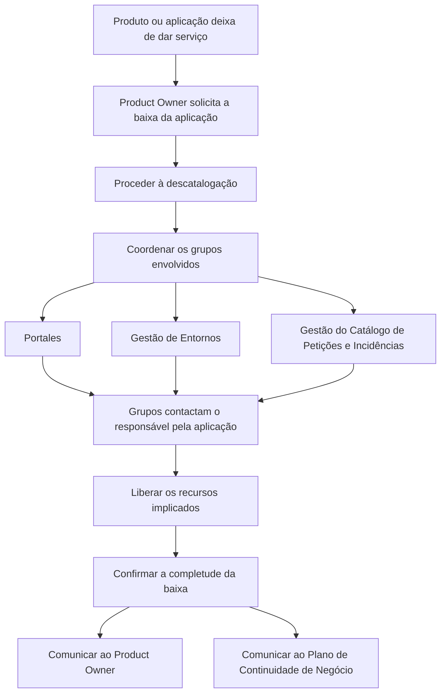

# Fase de Decomisado de Aplicações — Processo de Baixa e Liberação de Recursos

## 1. Metadados do Documento
- **Arquivo de Origem:** `Não identificado no conteúdo fornecido`
- **Tipo de Documento:** `Procedimento`
- **Domínio / Sistema:** `Reef / Portfolio de Aplicações`
- **Público-Alvo:** `Product Owners, equipes de Portais, Gestão de Entornos, Gestão do Catálogo de Petições e Incidências, Plano de Continuidade de Negócio`
- **Data/Versão Identificada:** `Não identificada`
- **Escopo da Extração:** `Uma página de conteúdo bruto fornecida`

---

## 2. Resumo Executivo & Contexto de Negócio

O documento descreve a fase de **Decomisado**, aplicável quando um produto ou aplicação deixa de prestar serviço. O objetivo do decomisado é garantir que a aplicação não permaneça ativa no portfolio de aplicações após o encerramento de sua utilização.

A permanência indevida de um produto ou aplicação no portfolio pode consumir recursos e gerar gastos. Por isso, o processo de decomisado prevê a solicitação formal de baixa, a descatalogação da aplicação e a coordenação das equipes responsáveis pelas atividades técnicas e operacionais necessárias.

O **Product Owner** inicia o processo ao solicitar a baixa da aplicação. Em seguida, os grupos envolvidos devem ser coordenados, incluindo Portales, Gestão de Entornos e Gestão do Catálogo de Petições e Incidências.

Após a execução das responsabilidades de cada grupo, os recursos envolvidos devem ser liberados. Ao final da baixa, a conclusão deve ser confirmada e comunicada ao Product Owner e ao Plano de Continuidade de Negócio.

---

## 3. Arquitetura, Componentes & Tecnologias Envolvidas

O conteúdo não descreve uma arquitetura técnica de software, protocolos, integrações, tecnologias, servidores ou contratos de API. A página apresenta um fluxo operacional de decomisado e os grupos corporativos envolvidos.

### Componentes, papéis e áreas citadas

| Componente / Área | Papel identificado no documento |
| :--- | :--- |
| Produto / Aplicação | Ativo que deixa de prestar serviço e deve ser decomisado. |
| Portfolio de Aplicações | Catálogo no qual a aplicação não deve continuar ativa após a baixa. |
| Product Owner | Responsável por solicitar a baixa da aplicação e receber a comunicação de conclusão. |
| Portales | Grupo citado como participante da colaboração necessária para o decomisado. |
| Gestão de Entornos | Grupo citado como participante da colaboração necessária para o decomisado. |
| Gestão do Catálogo de Petições e Incidências | Grupo citado como participante da colaboração necessária para o decomisado. |
| Responsável pela aplicação | Pessoa contatada pelos grupos para que cada grupo execute sua parte correspondente. |
| Plano de Continuidade de Negócio | Destinatário da comunicação após a finalização da baixa. |
| Reef | Área, sistema ou repositório documental mencionado como fonte de documentação relacionada ao decomisado. |
| Mapfredocument | Referência exibida no conteúdo bruto; a função não é detalhada. |
| Zeus | Referência exibida na navegação documental; a função não é detalhada. |



> **Nota de Análise:** O documento não detalha quais recursos são liberados, quais sistemas executam a descatalogação, nem os mecanismos usados para comunicação entre as equipes.

---

## 4. Regras de Negócio, Especificações Funcionais & Processos

### Regra de acionamento do decomisado

O decomisado deve ser realizado quando um produto ou aplicação deixar de dar serviço. A finalidade é impedir que o ativo continue ativo no portfolio de aplicações, consumindo recursos e gerando gastos.

### Processo de decomisado

1. **Solicitar a baixa da aplicação**
   - O Product Owner deve solicitar a baixa da aplicação.
   - A solicitação de baixa é o primeiro passo da fase de Decomisado.
   - A baixa permite que seja realizada a descatalogação da aplicação.

2. **Coordenar os grupos envolvidos**
   - A colaboração entre os grupos envolvidos deve ser orquestrada.
   - Os grupos explicitamente citados são Portales, Gestão de Entornos e Gestão do Catálogo de Petições e Incidências.
   - O documento utiliza reticências ao listar grupos, portanto não fornece uma relação completa de todas as equipes participantes.

3. **Liberar os recursos implicados**
   - Os diferentes grupos devem entrar em contato com o responsável pela aplicação.
   - Cada grupo executa a parte que lhe corresponde no processo de decomisado.
   - O resultado esperado desta etapa é a liberação dos recursos envolvidos.

4. **Confirmar e comunicar a completude da baixa**
   - Após a finalização da baixa, a conclusão deve ser confirmada.
   - A conclusão deve ser comunicada ao Product Owner.
   - A conclusão também deve ser comunicada ao Plano de Continuidade de Negócio.

### Restrições e critérios explícitos

| Critério | Regra |
| :--- | :--- |
| Gatilho | O produto ou aplicação deixa de prestar serviço. |
| Início formal | O Product Owner solicita a baixa da aplicação. |
| Objetivo de catálogo | A aplicação deve ser descatalogada. |
| Coordenação | Deve haver colaboração orquestrada entre os grupos implicados. |
| Execução | Os grupos contactam o responsável pela aplicação e executam suas responsabilidades. |
| Recursos | Os recursos implicados devem ser liberados. |
| Encerramento | A completude da baixa deve ser confirmada e comunicada. |
| Comunicação final | Product Owner e Plano de Continuidade de Negócio devem ser notificados. |

---

## 5. Tabelas de Parâmetros, Ambientes e Estruturas de Dados

### Papéis e responsabilidades

| Item / Parâmetro | Descrição / Função | Tipo / Valores / Formato | Ambiente / Observações |
| :--- | :--- | :--- | :--- |
| Product Owner | Solicita a baixa da aplicação e recebe a comunicação de conclusão. | Papel organizacional | A solicitação é o primeiro passo do decomisado. |
| Responsável pela aplicação | É contatado pelos grupos envolvidos durante a execução das atividades de decomisado. | Papel organizacional | O documento não define atribuições adicionais. |
| Portales | Participa da colaboração para o decomisado. | Grupo envolvido | Responsabilidades específicas não detalhadas. |
| Gestão de Entornos | Participa da colaboração para o decomisado. | Grupo envolvido | Responsabilidades específicas não detalhadas. |
| Gestão do Catálogo de Petições e Incidências | Participa da colaboração para o decomisado. | Grupo envolvido | Responsabilidades específicas não detalhadas. |
| Plano de Continuidade de Negócio | Recebe comunicação após a finalização da baixa. | Área ou plano corporativo | O conteúdo não especifica o formato da comunicação. |

### Artefatos, estados e referências

| Item / Parâmetro | Descrição / Função | Tipo / Valores / Formato | Ambiente / Observações |
| :--- | :--- | :--- | :--- |
| Baixa da aplicação | Solicitação e conclusão do encerramento da aplicação. | Processo / estado operacional | Deve ser solicitada pelo Product Owner. |
| Descatalogação | Remoção da aplicação do catálogo ou portfolio de aplicações. | Atividade operacional | Decorre da solicitação de baixa. |
| Recursos implicados | Recursos que devem ser liberados durante o decomisado. | Não especificado | Tipos de recursos não detalhados. |
| Portfolio de aplicações | Conjunto de aplicações no qual o ativo não deve permanecer ativo após deixar de prestar serviço. | Catálogo corporativo | Não são fornecidas ferramentas ou URLs de administração. |
| Decomisado Documentation | Referência documental para detalhamento das tarefas. | Documentação | Mencionada como “Decomisado Documentation / DOCUMENTACIÓN Reef”. |
| Reef | Referência de documentação e navegação corporativa. | Sistema, área ou repositório não detalhado | O conteúdo não define sua função técnica. |
| Mapfredocument | Referência exibida no conteúdo bruto. | Não especificado | Não há detalhamento adicional. |
| Zeus | Referência exibida na navegação documental. | Não especificado | Não há detalhamento adicional. |

### Ambientes, URLs, logs e configurações

| Item / Parâmetro | Descrição / Função | Tipo / Valores / Formato | Ambiente / Observações |
| :--- | :--- | :--- | :--- |
| URLs | Não informadas. | Não aplicável | O documento não fornece URLs de ambiente. |
| Servidores | Não informados. | Não aplicável | O documento não identifica servidores. |
| Logs | Não informados. | Não aplicável | O documento não especifica rotas, níveis ou variáveis de log. |
| Portas | Não informadas. | Não aplicável | O documento não fornece portas de rede. |
| APIs / contratos JSON | Não informados. | Não aplicável | O documento não descreve interfaces técnicas. |

---

## 6. Bateria de Perguntas & Respostas para RAG (FAQ Sintético)

### P1: Quando uma aplicação deve entrar na fase de Decomisado?
**R:** Uma aplicação deve entrar na fase de Decomisado quando o produto ou aplicação deixar de dar serviço. O objetivo é evitar que a aplicação permaneça ativa no portfolio de aplicações, consumindo recursos e gerando gastos.

### P2: Quem deve iniciar o processo de baixa de uma aplicação?
**R:** O Product Owner deve iniciar o processo. O documento estabelece que solicitar a baixa da aplicação é o primeiro passo da fase de Decomisado.

### P3: Qual é a consequência esperada da solicitação de baixa feita pelo Product Owner?
**R:** A solicitação de baixa permite proceder à descatalogação da aplicação. O documento não detalha a ferramenta, o catálogo específico ou o procedimento técnico de descatalogação.

### P4: Quais grupos são citados como participantes do decomisado?
**R:** O documento cita Portales, Gestão de Entornos e Gestão do Catálogo de Petições e Incidências como grupos que devem colaborar no decomisado. A lista é apresentada com reticências, portanto pode não ser exaustiva.

### P5: Como deve ocorrer a colaboração entre as equipes envolvidas?
**R:** A colaboração entre os distintos grupos implicados deve ser orquestrada. O documento não identifica uma equipe, ferramenta ou fluxo de aprovação responsável por essa orquestração.

### P6: Quem os grupos envolvidos devem contatar durante o processo?
**R:** Os grupos envolvidos devem contatar o responsável pela aplicação para poder executar a parte que corresponde a cada grupo no processo de decomisado.

### P7: O que deve acontecer com os recursos implicados no decomisado?
**R:** Os recursos implicados devem ser liberados. O documento não especifica quais recursos estão incluídos, como infraestrutura, acessos, dados, licenças ou ambientes.

### P8: Quem deve receber a comunicação após a finalização da baixa?
**R:** Após a finalização da baixa, a conclusão deve ser comunicada ao Product Owner e ao Plano de Continuidade de Negócio.

### P9: Qual risco corporativo o decomisado procura evitar?
**R:** O decomisado procura evitar que um produto ou aplicação que já não presta serviço permaneça ativo no portfolio de aplicações, consumindo recursos e gerando gastos.

### P10: O documento informa métodos HTTP, contratos JSON ou APIs da aplicação decomisada?
**R:** Não. O conteúdo fornecido não descreve métodos HTTP, contratos JSON, APIs, tecnologias, ambientes, servidores ou integrações técnicas da aplicação.

### P11: Onde o documento indica que as tarefas de decomisado são detalhadas?
**R:** O conteúdo indica que as tarefas são detalhadas em “Decomisado Documentation / DOCUMENTACIÓN Reef”. Não são fornecidos links, caminhos de acesso ou conteúdo complementar dessa documentação.

### P12: O processo termina apenas com a liberação dos recursos?
**R:** Não. Após a liberação dos recursos, a baixa deve ser finalizada, sua completude deve ser confirmada e a conclusão deve ser comunicada ao Product Owner e ao Plano de Continuidade de Negócio.

---

## 7. Glossário de Termos, Siglas & Conceitos-Chave

- **Decomisado:** Fase em que um produto ou aplicação que deixou de prestar serviço é baixado, descatalogado e tem seus recursos implicados liberados.
- **Product Owner:** Papel responsável por solicitar a baixa da aplicação e por receber a comunicação de conclusão da baixa.
- **Baixa da aplicação:** Solicitação e conclusão do encerramento operacional da aplicação.
- **Descatalogação:** Ação de retirar a aplicação do catálogo ou portfolio de aplicações.
- **Portfolio de aplicações:** Conjunto de aplicações corporativas no qual uma aplicação não deve permanecer ativa após deixar de prestar serviço.
- **Recursos implicados:** Recursos associados à aplicação que devem ser liberados durante o decomisado; o documento não especifica sua natureza.
- **Portales:** Grupo citado como envolvido no processo de decomisado; o significado e as responsabilidades específicas não são expandidos.
- **Gestão de Entornos:** Grupo citado como envolvido no processo de decomisado.
- **Gestão do Catálogo de Petições e Incidências:** Grupo citado como envolvido no processo de decomisado.
- **Plano de Continuidade de Negócio:** Destinatário da comunicação após a baixa ser finalizada.
- **Reef:** Referência documental ou corporativa associada à documentação do decomisado; o significado não é expandido no texto.
- **Mapfredocument:** Referência exibida no conteúdo bruto; não detalhada.
- **Zeus:** Referência exibida na navegação documental; não detalhada.

---

## 8. Notas Críticas, Riscos & Limitações

- O documento fornecido contém apenas uma página e apresenta um processo resumido de decomisado.
- Não há detalhamento sobre critérios de aprovação, responsáveis pela orquestração, prazos, SLAs, evidências de conclusão ou mecanismos de escalonamento.
- Não são identificados os recursos que devem ser liberados, nem procedimentos técnicos para sua liberação.
- Não são fornecidos sistemas, URLs, ambientes, servidores, portas, variáveis de configuração, rotas de logs ou contratos de integração.
- A lista de equipes envolvidas não é necessariamente completa, pois o conteúdo usa reticências após mencionar Portales, Gestão de Entornos e Gestão do Catálogo de Petições e Incidências.
- O documento cita “Decomisado Documentation / DOCUMENTACIÓN Reef”, mas não disponibiliza o conteúdo dessa documentação complementar.
- **Nota de Análise:** O texto descreve uma fase operacional e organizacional; não há informação suficiente para derivar uma arquitetura de software, fluxos técnicos de dados ou especificações de API.

---

## 9. Conteúdo Bruto Estruturado (Referência Fiel)

```text
--- [PÁGINA 1 DE 1] ---

FASE DECOMISADO
DECOMISADO
Una vez que el producto/aplicación deje de dar servicio
se deberá decomisar para que no continúe activo/a en
el portfolio de aplicaciones consumiendo recursos y
generando gastos.
Las actividades que se realizan durante esta fase son:
Solicitar la baja de la aplicación
Como primer paso del Decomisado, el Product
Owner debe solicitar la baja de la aplicación
para que se proceda a su descatalogación.
Coordinar los equipos implicados en el
decomisado
Es preciso orquestar la colaboración entre los
distintos grupos implicados: Portales, Gestión
de Entornos, Gestión del Catálogo de
Peticiones de Incidencias...
Liberar los recursos implicados
Los distintos grupos contactarán con el
responsable de la aplicación para poder
ejecutar la parte que le corresponda.
Conrmar y comunicar la completitud de
la baja y comunicarla al Plan de
Continuidad de Negocio
Una vez nalizada la baja, se comunica al
Product Owner y al Plan de Continuidad de
Negocio.
Estas tareas se detallan en: Decomisado
Documentation / DOCUMENTACIÓN Reef
DOCUMENTACIÓN Reef
Mapfredocument
DOCUMENTACIÓN Reef
Owner
user:agonzalez_mapfre.com
Lifecycle
Approved Source
 / 
 VL
Buscar Inicio Soluciones Arquitecturas APIs Componentes Cloud Documentación Zeus Reef Ayuda
ES
```
