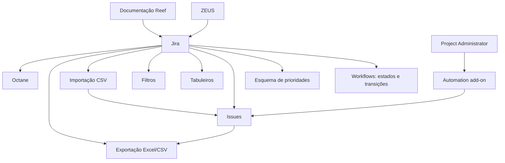

# JIRA Advance — Configuração Avançada, Automatismos e Integrações

## 1. Metadados do Documento
- **Arquivo de Origem:** Não identificado no conteúdo fornecido
- **Tipo de Documento:** Apresentação Executiva
- **Domínio / Sistema:** Jira, Octane, ZEUS e documentação Reef
- **Público-Alvo:** Administradores de projeto Jira, desenvolvedores, equipes de operação e gestão de projetos
- **Data/Versão Identificada:** Não identificada

---

## 2. Resumo Executivo & Contexto de Negócio

O documento apresenta tópicos de conhecimento avançado de Jira, com foco em configuração, personalização de processos, gestão de issues, criação de tabuleiros, filtros, importação/exportação de dados e automatização operacional. O conteúdo associa Jira à administração de projetos e ao controle do ciclo de vida de tickets ou issues.

A personalização de workflows permite definir e gerir estados e transições de issues em um projeto. O documento também cita esquemas de prioridades, que permitem associar subconjuntos de prioridades a projetos específicos, e a movimentação de issues entre projetos quando necessário.

A apresentação descreve recursos para operar informações de projeto, incluindo exportação de issues para Excel ou CSV e importação de ficheiros CSV. Para importação, o formato do ficheiro de origem varia conforme o tipo de informação importada.

O material também trata da criação de tabuleiros Scrum e Kanban, filtros rápidos, personalizados e por defeito, além de automatismos administrados pelo Project Administrator. São citadas integrações com Octane, ZEUS e a documentação Reef, mas o documento não fornece contratos técnicos, métodos HTTP, URLs, detalhes de sincronização ou especificações de dados dessas integrações.

---

## 3. Arquitetura, Componentes & Tecnologias Envolvidas

| Componente / Tecnologia | Papel identificado no documento |
| :--- | :--- |
| Jira | Plataforma central para gestão de projetos, issues, workflows, prioridades, tabuleiros, filtros, importações, exportações e automatismos. |
| Workflow Jira | Mecanismo para definir e gerir estados e transições de tickets ou issues em um projeto. |
| Esquema de Prioridades | Configuração que associa subconjuntos de prioridades a determinados projetos. |
| Issues | Tickets que podem ser movidos entre projetos, exportados, importados e utilizados em regras de automatização. |
| Excel / CSV | Formatos citados para exportação de informações de projetos e importação de dados. |
| Tabuleiro Scrum | Tipo de tabuleiro disponível para criação no Jira. |
| Tabuleiro Kanban | Tipo de tabuleiro disponível para criação no Jira. |
| Automation add-on | Add-on integrado ao funcionamento normal do Jira para criação de regras de automatização pelo Project Administrator. |
| Octane | Ferramenta com contenedores Jira sincronizados. |
| ZEUS | Sistema citado na criação de contenedores para Jira. |
| Reef | Repositório ou área de documentação citada como “DOCUMENTACIÓN Reef”. |
| Mapfredocument | Termo exibido no contexto da documentação Reef. |
| Project Administrator | Papel responsável por criar regras de automatização em cada projeto Jira. |



> **Nota de Análise:** O documento cita sincronização de contenedores Jira com Octane e criação de contenedores “ZEUS to JIRA”, mas não detalha direção do fluxo, mecanismos de integração, autenticação, frequência de sincronização ou estruturas de dados.

---

## 4. Regras de Negócio, Especificações Funcionais & Processos

### Workflows Jira
- Os workflows permitem definir e gerir os estados e as transições de tickets ou issues dentro de um projeto.
- O documento menciona a possibilidade de personalizar workflows.
- Não são identificados estados específicos, transições permitidas, condições, validadores, post-functions ou permissões de transição.

### Esquema de Prioridades
- O esquema de prioridades permite associar um subconjunto de prioridades a determinados projetos.
- O documento não informa quais prioridades existem, nem quais projetos recebem cada subconjunto.

### Movimentação de Issues
- Issues podem ser movidas entre projetos quando necessário.
- O documento não especifica critérios, permissões, impacto em campos, histórico, anexos, workflow ou responsáveis após a movimentação.

### Exportação de Issues
- A informação de um projeto Jira pode ser exportada para um ficheiro Excel.
- O título da funcionalidade também menciona exportação para Excel/CSV.
- O documento não define campos exportados, filtros aplicáveis, formato final, codificação ou limitações de volume.

### Importação de Ficheiros CSV
- O formato do ficheiro de origem varia conforme o tipo de informação a importar.
- As atividades citadas são:
  1. Formatear ficheiros CSV.
  2. Importar ficheiros CSV.
  3. Importar issues com orientação a produto.
- O documento não fornece layout CSV, nomes de colunas, campos obrigatórios, tipos de dados ou regras de validação.

### Criação de Tabuleiros
1. Acessar o projeto.
2. Selecionar a opção **Create Board**.
3. Criar um tabuleiro do tipo Scrum ou Kanban.

### Criação de Filtros no Tabuleiro
1. Posicionar-se na opção de busca simples ou avançada.
2. Aplicar as alterações no filtro.
3. Utilizar uma das opções citadas:
   - Filtros rápidos.
   - Filtros personalizados.
   - Filtros por defeito.

### Automatismos Jira
- Com a integração do add-on Automation ao funcionamento normal do Jira, o Project Administrator de cada projeto pode criar regras para automatizar processos.
- Automatismos disponíveis citados:
  - Atribuir a issue a um utilizador.
  - Criar subtarefas dependendo de Tests DoD.
  - Criar um número determinado de subtarefas.
  - Completar atributos ao passar de uma transição para outra.
  - Criar campos calculados.
  - Criar regra para herdar atributos de uma issue em outra.
  - Enviar notificação de novo defeito.

### Integrações
- O documento afirma existirem integrações e sincronizações com outras ferramentas para facilitar a operação diária.
- São citadas:
  - Contenedores Jira sincronizados com Octane.
  - ZEUS to JIRA: criação de contenedores.
  - Documentação Reef.

---

## 5. Tabelas de Parâmetros, Ambientes e Estruturas de Dados

| Item / Parâmetro | Descrição / Função | Tipo / Valores / Formato | Ambiente / Observações |
| :--- | :--- | :--- | :--- |
| Workflow | Define e gere estados e transições de tickets ou issues. | Configuração Jira | Personalizável; estados e transições não detalhados. |
| Esquema de Prioridades | Associa subconjuntos de prioridades a determinados projetos. | Configuração Jira | Prioridades e projetos não especificados. |
| Movimento de issue | Permite mover issues entre projetos. | Operação Jira | Critérios e permissões não detalhados. |
| Exportação de issues | Exporta informação de projeto Jira. | Excel / CSV | O texto afirma exportação para Excel; o título também menciona CSV. |
| Ficheiro CSV de origem | Fonte de dados para importação. | CSV | O formato varia segundo o tipo de informação a importar. |
| Importação de issues | Importa issues com orientação a produto. | Processo de importação | Layout, campos e validações não detalhados. |
| Create Board | Opção utilizada para criar um tabuleiro a partir do projeto. | Ação de interface Jira | Localização exata na interface não detalhada. |
| Tipo de tabuleiro | Define o modelo de tabuleiro criado. | Scrum; Kanban | São os dois tipos explicitamente citados. |
| Filtro rápido | Opção de filtro em tabuleiro. | Filtro Jira | Sem detalhamento adicional. |
| Filtro personalizado | Opção de filtro em tabuleiro. | Filtro Jira | Sem detalhamento adicional. |
| Filtro por defeito | Opção de filtro em tabuleiro. | Filtro Jira | Sem detalhamento adicional. |
| Automation add-on | Permite criar regras para automatização de processos. | Add-on Jira | Utilizado pelo Project Administrator. |
| Tests DoD | Critério citado para criação de subtarefas. | Termo não expandido | O documento não define a sigla DoD. |
| Octane | Ferramenta sincronizada com contenedores Jira. | Integração | Método de sincronização não detalhado. |
| ZEUS | Sistema citado na criação de contenedores Jira. | Integração | Fluxo técnico não detalhado. |
| Reef | Área ou sistema de documentação mencionado. | Documentação | Aparecem os termos “DOCUMENTACIÓN Reef” e “Mapfredocument”. |
| Owner | Proprietário exibido na documentação Reef. | `user:agonzalez_mapfre.com` | Valor apresentado literalmente no conteúdo. |
| Lifecycle | Estado de ciclo de vida exibido. | `Approved` | Contexto detalhado não informado. |
| Source | Origem exibida na documentação Reef. | `VL` | Contexto detalhado não informado. |

---

## 6. Bateria de Perguntas & Respostas para RAG (FAQ Sintético)

### P1: Para que servem os workflows no Jira?
**R:** Os workflows no Jira permitem definir e gerir os estados e as transições de tickets ou issues dentro de um projeto. O documento menciona a personalização de workflows, mas não especifica os estados, as transições, os validadores ou as permissões aplicáveis.

### P2: O que é um esquema de prioridades no Jira?
**R:** O esquema de prioridades permite associar um subconjunto de prioridades a determinados projetos Jira. O documento não informa quais são as prioridades disponíveis nem a configuração por projeto.

### P3: É possível mover issues entre projetos no Jira?
**R:** Sim. O documento indica que issues podem ser movidas entre projetos quando necessário. Não são apresentados critérios, permissões ou impactos dessa movimentação em campos, responsáveis, workflow ou histórico.

### P4: Quais formatos são citados para exportação de issues?
**R:** O documento afirma que a informação de um projeto Jira pode ser exportada para um ficheiro Excel. O título da funcionalidade também menciona exportação de issues para Excel/CSV. Não há detalhes sobre os campos exportados ou a estrutura dos ficheiros.

### P5: O que deve ser considerado na importação de ficheiros CSV?
**R:** O formato do ficheiro CSV de origem varia conforme o tipo de informação que será importada. As atividades citadas incluem formatar ficheiros CSV, importar ficheiros CSV e importar issues com orientação a produto. O documento não especifica colunas, campos obrigatórios ou regras de validação.

### P6: Como criar um tabuleiro no Jira segundo o documento?
**R:** Para criar um tabuleiro, é necessário acessar o projeto e selecionar **Create Board**. Os tipos de tabuleiro citados são Scrum e Kanban.

### P7: Que tipos de filtros podem ser criados dentro de um tabuleiro?
**R:** O documento cita filtros rápidos, filtros personalizados e filtros por defeito. Para criar um filtro, deve-se utilizar a opção de busca simples ou avançada e aplicar as alterações desejadas no filtro.

### P8: Quem pode criar automatismos no Jira?
**R:** O Project Administrator de cada projeto pode criar regras para automatizar processos, utilizando a integração do add-on Automation ao funcionamento normal do Jira.

### P9: Quais automatismos Jira são explicitamente mencionados?
**R:** São mencionados automatismos para atribuir uma issue a um utilizador, criar subtarefas dependendo de Tests DoD, criar um número determinado de subtarefas, completar atributos durante transições, criar campos calculados, herdar atributos de uma issue para outra e notificar um novo defeito.

### P10: Qual integração com Octane é mencionada?
**R:** O documento menciona contenedores Jira sincronizados com Octane. Não há detalhamento sobre a tecnologia de integração, a direção da sincronização, os dados sincronizados ou o tratamento de falhas.

### P11: O que significa “ZEUS to JIRA” no documento?
**R:** “ZEUS to JIRA” é apresentado como criação de contenedores. O documento não detalha quais contenedores são criados, quais dados são transferidos, nem como a integração entre ZEUS e Jira é implementada.

### P12: O documento fornece detalhes técnicos de APIs, URLs ou contratos de integração?
**R:** Não. O conteúdo apenas cita integrações e sincronizações com Octane, ZEUS e documentação Reef. Não são apresentados métodos HTTP, URLs, credenciais, contratos JSON, portas, versões ou mecanismos de autenticação.

---

## 7. Glossário de Termos, Siglas & Conceitos-Chave

- **Jira:** Plataforma central citada para gestão de projetos, issues, workflows, tabuleiros, filtros, importações, exportações e automatismos.
- **Issue:** Ticket ou item de trabalho gerido dentro de um projeto Jira.
- **Workflow:** Configuração que define e gere estados e transições de tickets ou issues.
- **Esquema de Prioridades:** Configuração que associa subconjuntos de prioridades a projetos específicos.
- **CSV:** Formato de ficheiro citado para importação e, no título da funcionalidade, exportação de issues.
- **Excel:** Formato de ficheiro citado para exportação da informação de um projeto Jira.
- **Scrum:** Tipo de tabuleiro Jira citado no documento.
- **Kanban:** Tipo de tabuleiro Jira citado no documento.
- **Automation:** Add-on integrado ao Jira para criação de regras de automatização.
- **Project Administrator:** Papel que pode criar regras de automatização em cada projeto.
- **DoD:** Termo presente em “Tests DoD”; o significado não é definido no documento.
- **Octane:** Ferramenta citada na sincronização de contenedores Jira.
- **ZEUS:** Sistema citado na criação de contenedores para Jira.
- **Reef:** Contexto ou área de documentação apresentada como “DOCUMENTACIÓN Reef”.
- **Mapfredocument:** Termo exibido na interface ou contexto da documentação Reef.
- **Contenedor:** Termo usado para elementos Jira sincronizados com Octane e criados a partir de ZEUS; sua definição funcional não é fornecida.

---

## 8. Notas Críticas, Riscos & Limitações

- O material é resumido e não apresenta detalhamento técnico de configuração, APIs, contratos, autenticação, permissões, campos ou modelos de dados.
- Não são identificados ambientes, URLs, servidores, versões de Jira, versões do add-on Automation ou versões de Octane e ZEUS.
- Os workflows são citados apenas conceitualmente; não há estados, transições, condições, validadores ou post-functions.
- A importação CSV não contém modelo de ficheiro, campos obrigatórios, regras de transformação ou mensagens de erro.
- As integrações com Octane e ZEUS não possuem especificação de sincronização, dados trocados, periodicidade, ownership ou tratamento de falhas.
- O termo **Tests DoD** é citado como condição para criação de subtarefas, mas não é definido.
- **Nota de Análise:** O documento lista automatismos e integrações, porém não detalha os critérios de disparo, as ações técnicas, os contratos de dados ou as regras de exceção associadas.

---

## 9. Conteúdo Bruto Estruturado (Referência Fiel)

```text
--- [PÁGINA 1 DE 2] ---

JIRA ADVANCE
JIRA ADVANCE
Conocimiento avanzado de Jira: con�guración, plugins, integraciones con herramientas...
Personalizar Work�ows
Los �ujos de trabajo permiten de�nir y
gestionar los estados y transiciones de los
tickets o issues dentro de un proyecto.
Work�ows en Jira
Personalizar el Esquema de Prioridades
El esquema de prioridades permite
asociar un subconjunto de prioridades a
determinados proyectos. Esquema de
Prioridades en Jira
Mover issues
Si es necesario, se pueden mover las
issues entre proyectos. Mover issues entre
proyectos
Exportar issues a Excel/csv
La información de un proyecto en JIRA se
puede exportar a un �chero Excel.
Exportar issues
Importar �cheros csv
El formato del �chero origen varía según el
tipo de información a importar.
- Formatear �cheros csv
- Importar �cheros csv
- Importar issues (orientación a producto)
Crear tableros
Para crear un tablero, hay que irse al
proyecto y pulsar en Create Board.
Existen varios tipos de tableros: - Tableros
Scrum - Tableros Kanban
Crear �ltros dentro del tablero
Para crear un �ltro hay que posicionarse
en la opción de búsqueda simple o
avanzada y aplicar los cambios en el �ltro.
Existen varias opciones: - Filtros rápidos -
Filtros personalizados - Filtros por defecto
Crear automatismos
Con la nueva integración del add-on
Automation al funcionamiento normal de
Jira, el Project Administrator de cada
proyecto puede crear diferentes reglas
para automatizar procesos. Crear
automatismos
Integración con otras herramientas
Existen algunas integraciones y
sincronizaciones con otras herramientas,
que ayudan a facilitar la operativa del día a
día.
Contenedores JIRA sincronizados con
Octane:
Documentation / DOCUMENTACIÓN Reef
DOCUMENTACIÓN Reef
Mapfredocument
DOCUMENTACIÓN Reef
Owner
user:agonzalez_mapfre.com
Lifecycle
Approved Source
 / 
 VL
Buscar Inicio Soluciones Arquitecturas APIs Componentes Cloud Documentación Zeus Reef Ayuda
ES


--- [PÁGINA 2 DE 2] ---

Algunos automatismos disponibles:
- Asignar al usuario - Crear subtareas
dependiendo de Tests DoD - Crear un
determinado número de subtareas -
Completar atributos al pasar de una
transición a otra - Crear campos
calculados - Crear regla para heredar
atributos de una issue en otra -
Noti�cación de nuevo defecto
ZEUS to JIRA: creación de
contenedores.
```
