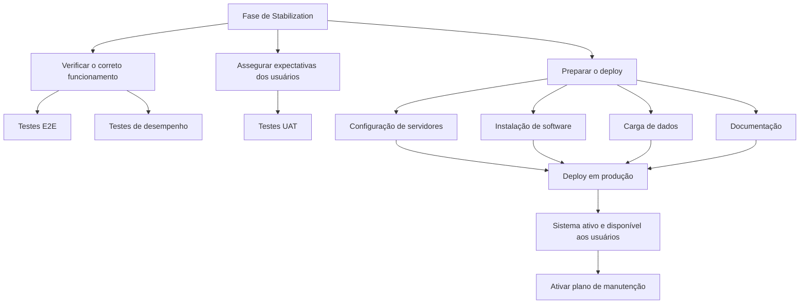

# Fase de Stabilization no Ciclo de Vida de Desenvolvimento de Software

## 1. Metadados do Documento
- **Arquivo de Origem:** Não identificado no conteúdo fornecido
- **Tipo de Documento:** Procedimento
- **Domínio / Sistema:** Reef / documentação Mapfre
- **Público-Alvo:** Desenvolvedores, Qualidade, Operação e equipes responsáveis pelo lançamento em produção
- **Data/Versão Identificada:** Não identificada

---

## 2. Resumo Executivo & Contexto de Negócio

O conteúdo descreve a fase de **Stabilization** como o período final do ciclo de vida de desenvolvimento de software antes do lançamento de um produto ou sistema em produção. O objetivo da fase de Stabilization é garantir que o produto ou aplicação cumpra todos os requisitos especificados, opere de maneira estável e esteja pronto para utilização pelos usuários finais sem erros.

A fase de Stabilization concentra atividades de validação funcional e de qualidade. A validação inclui a confirmação do correto funcionamento do software por meio de testes end-to-end (E2E) e testes de desempenho, além da confirmação de que os usuários finais aceitam o sistema por meio de testes UAT.

Além da validação, a fase de Stabilization inclui a preparação do deploy em produção. Essa preparação considera o tipo de deploy selecionado anteriormente na fase de Construction e abrange configuração de servidores, instalação de software, carga de dados e documentação.

Após a preparação, o sistema é implantado no ambiente de produção e disponibilizado para todos os usuários. O ciclo descrito também prevê a ativação de um plano de manutenção após o deploy, para manter o produto ou aplicação atualizado diante de novas necessidades ou incidências ao longo de sua vida útil.

---

## 3. Arquitetura, Componentes & Tecnologias Envolvidas

O documento não detalha uma arquitetura de software composta por camadas, APIs, bancos de dados, microsserviços ou contratos de integração. Os elementos citados estão relacionados ao processo de estabilização e lançamento em produção.

| Componente / Elemento | Papel identificado no conteúdo |
| :--- | :--- |
| Fase de Stabilization | Período final do ciclo de desenvolvimento antes do lançamento em produção. |
| Testes E2E | Utilizados para confirmar o funcionamento esperado do software e o cumprimento dos requisitos de qualidade. |
| Testes de Rendimiento | Utilizados para validar aspectos de desempenho durante a verificação do funcionamento. |
| Testes UAT | Utilizados para assegurar que os usuários finais aceitam o sistema e que ele atende necessidades e expectativas. |
| Fase Construction | Fase em que o tipo de deploy é selecionado previamente. |
| Ambiente de produção | Destino do deploy e ambiente no qual o sistema é ativado e disponibilizado aos usuários. |
| Plano de manutenção | Processo ativado após o deploy em produção para tratar novas necessidades ou incidências. |
| Reef | Contexto de documentação citado no conteúdo. |
| Mapfredocument | Termo exibido no cabeçalho de documentação. |
| Go Live | Referência para detalhamento das atividades de preparação, execução do deploy e ativação do plano de manutenção. |
| Pruebas Estabilización | Referência para detalhamento das atividades de validação da fase de Stabilization. |



> *Nota de Análise: O conteúdo não especifica tecnologias, servidores, URLs, métodos HTTP, contratos de API, versões de software ou responsáveis técnicos pela execução das atividades.*

---

## 4. Regras de Negócio, Especificações Funcionais & Processos

### 4.1 Objetivo da fase de Stabilization

A fase de Stabilization é definida como o período final do ciclo de vida do desenvolvimento de software antes do lançamento do produto ou sistema em produção.

Durante a fase de Stabilization, o produto ou aplicação deve:

1. Cumprir todos os requisitos especificados.
2. Funcionar de maneira estável.
3. Estar pronto para uso pelos usuários finais.
4. Não apresentar erros para os usuários finais.

### 4.2 Verificação do correto funcionamento

A verificação do correto funcionamento confirma que o software:

- Funciona conforme esperado.
- Cumpre todos os requisitos de qualidade.
- É submetido a testes E2E.
- É submetido a testes de desempenho.

O documento referencia **Pruebas Estabilización** como fonte de detalhamento das atividades de validação realizadas na fase de Stabilization.

### 4.3 Validação das expectativas dos usuários

A validação das expectativas dos usuários busca assegurar que:

- Os usuários finais aceitem o sistema.
- O sistema atenda às necessidades dos usuários finais.
- O sistema atenda às expectativas dos usuários finais.
- Sejam executados testes UAT para confirmar a aceitação.

### 4.4 Preparação do deploy

A preparação do deploy assegura que todos os componentes do sistema estejam prontos para implantação no ambiente de produção.

A preparação deve respeitar o tipo de deploy selecionado previamente durante a fase de Construction. As atividades explicitamente citadas são:

1. Configuração dos servidores.
2. Instalação de software.
3. Carga de dados.
4. Documentação.

### 4.5 Deploy em produção

O deploy em produção consiste em:

1. Realizar a implantação no ambiente de produção.
2. Ativar o sistema.
3. Disponibilizar o sistema para todos os usuários.

### 4.6 Ativação do plano de manutenção

Após o produto ou aplicação estar implantado em produção, deve ser realizado o manutenção necessário para que o sistema:

- Permaneça atualizado.
- Atenda a novas necessidades.
- Trate incidências que possam surgir durante sua vida útil.

O documento referencia **Go Live** como fonte de detalhamento para:

- Preparação do deploy.
- Execução do deploy.
- Ativação do plano de manutenção.

---

## 5. Tabelas de Parâmetros, Ambientes e Estruturas de Dados

| Item / Parâmetro | Descrição / Função | Tipo / Valores / Formato | Ambiente / Observações |
| :--- | :--- | :--- | :--- |
| Fase de Stabilization | Período final do ciclo de desenvolvimento antes do lançamento. | Fase do ciclo de vida de software | Antecede o lançamento em produção. |
| Requisitos especificados | Requisitos que o produto ou aplicação deve cumprir. | Requisitos funcionais e/ou de qualidade não detalhados | O documento não lista requisitos individuais. |
| Testes E2E | Confirmam o correto funcionamento do software. | Teste end-to-end | Executados na verificação de funcionamento. |
| Testes de desempenho | Validam requisitos de qualidade relacionados ao desempenho. | Teste de rendimento/desempenho | Executados na verificação de funcionamento. |
| Testes UAT | Confirmam aceitação do sistema pelos usuários finais. | Teste de aceitação do usuário | Executados para assegurar necessidades e expectativas dos usuários. |
| Tipo de deploy | Modalidade de implantação previamente selecionada. | Não detalhado | Selecionado na fase Construction. |
| Configuração de servidores | Atividade de preparação para produção. | Atividade operacional | Sem servidores, endereços ou parâmetros especificados. |
| Instalação de software | Atividade de preparação para produção. | Atividade operacional | Sem software ou versões especificadas. |
| Carga de dados | Atividade de preparação para produção. | Atividade operacional | Sem origem, estrutura ou volume de dados especificados. |
| Documentação | Atividade de preparação para produção. | Artefato documental | Também aparece como contexto Reef / Mapfredocument. |
| Deploy em produção | Implantação e ativação do sistema. | Processo operacional | Torna o sistema disponível para todos os usuários. |
| Plano de manutenção | Manutenção após a entrada em produção. | Processo contínuo | Voltado a novas necessidades e incidências. |
| Pruebas Estabilización | Referência de detalhamento das atividades de validação. | Documento ou seção referenciada | Conteúdo não fornecido. |
| Go Live | Referência de detalhamento de deploy e manutenção. | Documento ou seção referenciada | Conteúdo não fornecido. |
| Reef | Contexto de documentação citado. | Plataforma, domínio ou área documental não detalhada | O conteúdo não define tecnicamente o termo. |
| Mapfredocument | Termo exibido na documentação. | Sistema, portal ou identificação documental não detalhada | O conteúdo não apresenta descrição adicional. |

---

## 6. Bateria de Perguntas & Respostas para RAG (FAQ Sintético)

### P1: O que é a fase de Stabilization no ciclo de vida de desenvolvimento de software?
**R:** A fase de Stabilization é o período final do ciclo de vida de desenvolvimento de software antes do lançamento de um produto ou sistema em produção. O objetivo é assegurar que o produto ou aplicação cumpra os requisitos especificados, funcione de forma estável e esteja pronto para uso dos usuários finais sem erros.

### P2: Quais testes são executados para verificar o correto funcionamento durante a fase de Stabilization?
**R:** A verificação do correto funcionamento é realizada por meio de testes E2E e testes de desempenho. Esses testes são utilizados para confirmar que o software funciona conforme esperado e cumpre os requisitos de qualidade.

### P3: Qual é a finalidade dos testes UAT na fase de Stabilization?
**R:** Os testes UAT são executados para assegurar que os usuários finais aceitam o sistema e que o sistema atende às necessidades e expectativas desses usuários.

### P4: Onde estão detalhadas as atividades de validação da fase de Stabilization?
**R:** O conteúdo informa que as atividades relacionadas à validação na fase de Stabilization são detalhadas na referência denominada **Pruebas Estabilización**. O detalhamento dessa referência não foi incluído no texto fornecido.

### P5: O que deve ser preparado antes do deploy em produção?
**R:** Antes do deploy em produção, todos os componentes do sistema devem estar prontos de acordo com o tipo de deploy selecionado previamente na fase Construction. As atividades citadas incluem configuração dos servidores, instalação de software, carga de dados e documentação.

### P6: Em qual fase é selecionado o tipo de deploy?
**R:** O tipo de deploy é selecionado previamente durante a fase de Construction. A fase de Stabilization utiliza essa seleção como referência para preparar a implantação em produção.

### P7: O que ocorre durante o deploy em produção?
**R:** Durante o deploy em produção, o sistema é implantado no ambiente de produção, ativado e disponibilizado para todos os usuários.

### P8: Quando o plano de manutenção deve ser ativado?
**R:** O plano de manutenção deve ser ativado depois que o produto ou aplicação estiver implantado em produção. O objetivo é manter o sistema atualizado diante de novas necessidades ou incidências que possam surgir ao longo de sua vida útil.

### P9: Qual documento ou seção detalha a preparação e execução do deploy?
**R:** O conteúdo referencia **Go Live** como a fonte de detalhamento das atividades de preparação e execução do deploy, além da ativação do plano de manutenção. O conteúdo dessa referência não foi fornecido.

### P10: O documento especifica servidores, tecnologias ou configurações técnicas para o deploy?
**R:** Não. O documento cita configuração de servidores, instalação de software e carga de dados como atividades de preparação, mas não identifica servidores, tecnologias, versões, URLs, portas, ferramentas ou parâmetros técnicos.

---

## 7. Glossário de Termos, Siglas & Conceitos-Chave

- **Stabilization:** Período final do ciclo de vida de desenvolvimento de software antes do lançamento em produção.
- **E2E:** Testes end-to-end utilizados para confirmar o funcionamento esperado do software e o cumprimento de requisitos de qualidade.
- **UAT:** Testes executados para assegurar que os usuários finais aceitam o sistema e que suas necessidades e expectativas são atendidas.
- **Rendimiento:** Termo em espanhol utilizado no documento para testes de desempenho.
- **Construction:** Fase citada como responsável pela seleção prévia do tipo de deploy.
- **Deploy:** Implantação do sistema em um ambiente, especificamente no ambiente de produção conforme o conteúdo.
- **Produção:** Ambiente no qual o sistema é ativado e disponibilizado para os usuários.
- **Plano de manutenção:** Conjunto de atividades de manutenção executadas após o deploy para atender novas necessidades ou incidências.
- **Pruebas Estabilización:** Referência citada para detalhamento das atividades de validação da fase de Stabilization.
- **Go Live:** Referência citada para detalhamento da preparação, execução do deploy e ativação do plano de manutenção.
- **Reef:** Contexto de documentação exibido no conteúdo; não definido tecnicamente.
- **Mapfredocument:** Termo exibido no cabeçalho de documentação; não definido tecnicamente.

---

## 8. Notas Críticas, Riscos & Limitações

- O conteúdo não identifica o arquivo de origem, data, versão, autor formal ou unidade organizacional responsável pelo procedimento.
- O conteúdo não apresenta critérios objetivos de aprovação, métricas de qualidade, limites de desempenho ou evidências exigidas para concluir a fase de Stabilization.
- O documento cita testes E2E, testes de desempenho e testes UAT, mas não detalha escopo, ferramentas, casos de teste, responsáveis, ambientes ou critérios de aceite.
- O tipo de deploy deve ter sido selecionado na fase Construction, porém o conteúdo não descreve as modalidades possíveis de deploy.
- Não são especificados servidores, ambientes além de produção, URLs, credenciais, mecanismos de rollback, janelas de mudança ou procedimentos de contingência.
- As referências **Pruebas Estabilización** e **Go Live** são citadas como fontes de detalhamento, mas o conteúdo dessas referências não foi disponibilizado.
- **Nota de Análise:** O documento não detalha componentes de software, microsserviços, métodos HTTP, contratos JSON, tecnologias de infraestrutura ou integrações externas.

---

## 9. Conteúdo Bruto Estruturado (Referência Fiel)

```text
--- [PÁGINA 1 DE 2] ---

FASE STABILIZATION
STABILIZATION
La fase de Stabilization es el
período nal en el ciclo de vida del
desarrollo de software antes del
lanzamiento del producto o sistema
en producción. Durante esta fase, el
objetivo es garantizar que el
producto/aplicación desarrollado
cumpla con todos los requisitos
especicados, funcione de manera
estable y esté listo para ser utilizado
por los usuarios nales sin errores.
Las actividades que se realizan en esta fase
son:
Vericar el correcto funcionamiento
Durante esta tarea se conrma que el
software funciona como se espera y
cumple con todos los requisitos de
calidad, mediante la ejecución de pruebas
E2E y pruebas de Rendimiento.
Asegurar que cumple con las
expectativas de los usuarios
Se trata de asegurar que los usuarios
nales aceptan el sistema y que cumple
con sus necesidades y expectativas, para
lo que se ejecutan las pruebas UAT.
Las actividades anteriores relacionadas con la
validación en la fase de Stabilization se
detallan en: Pruebas Estabilización
Preparar el Despliegue
Se asegura que todos los componentes
del sistema están listos para ser
desplegados en el entorno de producción,
de acuerdo al tipo de despliegue
previamente seleccionado (en la fase
Construction): conguración de los
servidores, instalación de software, carga
de datos, documentación…
Desplegar a Producción
Se realiza el despliegue al entorno de
producción activando el sistema y su
disponibilidad para todos los usuarios.
Activar el Plan de Mantenimiento
Una vez que el producto/aplicación se
encuentra desplegado en Producción es
importante realizar el mantenimiento
necesario para que se mantenga
actualizado con las nuevas necesidades o
incidencias que puedan surgir durante su
vida útil.
Las actividades anteriores relacionadas con la
preparación y ejecución del despliegue, y la
Documentation / DOCUMENTACIÓN Reef
DOCUMENTACIÓN Reef
Mapfredocument
DOCUMENTACIÓN Reef
Owner
user:agonzalez_mapfre.com
Lifecycle
Approved Source
 / 
 VL
Buscar Inicio Soluciones Arquitecturas APIs Componentes Cloud Documentación Zeus Reef Ayuda
ES


--- [PÁGINA 2 DE 2] ---

activación del Plan de Mantenimiento se
detallan en: Go Live
```
