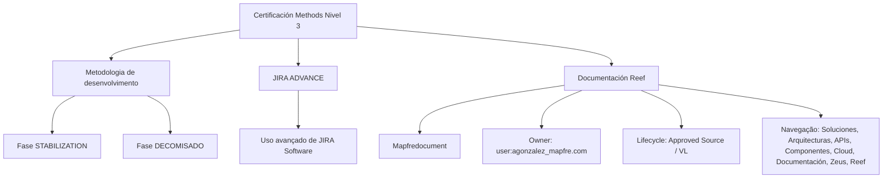

# Certificación Methods Nivel 3 — Fases Stabilization, Decomisado e JIRA Advance

## 1. Metadados do Documento
- **Arquivo de Origem:** Não identificado no conteúdo fornecido
- **Tipo de Documento:** Apresentação Executiva / Material de treinamento
- **Domínio / Sistema:** Metodologia de desenvolvimento, JIRA Software, Reef e Mapfredocument
- **Público-Alvo:** Desenvolvedores, equipes de metodologia e usuários de JIRA Software
- **Data/Versão Identificada:** Não identificada

---

## 2. Resumo Executivo & Contexto de Negócio

O conteúdo apresenta a certificação **Methods Nivel 3**, organizada em tópicos relacionados à metodologia de desenvolvimento e ao uso avançado da ferramenta **JIRA Software**. O material identifica explicitamente dois momentos metodológicos: a fase **STABILIZATION** e a fase **DECOMISADO**.

A fase **STABILIZATION** é descrita como uma seção que contém o temário correspondente dentro da metodologia de desenvolvimento. O texto não detalha atividades, critérios de entrada, critérios de saída, responsáveis, ferramentas ou entregáveis associados à fase STABILIZATION.

A fase **DECOMISADO** também é apresentada como uma seção de temário da metodologia de desenvolvimento. Não há detalhamento adicional sobre o significado operacional de DECOMISADO, procedimentos de descontinuação, controles técnicos, aprovações ou impactos sobre sistemas.

O documento também cita **JIRA ADVANCE**, identificado como conteúdo sobre o uso avançado de JIRA Software. Além disso, há referências ao repositório ou área de documentação **Reef**, ao sistema ou recurso **Mapfredocument**, a um proprietário identificado como `user:agonzalez_mapfre.com` e ao ciclo de vida `Approved Source / VL`.

---

## 3. Arquitetura, Componentes & Tecnologias Envolvidas

Os elementos identificados no conteúdo são:

- **Methods Nivel 3:** Certificação ou nível de capacitação referido pelo documento.
- **Metodologia de desenvolvimento:** Contexto no qual as fases STABILIZATION e DECOMISADO são organizadas.
- **STABILIZATION:** Fase da metodologia de desenvolvimento com temário próprio.
- **DECOMISADO:** Fase da metodologia de desenvolvimento com temário próprio.
- **JIRA Software:** Ferramenta mencionada no tópico JIRA ADVANCE.
- **Documentation / DOCUMENTACIÓN Reef:** Área ou recurso de documentação citado no conteúdo.
- **Mapfredocument:** Nome exibido no conteúdo, sem explicação funcional adicional.
- **Zeus, Soluciones, Arquitecturas, APIs, Componentes e Cloud:** Itens de navegação exibidos na área de documentação.
- **Owner `user:agonzalez_mapfre.com`:** Proprietário indicado para a documentação Reef.
- **Lifecycle `Approved Source / VL`:** Estado ou atributo de ciclo de vida exibido para a documentação Reef.



> **Nota de Análise:** O conteúdo não descreve arquitetura de software, integrações, APIs, protocolos, ambientes, microsserviços, bancos de dados ou fluxos de dados. O diagrama representa exclusivamente relações explícitas entre os tópicos e recursos citados.

---

## 4. Regras de Negócio, Especificações Funcionais & Processos

### 4.1 Certificación Methods Nivel 3
- O documento é intitulado **CERTIFICACIÓN - METHODS NIVEL 3**.
- Também aparece a variação textual **CERTIFICACIÓN METHODS NIVEL 3**.
- O conteúdo fornecido não informa requisitos para certificação, critérios de aprovação, público elegível, duração, avaliações ou responsáveis.

### 4.2 Fase STABILIZATION
- A fase **STABILIZATION** faz parte da metodologia de desenvolvimento.
- O documento informa que a seção contém o temário da fase STABILIZATION.
- Não são apresentados processos, atividades, critérios, dependências ou entregáveis dessa fase.

### 4.3 Fase DECOMISADO
- A fase **DECOMISADO** faz parte da metodologia de desenvolvimento.
- O documento informa que a seção contém o temário da fase DECOMISADO.
- Não há detalhamento de procedimentos, validações, aprovações, riscos ou atividades de decomissionamento.

### 4.4 JIRA ADVANCE
- O tópico **JIRA ADVANCE** aborda o uso avançado da ferramenta **JIRA Software**.
- O conteúdo não informa recursos específicos do JIRA Software, como projetos, workflows, permissões, dashboards, automações, tipos de issue ou consultas JQL.

### 4.5 Documentação Reef
- A documentação é identificada como **Documentation / DOCUMENTACIÓN Reef**.
- O proprietário exibido é `user:agonzalez_mapfre.com`.
- O ciclo de vida exibido é `Approved Source / VL`.
- A navegação apresentada contém os itens: Buscar, Inicio, Soluciones, Arquitecturas, APIs, Componentes, Cloud, Documentación, Zeus, Reef, Ayuda e ES.

---

## 5. Tabelas de Parâmetros, Ambientes e Estruturas de Dados

| Item / Parâmetro | Descrição / Função | Tipo / Valores / Formato | Ambiente / Observações |
| :--- | :--- | :--- | :--- |
| Certificación Methods Nivel 3 | Título da certificação ou material apresentado | Texto | Não há versão ou data identificada |
| Fase STABILIZATION | Fase da metodologia de desenvolvimento | Temário / seção | Sem detalhamento de atividades |
| Fase DECOMISADO | Fase da metodologia de desenvolvimento | Temário / seção | Sem detalhamento de atividades |
| JIRA ADVANCE | Conteúdo sobre utilização avançada de JIRA Software | Tópico de treinamento | Sem recursos funcionais especificados |
| JIRA Software | Ferramenta citada no tópico JIRA ADVANCE | Ferramenta | Não são informados projetos, URLs ou configurações |
| Documentation / DOCUMENTACIÓN Reef | Área ou recurso de documentação | Documentação | Referência exibida repetidamente |
| Mapfredocument | Nome citado no conteúdo | Não especificado | Não há definição funcional |
| Owner | Proprietário da documentação Reef | `user:agonzalez_mapfre.com` | Valor apresentado literalmente |
| Lifecycle | Estado ou atributo de ciclo de vida | `Approved Source / VL` | Significado de `VL` não detalhado |
| Navegação | Itens visíveis na área de documentação | Buscar, Inicio, Soluciones, Arquitecturas, APIs, Componentes, Cloud, Documentación, Zeus, Reef, Ayuda, ES | Não há URLs, permissões ou descrição dos itens |
| Idioma | Identificador de idioma exibido | `ES` | Provavelmente indicador de idioma; o documento não explica o campo |

---

## 6. Bateria de Perguntas & Respostas para RAG (FAQ Sintético)

### P1: Qual é o tema principal do documento Certificación Methods Nivel 3?
**R:** O documento apresenta a certificação Methods Nivel 3 e lista conteúdos relativos às fases STABILIZATION e DECOMISADO da metodologia de desenvolvimento, além do uso avançado de JIRA Software por meio do tópico JIRA ADVANCE.

### P2: O que o documento informa sobre a fase STABILIZATION?
**R:** O documento informa que existe uma seção com o temário da fase STABILIZATION dentro da metodologia de desenvolvimento. Não são descritas atividades, critérios de validação, entregáveis, responsáveis ou ferramentas específicos dessa fase.

### P3: Quais informações são fornecidas sobre a fase DECOMISADO?
**R:** O documento afirma que a fase DECOMISADO possui um temário dentro da metodologia de desenvolvimento. O conteúdo não apresenta detalhamento operacional, técnico ou funcional sobre essa fase.

### P4: O que é JIRA ADVANCE no contexto do documento?
**R:** JIRA ADVANCE é o tópico que contém o temário relacionado ao uso avançado da ferramenta JIRA Software. O documento não especifica quais funcionalidades avançadas, workflows, automações ou configurações do JIRA Software são abordados.

### P5: Qual ferramenta é mencionada no tópico JIRA ADVANCE?
**R:** A ferramenta mencionada é o JIRA Software. O texto a associa ao uso avançado, mas não apresenta versão, URL, projetos, permissões ou parâmetros de configuração.

### P6: Quem é o proprietário identificado para a documentação Reef?
**R:** O proprietário apresentado no conteúdo da documentação Reef é `user:agonzalez_mapfre.com`.

### P7: Qual é o ciclo de vida mostrado para a documentação Reef?
**R:** O ciclo de vida exibido é `Approved Source / VL`. O documento não define o significado de `VL` nem descreve os critérios para esse estado de ciclo de vida.

### P8: Quais áreas de navegação são exibidas na documentação Reef?
**R:** A navegação exibida contém Buscar, Inicio, Soluciones, Arquitecturas, APIs, Componentes, Cloud, Documentación, Zeus, Reef, Ayuda e ES. O documento não explica a finalidade individual dessas áreas.

### P9: O documento descreve uma arquitetura técnica ou integração entre sistemas?
**R:** Não. O conteúdo fornecido menciona tópicos de metodologia, JIRA Software, documentação Reef e Mapfredocument, mas não apresenta arquitetura de software, componentes técnicos, integrações, APIs, fluxos de dados, protocolos ou ambientes.

### P10: O que é Mapfredocument segundo o documento?
**R:** Mapfredocument é um nome exibido no conteúdo próximo às referências de documentação Reef. O documento não fornece uma definição, finalidade, escopo funcional ou relação técnica detalhada para Mapfredocument.

---

## 7. Glossário de Termos, Siglas & Conceitos-Chave

- **Methods Nivel 3:** Nome da certificação ou nível de capacitação indicado no documento.
- **STABILIZATION:** Nome de uma fase da metodologia de desenvolvimento; o documento informa somente que existe um temário associado.
- **DECOMISADO:** Nome de uma fase da metodologia de desenvolvimento; o documento informa somente que existe um temário associado.
- **JIRA ADVANCE:** Tópico de conteúdo relacionado ao uso avançado de JIRA Software.
- **JIRA Software:** Ferramenta citada no material, sem detalhamento técnico adicional.
- **Reef:** Nome associado à área ou recurso de documentação mencionado no conteúdo.
- **Mapfredocument:** Nome exibido no material sem definição funcional explícita.
- **Owner:** Campo que identifica o proprietário de um conteúdo ou recurso.
- **Lifecycle:** Campo que indica o ciclo de vida de um conteúdo ou recurso.
- **Approved Source / VL:** Valor apresentado para o campo Lifecycle; o documento não define `VL`.
- **ES:** Identificador exibido na navegação; o documento não esclarece seu significado.

---

## 8. Notas Críticas, Riscos & Limitações

- O conteúdo fornecido consiste predominantemente em títulos, tópicos e elementos de navegação, sem aprofundamento técnico ou operacional.
- Não há informações sobre versões, datas, autoria formal, responsáveis por cada fase ou critérios de certificação.
- Não foram identificados contratos de API, métodos HTTP, URLs, ambientes, credenciais, portas, infraestrutura, logs ou mecanismos de monitoramento.
- Não há descrição dos procedimentos executados nas fases STABILIZATION e DECOMISADO.
- O documento cita JIRA Software, mas não detalha configurações, fluxos, automações, permissões, consultas ou padrões de uso.
- O significado de `VL`, exibido no atributo `Approved Source / VL`, não é explicado.
- **Nota de Análise:** O conteúdo lista Reef e Mapfredocument, porém não detalha suas funções, integrações ou responsabilidades no ecossistema corporativo.

---

## 9. Conteúdo Bruto Estruturado (Referência Fiel)

```text
--- [PÁGINA 1 DE 1] ---

CERTIFICACIÓN - METHODS NIVEL 3
CERTIFICACIÓN METHODS NIVEL 3
FASE STABILIZATION
En este apartado se encuentra el temario
de la fase STABILIZATION dentro de la
metodología de desarrollo.
FASE DECOMISADO
En este apartado se encuentra el temario
de la fase DECOMISADO dentro de la
metodología de desarrollo.
JIRA ADVANCE
En este apartado se encuentra el temario
del uso avanzado de la herramienta JIRA
Software.
Documentation / DOCUMENTACIÓN Reef
DOCUMENTACIÓN Reef
Mapfredocument
DOCUMENTACIÓN Reef
Owner
user:agonzalez_mapfre.com
Lifecycle
Approved Source
 / 
 VL
Buscar Inicio Soluciones Arquitecturas APIs Componentes Cloud Documentación Zeus Reef Ayuda
ES
```
