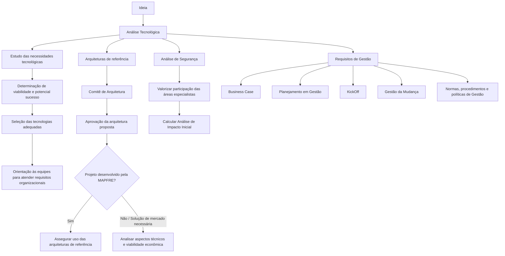

# Fase de Análise Tecnológica — Avaliação de Viabilidade e Seleção de Tecnologias

## 1. Metadados do Documento
- **Arquivo de Origem:** Não informado
- **Tipo de Documento:** Procedimento
- **Domínio / Sistema:** Análise Tecnológica / Documentação Reef / MAPFRE
- **Público-Alvo:** Arquitetura, Segurança, Gestão de Produto/Aplicação e equipes de desenvolvimento
- **Data/Versão Identificada:** Não identificada

---

## 2. Resumo Executivo & Contexto de Negócio

A Análise Tecnológica é apresentada como a fase inicial de estudo das necessidades tecnológicas derivadas de uma ideia. O objetivo é determinar a viabilidade e o potencial sucesso antes da criação do produto.

A fase orienta a escolha das tecnologias mais adequadas ao desenvolvimento. Essa decisão deve guiar as equipes de trabalho no atendimento aos requisitos definidos pela organização.

O Comitê de Arquitetura aprova a arquitetura proposta para o projeto. Quando o projeto é desenvolvido pela MAPFRE, o Comitê de Arquitetura assegura o uso das arquiteturas de referência; quando for necessária uma solução de mercado, o Comitê analisa aspectos técnicos e viabilidade econômica.

A participação da área de Segurança busca avaliar o envolvimento das áreas especialistas e calcular o Análise de Impacto Inicial. No âmbito da gestão de Produto/Aplicação, o documento também relaciona Business Case, planejamento em Gestão, KickOff, Gestão da Mudança e normas, procedimentos e políticas de Gestão.

---

## 3. Arquitetura, Componentes & Tecnologias Envolvidas

O documento não descreve uma arquitetura de software com componentes técnicos, interfaces, protocolos, microsserviços, bancos de dados ou ambientes. A estrutura apresentada é um fluxo de governança para a fase de Análise Tecnológica.



**Nota de Análise:** o documento cita Documentação Reef, Mapfredocument, Zeus, Soluções, Arquiteturas, APIs, Componentes e Cloud na navegação exibida, mas não detalha a função técnica, integração ou relação operacional desses elementos com a Análise Tecnológica.

---

## 4. Regras de Negócio, Especificações Funcionais & Processos

1. A Análise Tecnológica ocorre antes da criação do produto.
2. A fase deve estudar as necessidades tecnológicas originadas a partir de uma ideia.
3. A análise deve determinar a viabilidade e o potencial sucesso da iniciativa.
4. A análise deve identificar as tecnologias mais adequadas para uso no desenvolvimento.
5. A seleção tecnológica deve orientar as equipes de trabalho para cumprir os requisitos estabelecidos pela organização.
6. O Comitê de Arquitetura é responsável por aprovar a arquitetura proposta para o projeto.
7. Quando o projeto for desenvolvido pela MAPFRE, o Comitê de Arquitetura deve assegurar a utilização das arquiteturas de referência.
8. Quando for necessária uma solução de mercado, o Comitê de Arquitetura deve analisar os aspectos técnicos e a viabilidade econômica.
9. A participação da Segurança deve avaliar a participação das áreas especialistas.
10. A participação da Segurança deve calcular o Análise de Impacto Inicial.
11. A gestão do Produto/Aplicação deve considerar Business Case, planejamento em Gestão, KickOff, Gestão da Mudança e normas, procedimentos e políticas de Gestão.
12. O documento informa que essas atividades são detalhadas em “Análisis Tecnológico”, sem fornecer o detalhamento adicional no conteúdo disponível.

---

## 5. Tabelas de Parâmetros, Ambientes e Estruturas de Dados

| Item / Parâmetro | Descrição / Função | Tipo / Valores / Formato | Ambiente / Observações |
| :--- | :--- | :--- | :--- |
| Análise Tecnológica | Fase inicial para estudar necessidades tecnológicas a partir de uma ideia. | Processo / fase | Ocorre antes da criação do produto. |
| Viabilidade | Avaliação necessária para determinar se a iniciativa pode avançar. | Critério de análise | O documento não define métricas ou critérios quantitativos. |
| Potencial sucesso | Aspecto avaliado durante a Análise Tecnológica. | Critério de análise | Sem método de cálculo descrito. |
| Tecnologias adequadas | Tecnologias selecionadas para o desenvolvimento. | Decisão tecnológica | Deve orientar as equipes de trabalho. |
| Requisitos organizacionais | Requisitos que as equipes devem cumprir. | Requisitos | O documento não enumera requisitos específicos. |
| Comitê de Arquitetura | Área responsável por aprovar a arquitetura proposta. | Órgão de governança | Atua também em arquiteturas de referência e soluções de mercado. |
| Arquiteturas de referência | Arquiteturas cujo uso deve ser assegurado para projetos desenvolvidos pela MAPFRE. | Padrão arquitetural | Não são listadas no documento. |
| Solução de mercado | Solução cuja necessidade aciona análise técnica e econômica. | Alternativa de solução | Sem fornecedores, produtos ou critérios detalhados. |
| Análise de Segurança | Participação da Segurança na fase de Análise Tecnológica. | Atividade de segurança | Avalia áreas especialistas e calcula o Análise de Impacto Inicial. |
| Análise de Impacto Inicial | Cálculo citado como objetivo da participação da Segurança. | Avaliação | Método, entradas e resultado não detalhados. |
| Business Case | Atividade destacada na gestão de Produto/Aplicação. | Atividade de gestão | Sem conteúdo adicional no documento. |
| Planejamento em Gestão | Atividade destacada na gestão de Produto/Aplicação. | Atividade de gestão | Aparece como “Planificación en Gestión” no conteúdo bruto. |
| KickOff | Atividade destacada na gestão de Produto/Aplicação. | Atividade de gestão | Sem rito ou participantes definidos. |
| Gestão da Mudança | Atividade destacada na gestão de Produto/Aplicação. | Atividade de gestão | Sem processo detalhado. |
| Normas, procedimentos e políticas de Gestão | Elementos a considerar no âmbito da gestão de Produto/Aplicação. | Governança | Não especificados. |
| Documentação Reef | Repositório ou seção de documentação citada na navegação. | Documentação | Sem descrição funcional adicional. |
| Mapfredocument | Elemento citado na navegação da documentação. | Sistema ou recurso citado | Sem detalhamento técnico. |
| Owner | Campo exibido na documentação. | Identificação de responsável | `user:agonzalez_mapfre.com` |
| Lifecycle | Campo exibido na documentação. | Ciclo de vida | `Approved` |
| Source | Campo exibido na documentação. | Origem | `VL` |

---

## 6. Bateria de Perguntas & Respostas para RAG (FAQ Sintético)

### P1: Qual é o objetivo da fase de Análise Tecnológica?
**R:** A fase de Análise Tecnológica estuda as necessidades tecnológicas a partir de uma ideia para determinar a viabilidade e o potencial sucesso antes da criação do produto. Também busca identificar as tecnologias mais adequadas para o desenvolvimento.

### P2: Em que momento do ciclo do produto ocorre a Análise Tecnológica?
**R:** A Análise Tecnológica ocorre previamente à criação do produto. O documento a caracteriza como a tarefa inicial de análise.

### P3: Qual é a responsabilidade do Comitê de Arquitetura durante a Análise Tecnológica?
**R:** O Comitê de Arquitetura aprova a arquitetura proposta para o projeto. Para projetos desenvolvidos pela MAPFRE, o Comitê assegura o uso das arquiteturas de referência. Quando uma solução de mercado é necessária, o Comitê analisa os aspectos técnicos e a viabilidade econômica.

### P4: O que ocorre quando o projeto é desenvolvido pela MAPFRE?
**R:** Quando o projeto é desenvolvido pela MAPFRE, o Comitê de Arquitetura assegura que o projeto utilize as arquiteturas de referência.

### P5: Quais análises são necessárias para uma solução de mercado?
**R:** Quando uma solução de mercado for necessária, o Comitê de Arquitetura deve analisar os aspectos técnicos e a viabilidade econômica. O documento não detalha critérios, fornecedores, produtos ou métricas para essa avaliação.

### P6: Qual é o papel da Segurança na fase de Análise Tecnológica?
**R:** A participação da Segurança tem como objetivo avaliar a participação das áreas especialistas e calcular o Análise de Impacto Inicial. O documento não descreve o método de cálculo nem os artefatos produzidos por essa análise.

### P7: Quais atividades de gestão devem ser consideradas para Produto/Aplicação?
**R:** O documento destaca Business Case, planejamento em Gestão, KickOff, Gestão da Mudança e normas, procedimentos e políticas de Gestão como atividades relevantes para a gestão de Produto/Aplicação.

### P8: Como a escolha de tecnologias impacta as equipes de trabalho?
**R:** A escolha das tecnologias mais adequadas deve orientar as equipes de trabalho no cumprimento de todos os requisitos estabelecidos pela organização.

### P9: O documento define APIs, microsserviços ou contratos de integração?
**R:** Não. Embora a navegação apresentada cite APIs, Componentes e Cloud, o conteúdo disponível não especifica APIs, microsserviços, métodos HTTP, contratos de dados, protocolos ou integrações.

### P10: Onde o documento indica que as atividades de gestão são detalhadas?
**R:** O documento informa que as atividades de gestão são detalhadas em “Análisis Tecnológico”. Contudo, o conteúdo fornecido não inclui esse detalhamento complementar.

---

## 7. Glossário de Termos, Siglas & Conceitos-Chave

- **Análise Tecnológica:** fase inicial que estuda necessidades tecnológicas a partir de uma ideia para determinar viabilidade e potencial sucesso.
- **Comitê de Arquitetura:** entidade responsável por aprovar a arquitetura proposta para o projeto.
- **Arquiteturas de referência:** arquiteturas que devem ser utilizadas em projetos desenvolvidos pela MAPFRE, conforme assegurado pelo Comitê de Arquitetura.
- **Solução de mercado:** solução cuja necessidade exige análise de aspectos técnicos e viabilidade econômica.
- **Análise de Impacto Inicial:** cálculo citado como objetivo da participação da área de Segurança.
- **Business Case:** atividade destacada no contexto de gestão de Produto/Aplicação; o documento não fornece definição adicional.
- **KickOff:** atividade destacada no contexto de gestão de Produto/Aplicação; o documento não fornece definição adicional.
- **Gestão da Mudança:** atividade destacada no contexto de gestão de Produto/Aplicação.
- **MAPFRE:** organização citada como responsável pelo desenvolvimento de determinados projetos.
- **Reef:** nome associado à documentação apresentada.
- **VL:** valor exibido no campo `Source`; o documento não expande ou define a sigla.

---

## 8. Notas Críticas, Riscos & Limitações

- O documento não apresenta critérios mensuráveis para viabilidade, potencial sucesso, seleção tecnológica ou viabilidade econômica.
- Não são descritos os artefatos de entrada, saída, responsáveis detalhados, prazos ou pontos de decisão da Análise Tecnológica.
- As arquiteturas de referência são citadas, mas não são enumeradas ou descritas.
- O Análise de Impacto Inicial é mencionado sem fórmula, metodologia, responsáveis, níveis de criticidade ou critérios de aprovação.
- As atividades de gestão são listadas, mas não possuem fluxo, requisitos, entregáveis ou critérios de conclusão no conteúdo disponível.
- A navegação cita APIs, Componentes, Cloud, Zeus e Mapfredocument, porém não há detalhamento técnico sobre esses itens.
- **Nota de Análise:** o documento contém conteúdo resumido e não detalha tecnologias, versões, URLs de ambientes, rotas de logs, servidores, integrações ou contratos de dados.

---

## 9. Conteúdo Bruto Estruturado (Referência Fiel)

```text
--- [PÁGINA 1 DE 1] ---

FASE ANÁLISIS TECNOLÓGICO
ANÁLISIS
TECNOLÓGICO
El Análisis tecnológico es la fase
inicial donde se estudian las
necesidades tecnológicas a partir de
la idea, para determinar su viabilidad
y potencial éxito.
Esta tarea inicial de análisis, previa a la
creación del producto, tiene como objetivo
determinar qué tecnologías son las más
adecuadas a utilizar durante el desarrollo.
Esto guiará a los equipos de trabajo a cumplir
con todos los requisitos establecidos por la
organización.
Los aspectos que se analizan en esta
actividad son:
Arquitecturas de referencia
El Comité de Arquitectura se encarga de
aprobar la arquitectura propuesta para el
proyecto: - Cuando el proyecto lo
desarrolla MAPFRE, asegura que utiliza las
arquitecturas de referencia. - Cuando sea
necesaria una solución de mercado, se
encarga de analizar los aspectos técnicos
y la viabilidad económica.
Análisis de Seguridad
El objetivo de la participación de
Seguridad en esta fase es valorar la
participación de las áreas expertas y
calcular el Análisis de Impacto Inicial.
Requisitos de Gestión
En el ámbito de la gestión del Producto /
Aplicación destacan varias actividades a
tener en cuenta: - Business Case -
Planificación en Gestión - KickOff -
Gestión del Cambio - Normativas,
procedimientos y políticas de Gestión
Estas actividades se detallan en: Análisis
Tecnológico
Documentation / DOCUMENTACIÓN Reef
DOCUMENTACIÓN Reef
Mapfredocument
DOCUMENTACIÓN Reef
Owner
user:agonzalez_mapfre.com
Lifecycle
Approved Source
 / 
 VL
Buscar Inicio Soluciones Arquitecturas APIs Componentes Cloud Documentación Zeus Reef Ayuda
ES
```
