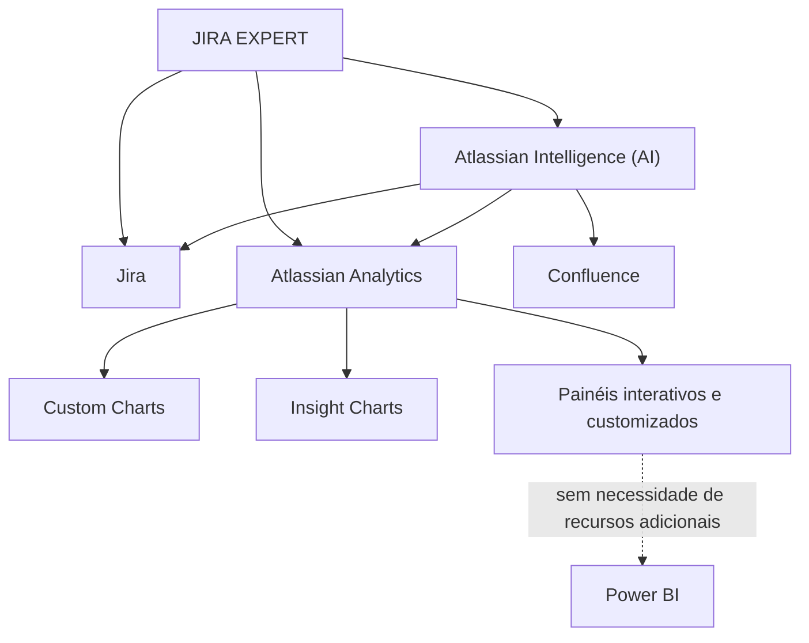

# JIRA EXPERT — Conhecimento Especialista de Jira, Atlassian Analytics e Atlassian Intelligence

## 1. Metadados do Documento
- **Arquivo de Origem:** Não identificado no conteúdo fornecido
- **Tipo de Documento:** Documentação corporativa / guia de conhecimento
- **Domínio / Sistema:** Jira, Atlassian Analytics, Atlassian Intelligence e documentação Reef
- **Público-Alvo:** Usuários de Jira, analistas, equipes de gestão, desenvolvedores e responsáveis por documentação
- **Data/Versão Identificada:** Não identificada

---

## 2. Resumo Executivo & Contexto de Negócio

O documento apresenta o espaço de conhecimento **JIRA EXPERT**, voltado ao uso especializado de Jira, incluindo automatismos, modelo de dados e recursos de inteligência artificial. O conteúdo também referencia funcionalidades integradas do ecossistema Atlassian para análise de dados e apoio operacional.

O **Atlassian Analytics** é descrito como uma ferramenta capaz de integrar os dados necessários para elaborar painéis interativos e customizados. Segundo o documento, esses painéis podem ser produzidos sem recorrer a recursos adicionais, como Power BI. A operação detalhada da ferramenta é direcionada à referência denominada **Guía Atlassian Analytics**.

O **Atlassian Intelligence (AI)** é apresentado como a ferramenta de inteligência artificial integrada da Atlassian, utilizável com Jira, Confluence e Atlassian Analytics. O documento delimita que a seção em questão detalha especificamente o uso da inteligência artificial com Jira e Analytics, além de afirmar que a Atlassian garante a segurança dos dados durante o uso da IA integrada.

Para Jira, o documento lista capacidades de IA generativa em caixas de edição, resumos de issues, automatismos com IA, divisão de tarefas com IA e busca de issues. Para Analytics, são citadas funcionalidades de IA em **Custom Charts** e **Insight Charts**. A documentação operacional complementar é indicada como **Guía Atlassian Intelligence**.

---

## 3. Arquitetura, Componentes & Tecnologias Envolvidas

| Componente / Tecnologia | Papel descrito no documento |
| :--- | :--- |
| JIRA EXPERT | Espaço de conhecimento especializado sobre Jira, automatismos, modelo de dados e IA. |
| Jira | Plataforma utilizada com recursos de IA generativa, resumos de issues, automatismos, divisão de tarefas e busca de issues. |
| Atlassian Analytics | Ferramenta para integração de dados e criação de painéis interativos e customizados. |
| Atlassian Intelligence (AI) | Inteligência artificial integrada da Atlassian para Jira, Confluence e Atlassian Analytics. |
| Confluence | Produto Atlassian citado como compatível com Atlassian Intelligence. |
| Custom Charts | Recurso de Analytics citado como suportado por IA. |
| Insight Charts | Recurso de Analytics citado como suportado por IA. |
| Power BI | Recurso adicional citado como não necessário para elaborar painéis com Atlassian Analytics. |
| Reef | Contexto de documentação corporativa exibido na navegação. |
| Mapfredocument | Elemento citado na área de documentação Reef. |
| Zeus | Item citado na navegação da documentação. |



**Nota de Análise:** O documento cita automatismos, modelo de dados, recursos de IA, Jira, Confluence e Analytics, mas não detalha integrações técnicas, APIs, métodos HTTP, contratos de dados, credenciais, topologia de infraestrutura ou fluxos de implantação.

---

## 4. Regras de Negócio, Especificações Funcionais & Processos

### Capacidades declaradas para Atlassian Analytics
1. O Atlassian Analytics integra os dados necessários para elaboração de painéis.
2. Os painéis podem ser interativos e customizados.
3. A elaboração dos painéis não requer recursos adicionais, sendo Power BI citado como exemplo de recurso dispensável.
4. A operação detalhada do Atlassian Analytics deve ser consultada na referência **Guía Atlassian Analytics**.

### Escopo declarado para Atlassian Intelligence
1. Atlassian Intelligence é uma ferramenta de inteligência artificial integrada da Atlassian.
2. Atlassian Intelligence pode ser utilizada com Jira, Confluence e Atlassian Analytics.
3. O documento detalha, na seção apresentada, o uso de Atlassian Intelligence com Jira e Analytics.
4. O documento afirma que a Atlassian garante que os dados continuam seguros com o uso da IA integrada.
5. A operação detalhada da ferramenta deve ser consultada na referência **Guía Atlassian Intelligence**.

### Recursos de IA declarados para Jira
1. IA generativa nas caixas de edição.
2. IA nos resumos de issues.
3. Automatismos com IA.
4. Divisão de tarefas com IA.
5. Busca de issues.

### Recursos de IA declarados para Atlassian Analytics
1. IA em Custom Charts.
2. IA em Insight Charts.

**Nota de Análise:** O documento não especifica critérios de ativação dos automatismos, permissões necessárias, comportamento de divisão de tarefas, modelos de IA empregados, limites de uso, retenção de dados ou procedimentos de contingência.

---

## 5. Tabelas de Parâmetros, Ambientes e Estruturas de Dados

| Item / Parâmetro | Descrição / Função | Tipo / Valores / Formato | Ambiente / Observações |
| :--- | :--- | :--- | :--- |
| JIRA EXPERT | Conhecimento especialista de Jira. | Área de conhecimento. | Cita automatismos, modelo de dados e IA. |
| Atlassian Analytics | Integra dados para criação de painéis. | Ferramenta Atlassian. | Permite painéis interativos e customizados. |
| Painéis | Visualizações elaboradas com dados integrados. | Interativos e customizados. | O documento informa que não requerem recursos adicionais como Power BI. |
| Guía Atlassian Analytics | Referência para operação da ferramenta Analytics. | Guia documental. | Conteúdo do guia não foi fornecido. |
| Atlassian Intelligence (AI) | Ferramenta de IA integrada da Atlassian. | Inteligência artificial integrada. | Utilizável com Jira, Confluence e Atlassian Analytics. |
| IA em Jira | Recursos de IA aplicados ao Jira. | IA generativa, resumos, automatismos, divisão de tarefas e busca. | Sem detalhamento de configuração. |
| IA em Analytics | Recursos de IA aplicados ao Analytics. | IA em Custom Charts e Insight Charts. | Sem detalhamento de configuração. |
| Guía Atlassian Intelligence | Referência para operação do Atlassian Intelligence. | Guia documental. | Conteúdo do guia não foi fornecido. |
| Owner | Proprietário exibido na documentação. | `user:agonzalez_mapfre.com` | Associado à documentação Reef. |
| Lifecycle | Estado de ciclo de vida exibido. | `Approved Source` | Associado à documentação Reef. |
| Navegação Reef | Itens de navegação apresentados. | Buscar, Inicio, Soluciones, Arquitecturas, APIs, Componentes, Cloud, Documentación, Zeus, Reef, Ayuda. | Interface em idioma `ES`. |

---

## 6. Bateria de Perguntas & Respostas para RAG (FAQ Sintético)

### P1: Qual é o objetivo do espaço JIRA EXPERT?
**R:** O espaço JIRA EXPERT concentra conhecimento especializado sobre Jira, incluindo automatismos, modelo de dados e inteligência artificial.

### P2: Para que serve o Atlassian Analytics segundo o documento?
**R:** O Atlassian Analytics integra os dados necessários para elaborar painéis interativos e customizados, sem necessidade de recorrer a recursos adicionais, como Power BI.

### P3: O documento informa que Power BI é obrigatório para criar painéis no Atlassian Analytics?
**R:** Não. O documento afirma que Atlassian Analytics permite elaborar painéis interativos e customizados sem recorrer a recursos adicionais, citando Power BI como exemplo.

### P4: Onde está a orientação operacional detalhada sobre Atlassian Analytics?
**R:** A operação com Atlassian Analytics é direcionada à documentação denominada **Guía Atlassian Analytics**.

### P5: O que é o Atlassian Intelligence?
**R:** Atlassian Intelligence é a ferramenta de inteligência artificial integrada da Atlassian, utilizável com Jira, Confluence e Atlassian Analytics.

### P6: Quais produtos Atlassian são citados como utilizáveis com Atlassian Intelligence?
**R:** O documento cita Jira, Confluence e Atlassian Analytics como produtos utilizáveis com Atlassian Intelligence.

### P7: Quais recursos de inteligência artificial são citados para Jira?
**R:** O documento cita IA generativa nas caixas de edição, IA nos resumos de issues, automatismos com IA, divisão de tarefas com IA e busca de issues.

### P8: Quais recursos de inteligência artificial são citados para Atlassian Analytics?
**R:** Para Atlassian Analytics, o documento cita IA em Custom Charts e IA em Insight Charts.

### P9: O documento especifica como configurar automatismos com IA no Jira?
**R:** Não. O documento apenas lista automatismos com IA como uma capacidade de Jira, sem detalhar configuração, gatilhos, condições, permissões ou regras de execução.

### P10: O documento apresenta garantias sobre a segurança dos dados no uso da IA integrada?
**R:** Sim. O texto afirma que a Atlassian garante que os dados seguem seguros com o uso da IA integrada.

### P11: Onde está a orientação operacional detalhada sobre Atlassian Intelligence?
**R:** A operação da ferramenta é direcionada à documentação denominada **Guía Atlassian Intelligence**.

### P12: Quem é o proprietário identificado na documentação Reef?
**R:** O campo Owner exibido na documentação Reef identifica `user:agonzalez_mapfre.com`.

---

## 7. Glossário de Termos, Siglas & Conceitos-Chave

- **AI:** Abreviação de inteligência artificial; no documento, refere-se ao Atlassian Intelligence.
- **Atlassian Analytics:** Ferramenta Atlassian para integração de dados e criação de painéis interativos e customizados.
- **Atlassian Intelligence:** Ferramenta de inteligência artificial integrada da Atlassian para Jira, Confluence e Atlassian Analytics.
- **Custom Charts:** Recurso de gráficos customizados citado no contexto de IA em Atlassian Analytics.
- **Insight Charts:** Recurso de gráficos de insights citado no contexto de IA em Atlassian Analytics.
- **Issue / Issues:** Termo utilizado no documento para itens pesquisáveis e resumíveis no Jira.
- **Jira:** Plataforma citada como parte do escopo de recursos de IA, automatismos, busca de issues e divisão de tarefas.
- **JIRA EXPERT:** Área ou documento de conhecimento especialista em Jira.
- **Power BI:** Recurso adicional citado como não necessário para produzir painéis com Atlassian Analytics.
- **Reef:** Contexto de documentação corporativa identificado no conteúdo bruto.

---

## 8. Notas Críticas, Riscos & Limitações

- O conteúdo fornecido é resumido e não apresenta detalhes técnicos sobre a arquitetura interna de Jira, Atlassian Analytics ou Atlassian Intelligence.
- Não há URLs, ambientes, servidores, portas, versões de produto, contratos de API, modelos de dados ou configurações de segurança explicitamente detalhados.
- O documento afirma que os dados seguem seguros com a IA integrada, mas não apresenta controles, evidências, políticas, mecanismos de proteção ou escopo dessa garantia.
- Os recursos de IA são listados, porém não há critérios funcionais, requisitos de acesso, limitações de uso, tratamento de falhas ou fluxos de aprovação.
- As referências **Guía Atlassian Analytics** e **Guía Atlassian Intelligence** são citadas, mas seus conteúdos não foram fornecidos para análise.
- A expressão textual `artical` aparece com caractere corrompido no conteúdo bruto; não é possível inferir correção além do texto apresentado.

---

## 9. Conteúdo Bruto Estruturado (Referência Fiel)

```text
--- [PÁGINA 1 DE 1] ---

JIRA EXPERT
JIRA EXPERT
Conocimiento experto de Jira: automatismos, modelo de datos, IA...
Atlassian Analytics
La herramienta Atlassian Analytics integra todos los datos
necesarios para elaborar paneles interactivos y customizados, sin
necesidad de recurrir a recursos adicionales (como Power BI).
La operatica con esta herramienta se detalla en: Guía Atlassian
Analytics
Atlassian Intelligence (AI)
Atlassian Intelligence es la herramienta de inteligencia artical
integrada de Atlassian que puede utilizarse con Jira, Conuence y
Atlassian Analytics. En concreto, en esta sección se detalle el uso
con Jira y Analytics. (Atlassian garantiza que los datos siguen
seguros con el uso de la IA Integrada).
AI en JIRA: - IA generativa en la cajas de edición - En los
resúmenes de la issues - Automatismos con IA - División de
tareas con IA - Búsqueda de issues
AI en ANALYTICS: - IA en Custom Charts - IA en Insight Charts
La operatica con esta herramienta se detalla en: Guía Atlassian
Intelligence
Documentation / DOCUMENTACIÓN Reef
DOCUMENTACIÓN Reef
Mapfredocument
DOCUMENTACIÓN Reef
Owner
user:agonzalez_mapfre.com
Lifecycle
Approved Source
 / 
 VL
Buscar Inicio Soluciones Arquitecturas APIs Componentes Cloud Documentación Zeus Reef Ayuda
ES
```
