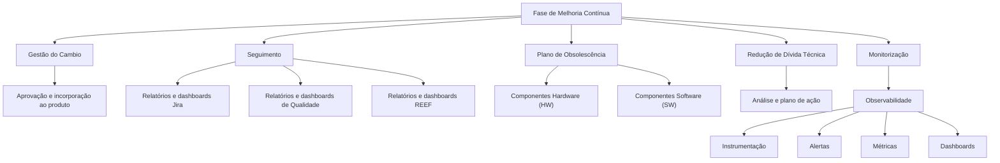
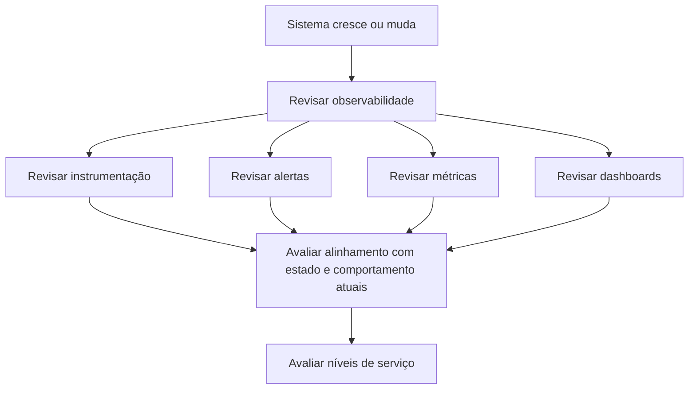

# Documentação REEF — Fase de Melhoria Contínua

## 1. Metadados do Documento
- **Arquivo de Origem:** Não informado; conteúdo bruto fornecido na solicitação.
- **Tipo de Documento:** Procedimento / Documentação de processo corporativo.
- **Domínio / Sistema:** REEF / MAPFRE.
- **Público-Alvo:** Gestão de produto, equipes de projeto, qualidade, arquitetura, operação e desenvolvimento.
- **Data/Versão Identificada:** Não identificada.

---

## 2. Resumo Executivo & Contexto de Negócio

O documento apresenta a **Fase de Melhoria Contínua** da documentação REEF no contexto da MAPFRE. Essa fase é definida como um conjunto de atividades transversais destinado a garantir visibilidade, coerência e evolução contínua do produto.

As atividades descritas abrangem gestão de mudanças, acompanhamento da execução do projeto, planejamento de obsolescência tecnológica, redução de dívida técnica e monitoramento. Cada atividade possui uma referência documental própria indicada no conteúdo como “El detalle de esta actividad se recoge en”.

A gestão de mudanças é acionada quando uma variação nas condições vigentes afeta custo, escopo, prazo, qualidade ou valor de negócio. O objetivo explícito é submeter a mudança à aprovação e incorporá-la ao produto.

O acompanhamento do projeto verifica a execução correta das atividades definidas no planejamento. Para isso, o processo se apoia principalmente em relatórios e dashboards de Jira, Qualidade e REEF.

A melhoria contínua também inclui a gestão de riscos tecnológicos e operacionais: componentes sem suporte do fornecedor devem ser tratados no plano de obsolescência; dívida técnica deve ser analisada e reduzida gradualmente; e a observabilidade deve evoluir junto com o sistema, revisando instrumentação, alertas, métricas e dashboards.

---

## 3. Arquitetura, Componentes & Tecnologias Envolvidas

O conteúdo não apresenta uma arquitetura de software detalhada, interfaces, APIs, protocolos, servidores ou contratos de integração. O documento cita os seguintes elementos de contexto:

- **REEF:** repositório ou sistema documental mencionado como fonte de apoio para dashboards e documentação.
- **MAPFRE:** organização na qual se aplica a definição de obsolescência tecnológica.
- **Jira:** ferramenta citada como fonte de relatórios e dashboards para acompanhamento.
- **Qualidade:** área, relatórios ou dashboards citados como apoio ao acompanhamento.
- **Hardware (HW):** componente físico sujeito a obsolescência tecnológica.
- **Software (SW):** componente lógico sujeito a obsolescência tecnológica.
- **Observabilidade:** disciplina associada à auditoria integral do sistema, níveis de serviço, instrumentação, alertas, métricas e dashboards.



> **Nota de Análise:** O documento não detalha a arquitetura interna do REEF, nem especifica integrações técnicas entre REEF, Jira e os dashboards de Qualidade.

---

## 4. Regras de Negócio, Especificações Funcionais & Processos

### 4.1 Fase de Melhoria Contínua

A Fase de Melhoria Contínua é composta por atividades transversais que devem garantir:

1. Visibilidade do produto.
2. Coerência do produto.
3. Melhoria contínua do produto.

### 4.2 Gestão do Cambio

A Gestão do Cambio deve ser iniciada quando for confirmada uma variação nas condições atuais que envolva um ou mais dos seguintes critérios:

- Custo.
- Escopo.
- Prazo.
- Qualidade.
- Valor de negócio.

Após a identificação e confirmação da variação, o processo deve proceder com:

1. Aprovação da mudança.
2. Incorporação da mudança ao produto.

O documento aponta “Gestão do Cambio” como referência para o detalhamento dessa atividade, mas não apresenta o fluxo de aprovação, responsáveis, critérios de priorização ou evidências exigidas.

### 4.3 Seguimento

O Seguimento estabelece as ações necessárias para comprovar a execução correta das atividades do projeto que foram definidas no planejamento.

O acompanhamento é apoiado principalmente por:

- Informes e dashboards de Jira.
- Informes e dashboards de Qualidade.
- Informes e dashboards de REEF.

O documento não especifica periodicidade de acompanhamento, indicadores obrigatórios, responsáveis pela análise, regras de escalonamento ou critérios de aceite.

### 4.4 Plano de Obsolescência

O documento considera como **obsolescência tecnológica** qualquer versão de componente de hardware ou software existente na MAPFRE para a qual ocorra ao menos uma das situações abaixo:

1. O suporte do fornecedor ou fabricante foi finalizado.
2. O componente sofreu descontinuidade.

A definição se aplica a:

- Componentes de hardware (**HW**).
- Componentes de software (**SW**).

O documento cita “Plano de Obsolescência” como referência detalhada, sem informar inventário de componentes, datas de fim de suporte, níveis de criticidade, responsáveis ou planos de substituição.

### 4.5 Redução de Dívida Técnica

A dívida técnica é definida como o custo de retrabalho derivado de decisões ou atuações realizadas durante o desenvolvimento que podem causar problemas no futuro.

As regras e relações explicitadas são:

1. A dívida técnica gera esforço de correção.
2. O esforço de correção aumenta com o passar do tempo.
3. Quando dívida técnica for detectada em um produto em curso, deve-se iniciar uma análise.
4. Após a análise, deve-se elaborar um plano de ação.
5. O plano de ação deve reduzir gradualmente a dívida técnica.

O conteúdo não define métricas para mensurar dívida técnica, prioridade, prazo, orçamento ou critérios de encerramento do plano de ação.

### 4.6 Monitorização e Observabilidade

A observabilidade requer uma auditoria integral do sistema para:

1. Estabelecer níveis de serviço.
2. Definir métricas-chave a serem analisadas.
3. Avaliar os níveis de serviço estabelecidos.

A observabilidade deve evoluir conforme o sistema cresce e muda. Essa evolução requer revisão contínua de:

- Instrumentação.
- Alertas.
- Métricas.
- Dashboards.

O propósito das revisões é assegurar alinhamento entre os mecanismos de observabilidade e o estado atual e comportamento do sistema.



---

## 5. Tabelas de Parâmetros, Ambientes e Estruturas de Dados

| Item / Parâmetro | Descrição / Função | Tipo / Valores / Formato | Ambiente / Observações |
| :--- | :--- | :--- | :--- |
| Fase de Melhoria Contínua | Conjunto de atividades transversais para garantir visibilidade, coerência e melhoria do produto. | Processo corporativo. | Contexto REEF / MAPFRE. |
| Gestão do Cambio | Processo iniciado diante de variação confirmada nas condições atuais. | Processo de aprovação e incorporação. | Afeta custo, escopo, prazo, qualidade ou valor de negócio. |
| Custo | Uma das condições cuja variação pode iniciar a Gestão do Cambio. | Critério de mudança. | Sem método de cálculo especificado. |
| Escopo | Uma das condições cuja variação pode iniciar a Gestão do Cambio. | Critério de mudança. | Sem processo de avaliação especificado. |
| Prazo / Tempo | Uma das condições cuja variação pode iniciar a Gestão do Cambio. | Critério de mudança. | O texto utiliza “tiempo”. |
| Qualidade | Uma das condições cuja variação pode iniciar a Gestão do Cambio. | Critério de mudança. | Também citada como fonte de relatórios e dashboards. |
| Valor de negócio | Uma das condições cuja variação pode iniciar a Gestão do Cambio. | Critério de mudança. | Sem critérios de mensuração especificados. |
| Seguimento | Ações para comprovar a correta execução das atividades planejadas no projeto. | Processo de acompanhamento. | Apoiado por Jira, Qualidade e REEF. |
| Jira | Fonte de informes e dashboards para acompanhamento. | Ferramenta citada. | Não há URL, projeto ou configuração fornecida. |
| REEF | Fonte de informes e dashboards e contexto da documentação. | Sistema ou repositório citado. | Não há arquitetura ou URL especificada. |
| Plano de Obsolescência | Trata componentes sem suporte ou descontinuados. | Processo de gestão tecnológica. | Aplicável a componentes MAPFRE. |
| HW | Componente de hardware sujeito à obsolescência tecnológica. | Hardware. | Quando o suporte do fornecedor/fabricante termina ou há descontinuidade. |
| SW | Componente de software sujeito à obsolescência tecnológica. | Software. | Quando o suporte do fornecedor/fabricante termina ou há descontinuidade. |
| Dívida técnica | Custo de retrabalho decorrente de decisões de desenvolvimento que podem causar problemas futuros. | Conceito de engenharia de software. | Deve ser analisada e reduzida gradualmente. |
| Plano de ação | Artefato necessário após a identificação e análise de dívida técnica. | Plano de redução. | Não há formato, responsável ou prazo especificado. |
| Observabilidade | Auditoria integral do sistema para níveis de serviço e métricas-chave. | Disciplina operacional/técnica. | Deve evoluir com o sistema. |
| Instrumentação | Elemento a ser revisado continuamente na observabilidade. | Componente de observabilidade. | Sem ferramentas especificadas. |
| Alertas | Elemento a ser revisado continuamente na observabilidade. | Mecanismo de monitoramento. | Sem limiares ou canais especificados. |
| Métricas | Elemento a ser definido e revisado para avaliar níveis de serviço. | Indicadores. | O documento não lista métricas específicas. |
| Dashboards | Elemento de apoio a seguimento e observabilidade. | Visualização de informações. | Sem URLs, plataformas ou modelos definidos. |

---

## 6. Bateria de Perguntas & Respostas para RAG (FAQ Sintético)

### P1: Qual é o objetivo da Fase de Melhoria Contínua na documentação REEF?
**R:** A Fase de Melhoria Contínua é um conjunto de atividades transversais destinado a garantir visibilidade, coerência e melhoria contínua do produto.

### P2: Quando a Gestão do Cambio deve ser iniciada?
**R:** A Gestão do Cambio deve ser iniciada quando for confirmada uma variação nas condições atuais de custo, escopo, prazo, qualidade ou valor de negócio.

### P3: O que acontece após a confirmação de uma variação que exige Gestão do Cambio?
**R:** Após a confirmação da variação, deve-se iniciar a Gestão do Cambio para proceder à aprovação da mudança e à sua incorporação ao produto.

### P4: Qual é a finalidade do processo de Seguimento?
**R:** O Seguimento estabelece as ações necessárias para comprovar a correta execução das atividades de projeto definidas no planejamento.

### P5: Quais fontes apoiam principalmente o Seguimento do projeto?
**R:** O Seguimento se apoia principalmente em informes e dashboards de Jira, Qualidade e REEF.

### P6: Quando um componente é considerado tecnologicamente obsoleto na MAPFRE?
**R:** Um componente de hardware ou software é considerado tecnologicamente obsoleto quando o suporte do fornecedor ou fabricante foi finalizado e/ou quando ocorreu a descontinuidade do componente.

### P7: Como o documento define dívida técnica?
**R:** Dívida técnica é o custo de retrabalho derivado de atuações durante o desenvolvimento que podem ocasionar problemas no futuro.

### P8: Qual ação deve ser tomada quando uma dívida técnica é detectada em um produto em curso?
**R:** Deve-se iniciar uma análise e elaborar um plano de ação para reduzir gradualmente a dívida técnica.

### P9: Por que a correção da dívida técnica deve ser tratada rapidamente?
**R:** O documento afirma que o esforço de correção da dívida técnica aumenta à medida que o tempo passa.

### P10: Para que serve a observabilidade descrita no documento?
**R:** A observabilidade requer uma auditoria integral do sistema para estabelecer níveis de serviço e definir métricas-chave que serão analisadas para avaliar esses níveis de serviço.

### P11: Quais elementos da observabilidade devem ser revisados continuamente?
**R:** A instrumentação, os alertas, as métricas e os dashboards devem ser revisados continuamente à medida que o sistema cresce e muda.

### P12: O documento especifica métricas, SLAs, URLs ou ferramentas concretas de monitoramento?
**R:** Não. O documento menciona níveis de serviço, métricas, instrumentação, alertas e dashboards, mas não fornece valores, metas, URLs, plataformas, ferramentas ou configurações específicas.

---

## 7. Glossário de Termos, Siglas & Conceitos-Chave

- **REEF:** Sistema, repositório ou contexto documental citado como fonte de dashboards e documentação. O significado expandido da sigla não é informado.
- **MAPFRE:** Organização mencionada como contexto para a definição de obsolescência tecnológica.
- **Jira:** Ferramenta citada como fonte de informes e dashboards para acompanhamento.
- **HW:** Hardware; componente físico sujeito à obsolescência tecnológica.
- **SW:** Software; componente lógico sujeito à obsolescência tecnológica.
- **Gestão do Cambio:** Processo acionado quando há variação confirmada em custo, escopo, prazo, qualidade ou valor de negócio.
- **Seguimento:** Processo de acompanhamento para verificar a correta execução das atividades previstas no planejamento.
- **Obsolescência Tecnológica:** Situação de um componente de hardware ou software cujo suporte foi encerrado pelo fornecedor/fabricante e/ou que foi descontinuado.
- **Dívida Técnica:** Custo de retrabalho decorrente de decisões de desenvolvimento que podem resultar em problemas futuros.
- **Observabilidade:** Auditoria integral do sistema voltada à definição e avaliação de níveis de serviço e métricas-chave.
- **Instrumentação:** Elemento de observabilidade que deve ser revisado conforme o sistema evolui.

---

## 8. Notas Críticas, Riscos & Limitações

- O conteúdo não fornece detalhes de implementação para os processos de Gestão do Cambio, Seguimento, Plano de Obsolescência, Redução de Dívida Técnica ou Monitorização.
- Não são identificados responsáveis, papéis, aprovações, prazos, níveis de criticidade ou critérios de encerramento dos processos.
- Não há métricas concretas, metas de nível de serviço, indicadores de qualidade, limiares de alerta ou cadência de revisão de dashboards.
- O documento cita Jira, Qualidade e REEF como fontes de informação, mas não apresenta URLs, projetos, permissões, integrações ou procedimentos de acesso.
- Não há inventário de hardware ou software, datas de fim de suporte, versões afetadas ou estratégia de substituição para o Plano de Obsolescência.
- **Nota de Análise:** O documento lista referências a documentos específicos para cada atividade, porém o conteúdo dessas referências não foi fornecido. Portanto, não é possível inferir etapas adicionais sem risco de alucinação.

---

## 9. Conteúdo Bruto Estruturado (Referência Fiel)

```text
--- [PÁGINA 1 DE 2] ---

Documentation / DOCUMENTACIÓN Reef
DOCUMENTACIÓN Reef
Mapfredocument
DOCUMENTACIÓN Reef
Owner
user:agonzalez_mapfre.com
Lifecycle
Approved Source
 /
 VL
Buscar Inicio Soluciones Arquitecturas APIs Componentes Cloud Documentación Zeus Reef Ayuda
ES


--- [PÁGINA 2 DE 2] ---

FASE MEJORA CONTINUA
MEJORA CONTINUA
Conjunto de actividades transversales que garantizan la visibilidad, la coherencia y la mejora del producto.
Gestión del Cambio
Cuando se con�rma una variación con las
condiciones actuales en coste, alcance,
tiempo, calidad o valor de negocio, se
inicia la Gestión del Cambio para proceder
a su aprobación e incorporación al
producto.
El detalle de esta actividad se recoge en:
Gestión del Cambio
Seguimiento
El seguimiento establece el conjunto de
acciones que se llevarán a cabo para la
comprobación de la correcta ejecución de
las actividades del proyecto establecidas
en la plani�cación del mismo.
Principalmente, se apoya en los informes
y dashboards de Jira, Calidad, REEF...
El detalle de esta actividad se recoge en:
Seguimiento
Plan de Obsolescencia
Se considera obsolescencia tecnológica a
toda aquella versión de un componente
hardware (HW) o software (SW) existente
en MAPFRE del cual haya �nalizado el
soporte del proveedor/fabricante y/o se
haya producido una discontinuidad del
mismo.
El detalle de esta actividad se recoge en:
Plan de Obsolescencia
Reducción de Deuda Técnica
La deuda técnica es el coste del retrabajo
derivado de actuaciones durante el
desarrollo que pueden llegar a ocasionar
problemas en el futuro. Este esfuerzo de
corrección aumenta a medida que pasa el
tiempo, por lo que cuando se detecta
deuda en el producto en curso, se debe
iniciar un análisis y elaborar un plan de
acción para reducir gradualmente la deuda
técnica.
El detalle de esta actividad se recoge en:
Reducción de Deuda Técnica
Monitorización
La Observabilidad precisa de una auditoría
integral del sistema para poder establecer
los niveles de servicio y de�nir las
métricas clave a analizar para evaluarlos.
A medida que el sistema crezca y cambie,
la Observabilidad también debe
evolucionar, revisando continuamente su
instrumentación, alertas, métricas y
dashboards para asegurar que se alineen
con el estado actual del sistema y su
comportamiento.
El detalle de esta actividad se recoge en:
Monitorización
```
