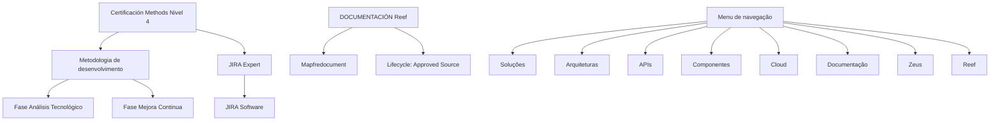

# Certificación Methods Nivel 4 — Temário de Análise Tecnológica, Melhoria Contínua e JIRA Expert

## 1. Metadados do Documento
- **Arquivo de Origem:** `Não identificado`
- **Tipo de Documento:** `Apresentação Executiva`
- **Domínio / Sistema:** `Certificación Methods Nivel 4; metodologia de desenvolvimento; Reef; JIRA Software`
- **Público-Alvo:** `Profissionais em certificação, desenvolvedores e utilizadores de JIRA Software`
- **Data/Versão Identificada:** `Não identificada`

---

## 2. Resumo Executivo & Contexto de Negócio

O conteúdo apresenta referências a uma certificação denominada **“Certificación Methods Nivel 4”**. O documento posiciona dois temas como partes da metodologia de desenvolvimento: a fase de **Análisis Tecnológico** e a fase de **Mejora Continua**.

A fase **Análisis Tecnológico** é descrita como uma seção que contém o respetivo temário dentro da metodologia de desenvolvimento. O trecho fornecido não especifica conteúdos programáticos, critérios de aprovação, duração, entregáveis ou responsáveis por essa fase.

A fase **Mejora Continua** também é apresentada como uma seção temática da metodologia de desenvolvimento. Não há detalhamento adicional sobre práticas, indicadores, ciclos de melhoria, ferramentas ou regras operacionais associadas à fase de melhoria contínua.

O documento ainda menciona **JIRA Expert**, associado ao uso especializado da ferramenta **JIRA Software**. Também há referências à documentação Reef, Mapfredocument, ao utilizador proprietário `agonzalez_mapfre.com`, ao estado de ciclo de vida `Approved Source` e a menus de navegação relacionados a soluções, arquiteturas, APIs, componentes, cloud, documentação, Zeus e Reef.

---

## 3. Arquitetura, Componentes & Tecnologias Envolvidas

Os elementos identificados são:

- **Certificación Methods Nivel 4:** certificação mencionada no conteúdo.
- **Metodologia de desenvolvimento:** contexto que contém as fases de Análisis Tecnológico e Mejora Continua.
- **Fase Análisis Tecnológico:** seção com temário da metodologia de desenvolvimento.
- **Fase Mejora Continua:** seção com temário da metodologia de desenvolvimento.
- **JIRA Expert:** tópico sobre uso especializado de JIRA Software.
- **JIRA Software:** ferramenta mencionada no contexto de uso especializado.
- **Reef / DOCUMENTACIÓN Reef:** área ou documentação nomeada no conteúdo.
- **Mapfredocument:** elemento mencionado junto da documentação Reef.
- **Zeus:** item disponível no menu de navegação.
- **Approved Source:** estado de ciclo de vida indicado para o conteúdo exibido.



> **Nota de Análise:** O conteúdo não descreve arquitetura de software, integrações, contratos de API, protocolos, ambientes, servidores, rotas de logs ou fluxos técnicos entre sistemas.

---

## 4. Regras de Negócio, Especificações Funcionais & Processos

### 4.1 Fase Análisis Tecnológico

1. A fase **Análisis Tecnológico** faz parte da metodologia de desenvolvimento.
2. A seção correspondente contém o temário dessa fase.
3. Não foram identificados critérios de entrada, saída, aprovação, responsáveis, atividades, ferramentas ou entregáveis para a fase Análisis Tecnológico.

### 4.2 Fase Mejora Continua

1. A fase **Mejora Continua** faz parte da metodologia de desenvolvimento.
2. A seção correspondente contém o temário dessa fase.
3. Não foram identificados ciclos de melhoria, métricas, processos de priorização, responsáveis, ferramentas ou critérios de aceite para a fase Mejora Continua.

### 4.3 JIRA Expert

1. O conteúdo indica a existência de um temário sobre o uso especializado de **JIRA Software**.
2. Não foram identificados fluxos de trabalho, tipos de issue, permissões, esquemas, automações, relatórios, configurações ou integrações de JIRA Software.

### 4.4 Documentação Reef

1. O conteúdo apresenta referências repetidas a **DOCUMENTACIÓN Reef**.
2. O proprietário indicado é `user:agonzalez_mapfre.com`.
3. O ciclo de vida indicado é `Approved Source`.
4. Não há detalhamento sobre o conteúdo, escopo, localização ou processo de manutenção da documentação Reef.

---

## 5. Tabelas de Parâmetros, Ambientes e Estruturas de Dados

| Item / Parâmetro | Descrição / Função | Tipo / Valores / Formato | Ambiente / Observações |
| :--- | :--- | :--- | :--- |
| Certificación Methods Nivel 4 | Certificação mencionada no documento | Texto | Sem versão, data, escopo ou critérios detalhados |
| Fase Análisis Tecnológico | Fase da metodologia de desenvolvimento | Temário | O conteúdo apenas informa que o temário existe |
| Fase Mejora Continua | Fase da metodologia de desenvolvimento | Temário | O conteúdo apenas informa que o temário existe |
| JIRA Expert | Tópico de uso especializado de JIRA Software | Temário | O trecho inicia com “n este apartado”; não há conteúdo funcional adicional |
| JIRA Software | Ferramenta mencionada no contexto de JIRA Expert | Ferramenta | Sem versão, URL, configuração ou fluxo descrito |
| DOCUMENTACIÓN Reef | Área ou documentação referenciada | Documentação | Citada repetidamente no conteúdo |
| Mapfredocument | Elemento relacionado à documentação Reef | Texto / Nome de sistema | Sem descrição funcional no conteúdo |
| Owner | Proprietário do conteúdo exibido | `user:agonzalez_mapfre.com` | Valor literal apresentado |
| Lifecycle | Estado de ciclo de vida do conteúdo | `Approved Source` | Também aparece a sequência `/ VL` sem contextualização |
| Idioma | Idioma exibido na navegação | `ES` | Valor literal apresentado |
| Soluciones | Item de menu | Texto | Sem detalhamento adicional |
| Arquitecturas | Item de menu | Texto | Sem detalhamento adicional |
| APIs | Item de menu | Texto | Sem detalhamento adicional |
| Componentes | Item de menu | Texto | Sem detalhamento adicional |
| Cloud | Item de menu | Texto | Sem detalhamento adicional |
| Documentación | Item de menu | Texto | Sem detalhamento adicional |
| Zeus | Item de menu | Texto | Sem detalhamento adicional |
| Reef | Item de menu | Texto | Sem detalhamento adicional |
| Ayuda | Item de menu | Texto | Sem detalhamento adicional |

---

## 6. Bateria de Perguntas & Respostas para RAG (FAQ Sintético)

### P1: Qual é o tema principal do documento?
**R:** O documento apresenta a certificação **Certificación Methods Nivel 4**, com referências ao temário das fases Análisis Tecnológico e Mejora Continua da metodologia de desenvolvimento, além de um tópico denominado JIRA Expert relacionado a JIRA Software.

### P2: O que o documento informa sobre a fase Análisis Tecnológico?
**R:** O documento informa que a fase **Análisis Tecnológico** possui uma seção com o respetivo temário dentro da metodologia de desenvolvimento. O trecho não apresenta o conteúdo desse temário, regras, entregáveis ou critérios de avaliação.

### P3: Qual é a relação entre a fase Mejora Continua e a metodologia de desenvolvimento?
**R:** A fase **Mejora Continua** é apresentada como uma fase pertencente à metodologia de desenvolvimento. O documento declara que existe um temário para essa fase, mas não detalha processos, métricas ou atividades de melhoria contínua.

### P4: O que significa JIRA Expert no contexto do documento?
**R:** **JIRA Expert** é descrito como uma seção que contém o temário do uso especializado da ferramenta **JIRA Software**. O documento não especifica configurações, tipos de issue, permissões, automações ou integrações da ferramenta.

### P5: Quais tecnologias ou ferramentas são explicitamente mencionadas?
**R:** As ferramentas, sistemas ou áreas nominalmente citadas são **JIRA Software**, **Reef**, **Mapfredocument** e **Zeus**. O conteúdo não fornece versões, endpoints, ambientes ou detalhes de integração para esses elementos.

### P6: Qual é o proprietário indicado para a documentação Reef?
**R:** O proprietário apresentado no conteúdo é `user:agonzalez_mapfre.com`.

### P7: Qual estado de ciclo de vida está associado ao conteúdo de documentação Reef?
**R:** O estado de ciclo de vida apresentado é **Approved Source**. A sequência adicional `/ VL` também aparece no conteúdo, porém sem explicação contextual.

### P8: O documento fornece URLs, servidores ou ambientes técnicos?
**R:** Não. O conteúdo fornecido não apresenta URLs, nomes de servidores, portas, credenciais, ambientes de desenvolvimento, homologação ou produção.

### P9: Quais itens estão disponíveis na navegação exibida?
**R:** A navegação inclui os itens **Buscar**, **Inicio**, **Soluciones**, **Arquitecturas**, **APIs**, **Componentes**, **Cloud**, **Documentación**, **Zeus**, **Reef** e **Ayuda**. O idioma indicado é **ES**.

### P10: Existem regras de negócio detalhadas para a certificação Methods Nivel 4?
**R:** Não. O conteúdo cita a certificação e os temas de Análisis Tecnológico, Mejora Continua e JIRA Expert, mas não descreve regras de negócio, critérios de certificação, pré-requisitos, notas mínimas ou fluxos de aprovação.

---

## 7. Glossário de Termos, Siglas & Conceitos-Chave

- **Certificación Methods Nivel 4:** nome da certificação mencionada no documento.
- **Análisis Tecnológico:** fase da metodologia de desenvolvimento cuja seção contém um temário.
- **Mejora Continua:** fase da metodologia de desenvolvimento cuja seção contém um temário.
- **JIRA Expert:** tópico relativo ao uso especializado de JIRA Software.
- **JIRA Software:** ferramenta citada no contexto de JIRA Expert.
- **DOCUMENTACIÓN Reef:** documentação ou área de documentação identificada como Reef.
- **Mapfredocument:** nome exibido junto à documentação Reef, sem definição adicional.
- **Owner:** campo que identifica o proprietário do conteúdo.
- **Lifecycle:** campo que identifica o estado de ciclo de vida do conteúdo.
- **Approved Source:** valor exibido para o campo Lifecycle.
- **ES:** código de idioma exibido na interface.
- **Zeus:** item de navegação mencionado sem definição adicional.

---

## 8. Notas Críticas, Riscos & Limitações

- O conteúdo extraído é predominantemente composto por títulos, descrições breves de seções e elementos de interface.
- O documento não detalha o temário de Análisis Tecnológico, Mejora Continua ou JIRA Expert.
- Não há evidência de arquitetura técnica implementável, integrações, contratos de APIs, esquemas de dados, versões de tecnologia, servidores ou ambientes.
- Não foram identificados critérios de certificação, mecanismos de avaliação, regras de aprovação ou responsabilidades operacionais.
- A expressão `/ VL` aparece após `Approved Source`, mas o conteúdo não define o seu significado.
- O texto de JIRA Expert inicia com `n este apartado`, aparentando ausência do caractere inicial na extração. Não é possível inferir ou corrigir o conteúdo além do trecho literal disponibilizado.

---

## 9. Conteúdo Bruto Estruturado (Referência Fiel)

```text
--- [PÁGINA 1 DE 1] ---

CERTIFICACIÓN - METHODS NIVEL 4
CERTIFICACIÓN METHODS NIVEL 4
FASE ANÁLISIS TECNOLÓGICO
En este apartado se encuentra el temario
de la fase ANÁLISIS TECNOLÓGICO dentro
de la metodología de desarrollo.
FASE MEJORA CONTINUA
En este apartado se encuentra el temario
de la fase MEJORA CONTINUA dentro de
la metodología de desarrollo.
JIRA EXPERT
n este apartado se encuentra el temario
del uso experto de la herramienta JIRA
Software.
Documentation / DOCUMENTACIÓN Reef
DOCUMENTACIÓN Reef
Mapfredocument
DOCUMENTACIÓN Reef
Owner
user:agonzalez_mapfre.com
Lifecycle
Approved Source
 / 
 VL
Buscar Inicio Soluciones Arquitecturas APIs Componentes Cloud Documentación Zeus Reef Ayuda
ES
```
