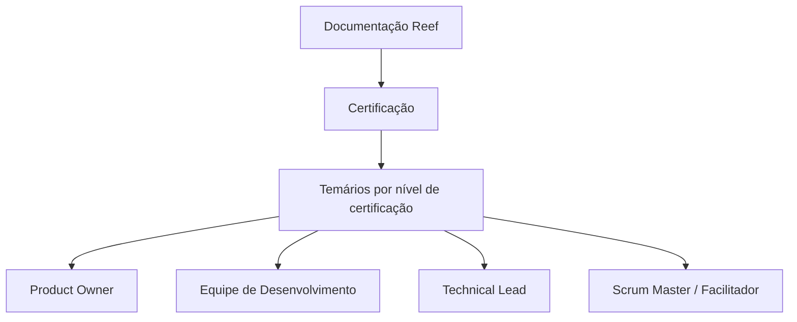

# Documentação Reef — Temários de Certificação por Perfil

## 1. Metadados do Documento
- **Arquivo de Origem:** `Não identificado`
- **Tipo de Documento:** Procedimento / Documentação de certificação
- **Domínio / Sistema:** Reef / Mapfre
- **Público-Alvo:** Product Owner, Equipe de Desenvolvimento, Technical Lead e Scrum Master (Facilitador)
- **Data/Versão Identificada:** Não identificada

---

## 2. Resumo Executivo & Contexto de Negócio

O documento apresenta uma área de **certificação** associada à documentação do sistema ou domínio **Reef**. A finalidade explicitamente indicada é disponibilizar os temários de cada nível de certificação.

Os temários são organizados por perfis profissionais. Os perfis visíveis no conteúdo são **Product Owner**, **Equipe de Desenvolvimento**, **Technical Lead** e **Scrum Master (Facilitador)**.

A extração também referencia elementos de navegação de uma plataforma documental Mapfre, incluindo as áreas Soluções, Arquiteturas, APIs, Componentes, Cloud, Documentação, Zeus, Reef e Ajuda. O conteúdo não descreve os critérios de certificação, os níveis existentes, os conteúdos programáticos nem o processo de aprovação.

---

## 3. Arquitetura, Componentes & Tecnologias Envolvidas

O conteúdo não apresenta arquitetura de software, tecnologias, integrações, APIs, protocolos, ambientes ou fluxos técnicos. A estrutura identificável é documental: uma seção de certificação dentro da documentação Reef, com temários organizados por perfil.



**Nota de Análise:** o documento não detalha os níveis de certificação, os materiais de estudo, mecanismos de avaliação, requisitos de aprovação ou relações técnicas entre Reef, Mapfre e os demais itens do menu de navegação.

---

## 4. Regras de Negócio, Especificações Funcionais & Processos

1. A seção denominada **CERTIFICACIÓN** contém os temários de cada nível de certificação.
2. Os temários de certificação são organizados por perfil.
3. Os perfis explicitamente listados são:
   - Product Owner;
   - Equipe de Desenvolvimento;
   - Technical Lead;
   - Scrum Master (Facilitador).
4. A documentação está associada a **Reef**, conforme as referências “Documentation / DOCUMENTACIÓN Reef” e “DOCUMENTACIÓN Reef”.
5. O conteúdo extraído indica estado de ciclo de vida como **Approved Source**.
6. Não há regras adicionais sobre elegibilidade, sequência de treinamentos, provas, notas mínimas, validade da certificação ou responsáveis por aprovação.

---

## 5. Tabelas de Parâmetros, Ambientes e Estruturas de Dados

| Item / Parâmetro | Descrição / Função | Tipo / Valores / Formato | Ambiente / Observações |
| :--- | :--- | :--- | :--- |
| Certificação | Seção que reúne temários de cada nível de certificação. | Seção documental | Não detalha níveis ou critérios de avaliação. |
| Organização dos temários | Forma de classificação dos conteúdos de certificação. | Por perfil | Explicitamente indicada no texto. |
| Product Owner | Perfil listado na organização dos temários. | Perfil profissional | Conteúdo programático não detalhado. |
| Equipe de Desenvolvimento | Perfil listado na organização dos temários. | Perfil profissional | Aparece como “EQUIPO DESARROLLO”. |
| Technical Lead | Perfil listado na organização dos temários. | Perfil profissional | Conteúdo programático não detalhado. |
| Scrum Master (Facilitador) | Perfil listado na organização dos temários. | Perfil profissional | Aparece acompanhado da qualificação “FACILITADOR”. |
| Documentation / DOCUMENTACIÓN Reef | Referência à documentação Reef. | Área documental | O texto alterna inglês e espanhol. |
| Mapfredocument | Termo exibido na navegação/documentação. | Identificador textual | Sem explicação adicional. |
| Owner | Campo de proprietário exibido no conteúdo. | Metadado | Valor: `user:agonzalez_mapfre.com`. |
| Lifecycle | Campo de ciclo de vida documental. | Metadado | Valor: `Approved Source`. |
| Navegação | Itens de menu apresentados. | Lista | Buscar, Inicio, Soluciones, Arquitecturas, APIs, Componentes, Cloud, Documentación, Zeus, Reef e Ayuda. |
| Idioma | Idioma indicado na interface. | Código | `ES`. |
| Versão | Campo exibido no conteúdo. | Texto | `VL`; significado não detalhado. |

---

## 6. Bateria de Perguntas & Respostas para RAG (FAQ Sintético)

### P1: Qual é o objetivo da seção de certificação na documentação Reef?
**R:** A seção de certificação contém os temários de cada nível de certificação. O texto informa que esses temários são organizados por perfil profissional.

### P2: Quais perfis possuem temários de certificação no documento?
**R:** O documento lista os seguintes perfis: Product Owner, Equipe de Desenvolvimento, Technical Lead e Scrum Master (Facilitador).

### P3: O documento explica quais são os níveis de certificação disponíveis?
**R:** Não. O conteúdo afirma que existem temários para cada nível de certificação, mas não identifica ou descreve os níveis.

### P4: O documento informa os conteúdos programáticos para Product Owner?
**R:** Não. Product Owner é listado como perfil de certificação, mas o temário específico desse perfil não está presente na extração fornecida.

### P5: Existe um processo de aprovação ou nota mínima para certificação Reef?
**R:** Não. O documento não apresenta regras de aprovação, notas mínimas, avaliações, prazos ou validade de certificações.

### P6: O que significa Scrum Master (Facilitador) no conteúdo?
**R:** Scrum Master (Facilitador) é um dos perfis pelos quais os temários de certificação são organizados. O documento não fornece uma definição adicional para o papel.

### P7: Qual é o estado de ciclo de vida indicado para o documento?
**R:** O campo `Lifecycle` apresenta o valor `Approved Source`.

### P8: Quem aparece como proprietário do documento?
**R:** O campo `Owner` apresenta o valor `user:agonzalez_mapfre.com`.

### P9: Quais áreas estão disponíveis na navegação da plataforma documental?
**R:** A navegação apresenta Buscar, Inicio, Soluciones, Arquitecturas, APIs, Componentes, Cloud, Documentación, Zeus, Reef e Ayuda.

### P10: O documento descreve APIs, arquiteturas ou componentes técnicos de Reef?
**R:** Não. APIs, Arquiteturas e Componentes aparecem apenas como itens de navegação. Não há descrição técnica desses elementos no conteúdo extraído.

---

## 7. Glossário de Termos, Siglas & Conceitos-Chave

- **Reef:** domínio ou sistema associado à documentação e à seção de certificação; não há definição funcional adicional.
- **Product Owner:** perfil listado para organização dos temários de certificação.
- **Equipe de Desenvolvimento:** perfil listado para organização dos temários de certificação.
- **Technical Lead:** perfil listado para organização dos temários de certificação.
- **Scrum Master (Facilitador):** perfil listado para organização dos temários de certificação.
- **Lifecycle:** campo de metadado que indica o ciclo de vida do documento.
- **Approved Source:** valor do campo Lifecycle; o documento não define o significado operacional desse estado.
- **Owner:** campo de metadado que identifica o proprietário do documento.
- **ES:** código exibido para idioma da interface, provavelmente espanhol; o documento não explicita a definição do código.
- **VL:** valor exibido junto ao conteúdo; o documento não define seu significado.

---

## 8. Notas Críticas, Riscos & Limitações

- A extração contém somente uma introdução resumida à certificação por perfis.
- Não existem detalhes sobre níveis de certificação, ementas, critérios de elegibilidade, provas, notas, aprovações ou validade.
- Não há especificações técnicas, contratos de API, fluxos operacionais, tecnologias, URLs, servidores ou ambientes.
- O termo `VL` aparece sem definição.
- A relação funcional entre Reef, Mapfredocument, Zeus e os demais itens de navegação não é detalhada.
- **Nota de Análise:** o documento lista os perfis Product Owner, Equipe de Desenvolvimento, Technical Lead e Scrum Master (Facilitador), porém não detalha os respectivos conteúdos programáticos.

---

## 9. Conteúdo Bruto Estruturado (Referência Fiel)

```text
--- [PÁGINA 1 DE 1] ---

CERTIFICACIÓN
 En este apartado se encuentran los temarios de cada uno de los niveles de certicación. Los temarios están
organizados por perles.
 PRODUCT OWNER
  EQUIPO DESARROLLO
  TECHNICAL LEAD
 SCRUM MASTER
(FACILITADOR)
Documentation / DOCUMENTACIÓN Reef
DOCUMENTACIÓN Reef
Mapfredocument
DOCUMENTACIÓN Reef
Owner
user:agonzalez_mapfre.com
Lifecycle
Approved Source
 / 
 VL
Buscar Inicio Soluciones Arquitecturas APIs Componentes Cloud Documentación Zeus Reef Ayuda
ES
```
