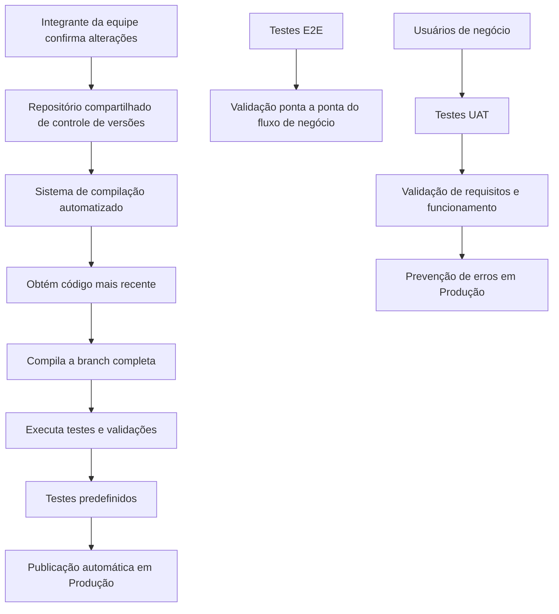

# Métodos de Engenharia de Software: CI/CD, Testes E2E e UAT — Documentação Reef

## 1. Metadados do Documento
- **Arquivo de Origem:** `Não identificado no conteúdo fornecido`
- **Tipo de Documento:** `Documentação / material conceitual de engenharia de software`
- **Domínio / Sistema:** `Reef / Mapfredocument`
- **Público-Alvo:** `Desenvolvedores, usuários de negócio e equipes de entrega de software`
- **Data/Versão Identificada:** `Não identificada`

---

## 2. Resumo Executivo & Contexto de Negócio

O documento apresenta conceitos de métodos de engenharia de software associados à **Integração Contínua**, ao **Despliegue Contínuo**, aos **testes End to End (E2E)** e aos **testes de Aceitação do Usuário (UAT)**. O conteúdo está inserido no contexto de “DOCUMENTACIÓN Reef” e menciona “Mapfredocument”.

A Integração Contínua (CI) é descrita como a automação da compilação e dos testes de código sempre que um integrante confirma alterações no controle de versões. O processo pressupõe um repositório compartilhado, incorporação frequente de código e testes unitários, além de um sistema automatizado de compilação, teste e validação da branch completa.

O Despliegue Contínuo (DC) é apresentado como uma estratégia em que alterações de código são publicadas automaticamente no ambiente de produção mediante uma série de testes predefinidos. O objetivo declarado é reduzir o intervalo entre a escrita do código e sua disponibilidade para usuários finais.

O documento também diferencia a validação técnica integral do fluxo de negócio, realizada por testes E2E, da validação realizada pelos usuários de negócio em UAT. Os testes UAT verificam tanto a adequação do sistema aos requisitos definidos quanto o funcionamento correto antes de produção, visando evitar erros no ambiente produtivo.

---

## 3. Arquitetura, Componentes & Tecnologias Envolvidas

Os elementos técnicos e processuais explicitamente citados são:

| Componente / Conceito | Papel descrito no documento |
| :--- | :--- |
| Controle de versões | Repositório compartilhado onde integrantes confirmam alterações de código. |
| Integração Contínua (CI) | Automatiza compilação e testes após confirmação de alterações. |
| Sistema de compilação automatizado | Obtém o código mais recente do repositório, compila, testa e valida a branch completa. |
| Testes unitários | São compartilhados pelos desenvolvedores junto ao código durante a CI. |
| Despliegue Contínuo (DC) | Publica automaticamente alterações de código no ambiente de produção. |
| Testes predefinidos | Base para a automação do Despliegue Contínuo. |
| Testes E2E | Validam a transmissão de dados do início ao fim de um fluxo de negócio entre aplicações. |
| Testes UAT | Permitem que usuários de negócio validem requisitos e funcionamento do sistema. |
| Reef | Contexto de documentação citado no conteúdo. |
| Mapfredocument | Termo citado no conteúdo, sem detalhamento técnico adicional. |
| Zeus | Item de navegação citado no conteúdo, sem detalhamento técnico adicional. |



**Nota de Análise:** o documento descreve o fluxo conceitual de CI/CD, E2E e UAT, mas não identifica ferramentas específicas de controle de versão, compilação, automação, execução de testes ou implantação.

---

## 4. Regras de Negócio, Especificações Funcionais & Processos

### Integração Contínua (CI)

1. A CI automatiza a compilação e os testes de código.
2. A automação ocorre sempre que um membro da equipe confirma mudanças no controle de versões.
3. A CI incentiva desenvolvedores a compartilhar código e testes unitários.
4. As mudanças são incorporadas a um repositório compartilhado após a conclusão de cada tarefa pequena.
5. A confirmação de código aciona um sistema automatizado de compilação.
6. O sistema automatizado deve:
   - obter o código mais recente do repositório compartilhado;
   - compilar a branch completa;
   - testar a branch completa;
   - validar a branch completa.

### Despliegue Contínuo (DC)

1. O Despliegue Contínuo é uma estratégia de desenvolvimento de software.
2. Alterações de código de uma aplicação são publicadas automaticamente no ambiente de produção.
3. A automação da publicação é baseada em uma série de testes predefinidos.
4. O objetivo principal é acelerar o ciclo de entrega de software.
5. O Despliegue Contínuo busca reduzir o tempo entre a escrita do código e a disponibilidade desse código para usuários finais.

### Estratégia CI/CD

A estratégia CI/CD é associada aos seguintes efeitos declarados:

- aceleração do ciclo de entrega;
- redução de erros humanos;
- melhoria da qualidade do software;
- resposta mais rápida a mudanças;
- resposta mais rápida a problemas.

### Testes End to End (E2E)

1. Os testes E2E verificam a transmissão de um dado desde o início até o fim do fluxo de negócio.
2. Os testes E2E asseguram que a informação viaje corretamente através de diferentes aplicações em um cenário concreto.
3. Os testes E2E não se concentram apenas em funcionalidades simples.
4. Os testes E2E validam o processo de negócio completo.

### Testes de Aceitação do Usuário (UAT)

1. Usuários de negócio devem validar se o sistema atende aos requisitos definidos.
2. A validação é realizada por meio da execução de testes de aceitação UAT.
3. Os usuários executam um subconjunto das provas funcionais projetadas durante o desenvolvimento.
4. Os usuários podem, opcionalmente, executar testes exploratórios baseados em sua própria experiência.
5. O objetivo do UAT é validar:
   - a adequação do sistema desenvolvido às necessidades especificadas;
   - o correto funcionamento do sistema.
6. A validação UAT busca evitar erros em produção.

---

## 5. Tabelas de Parâmetros, Ambientes e Estruturas de Dados

| Item / Parâmetro | Descrição / Função | Tipo / Valores / Formato | Ambiente / Observações |
| :--- | :--- | :--- | :--- |
| CI | Processo de automatizar compilação e testes de código após confirmação de mudanças. | Sigla / processo de engenharia de software. | Integrado ao controle de versões e a repositório compartilhado. |
| DC | Estratégia de publicar automaticamente alterações de código de uma aplicação. | Sigla / estratégia de desenvolvimento. | Produção. |
| CI/CD | Estratégia associada à aceleração de entrega, redução de erros humanos e melhoria de qualidade. | Prática de entrega de software. | Não são citadas ferramentas ou pipelines específicos. |
| E2E | Teste que verifica a transmissão do dado do início ao fim de um fluxo de negócio. | Sigla / tipo de teste. | Abrange diferentes aplicações em cenário concreto. |
| UAT | Teste executado por usuários de negócio para validar requisitos e funcionamento. | Sigla / teste de aceitação. | Executa subconjunto de testes funcionais e, opcionalmente, testes exploratórios. |
| Repositório compartilhado | Local compartilhado de controle de versões que recebe código e testes unitários. | Componente conceitual. | Tecnologia específica não identificada. |
| Sistema de compilação automatizado | Obtém código, compila, testa e valida a branch completa. | Componente conceitual. | Ferramenta específica não identificada. |
| Testes predefinidos | Conjunto de testes que fundamenta a automação do Despliegue Contínuo. | Critério de automação. | Necessários antes da publicação automática em produção. |
| Produção | Ambiente no qual alterações de código são publicadas automaticamente no Despliegue Contínuo. | Ambiente. | Nenhuma URL, servidor, porta ou configuração foi informada. |
| Reef | Referência de documentação citada no conteúdo. | Domínio / contexto documental. | Não há detalhamento adicional. |
| Mapfredocument | Termo exibido no conteúdo. | Nome citado. | Função e integração não detalhadas. |
| Owner | Identificação exibida no conteúdo: `user:agonzalez_mapfre.com`. | Campo de propriedade. | Não há detalhe sobre responsabilidades. |
| Lifecycle | Campo exibido no conteúdo. | Campo documental. | Valor não informado. |
| Approved Source | Texto exibido no conteúdo. | Estado ou metadado documental possível. | Sem explicação adicional. |

---

## 6. Bateria de Perguntas & Respostas para RAG (FAQ Sintético)

### P1: O que é Integração Contínua (CI) no contexto da documentação Reef?
**R:** A Integração Contínua, ou CI, é o processo de automatizar a compilação e os testes de código cada vez que um integrante da equipe confirma alterações no controle de versões. A CI envolve um repositório compartilhado e um sistema automatizado que obtém o código mais recente, compila, testa e valida a branch completa.

### P2: O que acontece quando uma alteração de código é confirmada no controle de versões?
**R:** Segundo o documento, a confirmação de código desencadeia um sistema de compilação automatizado. Esse sistema obtém o código mais recente do repositório compartilhado e executa a compilação, os testes e a validação da branch completa.

### P3: Qual é o papel dos testes unitários na Integração Contínua?
**R:** A CI incentiva desenvolvedores a compartilhar código e testes unitários. O documento indica que as mudanças são incorporadas ao repositório compartilhado após a conclusão de cada tarefa pequena.

### P4: O que é Despliegue Contínuo (DC)?
**R:** O Despliegue Contínuo é uma estratégia de desenvolvimento de software na qual alterações de código de uma aplicação são publicadas automaticamente no ambiente de produção. Essa automação é baseada em uma série de testes predefinidos.

### P5: Qual é o objetivo principal do Despliegue Contínuo?
**R:** O objetivo principal do Despliegue Contínuo é acelerar o ciclo de entrega de software e reduzir o tempo entre a escrita do código e sua disponibilidade para usuários finais.

### P6: Quais benefícios são atribuídos à estratégia CI/CD?
**R:** A estratégia CI/CD permite acelerar o ciclo de entrega, reduzir erros humanos, melhorar a qualidade do software e fornecer resposta mais rápida a mudanças e problemas.

### P7: O que os testes End to End (E2E) validam?
**R:** Os testes End to End validam a transmissão de um dado desde o início até o fim de um fluxo de negócio. Eles asseguram que a informação viaje corretamente entre diferentes aplicações em um cenário concreto e validam o processo de negócio completo, não apenas funcionalidades simples.

### P8: Quem executa os testes de Aceitação do Usuário (UAT)?
**R:** Os testes UAT são executados por usuários de negócio. Esses usuários validam se o sistema atende aos requisitos definidos por meio de um subconjunto dos testes funcionais projetados durante o desenvolvimento e, opcionalmente, por testes exploratórios baseados em sua experiência.

### P9: Qual é o objetivo dos testes UAT antes de produção?
**R:** O objetivo dos testes UAT é permitir que usuários de negócio validem a adequação do sistema desenvolvido às necessidades especificadas e confirmem o funcionamento correto do sistema, buscando evitar erros em produção.

### P10: Quais ferramentas de CI/CD são utilizadas no documento?
**R:** O documento não identifica ferramentas específicas de CI/CD, controle de versões, compilação, execução de testes ou publicação em produção. O conteúdo descreve apenas os processos e objetivos conceituais.

---

## 7. Glossário de Termos, Siglas & Conceitos-Chave

- **CI (Integración Continua):** Processo de automatizar compilação e testes de código após alterações confirmadas no controle de versões.
- **CD / DC (Despliegue Continuo):** Estratégia de publicar automaticamente alterações de código no ambiente de produção, baseada em testes predefinidos.
- **CI/CD:** Estratégia que combina Integração Contínua e Despliegue Contínuo para acelerar a entrega e melhorar a qualidade do software.
- **E2E (End to End):** Teste que valida a transmissão de dados e o processo de negócio completo do início ao fim.
- **UAT (User Acceptance Test):** Teste de aceitação executado por usuários de negócio para validar requisitos e funcionamento do sistema.
- **Branch:** Ramificação completa submetida à compilação, testes e validação pelo sistema automatizado.
- **Controle de versões:** Mecanismo que recebe confirmações de código e aciona o processo automatizado de CI.
- **Repositório compartilhado:** Repositório de controle de versões utilizado por integrantes da equipe para compartilhar código e testes unitários.
- **Testes exploratórios:** Testes opcionais realizados pelos usuários de negócio com base em sua própria experiência.
- **Produção:** Ambiente no qual o Despliegue Contínuo publica automaticamente alterações de código.

---

## 8. Notas Críticas, Riscos & Limitações

- O documento não identifica ferramentas, produtos ou plataformas concretas para controle de versões, compilação, testes, CI/CD ou implantação.
- O documento não informa contratos de integração, métodos HTTP, APIs, formatos de dados, endpoints, URLs, portas ou servidores.
- Não foram fornecidos critérios detalhados para aprovação ou reprovação dos testes predefinidos que antecedem a publicação automática em produção.
- Não foram detalhados os casos de teste E2E, os cenários concretos, as aplicações participantes nem os dados transmitidos.
- Não foram detalhados os requisitos funcionais validados por UAT, responsáveis pela aprovação, evidências exigidas ou critérios formais de aceite.
- Os termos “Reef”, “Mapfredocument” e “Zeus” são citados, mas suas responsabilidades, integrações e arquitetura não são explicadas.
- **Nota de Análise:** o conteúdo descreve princípios e objetivos de CI/CD, E2E e UAT, mas não apresenta uma implementação técnica específica.

---

## 9. Conteúdo Bruto Estruturado (Referência Fiel)

```text
--- [PÁGINA 1 DE 1] ---

TÉRMINOS (METHODS)
Integración Continua / Despliegue Continuo (#CI/CD, #CI, #CD)
La Integración Continua (CI) es el proceso de automatizar la compilación y las pruebas de código cada vez que un miembro del equipo
conrma cambios en el control de versiones.
La CI estimula a los desarrolladores para que compartan el código y las pruebas unitarias, ya que incorpora sus cambios a un repositorio
de control de versiones compartido después de que cada tarea pequeña se complete. La conrmación de código desencadena un
sistema de compilación automatizado para obtener el código más reciente del repositorio compartido y para compilar, probar y validar la
rama completa.
El Despliegue Continuo (DC) es una estrategia de desarrollo de software en la que los cambios de código de una aplicación se publican
automáticamente en el entorno de producción. Esta automatización se basa en una serie de pruebas predenidas.
El objetivo principal del despliegue continuo es acelerar el ciclo de entrega de software, reducir el tiempo entre la escritura del código y su
disponibilidad para los usuarios nales.
La estrategia CI/CD permite acelerar el ciclo de entrega, reducir errores humanos, mejorar la calidad del software y proporcionar una
respuesta más rápida a cambios y problemas.
Pruebas End to End (#E2E)
Las Pruebas End to End (E2E) se centran en comprobar la transmisión del dato desde el inicio hasta el n del ujo de negocio, asegurando
que la información viaja correctamente a través de las distintas aplicaciones en un escenario concreto. Es decir, en lugar de centrarse en
funcionalidades simples, se valida el proceso de negocio al completo.
Pruebas de Aceptación del Usuario (User Acceptance Test ) (#UAT)
Los usuarios de negocio deben validar que el sistema cumple con los requisitos denidos, mediante la ejecución de las Pruebas de
Aceptación (UAT). Para ello que ejecutan un subconjunto de las pruebas funcionales diseñadas durante el desarrollo, y, opcionalmente,
pruebas exploratorias basadas en su propia experiencia.
El objetivo es que los usuarios validen, tanto la adecuación del sistema desarrollado a las necesidades especicadas, como el correcto
funcionamiento de dicho sistema, con el n de evitar errores en Producción.
Documentation / DOCUMENTACIÓN Reef
DOCUMENTACIÓN Reef
Mapfredocument
DOCUMENTACIÓN Reef
Owner
user:agonzalez_mapfre.com
Lifecycle
Approved Source
 / 
 VL
Buscar Inicio Soluciones Arquitecturas APIs Componentes Cloud Documentación Zeus Reef Ayuda
ES
```
