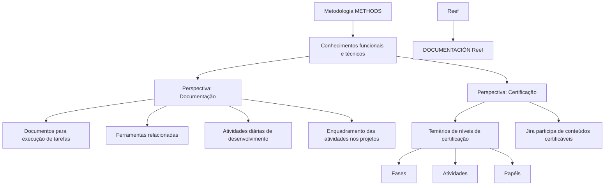

# Metodologia METHODS — Documentação e Certificação

## 1. Metadados do Documento
- **Arquivo de Origem:** Não informado
- **Tipo de Documento:** Procedimento
- **Domínio / Sistema:** Metodologia de desenvolvimento METHODS; Reef
- **Público-Alvo:** Equipes de projeto, desenvolvedores e profissionais em certificação
- **Data/Versão Identificada:** Não identificada

---

## 2. Resumo Executivo & Contexto de Negócio

O conteúdo apresenta uma área de conhecimento relacionada à metodologia de desenvolvimento **METHODS**. O objetivo declarado é permitir a aquisição de conhecimentos funcionais e técnicos associados à metodologia, organizando as informações em duas perspectivas: **Documentação** e **Certificação**.

A perspectiva de **Documentação** reúne documentos que auxiliam a execução das tarefas previstas na metodologia METHODS e o conhecimento das ferramentas relacionadas. O repositório é descrito como um local no qual as equipes podem conhecer as atividades de desenvolvimento realizadas no cotidiano dos projetos e entender como essas atividades se enquadram na metodologia.

A perspectiva de **Certificação** contém os conteúdos programáticos dos diferentes níveis de certificação. O texto diferencia fases, atividades e papéis, especificando que as certificações incidem sobre fases e atividades. A ferramenta **Jira** participa do conteúdo programático de qualquer conteúdo certificável.

O trecho também referencia navegação em um ambiente denominado **Reef**, incluindo áreas como Soluções, Arquiteturas, APIs, Componentes, Cloud, Documentação, Zeus, Reef e Ajuda. Não há detalhamento adicional sobre contratos, integrações técnicas, autenticação, permissões ou funcionamento interno dessas áreas.

---

## 3. Arquitetura, Componentes & Tecnologias Envolvidas

Os elementos identificados no conteúdo são:

- **METHODS:** metodologia de desenvolvimento para a qual são disponibilizados conhecimentos funcionais e técnicos.
- **Documentação:** perspectiva que centraliza documentos, tarefas metodológicas, ferramentas relacionadas e atividades de desenvolvimento.
- **Certificação:** perspectiva que centraliza temários de diferentes níveis de certificação.
- **Jira:** ferramenta participante no temário de qualquer conteúdo certificável.
- **Reef:** ambiente referenciado pela área “DOCUMENTACIÓN Reef” e pelo menu de navegação.
- **Zeus:** item presente no menu de navegação, sem detalhamento funcional ou técnico.
- **Mapfredocument:** termo exibido no conteúdo, sem explicação adicional.
- **Owner:** campo exibido com o valor `user:agonzalez_mapfre.com`.
- **Lifecycle:** campo exibido com o valor `Approved`.



> **Nota de Análise:** o conteúdo não descreve uma arquitetura de software, interfaces, APIs, fluxos de dados, tecnologias de implementação, ambientes de execução ou relações técnicas entre Reef, Zeus, Mapfredocument e Jira.

---

## 4. Regras de Negócio, Especificações Funcionais & Processos

### Organização do conhecimento METHODS

1. A documentação da metodologia METHODS tem como finalidade permitir a aquisição de conhecimentos funcionais e técnicos.
2. As informações são organizadas em duas perspectivas:
   - Documentação.
   - Certificação.

### Perspectiva de Documentação

1. A área de Documentação contém documentos que ajudam na realização das tarefas da metodologia METHODS.
2. A área de Documentação permite conhecer ferramentas relacionadas à metodologia METHODS.
3. As equipes podem consultar as atividades de desenvolvimento que devem executar diariamente nos projetos.
4. As equipes podem compreender como as atividades de desenvolvimento se enquadram na metodologia METHODS.

### Perspectiva de Certificação

1. A área de Certificação contém temários de diferentes níveis de certificação.
2. O conteúdo de certificação distingue:
   - Fases.
   - Atividades.
   - Papéis.
3. A certificação é obtida sobre fases e atividades.
4. A ferramenta Jira participa do temário de qualquer conteúdo certificável.

> **Nota de Análise:** o texto não informa os níveis de certificação existentes, os critérios de aprovação, os papéis disponíveis, as fases da metodologia, as atividades certificáveis nem a forma de participação do Jira no processo de certificação.

---

## 5. Tabelas de Parâmetros, Ambientes e Estruturas de Dados

| Item / Parâmetro | Descrição / Função | Tipo / Valores / Formato | Ambiente / Observações |
| :--- | :--- | :--- | :--- |
| Metodologia | Base de conhecimento funcional e técnico apresentada no conteúdo. | `METHODS` | Metodologia de desenvolvimento. |
| Perspectiva | Área destinada a documentos, tarefas e ferramentas relacionadas. | `Documentación` | Associada à metodologia METHODS. |
| Perspectiva | Área destinada aos temários dos níveis de certificação. | `Certificación` | Distingue fases, atividades e papéis. |
| Ferramenta | Ferramenta participante no temário de conteúdos certificáveis. | `Jira` | Não há detalhamento da integração ou do uso. |
| Área / Ambiente | Área referenciada no conteúdo. | `DOCUMENTACIÓN Reef` | Relacionada ao Reef. |
| Sistema / Termo | Termo apresentado sem descrição funcional. | `Mapfredocument` | Sem detalhamento adicional. |
| Owner | Identificação do proprietário exibida no conteúdo. | `user:agonzalez_mapfre.com` | Valor literal extraído. |
| Lifecycle | Estado de ciclo de vida exibido. | `Approved` | Valor literal extraído. |
| Idioma | Opção de idioma exibida no menu. | `ES` | O conteúdo original está em espanhol. |
| Menu | Item de navegação. | `Buscar` | Sem detalhamento adicional. |
| Menu | Item de navegação. | `Inicio` | Sem detalhamento adicional. |
| Menu | Item de navegação. | `Soluciones` | Sem detalhamento adicional. |
| Menu | Item de navegação. | `Arquitecturas` | Sem detalhamento adicional. |
| Menu | Item de navegação. | `APIs` | Sem detalhamento adicional. |
| Menu | Item de navegação. | `Componentes` | Sem detalhamento adicional. |
| Menu | Item de navegação. | `Cloud` | Sem detalhamento adicional. |
| Menu | Item de navegação. | `Documentación` | Sem detalhamento adicional. |
| Menu | Item de navegação. | `Zeus` | Sem detalhamento adicional. |
| Menu | Item de navegação. | `Reef` | Sem detalhamento adicional. |
| Menu | Item de navegação. | `Ayuda` | Sem detalhamento adicional. |

---

## 6. Bateria de Perguntas & Respostas para RAG (FAQ Sintético)

### P1: Qual é o objetivo da documentação relacionada à metodologia METHODS?
**R:** A documentação relacionada à metodologia METHODS busca permitir a aquisição de conhecimentos funcionais e técnicos. O conteúdo é organizado nas perspectivas de Documentação e Certificação.

### P2: Quais são as duas perspectivas de organização da informação na metodologia METHODS?
**R:** As informações da metodologia METHODS são organizadas em duas perspectivas: Documentação e Certificação.

### P3: O que está disponível na perspectiva de Documentação da metodologia METHODS?
**R:** A perspectiva de Documentação reúne documentos que ajudam a realizar tarefas da metodologia METHODS, permite conhecer ferramentas relacionadas e apresenta atividades de desenvolvimento realizadas no cotidiano dos projetos, incluindo o enquadramento dessas atividades na metodologia.

### P4: Como a área de Documentação auxilia as equipes de projeto?
**R:** A área de Documentação permite que equipes conheçam as atividades de desenvolvimento a realizar no dia a dia dos projetos e compreendam como essas atividades se enquadram dentro da metodologia METHODS.

### P5: O que a área de Certificação disponibiliza?
**R:** A área de Certificação disponibiliza os temários dos distintos níveis de certificação e faz distinção entre fases, atividades e papéis.

### P6: Sobre quais elementos é obtida a certificação na metodologia METHODS?
**R:** Segundo o conteúdo, a certificação é obtida sobre fases e atividades. Os papéis são diferenciados no temário, mas o texto não afirma que a certificação seja obtida diretamente sobre papéis.

### P7: Qual é o papel do Jira nos conteúdos certificáveis?
**R:** Jira é a ferramenta que participará do temário de qualquer conteúdo certificável. O documento não detalha como Jira participa, quais funcionalidades são abordadas ou quais atividades são executadas na ferramenta.

### P8: O documento descreve APIs, métodos HTTP ou contratos de integração?
**R:** Não. Embora “APIs” apareça como item de navegação, o conteúdo não descreve APIs, métodos HTTP, contratos JSON, endpoints, autenticação ou integrações.

### P9: O que é Reef no contexto do conteúdo fornecido?
**R:** Reef é referenciado por “DOCUMENTACIÓN Reef” e como item do menu de navegação. O conteúdo não oferece definição funcional, arquitetura, integrações ou responsabilidades técnicas adicionais para Reef.

### P10: Qual é o estado de ciclo de vida identificado no conteúdo?
**R:** O campo `Lifecycle` apresenta o valor `Approved`.

---

## 7. Glossário de Termos, Siglas & Conceitos-Chave

- **METHODS:** metodologia de desenvolvimento mencionada como fonte de conhecimentos funcionais e técnicos.
- **Documentación / Documentação:** perspectiva que reúne documentos, tarefas metodológicas, ferramentas relacionadas e atividades de desenvolvimento.
- **Certificación / Certificação:** perspectiva que reúne temários de níveis de certificação, diferenciando fases, atividades e papéis.
- **Jira:** ferramenta participante no temário de qualquer conteúdo certificável.
- **Reef:** ambiente ou área referenciada por “DOCUMENTACIÓN Reef” e pelo menu de navegação; sem definição adicional no conteúdo.
- **Zeus:** item de menu citado sem descrição adicional.
- **Lifecycle:** campo que indica o estado de ciclo de vida; no conteúdo, o valor é `Approved`.
- **Owner:** campo que identifica o proprietário; no conteúdo, o valor exibido é `user:agonzalez_mapfre.com`.
- **APIs:** item de navegação exibido, sem descrição de interfaces, contratos ou serviços.

---

## 8. Notas Críticas, Riscos & Limitações

- O conteúdo é resumido e não apresenta detalhamento técnico sobre arquitetura, integrações, APIs, infraestrutura, ambientes, URLs, servidores, credenciais, permissões ou logs.
- Não foram identificados critérios de avaliação, níveis específicos de certificação, conteúdos programáticos detalhados, prazos ou responsáveis pelas fases e atividades.
- O papel operacional do Jira é limitado à afirmação de que a ferramenta participa do temário de qualquer conteúdo certificável.
- Os termos `Reef`, `Zeus` e `Mapfredocument` são citados sem definição adicional.
- O texto original contém caracteres possivelmente corrompidos na palavra “certificación”, exibida como `certicación`. A transcrição abaixo preserva o conteúdo extraído.
- Não é possível afirmar, apenas com base no conteúdo, se Reef é um portal, sistema, módulo, produto ou repositório documental.

---

## 9. Conteúdo Bruto Estruturado (Referência Fiel)

```text
--- [PÁGINA 1 DE 1] ---

METODOLOGÍA
 En este apartado se encuentra la documentación que permite adquirir conocimientos tanto funcionales como
técnicos relacionados con la metodología de desarrollo METHODS. La información está organizada en dos perspectivas:
Documentación
Certicación
DOCUMENTACIÓN
En este lugar se encuentran los documentos que ayudan a realizar las tareas de la metodología METHODS, así como conocer las
herramientas realacionadas. Es un lugar donde los equipos pueden conocer las actividades de desarrollo a realizar el el día a día de los
proyectos, y cómo se enmarcan dentro de la metodología.
CERTIFICACIÓN
Aquí se encuentran los temarios de los distintos niveles de certicación, haciendo distinción entre fases, actividades y roles. Las fases y
actividades son aquellas sobre los que se obtendrá la certicación. Jira es la herramienta que participará en el temario de cualquier
contenido certicable.
Documentation / DOCUMENTACIÓN Reef
DOCUMENTACIÓN Reef
Mapfredocument
DOCUMENTACIÓN Reef
Owner
user:agonzalez_mapfre.com
Lifecycle
Approved Source
 / 
 VL
Buscar Inicio Soluciones Arquitecturas APIs Componentes Cloud Documentación Zeus Reef Ayuda
ES
```
