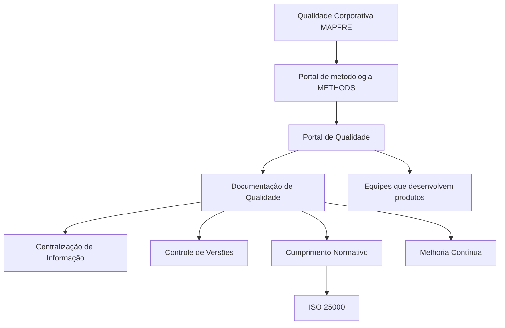

# Documentação de Qualidade Corporativa MAPFRE — Portal de Qualidade no METHODS / Reef

## 1. Metadados do Documento
- **Arquivo de Origem:** `Não identificado no conteúdo fornecido`
- **Tipo de Documento:** `Procedimento`
- **Domínio / Sistema:** `Qualidade Corporativa MAPFRE; METHODS; Portal de Qualidade; Reef`
- **Público-Alvo:** `Equipes que desenvolvem produtos e membros das equipes`
- **Data/Versão Identificada:** `Não identificada`

---

## 2. Resumo Executivo & Contexto de Negócio

O documento apresenta a documentação relacionada à Qualidade Corporativa da MAPFRE e informa que esse conteúdo está disponível no portal de metodologia METHODS, especificamente no Portal de Qualidade. O Portal de Qualidade é descrito como o ponto de acesso central para documentação de qualidade.

A gestão da qualidade é apresentada como um pilar fundamental para o sucesso e a sustentabilidade de qualquer produto. Nesse contexto, o Portal de Qualidade busca permitir que os membros das equipes localizem e utilizem a documentação necessária de maneira intuitiva e sem complicações.

A documentação de qualidade é indicada como essencial para garantir que os produtos atendam aos padrões estabelecidos. As utilidades explicitamente listadas incluem centralização das informações, controle de versões, suporte ao cumprimento normativo e apoio à melhoria contínua da documentação gerada.

O conteúdo também associa o Portal de Qualidade ao suporte para equipes que desenvolvem produtos no atendimento a normativas e padrões internacionais, citando ISO 25000. Entretanto, o documento não detalha quais documentos, controles, processos de aprovação ou requisitos específicos da ISO 25000 são aplicados.

---

## 3. Arquitetura, Componentes & Tecnologias Envolvidas

Os elementos identificados no conteúdo são:

| Componente / Elemento | Papel identificado no documento |
| :--- | :--- |
| MAPFRE | Organização referenciada pela documentação de Qualidade Corporativa. |
| METHODS | Portal de metodologia onde está localizada a documentação de Qualidade Corporativa da MAPFRE. |
| Portal de Qualidade | Localização única para consulta, armazenamento e gestão de documentos de qualidade. |
| Reef | Área ou contexto de documentação identificado na navegação como “Documentación Reef”. |
| Mapfredocument | Elemento de navegação ou identificação exibido no conteúdo bruto. |
| ISO 25000 | Norma ou padrão internacional citado como referência de cumprimento normativo. |
| Sistema de controle de versões | Funcionalidade atribuída à plataforma para assegurar o uso da versão mais atualizada de cada documento. |



> **Nota de Análise:** o diagrama representa apenas as relações conceituais explicitadas no texto. O documento não descreve arquitetura de software, integrações técnicas, APIs, bancos de dados, protocolos, métodos HTTP ou infraestrutura do Portal de Qualidade.

---

## 4. Regras de Negócio, Especificações Funcionais & Processos

### Gestão e acesso à documentação de qualidade

1. A documentação relacionada à Qualidade Corporativa da MAPFRE encontra-se no portal de metodologia METHODS.
2. Dentro do portal METHODS, a documentação de qualidade está localizada no Portal de Qualidade.
3. O Portal de Qualidade deve fornecer uma localização única para encontrar a documentação de forma intuitiva e fácil.
4. O Portal de Qualidade deve permitir que os membros das equipes encontrem e utilizem a informação necessária sem complicações.

### Centralização de informação

1. O Portal de Qualidade permite armazenar os documentos de qualidade em um único local.
2. A centralização deve facilitar o acesso aos documentos de qualidade.
3. A centralização deve facilitar a gestão dos documentos de qualidade.

### Controle de versões

1. A plataforma inclui um sistema de controle de versões.
2. O sistema de controle de versões deve assegurar que a versão utilizada seja sempre a versão mais atualizada de cada documento.
3. O uso da versão atualizada é indicado como crucial para manter coerência e precisão nos processos de qualidade.

### Cumprimento normativo

1. O Portal de Qualidade auxilia as equipes que desenvolvem produtos no cumprimento de normativas e padrões internacionais.
2. ISO 25000 é citada como exemplo de normativa ou padrão internacional.
3. O apoio ao cumprimento normativo é fornecido por meio de uma estrutura clara e organizada para a documentação requerida.

### Melhoria contínua

1. A centralização e a organização da documentação de qualidade facilitam a identificação de áreas de melhoria.
2. A documentação organizada facilita a implementação de ações corretivas e preventivas.
3. Essas ações contribuem para a melhoria contínua da documentação gerada.

> **Nota de Análise:** o documento não especifica responsáveis por aprovações, critérios de versionamento, periodicidade de revisão, fluxo de publicação, repositórios físicos, permissões de acesso ou indicadores de qualidade.

---

## 5. Tabelas de Parâmetros, Ambientes e Estruturas de Dados

| Item / Parâmetro | Descrição / Função | Tipo / Valores / Formato | Ambiente / Observações |
| :--- | :--- | :--- | :--- |
| Localização da documentação | Repositório da documentação de Qualidade Corporativa da MAPFRE. | Portal de metodologia METHODS. | A documentação está mais especificamente no Portal de Qualidade. |
| Portal de Qualidade | Ponto único para localizar documentação de qualidade. | Portal. | Deve permitir acesso e uso intuitivo da informação. |
| Centralização de Informação | Armazenamento de todos os documentos de qualidade em um único lugar. | Utilidade do Portal de Qualidade. | Facilita acesso e gestão dos documentos. |
| Controle de Versões | Assegura o uso da versão mais atualizada de cada documento. | Sistema de controle de versões. | Crucial para coerência e precisão dos processos de qualidade. |
| Cumprimento Normativo | Apoio às equipes para atender normativas e padrões internacionais. | Estrutura organizada de documentação. | ISO 25000 é citada como exemplo. |
| Melhoria Continua | Identificação de melhorias e implementação de ações corretivas e preventivas. | Utilidade da documentação centralizada e organizada. | Contribui para a melhoria contínua da documentação gerada. |
| Owner | Proprietário exibido na interface. | `user:agonzalez_mapfre.com` | O documento não esclarece o significado operacional desse identificador. |
| Lifecycle | Estado de ciclo de vida exibido na interface. | `Approved Source / VL` | O documento não define os significados de “Approved Source” ou “VL”. |
| Idioma da interface | Idioma indicado na navegação. | `ES` | O conteúdo bruto principal está em espanhol. |
| Navegação exibida | Opções de navegação apresentadas na interface. | `Buscar`, `Inicio`, `Soluciones`, `Arquitecturas`, `APIs`, `Componentes`, `Cloud`, `Documentación`, `Zeus`, `Reef`, `Ayuda` | Não há descrição funcional detalhada de cada opção. |

---

## 6. Bateria de Perguntas & Respostas para RAG (FAQ Sintético)

### P1: Onde está localizada a documentação de Qualidade Corporativa da MAPFRE?
**R:** A documentação relacionada à Qualidade Corporativa da MAPFRE está localizada no portal de metodologia METHODS, mais especificamente no Portal de Qualidade.

### P2: Qual é a finalidade principal do Portal de Qualidade?
**R:** O Portal de Qualidade fornece uma localização única para encontrar documentação de qualidade de forma intuitiva e fácil, permitindo que os membros das equipes localizem e utilizem a informação necessária sem complicações.

### P3: Por que a gestão da qualidade é importante segundo o documento?
**R:** A gestão da qualidade é apresentada como um pilar fundamental para o sucesso e a sustentabilidade de qualquer produto.

### P4: Como o Portal de Qualidade apoia a centralização de informações?
**R:** O Portal de Qualidade permite armazenar todos os documentos de qualidade em um único lugar, facilitando o acesso e a gestão desses documentos.

### P5: Como funciona o controle de versões mencionado no Portal de Qualidade?
**R:** A plataforma inclui um sistema de controle de versões que assegura a utilização da versão mais atualizada de cada documento. O documento afirma que isso é crucial para manter a coerência e a precisão nos processos de qualidade.

### P6: Qual norma internacional é citada no contexto de cumprimento normativo?
**R:** O documento cita ISO 25000 como exemplo de normativa ou padrão internacional cujo cumprimento pode ser apoiado pelo Portal de Qualidade.

### P7: De que forma o Portal de Qualidade ajuda equipes que desenvolvem produtos a cumprir normas?
**R:** O Portal de Qualidade ajuda as equipes que desenvolvem produtos fornecendo uma estrutura clara e organizada para a documentação requerida por normativas e padrões internacionais.

### P8: Como a documentação centralizada contribui para a melhoria contínua?
**R:** A centralização e organização da documentação de qualidade facilitam a identificação de áreas de melhoria e a implementação de ações corretivas e preventivas, contribuindo para a melhoria contínua da documentação gerada.

### P9: O documento detalha APIs, integrações ou métodos técnicos do Portal de Qualidade?
**R:** Não. O documento descreve objetivos e utilidades da documentação de qualidade, mas não detalha APIs, integrações, métodos HTTP, contratos JSON, bancos de dados, protocolos ou infraestrutura técnica.

### P10: Quais elementos de navegação são exibidos na interface apresentada?
**R:** A interface exibe as opções: Buscar, Inicio, Soluciones, Arquitecturas, APIs, Componentes, Cloud, Documentación, Zeus, Reef e Ayuda. O documento não explica a função individual de cada opção.

---

## 7. Glossário de Termos, Siglas & Conceitos-Chave

- **MAPFRE:** Organização referenciada como responsável pelo contexto de Qualidade Corporativa.
- **METHODS:** Portal de metodologia no qual se encontra a documentação relacionada à Qualidade Corporativa da MAPFRE.
- **Portal de Qualidade:** Área do portal METHODS destinada à documentação de qualidade.
- **ISO 25000:** Norma ou padrão internacional citado no documento; o escopo e os requisitos aplicáveis não são detalhados.
- **Reef:** Termo exibido na documentação e na navegação; o documento não apresenta definição adicional.
- **Mapfredocument:** Termo exibido no conteúdo bruto; o documento não fornece definição.
- **Lifecycle:** Campo de ciclo de vida exibido com o valor `Approved Source / VL`; sem definição adicional no documento.
- **Controle de Versões:** Sistema que assegura o uso da versão mais atualizada de cada documento.
- **Ações corretivas e preventivas:** Ações mencionadas como mecanismos para apoiar a melhoria contínua da documentação gerada.

---

## 8. Notas Críticas, Riscos & Limitações

- O documento não identifica o nome do arquivo de origem, data, versão, autor formal ou histórico de revisões.
- Não há detalhamento técnico sobre a implementação do Portal de Qualidade, incluindo arquitetura, autenticação, autorização, integrações, APIs, tecnologias, bancos de dados ou URLs.
- O documento cita ISO 25000, mas não especifica quais requisitos, controles, evidências ou processos de conformidade são exigidos.
- Os valores `Approved Source / VL`, `Mapfredocument`, `Reef` e o identificador de owner são exibidos sem explicação funcional.
- Não são descritos fluxos de aprovação, responsáveis por manutenção documental, frequência de atualização, regras de retenção ou tratamento de documentos obsoletos.
- A expressão `identicación` no conteúdo bruto contém um caractere não textual ou corrompido entre `identi` e `cación`; a extração foi preservada fielmente.

---

## 9. Conteúdo Bruto Estruturado (Referência Fiel)

```text
--- [PÁGINA 1 DE 1] ---

DOCUMENTACIÓN
 En este apartado se aborda todo aquello relacionado con la Calidad.
La documentación relacionada con la Calidad Corporativa de MAPFRE se encuentra en el portal de metodología METHODS, y más en
concreto en el Portal de Calidad:
CALIDAD
La gestión de la calidad es un pilar fundamental para el éxito y la sostenibilidad de cualquier producto.
El Portal de Calidad proporciona una ubicación única dónde encontrar todas la documentación de forma intuitiva y fácil, asegurando que
todos los miembros del equipo puedan encontrar y utilizar la información que necesitan sin complicaciones.
La documentación de calidad es esencial para garantizar que los productos cumplan con los estándares establecidos. A continuación, se
detallan algunas de las principales utilidades de la documentación contenida en el Portal de Calidad:
Centralización de Información: El portal permite almacenar todos los documentos de calidad en un único lugar, facilitando su acceso y
gestión.
Control de Versiones: La plataforma incluye un sistema de control de versiones que asegura que siempre se esté utilizando la versión
más actualizada de cada documento. Esto es crucial para mantener la coherencia y la precisión en los procesos de calidad.
Cumplimiento Normativo: El Portal de Calidad ayuda a las equipos que desarrollan productos, a cumplir con las normativas y estándares
internacionales, como ISO 25000, al proporcionar una estructura clara y organizada para la documentación requerida.
Mejora Continua: Al centralizar y organizar la documentación de calidad, el portal facilita la identicación de áreas de mejora y la
implementación de acciones correctivas y preventivas. Esto contribuye a la mejora continua de la documentación generada.
Documentation / DOCUMENTACIÓN Reef
DOCUMENTACIÓN Reef
Mapfredocument
DOCUMENTACIÓN Reef
Owner
user:agonzalez_mapfre.com
Lifecycle
Approved Source
 / 
 VL
Buscar Inicio Soluciones Arquitecturas APIs Componentes Cloud Documentación Zeus Reef Ayuda
ES
```
