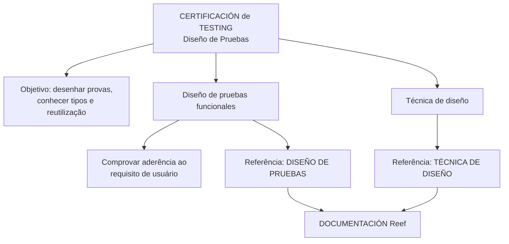

# Certificação de Testing — Desenho de Testes Funcionais

## 1. Metadados do Documento
- **Arquivo de Origem:** Não identificado no conteúdo extraído
- **Tipo de Documento:** Procedimento / material de treinamento
- **Domínio / Sistema:** Certificación de Testing; documentação Reef; Mapfredocument
- **Público-Alvo:** Profissionais envolvidos em testes funcionais
- **Data/Versão Identificada:** Não identificada

---

## 2. Resumo Executivo & Contexto de Negócio

O conteúdo apresenta o módulo **“CERTIFICACIÓN de TESTING - Diseño de Pruebas”**, cujo objetivo é revisar como uma prova deve ser desenhada, quais tipos de provas existem e como essas provas podem ser reutilizadas.

O foco explícito do material é o **desenho de testes funcionais**. Esses testes são definidos como mecanismos para comprovar que o que foi construído corresponde ao que foi solicitado nos requisitos de usuário.

O documento informa que o processo de desenho de testes pode ser apoiado por diferentes técnicas de desenho. Contudo, o conteúdo bruto não descreve nomes, critérios de seleção, etapas ou exemplos dessas técnicas.

Como fonte complementar, o material referencia os itens documentais **“DISEÑO DE PRUEBAS”** e **“TÉCNICA DE DISEÑO”**, disponíveis no contexto de documentação Reef. O extrato também apresenta elementos de navegação para Documentación, Arquitecturas, APIs, Componentes, Cloud, Zeus, Reef e Ayuda, sem detalhar o conteúdo dessas áreas.

---

## 3. Arquitetura, Componentes & Tecnologias Envolvidas

O documento não apresenta uma arquitetura de software, interfaces, servidores, tecnologias de implementação ou integrações técnicas. O relacionamento identificável é documental: o módulo de certificação aborda desenho de provas funcionais e referencia documentos complementares sobre desenho e técnicas de desenho.



**Nota de Análise:** O extrato menciona “Mapfredocument”, “DOCUMENTACIÓN Reef”, “Zeus”, “Cloud”, “APIs” e “Componentes” em elementos de navegação, mas não descreve funções, contratos, tecnologias ou relações técnicas entre esses termos.

---

## 4. Regras de Negócio, Especificações Funcionais & Processos

### 4.1 Objetivo do módulo
O módulo tem como finalidade revisar:

1. Como desenhar uma prova.
2. Quais tipos de provas existem.
3. Como reutilizar provas.

### 4.2 Desenho de testes funcionais
O documento estabelece que as provas funcionais devem ser desenhadas para verificar se a construção realizada corresponde ao que foi solicitado nos requisitos de usuário.

### 4.3 Técnicas de desenho
Para realizar o desenho das provas, o documento indica que podem ser utilizadas diferentes técnicas de desenho.

**Nota de Análise:** O documento não especifica quais são as técnicas disponíveis, como aplicar cada técnica, quais tipos de prova existem ou quais critérios devem orientar a reutilização de provas.

### 4.4 Referências documentais
- Para mais informações sobre testes funcionais e desenho de provas, o documento aponta para **DISEÑO DE PRUEBAS**.
- Para mais informações sobre técnicas de desenho, o documento aponta para **TÉCNICA DE DISEÑO**.

---

## 5. Tabelas de Parâmetros, Ambientes e Estruturas de Dados

| Item / Parâmetro | Descrição / Função | Tipo / Valores / Formato | Ambiente / Observações |
| :--- | :--- | :--- | :--- |
| CERTIFICACIÓN de TESTING - Diseño de Pruebas | Módulo de treinamento sobre desenho de provas. | Título de módulo. | Não há versão ou data identificada. |
| Objetivo | Revisar como desenhar provas, tipos de provas e reutilização. | Objetivo funcional. | Não detalha os tipos nem o método de reutilização. |
| Diseño de pruebas funcionales | Desenho de testes para comprovar aderência entre construção e requisitos de usuário. | Processo de teste funcional. | Referência complementar: `DISEÑO DE PRUEBAS`. |
| Técnica de diseño | Apoio ao desenho de provas por meio de diferentes técnicas. | Conceito/processo. | Referência complementar: `TÉCNICA DE DISEÑO`; técnicas não enumeradas. |
| DOCUMENTACIÓN Reef | Área ou referência documental exibida no extrato. | Repositório ou seção documental. | O conteúdo não detalha estrutura, acesso ou governança. |
| Mapfredocument | Termo exibido no cabeçalho do ambiente documental. | Nome apresentado no documento. | Função não detalhada. |
| Owner | Proprietário exibido no extrato. | `user:agonzalez_mapfre.com` | Não há descrição de responsabilidades. |
| Lifecycle | Situação de ciclo de vida apresentada. | `Approved Source` | Não há definição do status no conteúdo. |
| Idioma | Idioma selecionado na navegação. | `ES` | Conteúdo principal em espanhol. |
| VL | Sigla exibida no cabeçalho. | `VL` | Significado não identificado no texto. |

---

## 6. Bateria de Perguntas & Respostas para RAG (FAQ Sintético)

### P1: Qual é o objetivo do módulo “CERTIFICACIÓN de TESTING - Diseño de Pruebas”?
**R:** O objetivo do módulo é revisar como uma prova deve ser desenhada, quais tipos de provas existem e como essas provas podem ser reutilizadas.

### P2: Para que servem os testes funcionais descritos no documento?
**R:** Os testes funcionais servem para comprovar que o que foi construído corresponde ao que foi solicitado nos requisitos de usuário.

### P3: O documento define quais tipos de provas devem ser utilizados?
**R:** Não. O documento informa que o módulo revisa os tipos de provas existentes, mas o extrato não enumera nem descreve esses tipos.

### P4: Quais técnicas devem ser usadas para desenhar as provas?
**R:** O documento afirma que o desenho das provas pode ser apoiado por diferentes técnicas de desenho. Entretanto, não identifica nem detalha essas técnicas no conteúdo fornecido.

### P5: Onde buscar informações adicionais sobre desenho de provas funcionais?
**R:** O documento indica a referência documental **DISEÑO DE PRUEBAS** para obter mais informações sobre o desenho de provas funcionais.

### P6: Onde buscar informações adicionais sobre técnicas de desenho de testes?
**R:** O documento indica a referência documental **TÉCNICA DE DISEÑO** para obter mais informações sobre técnicas de desenho.

### P7: O documento apresenta critérios para reutilizar casos ou provas de teste?
**R:** Não. A reutilização de provas é mencionada como parte do objetivo do módulo, mas não há critérios, procedimento ou exemplos de reutilização no conteúdo extraído.

### P8: O documento especifica uma arquitetura técnica, microsserviços ou APIs para os testes?
**R:** Não. Embora a navegação mencione Arquiteturas, APIs, Componentes e Cloud, o conteúdo não descreve arquitetura de software, microsserviços, contratos de API, ambientes ou tecnologias.

### P9: Quem aparece como owner do conteúdo na documentação?
**R:** O extrato apresenta `user:agonzalez_mapfre.com` no campo **Owner**.

### P10: Qual é o status de ciclo de vida mostrado no documento?
**R:** O campo **Lifecycle** apresenta o valor **Approved Source**. O documento não define o significado operacional desse status.

---

## 7. Glossário de Termos, Siglas & Conceitos-Chave

- **CERTIFICACIÓN de TESTING:** Módulo identificado como “Diseño de Pruebas”.
- **Diseño de pruebas:** Desenho ou elaboração de provas/testes.
- **Pruebas funcionales:** Provas desenhadas para comprovar que a construção realizada atende aos requisitos de usuário.
- **Requisitos de usuario:** Solicitações ou requisitos do usuário que devem ser atendidos pelo que foi construído.
- **Técnica de diseño:** Técnica utilizada como apoio ao desenho de provas; modalidades não detalhadas.
- **DOCUMENTACIÓN Reef:** Referência a uma área ou conjunto documental chamado Reef.
- **Mapfredocument:** Termo exibido no cabeçalho do ambiente documental; significado funcional não detalhado.
- **Lifecycle:** Campo de ciclo de vida exibido com o valor `Approved Source`.
- **VL:** Sigla exibida no extrato, sem definição fornecida.
- **ES:** Indicador de idioma espanhol exibido na navegação.

---

## 8. Notas Críticas, Riscos & Limitações

- O conteúdo é resumido e não descreve os tipos de provas citados no objetivo do módulo.
- As técnicas de desenho são mencionadas, mas não são identificadas, explicadas ou associadas a critérios de uso.
- Não há exemplos de casos de teste, evidências de teste, critérios de aceite, massa de dados ou procedimento de execução.
- Não há detalhamento sobre como reutilizar provas.
- As referências **DISEÑO DE PRUEBAS** e **TÉCNICA DE DISEÑO** são citadas, mas seus conteúdos não foram incluídos no extrato.
- A navegação menciona áreas como Arquiteturas, APIs, Componentes, Cloud, Zeus e Reef, sem descrever suas funções ou relações.
- A expressão original contém um caractere inválido em “nalidad”, preservado na referência bruta para fins de auditoria.

---

## 9. Conteúdo Bruto Estruturado (Referência Fiel)

```text
--- [PÁGINA 1 DE 1] ---

CERTIFICACIÓN de TESTING - Diseño de Pruebas
OBJETIVO
La nalidad de este módulo es repasar cómo tenemos que diseñar una prueba. Qué tipos de pruebas tenemos y como reutilizarlas.
Diseño de pruebas
Técnica de diseño
Diseño de pruebas funcionales
Tenemos que diseñar las pruebas funcionales, que nos servirán para comprobar, que lo construído es lo solicitado en los requisitos de
usuario.
Podemos encontrar más información en: DISEÑO DE PRUEBAS
Técnica de diseño
Para realizar el diseño de las pruebas, podemos apoyarnos en distintas técnicas.
Podemos encontrar más información en: TÉCNICA DE DISEÑO
Documentation / DOCUMENTACIÓN Reef
DOCUMENTACIÓN Reef
Mapfredocument
DOCUMENTACIÓN Reef
Owner
user:agonzalez_mapfre.com
Lifecycle
Approved Source
 / 
 VL
Buscar Inicio Soluciones Arquitecturas APIs Componentes Cloud Documentación Zeus Reef Ayuda
ES
```
