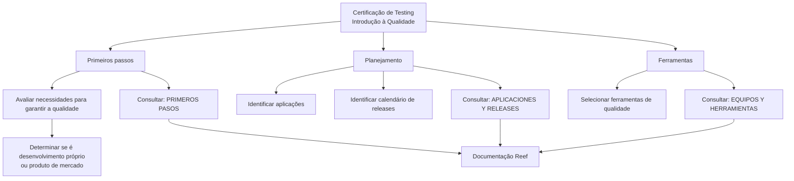

# Certificação de Testing — Introdução à Qualidade e Preparação para Testes

## 1. Metadados do Documento
- **Arquivo de Origem:** `Não identificado no conteúdo fornecido`
- **Tipo de Documento:** Procedimento / material de capacitação em qualidade
- **Domínio / Sistema:** Certificação de Testing; documentação Reef; Mapfredocument
- **Público-Alvo:** Profissionais envolvidos em desenvolvimento, qualidade, planejamento de releases e testes
- **Data/Versão Identificada:** Não identificada

---

## 2. Resumo Executivo & Contexto de Negócio

O documento apresenta uma introdução à certificação de testing orientada à qualidade de produtos. O objetivo declarado é revisar como os temas de qualidade devem ser abordados desde o início e identificar o que será necessário para realizar o processo de testing.

A abordagem proposta está organizada em três eixos: primeiros passos, planejamento e ferramentas. Os primeiros passos exigem avaliar o necessário para garantir a qualidade do produto, considerando se o produto será desenvolvido internamente ou se será um produto de mercado.

No eixo de planejamento, o documento determina a identificação das aplicações envolvidas e do calendário de releases do produto. Essa identificação é apresentada como necessária para organizar a atividade de testing em relação às entregas planejadas.

No eixo de ferramentas, o documento estabelece a necessidade de selecionar as ferramentas de qualidade utilizadas pelo produto. A documentação Reef é indicada como repositório de informações complementares para os três eixos: `PRIMEROS PASOS`, `APLICACIONES Y RELEASES` e `EQUIPOS Y HERRAMIENTAS`.

---

## 3. Arquitetura, Componentes & Tecnologias Envolvidas

O conteúdo não descreve uma arquitetura de software, tecnologias específicas, integrações, APIs, servidores, protocolos ou contratos de dados. O documento descreve um fluxo conceitual de preparação de qualidade e testing.

Componentes e referências citados:

| Componente / Referência | Papel identificado no documento |
| :--- | :--- |
| Certificação de Testing | Contexto educacional ou de capacitação sobre qualidade e testing. |
| Qualidade | Tema central que deve ser abordado desde o início do produto. |
| Produto | Elemento que deve ter sua qualidade garantida, podendo ser desenvolvimento próprio ou produto de mercado. |
| Aplicações | Elementos que devem ser identificados durante o planejamento. |
| Calendário de releases | Informação necessária para o planejamento do testing. |
| Ferramentas de Qualidade | Ferramentas que devem ser selecionadas para o produto. |
| Reef | Área de documentação indicada como fonte complementar. |
| Mapfredocument | Nome exibido na área de documentação. |
| Zeus | Item exibido no menu de navegação da documentação. |



> **Nota de Análise:** O documento não detalha ferramentas concretas de qualidade, responsáveis, critérios de aceite, métodos de teste, ambientes, integrações ou contratos técnicos.

---

## 4. Regras de Negócio, Especificações Funcionais & Processos

### 4.1 Objetivo de qualidade e testing
1. Os temas de qualidade devem ser abordados desde o início.
2. É necessário identificar os elementos necessários para realizar o testing.
3. A preparação de qualidade deve considerar as características do produto avaliado.

### 4.2 Primeiros passos
1. Avaliar o que é necessário para garantir a qualidade do produto.
2. Considerar o modelo de obtenção do produto durante a avaliação:
   - Desenvolvimento do próprio produto.
   - Produto de mercado.
3. Consultar a referência `PRIMEROS PASOS` para informações adicionais.

### 4.3 Planejamento
1. Identificar as aplicações relacionadas ao produto.
2. Identificar o calendário de releases do produto.
3. Consultar a referência `APLICACIONES Y RELEASES` para informações adicionais.

### 4.4 Ferramentas
1. Selecionar as ferramentas de qualidade que serão utilizadas pelo produto.
2. Consultar a referência `EQUIPOS Y HERRAMIENTAS` para informações adicionais.

> **Nota de Análise:** O documento determina que aplicações, releases e ferramentas sejam identificados ou selecionados, mas não fornece critérios de seleção, responsáveis, datas, ferramentas específicas ou fluxo de aprovação.

---

## 5. Tabelas de Parâmetros, Ambientes e Estruturas de Dados

| Item / Parâmetro | Descrição / Função | Tipo / Valores / Formato | Ambiente / Observações |
| :--- | :--- | :--- | :--- |
| Abordagem de qualidade | Os temas de qualidade devem ser tratados desde o início. | Diretriz de processo | Aplicável ao módulo de certificação de testing. |
| Necessidades de qualidade | Avaliar o necessário para garantir a qualidade do produto. | Atividade de avaliação | Considera desenvolvimento próprio ou produto de mercado. |
| Origem do produto | Classificação usada na avaliação inicial de qualidade. | `Desenvolvimento do mesmo` ou `produto de mercado` | Não há critérios adicionais descritos. |
| Aplicações | Aplicações do produto que devem ser identificadas. | Lista não especificada | Necessárias para planejamento. |
| Calendário de releases | Agenda de releases do produto. | Calendário não especificado | Necessário para planejamento. |
| Ferramentas de Qualidade | Ferramentas a serem usadas no produto. | Ferramentas não identificadas | Devem ser selecionadas. |
| PRIMEROS PASOS | Referência para informações sobre avaliação inicial. | Link ou seção documental | Citada como fonte complementar. |
| APLICACIONES Y RELEASES | Referência para informações sobre aplicações e releases. | Link ou seção documental | Citada como fonte complementar. |
| EQUIPOS Y HERRAMIENTAS | Referência para informações sobre equipes e ferramentas. | Link ou seção documental | Citada como fonte complementar. |
| DOCUMENTACIÓN Reef | Área de documentação exibida no conteúdo. | Repositório documental | Associada a Mapfredocument. |
| Owner | Proprietário exibido na página documental. | `user:agonzalez_mapfre.com` | Valor literal apresentado no conteúdo. |
| Lifecycle | Estado do ciclo de vida exibido. | `Approved Source` | Sem detalhamento adicional. |
| Idioma | Idioma exibido na interface. | `ES` | O conteúdo principal está em espanhol. |

---

## 6. Bateria de Perguntas & Respostas para RAG (FAQ Sintético)

### P1: Qual é o objetivo do módulo “Certificación de TESTING - Introducción de Calidad”?
**R:** O objetivo é revisar como os temas de qualidade devem ser abordados desde o início e identificar o que será necessário para realizar o testing.

### P2: Quais são os três tópicos principais da introdução à qualidade?
**R:** Os três tópicos principais são `Primeros pasos`, `Planificación` e `Herramientas`.

### P3: O que deve ser avaliado nos primeiros passos da qualidade?
**R:** Deve ser avaliado o que é necessário para garantir a qualidade do produto, considerando se o produto será desenvolvido internamente ou se será um produto de mercado.

### P4: Qual distinção sobre o produto deve ser considerada durante a avaliação inicial?
**R:** A avaliação deve considerar se a organização fará o desenvolvimento do produto ou se o produto é um produto de mercado.

### P5: Quais informações precisam ser identificadas na fase de planejamento?
**R:** Na fase de planejamento, devem ser identificadas as aplicações e o calendário de releases do produto.

### P6: Por que o calendário de releases é relevante para o processo descrito?
**R:** O documento afirma que o calendário de releases do produto deve ser identificado como parte necessária do planejamento para testing. O conteúdo não fornece regras adicionais de uso desse calendário.

### P7: O que deve ocorrer em relação às ferramentas de qualidade?
**R:** Devem ser selecionadas as ferramentas de qualidade que serão utilizadas pelo produto.

### P8: Onde buscar mais informações sobre os primeiros passos de qualidade?
**R:** O documento direciona para a referência `PRIMEROS PASOS` como fonte de informações adicionais.

### P9: Onde buscar mais informações sobre aplicações e releases?
**R:** O documento direciona para a referência `APLICACIONES Y RELEASES`.

### P10: Onde buscar mais informações sobre equipes e ferramentas?
**R:** O documento direciona para a referência `EQUIPOS Y HERRAMIENTAS`.

### P11: Quais ferramentas de qualidade são obrigatórias segundo o documento?
**R:** O documento não nomeia ferramentas específicas. Ele determina apenas que as ferramentas de qualidade apropriadas ao produto devem ser selecionadas.

### P12: O documento detalha técnicas de teste, APIs ou critérios de aceite?
**R:** Não. O conteúdo fornecido apresenta diretrizes introdutórias para qualidade, planejamento e seleção de ferramentas, sem detalhar técnicas de teste, APIs, ambientes, critérios de aceite ou contratos de integração.

---

## 7. Glossário de Termos, Siglas & Conceitos-Chave

- **Testing:** Atividade de testes mencionada como parte do processo de qualidade.
- **Qualidade:** Tema que deve ser abordado desde o início para garantir a qualidade do produto.
- **Produto de mercado:** Produto que não é desenvolvido pela própria organização, conforme a distinção apresentada no documento.
- **Release:** Entrega ou versão planejada do produto; o calendário de releases deve ser identificado.
- **PRIMEROS PASOS:** Referência documental indicada para aprofundar os primeiros passos de qualidade.
- **APLICACIONES Y RELEASES:** Referência documental indicada para informações sobre aplicações e calendário de releases.
- **EQUIPOS Y HERRAMIENTAS:** Referência documental indicada para informações sobre equipes e ferramentas.
- **Reef:** Área de documentação mencionada no conteúdo.
- **Mapfredocument:** Nome exibido junto à documentação Reef.
- **Lifecycle:** Campo apresentado na página documental com o valor `Approved Source`.
- **VL:** Sigla exibida na interface, sem definição no conteúdo fornecido.
- **ES:** Indicador de idioma exibido na interface, sem expansão textual no conteúdo fornecido.

---

## 8. Notas Críticas, Riscos & Limitações

- O documento é introdutório e não especifica métodos de teste, níveis de teste, critérios de aceite, métricas de qualidade ou estratégia de automação.
- Não há tecnologias, ferramentas, versões, URLs, credenciais, ambientes, servidores, portas ou caminhos de logs identificados.
- O conteúdo não define responsáveis, papéis, equipes, prazos ou mecanismos de governança para seleção de ferramentas e planejamento de releases.
- As referências `PRIMEROS PASOS`, `APLICACIONES Y RELEASES` e `EQUIPOS Y HERRAMIENTAS` são citadas, mas seus conteúdos não foram fornecidos.
- O valor exibido como owner contém `user:agonzalez_mapfre.com`; o documento não esclarece se é um identificador de usuário, e-mail incompleto ou outro tipo de referência.
- Alguns caracteres aparecem corrompidos na extração bruta, como `nalidad`, `Planicación` e `identicar`.

---

## 9. Conteúdo Bruto Estruturado (Referência Fiel)

```text
--- [PÁGINA 1 DE 1] ---

CERTIFICACIÓN de TESTING - Introducción de Calidad
OBJETIVO
La nalidad de este módulo es repasar cómo tenemos que abordar los temas de Calidad desde el inicio. Qué será necesario para poder
realizar el testing.
Primeros pasos
Planicación
Herramientas
Primeros pasos
Deberemos evaluar qué necesitamos para garantizar la calidad del producto, en función de si hacemos el desarrollo del mismo o se trata de
un producto de mercado.
Podemos encontrar más información en: PRIMEROS PASOS
Planicación
Será necesario identicar las aplicaciones y el calendario de releases que tiene nuestro producto.
Podemos encontrar más información en: APLICACIONES Y RELEASES
Herramientas
Tendremos que seleccionar las herramientas de Calidad que utilizaremos para el producto.
Podemos encontrar más información en: EQUIPOS Y HERRAMIENTAS
Documentation / DOCUMENTACIÓN Reef
DOCUMENTACIÓN Reef
Mapfredocument
DOCUMENTACIÓN Reef
Owner
user:agonzalez_mapfre.com
Lifecycle
Approved Source
 / 
 VL
Buscar Inicio Soluciones Arquitecturas APIs Componentes Cloud Documentación Zeus Reef Ayuda
ES
```
