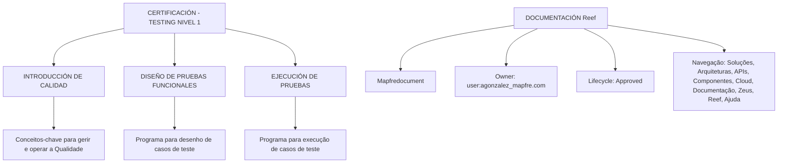

# Certificación — Testing Nivel 1: Introducción de Calidad, Diseño y Ejecución de Pruebas

## 1. Metadados do Documento
- **Arquivo de Origem:** `Não identificado no conteúdo fornecido`
- **Tipo de Documento:** `Apresentação Executiva / Material de Certificação`
- **Domínio / Sistema:** `Certificación Testing Nivel 1; Reef; Mapfredocument`
- **Público-Alvo:** `Profissionais que gerenciam e operam Qualidade e testes funcionais`
- **Data/Versão Identificada:** `Não identificada`

---

## 2. Resumo Executivo & Contexto de Negócio

O conteúdo apresenta o material denominado **“CERTIFICACIÓN - TESTING NIVEL 1”**, associado a uma certificação de nível 1 em testes. O documento organiza conteúdos relacionados à gestão e operação de qualidade, desenho de testes funcionais e execução de casos de teste.

A seção **“INTRODUCCIÓN DE CALIDAD”** informa que contém o programa com os conceitos-chave necessários para gerenciar e operar a Qualidade. O conteúdo fornecido não detalha quais são esses conceitos, critérios, ferramentas ou procedimentos de qualidade.

A seção **“DISEÑO DE PRUEBAS FUNCIONALES”** declara que contém o programa para o desenho de casos de teste. Não há detalhamento sobre técnicas de desenho, critérios de cobertura, dados de teste, priorização ou templates de casos de teste.

A seção **“EJECUCIÓN DE PRUEBAS”** declara que contém o programa para a execução de casos de teste. O extrato não apresenta procedimentos operacionais, ferramentas, evidências esperadas, tratamento de defeitos ou critérios de aprovação.

O conteúdo também referencia a área de documentação **Reef**, incluindo a identificação “Mapfredocument”, o status de ciclo de vida **Approved**, o proprietário `user:agonzalez_mapfre.com` e opções de navegação como Soluções, Arquiteturas, APIs, Componentes, Cloud, Documentação, Zeus, Reef e Ajuda.

---

## 3. Arquitetura, Componentes & Tecnologias Envolvidas

Os componentes e conceitos explicitamente citados são:

- **CERTIFICACIÓN - TESTING NIVEL 1:** Material ou programa de certificação.
- **Introducción de Calidad:** Área de conteúdo sobre conceitos-chave para gestão e operação de qualidade.
- **Diseño de Pruebas Funcionales:** Área de conteúdo destinada ao desenho de casos de teste.
- **Ejecución de Pruebas:** Área de conteúdo destinada à execução de casos de teste.
- **Reef:** Área ou plataforma de documentação mencionada no conteúdo.
- **Mapfredocument:** Identificador textual associado à documentação Reef.
- **Zeus:** Item disponível na navegação da documentação.
- **APIs, Componentes e Cloud:** Categorias disponíveis na navegação, sem descrição técnica adicional.
- **Lifecycle Approved:** Estado de ciclo de vida exibido para a documentação Reef.
- **Owner `user:agonzalez_mapfre.com`:** Proprietário identificado para a documentação.



> **Nota de Análise:** O conteúdo não descreve arquitetura de software, integrações, protocolos, tecnologias de implementação, APIs, contratos, URLs de ambiente ou rotas de logs.

---

## 4. Regras de Negócio, Especificações Funcionais & Processos

1. O material de certificação está identificado como **Testing Nivel 1**.
2. A seção **Introducción de Calidad** reúne um temário com conceitos-chave para:
   - Gerenciar a Qualidade.
   - Operar a Qualidade.
3. A seção **Diseño de Pruebas Funcionales** reúne um temário destinado ao desenho de casos de teste.
4. A seção **Ejecución de Pruebas** reúne um temário destinado à execução de casos de teste.
5. A documentação Reef apresenta ciclo de vida com valor **Approved**.
6. O proprietário exibido para a documentação Reef é `user:agonzalez_mapfre.com`.
7. A interface de documentação apresenta idioma **ES**.

> **Nota de Análise:** O documento não especifica regras de validação, critérios de aceite, etapas detalhadas de execução, cálculos, perfis de acesso, responsabilidades operacionais ou fluxos de aprovação.

---

## 5. Tabelas de Parâmetros, Ambientes e Estruturas de Dados

| Item / Parâmetro | Descrição / Função | Tipo / Valores / Formato | Ambiente / Observações |
| :--- | :--- | :--- | :--- |
| Certificação | Identificação do material apresentado | `CERTIFICACIÓN - TESTING NIVEL 1` | Sem versão ou data identificada |
| Introdução de Qualidade | Temário com conceitos-chave para gestão e operação da Qualidade | `INTRODUCCIÓN DE CALIDAD` | Conceitos não detalhados |
| Desenho de Testes Funcionais | Temário para desenho de casos de teste | `DISEÑO DE PRUEBAS FUNCIONALES` | Técnicas de desenho não detalhadas |
| Execução de Testes | Temário para execução de casos de teste | `EJECUCIÓN DE PRUEBAS` | Procedimentos de execução não detalhados |
| Documentação | Área de documentação mencionada | `DOCUMENTACIÓN Reef` | Associada a Reef |
| Identificador documental | Texto identificado na documentação | `Mapfredocument` | Sem explicação adicional |
| Owner | Proprietário exibido para a documentação | `user:agonzalez_mapfre.com` | Valor literal fornecido |
| Lifecycle | Estado de ciclo de vida da documentação | `Approved` | Estado exibido no conteúdo |
| Idioma | Idioma exibido na navegação | `ES` | Sem detalhamento adicional |
| Navegação | Categorias e áreas disponíveis | `Buscar`, `Inicio`, `Soluciones`, `Arquitecturas`, `APIs`, `Componentes`, `Cloud`, `Documentación`, `Zeus`, `Reef`, `Ayuda` | Não são fornecidas URLs ou descrições funcionais |

---

## 6. Bateria de Perguntas & Respostas para RAG (FAQ Sintético)

### P1: Qual é o nome da certificação apresentada no documento?
**R:** A certificação apresentada é **CERTIFICACIÓN - TESTING NIVEL 1**. O conteúdo não informa versão, data, duração, pré-requisitos ou critérios de aprovação dessa certificação.

### P2: Qual é o objetivo da seção “Introducción de Calidad”?
**R:** A seção **INTRODUCCIÓN DE CALIDAD** contém um temário com conceitos-chave para gerenciar e operar a Qualidade. O documento não lista quais conceitos, métodos ou ferramentas de qualidade compõem esse temário.

### P3: O documento descreve técnicas específicas para desenho de testes funcionais?
**R:** Não. O documento apenas informa que a seção **DISEÑO DE PRUEBAS FUNCIONALES** contém o temário para o desenho de casos de teste. Técnicas, critérios de cobertura, templates, dados de teste e critérios de priorização não são descritos.

### P4: O que é coberto pela seção “Ejecución de Pruebas”?
**R:** A seção **EJECUCIÓN DE PRUEBAS** contém o temário para a execução de casos de teste. O conteúdo fornecido não detalha procedimentos, evidências, ferramentas, gestão de defeitos ou critérios de conclusão da execução.

### P5: Qual é o estado de ciclo de vida da documentação Reef?
**R:** O campo **Lifecycle** da documentação Reef está apresentado com o valor **Approved**.

### P6: Quem é o proprietário identificado para a documentação Reef?
**R:** O proprietário exibido no conteúdo é `user:agonzalez_mapfre.com`.

### P7: Quais áreas de navegação estão visíveis na documentação?
**R:** A navegação exibida contém: **Buscar**, **Inicio**, **Soluciones**, **Arquitecturas**, **APIs**, **Componentes**, **Cloud**, **Documentación**, **Zeus**, **Reef** e **Ayuda**.

### P8: O documento informa URLs, ambientes ou servidores para execução de testes?
**R:** Não. O conteúdo não apresenta URLs, nomes de servidores, portas, ambientes, variáveis de configuração ou caminhos de logs.

### P9: O documento especifica como registrar defeitos encontrados durante a execução dos testes?
**R:** Não. Embora exista uma seção sobre execução de casos de teste, o conteúdo extraído não descreve o processo de registro, classificação, tratamento ou acompanhamento de defeitos.

### P10: Qual é o idioma apresentado na interface da documentação?
**R:** A interface apresenta o indicador de idioma **ES**. O conteúdo não detalha se existem outros idiomas disponíveis.

---

## 7. Glossário de Termos, Siglas & Conceitos-Chave

- **CERTIFICACIÓN - TESTING NIVEL 1:** Nome da certificação ou material de treinamento apresentado.
- **INTRODUCCIÓN DE CALIDAD:** Seção com temário de conceitos-chave para gerenciar e operar a Qualidade.
- **DISEÑO DE PRUEBAS FUNCIONALES:** Seção destinada ao temário de desenho de casos de teste.
- **EJECUCIÓN DE PRUEBAS:** Seção destinada ao temário de execução de casos de teste.
- **Reef:** Nome da área ou plataforma de documentação citada.
- **Mapfredocument:** Identificador textual apresentado junto à documentação Reef; o documento não define seu significado.
- **Lifecycle:** Campo que representa o ciclo de vida da documentação.
- **Approved:** Valor de ciclo de vida apresentado para a documentação.
- **Owner:** Campo que identifica o proprietário da documentação.
- **Zeus:** Item disponível na navegação; o documento não explica sua finalidade.
- **APIs:** Categoria disponível na navegação; o documento não detalha APIs específicas.
- **Cloud:** Categoria disponível na navegação; o documento não detalha serviços de nuvem.
- **ES:** Indicador de idioma apresentado na interface.

---

## 8. Notas Críticas, Riscos & Limitações

- O conteúdo fornecido possui caráter resumido e não detalha o programa completo da certificação.
- Não há descrição de tecnologias, ferramentas de testes, frameworks, ambientes, integrações ou arquitetura técnica.
- Não há especificação de critérios de entrada e saída, critérios de aceite, métricas de qualidade ou gestão de defeitos.
- Não são fornecidas URLs, endpoints, rotas de logs, parâmetros de infraestrutura ou configurações de ambiente.
- **Mapfredocument**, **Reef** e **Zeus** são citados, mas suas responsabilidades funcionais e técnicas não são definidas.
- O valor **Approved** é apresentado como ciclo de vida, porém o documento não descreve o processo ou as condições que conduzem a esse estado.
- Não há data, versão, autoria formal, histórico de revisões ou referência ao arquivo de origem.

---

## 9. Conteúdo Bruto Estruturado (Referência Fiel)

```text
--- [PÁGINA 1 DE 1] ---

CERTIFICACIÓN - TESTING NIVEL 1
CERTIFICACIÓN Testing nivel 1
INTRODUCCIÓN DE CALIDAD
En este apartado se encuentra el temario
con todos los conceptos clave para
gestionar y operar la Calidad
DISEÑO DE PRUEBAS FUNCIONALES
En este apartado se encuentra el temario
para el diseño de casos de prueba
EJECUCIÓN DE PRUEBAS
En este apartado se encuentra el temario
para la ejecución de casos de prueba
Documentation / DOCUMENTACIÓN Reef
DOCUMENTACIÓN Reef
Mapfredocument
DOCUMENTACIÓN Reef
Owner
user:agonzalez_mapfre.com
Lifecycle
Approved Source
 / 
 VL
Buscar Inicio Soluciones Arquitecturas APIs Componentes Cloud Documentación Zeus Reef Ayuda
ES
```
