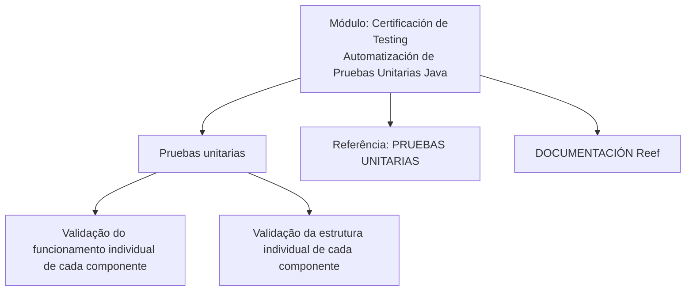

# Certificación de Testing — Automatización de Pruebas Unitarias en Java

## 1. Metadados do Documento
- **Arquivo de Origem:** Não identificado
- **Tipo de Documento:** Procedimento
- **Domínio / Sistema:** Testing de provas unitárias Java; documentação Reef
- **Público-Alvo:** Desenvolvedores
- **Data/Versão Identificada:** Não identificada

---

## 2. Resumo Executivo & Contexto de Negócio

O documento apresenta o módulo **“CERTIFICACIÓN de TESTING - Automatización de Pruebas Unitarias Java”**. A finalidade declarada é revisar o tema de testes unitários em Java.

O conteúdo estabelece que testes unitários devem ser executados para validar o correto funcionamento e a estrutura de cada componente de forma individual. O documento não descreve frameworks de teste, ferramentas de automação, comandos de execução, cobertura mínima ou critérios de aprovação.

A documentação referencia a área **“PRUEBAS UNITARIAS”** e a **DOCUMENTACIÓN Reef** como fontes para informações adicionais. A página aparece associada ao ciclo de vida **Approved**, com proprietário identificado como `user:agonzalez_mapfre.com`.

---

## 3. Arquitetura, Componentes & Tecnologias Envolvidas

| Componente / Tecnologia | Papel identificado no documento |
| :--- | :--- |
| Java | Tecnologia associada ao módulo de automatização de testes unitários. |
| Pruebas unitarias | Práticas de validação individual do funcionamento e da estrutura de componentes. |
| DOCUMENTACIÓN Reef | Repositório ou área documental mencionada para consulta. |
| Mapfredocument | Termo exibido na navegação da documentação; não há detalhamento adicional. |
| Zeus | Item exibido na navegação da documentação; não há detalhamento adicional. |
| Cloud | Item exibido na navegação da documentação; não há detalhamento adicional. |



**Nota de Análise:** O documento não detalha componentes Java específicos, classes, pacotes, métodos HTTP, contratos, ferramentas de automação, pipelines CI/CD ou integrações entre sistemas.

---

## 4. Regras de Negócio, Especificações Funcionais & Processos

1. O módulo possui a finalidade de revisar o testing de testes unitários em Java.
2. É necessário executar testes unitários.
3. Os testes unitários devem validar o correto funcionamento de cada componente individualmente.
4. Os testes unitários devem validar a estrutura de cada componente individualmente.
5. Informações adicionais podem ser encontradas na referência **PRUEBAS UNITARIAS**, dentro da documentação Reef.
6. O conteúdo está identificado com o ciclo de vida **Approved**.

---

## 5. Tabelas de Parâmetros, Ambientes e Estruturas de Dados

| Item / Parâmetro | Descrição / Função | Tipo / Valores / Formato | Ambiente / Observações |
| :--- | :--- | :--- | :--- |
| Módulo | Certificación de Testing - Automatización de Pruebas Unitarias Java | Título de módulo | Não há versão identificada. |
| Objetivo | Revisar o testing de testes unitários em Java | Objetivo funcional | Declarado no documento. |
| Escopo de validação | Funcionamento correto de cada componente | Critério de teste | Validação individual. |
| Escopo de validação | Estrutura de cada componente | Critério de teste | Validação individual. |
| Referência adicional | PRUEBAS UNITARIAS | Referência documental | Indicada como fonte de mais informações. |
| Repositório documental | DOCUMENTACIÓN Reef | Área documental | Exibida na navegação e no conteúdo. |
| Owner | `user:agonzalez_mapfre.com` | Identificador de usuário | Associado à página documental. |
| Lifecycle | Approved | Estado de ciclo de vida | Exibido na página. |
| Source | VL | Valor exibido | O documento não explica o significado de “VL”. |
| Idioma | ES | Código exibido | Conteúdo principal em espanhol. |

---

## 6. Bateria de Perguntas & Respostas para RAG (FAQ Sintético)

### P1: Qual é a finalidade do módulo “Certificación de Testing - Automatización de Pruebas Unitarias Java”?
**R:** A finalidade declarada do módulo é revisar o tema de testing de testes unitários em Java.

### P2: O que os testes unitários devem validar segundo o documento?
**R:** Os testes unitários devem validar o correto funcionamento e a estrutura de cada componente de forma individual.

### P3: A validação descrita é integrada entre múltiplos componentes?
**R:** Não. O documento especifica que cada componente deve ser validado de forma individual por meio de testes unitários.

### P4: Qual tecnologia é explicitamente associada ao módulo de testes unitários?
**R:** O módulo é explicitamente associado a Java, conforme o título “Automatización de Pruebas Unitarias Java”.

### P5: Onde buscar informações adicionais sobre testes unitários?
**R:** O documento indica a referência “PRUEBAS UNITARIAS” e a DOCUMENTACIÓN Reef como locais para obter mais informações.

### P6: O documento define algum framework de testes Java, como JUnit ou Mockito?
**R:** Não. O conteúdo não menciona frameworks, bibliotecas, versões ou ferramentas específicas para implementação de testes unitários em Java.

### P7: O documento informa critérios mínimos de cobertura de código?
**R:** Não. Não há percentuais, métricas de cobertura, gates de qualidade ou critérios quantitativos de aprovação descritos.

### P8: Quem é o proprietário identificado da documentação?
**R:** O proprietário exibido na documentação é `user:agonzalez_mapfre.com`.

### P9: Qual é o estado de ciclo de vida exibido para o conteúdo?
**R:** O estado de ciclo de vida exibido é **Approved**.

### P10: O documento fornece comandos para executar os testes unitários?
**R:** Não. O documento estabelece a necessidade de executar testes unitários, mas não fornece comandos, ferramentas de build ou procedimentos de execução.

---

## 7. Glossário de Termos, Siglas & Conceitos-Chave

- **Java:** Tecnologia mencionada no título do módulo de automatização de testes unitários.
- **Pruebas unitarias:** Testes unitários executados para validar o funcionamento e a estrutura de cada componente individualmente.
- **DOCUMENTACIÓN Reef:** Área documental mencionada como referência para informações adicionais.
- **Lifecycle:** Campo de ciclo de vida da página documental, com valor `Approved`.
- **Approved:** Estado de ciclo de vida exibido para o conteúdo.
- **Owner:** Campo que identifica o proprietário da página documental.
- **VL:** Valor exibido no campo `Source`; o significado não é detalhado no documento.
- **ES:** Código de idioma exibido na interface documental.

---

## 8. Notas Críticas, Riscos & Limitações

- O documento não especifica frameworks, bibliotecas ou ferramentas de testes unitários para Java.
- Não há descrição de estrutura de projeto, classes, componentes concretos, casos de teste ou exemplos de código.
- Não são definidos critérios de cobertura, limiares de qualidade, métricas, evidências ou condições de aprovação de testes.
- Não há instruções operacionais sobre execução local, integração contínua, automação em pipeline ou tratamento de falhas.
- O significado do campo `Source: VL` não é explicado.
- Os itens de navegação `Mapfredocument`, `Zeus` e `Cloud` são exibidos, mas não possuem detalhamento funcional no conteúdo extraído.

---

## 9. Conteúdo Bruto Estruturado (Referência Fiel)

```text
--- [PÁGINA 1 DE 1] ---

CERTIFICACIÓN de TESTING - Automatización de Pruebas Unitarias
Java
OBJETIVO
La finalidad de este módulo es repasar el testing de pruebas unitarias en Java
Pruebas unitarias
Pruebas unitarias
Será necesario ejecutar pruebas unitarias que validen el correcto funcionamiento y estructura de cada componente de forma individual.
Podemos encontrar más información en: PRUEBAS UNITARIAS
Documentation / DOCUMENTACIÓN Reef
DOCUMENTACIÓN Reef
Mapfredocument
DOCUMENTACIÓN Reef
Owner
user:agonzalez_mapfre.com
Lifecycle
Approved Source
/
VL
Buscar Inicio Soluciones Arquitecturas APIs Componentes Cloud Documentación Zeus Reef Ayuda
ES
```
