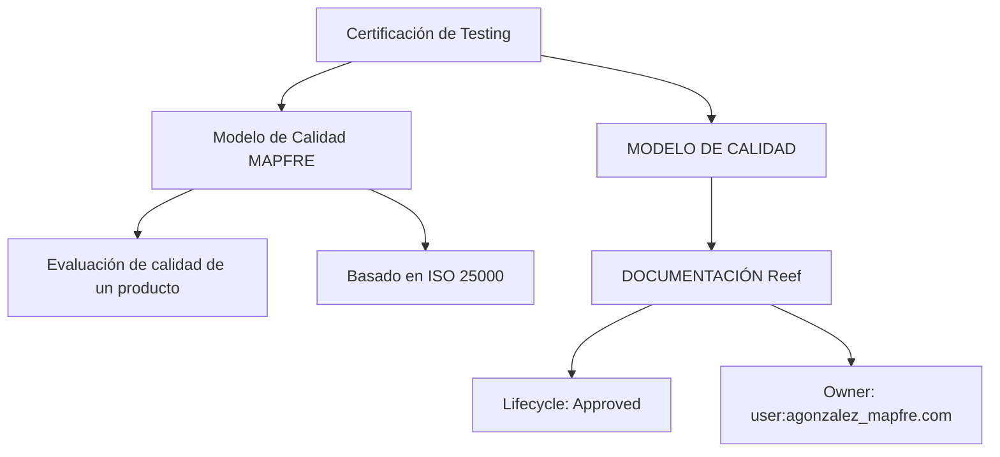

# Certificación de Testing — Modelo de Calidad MAPFRE basado en ISO 25000

## 1. Metadados do Documento
- **Arquivo de Origem:** Não identificado
- **Tipo de Documento:** Apresentação Executiva
- **Domínio / Sistema:** Modelo de Calidad MAPFRE; Reef Documentation
- **Público-Alvo:** Testing, Qualidade, Desenvolvimento e Arquitetura
- **Data/Versão Identificada:** Não identificada

---

## 2. Resumo Executivo & Contexto de Negócio

O documento apresenta o módulo **“Certificación de Testing - Modelo de Calidad”**, cuja finalidade declarada é revisar as métricas do Modelo de Calidad da MAPFRE baseado na norma **ISO 25000**.

O Modelo de Calidad define as métricas que serão avaliadas para verificar a qualidade de um produto. O material não detalha quais métricas específicas são utilizadas, seus critérios de cálculo, pesos, limites de aprovação ou processo de certificação.

O conteúdo aponta para fontes documentais denominadas **“MODELO DE CALIDAD”**, **“DOCUMENTACIÓN Reef”** e **“Mapfredocument”**. A interface apresentada indica navegação por áreas como Soluciones, Arquitecturas, APIs, Componentes, Cloud, Documentación, Zeus e Reef.

A documentação Reef exibida possui ciclo de vida **Approved** e apresenta como proprietário o usuário `agonzalez_mapfre.com`. Não há detalhamento adicional sobre responsabilidades, governança, aprovação ou manutenção do conteúdo.

---

## 3. Arquitetura, Componentes & Tecnologias Envolvidas

Os elementos identificados no documento são:

- **Modelo de Calidad MAPFRE:** modelo que define métricas para avaliação da qualidade de produtos.
- **ISO 25000:** norma na qual o Modelo de Calidad MAPFRE é baseado, conforme informado no material.
- **Reef Documentation / DOCUMENTACIÓN Reef:** área ou repositório documental citado como fonte de informação.
- **Mapfredocument:** termo exibido na interface documental.
- **Zeus:** item de navegação exibido na interface.
- **Soluciones, Arquitecturas, APIs, Componentes, Cloud e Documentación:** categorias de navegação exibidas.



> **Nota de Análise:** O documento não descreve arquitetura de software, integrações, APIs, microsserviços, tecnologias de implementação, ambientes ou fluxos técnicos de dados.

---

## 4. Regras de Negócio, Especificações Funcionais & Processos

1. O módulo “Certificación de Testing - Modelo de Calidad” tem como finalidade revisar as métricas do Modelo de Calidad da MAPFRE.
2. O Modelo de Calidad da MAPFRE é declarado como baseado na ISO 25000.
3. O Modelo de Calidad define as métricas que serão avaliadas para comprovar a qualidade de um produto.
4. O documento indica que informações adicionais podem ser encontradas em “MODELO DE CALIDAD”.
5. A documentação Reef apresentada possui estado de ciclo de vida **Approved**.
6. O proprietário exibido para a documentação Reef é `user:agonzalez_mapfre.com`.

> **Nota de Análise:** O material não especifica métricas de qualidade, fórmula de avaliação, critérios de aceite, periodicidade de medição, responsáveis pela execução dos testes, ferramentas de teste ou evidências necessárias para certificação.

---

## 5. Tabelas de Parâmetros, Ambientes e Estruturas de Dados

| Item / Parâmetro | Descrição / Função | Tipo / Valores / Formato | Ambiente / Observações |
| :--- | :--- | :--- | :--- |
| Módulo | Certificación de Testing - Modelo de Calidad | Título de módulo | Sem versão identificada |
| Objetivo | Revisar métricas do Modelo de Calidad MAPFRE | Finalidade declarada | Baseado em ISO 25000 |
| Modelo de Calidad | Define métricas a serem avaliadas para verificar a qualidade de um produto | Modelo de qualidade | Métricas não detalhadas |
| ISO 25000 | Norma de referência do Modelo de Calidad MAPFRE | Norma | Sem detalhamento adicional |
| MODELO DE CALIDAD | Fonte indicada para mais informações | Referência documental | URL não informada |
| DOCUMENTACIÓN Reef | Área documental citada | Repositório ou área de documentação | Interface exibida em espanhol |
| Lifecycle | Estado da documentação Reef | `Approved` | Sem histórico ou critérios de aprovação |
| Owner | Proprietário exibido da documentação | `user:agonzalez_mapfre.com` | Nome completo não informado |
| Navegação | Categorias exibidas na interface | Buscar, Inicio, Soluciones, Arquitecturas, APIs, Componentes, Cloud, Documentación, Zeus, Reef, Ayuda | Idioma exibido: `ES` |
| Mapfredocument | Termo exibido na interface documental | Não detalhado | Relação funcional não explicada |

---

## 6. Bateria de Perguntas & Respostas para RAG (FAQ Sintético)

### P1: Qual é o objetivo do módulo “Certificación de Testing - Modelo de Calidad”?
**R:** A finalidade declarada do módulo é revisar as métricas do Modelo de Calidad da MAPFRE, que é baseado na ISO 25000.

### P2: Em qual norma o Modelo de Calidad da MAPFRE é baseado?
**R:** O documento informa que o Modelo de Calidad da MAPFRE é baseado na ISO 25000.

### P3: Para que serve o Modelo de Calidad descrito no documento?
**R:** O Modelo de Calidad define as métricas que serão avaliadas para comprovar a qualidade de um produto.

### P4: Quais métricas de qualidade são definidas pelo Modelo de Calidad?
**R:** O documento afirma que o Modelo de Calidad define métricas para avaliação da qualidade de produtos, mas não apresenta os nomes, fórmulas, limites ou critérios dessas métricas.

### P5: Onde o documento indica que podem ser encontradas mais informações sobre o modelo?
**R:** O documento direciona para a referência denominada “MODELO DE CALIDAD” e também cita “DOCUMENTACIÓN Reef”.

### P6: Qual é o ciclo de vida exibido para a documentação Reef?
**R:** O ciclo de vida exibido para a documentação Reef é `Approved`.

### P7: Quem é o proprietário exibido da documentação Reef?
**R:** O proprietário exibido é `user:agonzalez_mapfre.com`.

### P8: O documento descreve como executar a certificação de testing?
**R:** Não. O documento apresenta a finalidade do módulo e a função geral do Modelo de Calidad, mas não descreve etapas operacionais, ferramentas, evidências, aprovações ou critérios de certificação.

### P9: O documento apresenta APIs, serviços ou integrações técnicas?
**R:** Não há APIs, contratos, microsserviços, endpoints, formatos de mensagem ou integrações técnicas detalhadas. “APIs” aparece somente como uma categoria de navegação da interface documental.

### P10: Quais áreas de navegação são exibidas na interface documental?
**R:** A interface apresenta as áreas Buscar, Inicio, Soluciones, Arquitecturas, APIs, Componentes, Cloud, Documentación, Zeus, Reef e Ayuda.

---

## 7. Glossário de Termos, Siglas & Conceitos-Chave

- **ISO 25000:** norma citada como base do Modelo de Calidad MAPFRE. O documento não expande a sigla nem detalha seu conteúdo.
- **Modelo de Calidad:** modelo que define métricas a serem avaliadas para comprovar a qualidade de um produto.
- **Certificación de Testing:** módulo apresentado para revisão das métricas do Modelo de Calidad.
- **Reef:** nome associado à documentação citada como “DOCUMENTACIÓN Reef”.
- **Lifecycle:** campo de ciclo de vida exibido para a documentação Reef, com valor `Approved`.
- **Approved:** estado de ciclo de vida exibido para a documentação Reef.
- **Owner:** campo que identifica o proprietário exibido da documentação Reef.
- **Zeus:** item de navegação exibido na interface, sem definição adicional.

---

## 8. Notas Críticas, Riscos & Limitações

- O conteúdo é resumido e não apresenta as métricas concretas do Modelo de Calidad.
- Não há critérios de entrada, saída, aprovação, reprovação ou cálculo para a certificação de testing.
- O documento não informa versão, data, autor formal, URL da documentação, ambiente, ferramenta de testes ou tecnologia de implementação.
- A referência a ISO 25000 não contém detalhamento sobre quais atributos, subatributos ou práticas da norma são utilizados.
- Termos como Reef, Zeus e Mapfredocument aparecem sem descrição funcional ou técnica.
- Há caracteres aparentemente corrompidos na extração bruta em palavras como `nalidad` e `dene`; a interpretação contextual sugere “finalidad” e “define”, mas a referência fiel abaixo preserva o texto extraído.

---

## 9. Conteúdo Bruto Estruturado (Referência Fiel)

```text
--- [PÁGINA 1 DE 1] ---

CERTIFICACIÓN de TESTING - Modelo de Calidad
OBJETIVO
La nalidad de este módulo es repasar las métricas del Modelo de Calidad de MAPFRE basado en la ISO 25000.
Modelo de Calidad
Modelo de Calidad
El Modelo de Calidad dene las métricas que se van a evaluar para comprobar la calidad de un producto.
Podemos encontrar más información en: MODELO DE CALIDAD
Documentation / DOCUMENTACIÓN Reef
DOCUMENTACIÓN Reef
Mapfredocument
DOCUMENTACIÓN Reef
Owner
user:agonzalez_mapfre.com
Lifecycle
Approved Source
 /
VL
Buscar Inicio Soluciones Arquitecturas APIs Componentes Cloud Documentación Zeus Reef Ayuda
ES
```
