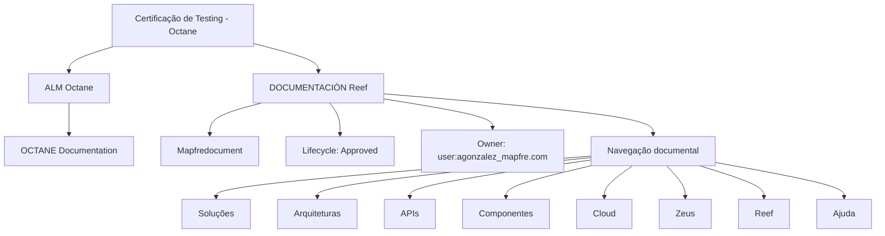

# Certificação de Testing — ALM Octane e Documentação Reef

## 1. Metadados do Documento
- **Arquivo de Origem:** Não identificado no conteúdo fornecido
- **Tipo de Documento:** Manual Operacional / Material de Certificação
- **Domínio / Sistema:** Testing, ALM Octane, Reef e Mapfre
- **Público-Alvo:** Profissionais de testes, desenvolvedores, arquitetos e operação
- **Data/Versão Identificada:** `Octane`; nenhuma data ou versão adicional identificada

---

## 2. Resumo Executivo & Contexto de Negócio

O documento apresentado é um material denominado **“CERTIFICACIÓN de TESTING - Octane”**. O objetivo declarado é revisar as funcionalidades fornecidas pela ferramenta **Octane** no contexto de atividades de testing.

O conteúdo define **ALM Octane** como uma plataforma de gestão do ciclo de vida das aplicações, isto é, uma ferramenta classificada no domínio de **Application Lifecycle Management (ALM)**. O trecho fornecido não descreve funcionalidades específicas, procedimentos de uso, integrações, métodos HTTP, configurações ou fluxos operacionais detalhados.

O documento também referencia fontes de informação e documentação associadas: **OCTANE Documentation**, **DOCUMENTACIÓN Reef** e **Mapfredocument**. A interface ou navegação exibida inclui categorias como Soluções, Arquiteturas, APIs, Componentes, Cloud, Documentação, Zeus, Reef e Ajuda.

A documentação Reef apresentada possui o ciclo de vida **Approved** e indica como proprietário o identificador `user:agonzalez_mapfre.com`. Não há detalhamento sobre governança documental, permissões, critérios de aprovação ou responsabilidades do proprietário.

---

## 3. Arquitetura, Componentes & Tecnologias Envolvidas

Os componentes e repositórios explicitamente citados são:

- **ALM Octane:** plataforma de gestão do ciclo de vida das aplicações.
- **OCTANE Documentation:** fonte de informações adicionais sobre Octane.
- **DOCUMENTACIÓN Reef:** documentação acessada ou referenciada pelo material.
- **Mapfredocument:** elemento citado junto à documentação Reef.
- **Zeus:** categoria disponível na navegação mostrada.
- **Cloud, APIs, Componentes, Arquiteturas e Soluções:** categorias de navegação/documentação exibidas.

O conteúdo não descreve uma arquitetura técnica detalhada, comunicação entre sistemas, protocolos, integrações, servidores ou persistência de dados. O fluxo abaixo representa somente a relação documental explicitamente apresentada.



> **Nota de Análise:** O conteúdo identifica ALM Octane como plataforma ALM, mas não detalha módulos, métodos de acesso, contratos de integração, tecnologias de implantação ou arquitetura interna.

---

## 4. Regras de Negócio, Especificações Funcionais & Processos

### 4.1 Objetivo declarado

A finalidade declarada do módulo é revisar as funcionalidades disponibilizadas pela ferramenta Octane.

### 4.2 Classificação funcional de Octane

O documento estabelece que:

1. **ALM Octane** é uma plataforma de gestão do ciclo de vida das aplicações.
2. O material aponta a existência de documentação adicional de Octane por meio da referência **OCTANE Documentation**.
3. A documentação Reef é apresentada como uma fonte documental relacionada.
4. A documentação Reef possui status de ciclo de vida **Approved**.
5. O proprietário apresentado para a documentação Reef é `user:agonzalez_mapfre.com`.

### 4.3 Navegação documental apresentada

A navegação exibida contém os seguintes itens:

1. Buscar
2. Início
3. Soluções
4. Arquiteturas
5. APIs
6. Componentes
7. Cloud
8. Documentação
9. Zeus
10. Reef
11. Ajuda
12. Idioma `ES`

> **Nota de Análise:** O documento não informa o procedimento para criar, executar, aprovar ou rastrear testes no ALM Octane. Também não há critérios de aceite, regras de cálculo, fluxos de defeitos, gestão de requisitos ou requisitos de acesso.

---

## 5. Tabelas de Parâmetros, Ambientes e Estruturas de Dados

| Item / Parâmetro | Descrição / Função | Tipo / Valores / Formato | Ambiente / Observações |
| :--- | :--- | :--- | :--- |
| Título do material | Identifica o conteúdo como material de certificação de testing relacionado a Octane. | `CERTIFICACIÓN de TESTING - Octane` | Idioma predominante: espanhol. |
| Objetivo do módulo | Revisar as funcionalidades fornecidas pela ferramenta Octane. | Declaração de objetivo | O texto não enumera as funcionalidades. |
| ALM Octane | Plataforma de gestão do ciclo de vida das aplicações. | Plataforma ALM | Não são fornecidos módulos, versão ou URL. |
| OCTANE Documentation | Referência para informações adicionais sobre Octane. | Fonte documental | O conteúdo não inclui URL completa. |
| DOCUMENTACIÓN Reef | Documentação citada no material. | Repositório ou área documental | Exibida na interface documental. |
| Mapfredocument | Identificação apresentada junto à documentação Reef. | Nome citado | Finalidade não detalhada. |
| Owner | Proprietário indicado para a documentação Reef. | `user:agonzalez_mapfre.com` | Não são descritas responsabilidades ou permissões. |
| Lifecycle | Estado de ciclo de vida da documentação Reef. | `Approved` | Não são apresentados estados alternativos ou fluxo de aprovação. |
| Idioma | Idioma indicado na interface. | `ES` | A interface exibida está em espanhol. |
| Navegação — Soluções | Categoria de navegação documental. | Item de menu | Sem detalhamento adicional. |
| Navegação — Arquiteturas | Categoria de navegação documental. | Item de menu | Sem detalhamento adicional. |
| Navegação — APIs | Categoria de navegação documental. | Item de menu | Sem detalhamento adicional. |
| Navegação — Componentes | Categoria de navegação documental. | Item de menu | Sem detalhamento adicional. |
| Navegação — Cloud | Categoria de navegação documental. | Item de menu | Sem detalhamento adicional. |
| Navegação — Zeus | Categoria de navegação documental. | Item de menu | Sem detalhamento adicional. |
| Navegação — Reef | Categoria de navegação documental. | Item de menu | Sem detalhamento adicional. |
| Navegação — Ajuda | Categoria de navegação documental. | Item de menu | Sem detalhamento adicional. |

---

## 6. Bateria de Perguntas & Respostas para RAG (FAQ Sintético)

### P1: Qual é o objetivo do módulo “CERTIFICACIÓN de TESTING - Octane”?
**R:** O objetivo informado é revisar as funcionalidades fornecidas pela ferramenta Octane. O conteúdo fornecido não detalha quais funcionalidades específicas serão revisadas.

### P2: O que é ALM Octane segundo o documento?
**R:** Segundo o documento, ALM Octane é uma plataforma de gestão do ciclo de vida das aplicações, no contexto de Application Lifecycle Management (ALM).

### P3: O documento descreve como criar ou executar testes no ALM Octane?
**R:** Não. O material apenas informa que o módulo revisa funcionalidades da ferramenta Octane e define ALM Octane como uma plataforma de gestão do ciclo de vida das aplicações. Não há procedimentos de criação, execução ou aprovação de testes.

### P4: Onde o documento indica que podem ser encontradas mais informações sobre Octane?
**R:** O documento aponta a referência **OCTANE Documentation** como fonte para obter mais informações sobre Octane. Nenhuma URL completa é disponibilizada no conteúdo fornecido.

### P5: Qual é o status de ciclo de vida da documentação Reef exibida?
**R:** O status de ciclo de vida exibido para a documentação Reef é **Approved**.

### P6: Quem é o proprietário indicado para a documentação Reef?
**R:** O proprietário indicado no conteúdo é `user:agonzalez_mapfre.com`.

### P7: Quais categorias documentais aparecem na navegação da interface?
**R:** A navegação exibida inclui Buscar, Início, Soluções, Arquiteturas, APIs, Componentes, Cloud, Documentação, Zeus, Reef e Ajuda.

### P8: O documento informa a versão do ALM Octane?
**R:** Não. O conteúdo menciona “Octane” e “ALM Octane”, mas não fornece número de versão, release, data de publicação ou ambiente.

### P9: Existe uma integração documentada entre ALM Octane e Reef?
**R:** Não há uma integração técnica documentada. O conteúdo referencia tanto ALM Octane quanto DOCUMENTACIÓN Reef, mas não descreve protocolos, APIs, fluxo de dados, autenticação ou dependências técnicas entre essas plataformas.

### P10: O que é Mapfredocument no contexto apresentado?
**R:** Mapfredocument é um nome citado junto à DOCUMENTACIÓN Reef. O trecho fornecido não define sua finalidade, arquitetura, responsabilidades ou relação técnica específica com ALM Octane.

### P11: O documento especifica permissões ou responsabilidades do proprietário da documentação Reef?
**R:** Não. O conteúdo apenas apresenta o campo Owner com o valor `user:agonzalez_mapfre.com`; não descreve permissões, responsabilidades, grupos de acesso ou processo de governança.

### P12: Qual idioma é indicado na interface documental mostrada?
**R:** O idioma indicado na interface é `ES`, correspondente a espanhol.

---

## 7. Glossário de Termos, Siglas & Conceitos-Chave

- **ALM:** *Application Lifecycle Management*; gestão do ciclo de vida das aplicações.
- **ALM Octane:** Plataforma de gestão do ciclo de vida das aplicações citada no documento.
- **Octane:** Nome pelo qual a ferramenta ALM Octane é referenciada no material.
- **OCTANE Documentation:** Referência documental indicada para obter mais informações sobre Octane.
- **DOCUMENTACIÓN Reef:** Área ou fonte documental citada no conteúdo.
- **Reef:** Nome apresentado como documentação e categoria de navegação.
- **Mapfredocument:** Termo exibido junto à documentação Reef, sem definição adicional no conteúdo.
- **Owner:** Campo que identifica o proprietário da documentação Reef.
- **Lifecycle:** Campo que identifica o estado de ciclo de vida da documentação.
- **Approved:** Estado de ciclo de vida atribuído à documentação Reef.
- **APIs:** Categoria de navegação exibida; o documento não fornece definição ou catálogo de APIs.
- **Cloud:** Categoria de navegação exibida; o documento não fornece detalhamento técnico.
- **Zeus:** Categoria de navegação exibida; o documento não define seu significado ou função.
- **ES:** Indicador de idioma exibido na interface, correspondente a espanhol.

---

## 8. Notas Críticas, Riscos & Limitações

- O conteúdo fornecido é extremamente resumido e não contém procedimentos operacionais de uso do ALM Octane.
- Não foram identificados métodos HTTP, contratos JSON, endpoints, URLs completas, portas, ambientes, credenciais, tecnologias de infraestrutura ou versões.
- Não há descrição de integrações entre ALM Octane, Reef, Mapfredocument, Zeus ou outras categorias apresentadas na navegação.
- O termo `Mapfredocument` é citado sem definição funcional ou técnica.
- O campo Owner apresenta um identificador de usuário, mas não descreve responsabilidades, permissões ou modelo de governança.
- O status `Approved` é apresentado sem explicar o processo, os critérios ou os participantes da aprovação.
- O texto de origem contém um caractere inválido ou corrompido em `nalidad`; a interpretação preservada no contexto é “finalidad”, palavra espanhola para finalidade.
- Não há conteúdo suficiente para inferir requisitos de negócio adicionais, processos de teste, regras de validação ou fluxos de aprovação sem introduzir informação não sustentada.

---

## 9. Conteúdo Bruto Estruturado (Referência Fiel)

```text
--- [PÁGINA 1 DE 1] ---

CERTIFICACIÓN de TESTING - Octane

OBJETIVO

La nalidad de este módulo es repasar las funcionalidades que proporciona la herramienta Octane.

Octane
Octane

ALM Octane es una plataforma de gestión del ciclo de vida de las aplicaciones (ALM).

Podemos encontrar más información en:
OCTANE
Documentation / DOCUMENTACIÓN Reef

DOCUMENTACIÓN Reef
Mapfredocument

DOCUMENTACIÓN Reef

Owner
user:agonzalez_mapfre.com

Lifecycle
Approved

Source
/
VL

Buscar
Inicio
Soluciones
Arquitecturas
APIs
Componentes
Cloud
Documentación
Zeus
Reef
Ayuda

ES
```
