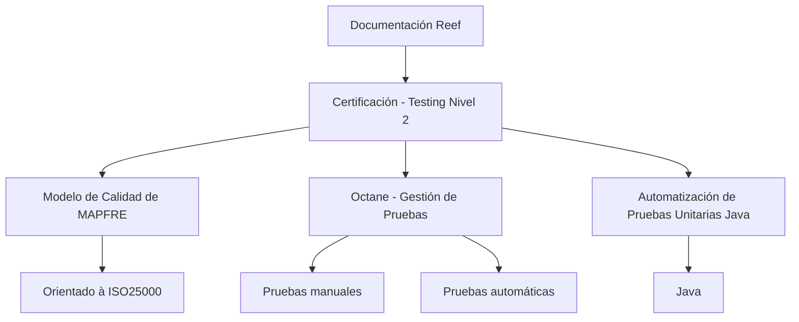

# Certificación - Testing Nivel 2: Documentación Reef

## 1. Metadados do Documento
- **Arquivo de Origem:** Não identificado no conteúdo extraído
- **Tipo de Documento:** Documentação / Material de Certificação
- **Domínio / Sistema:** MAPFRE — Reef, Modelo de Calidad, Octane e automatização de testes unitários Java
- **Público-Alvo:** Profissionais de testes, desenvolvedores Java e usuários da documentação Reef
- **Data/Versão Identificada:** Não identificada
- **Proprietário Identificado:** `user:agonzalez_mapfre.com`
- **Lifecycle:** Approved Source / VL

---

## 2. Resumo Executivo & Contexto de Negócio

O conteúdo apresenta a documentação Reef associada à **Certificación - Testing Nivel 2**. A certificação reúne temas relacionados ao modelo de qualidade da MAPFRE, à gestão de testes com a ferramenta Octane e à automatização de testes unitários na linguagem Java.

O documento declara que o **Modelo de Calidad de MAPFRE** é orientado à norma **ISO25000**. Entretanto, o conteúdo extraído não detalha requisitos de qualidade, métricas, critérios de aceitação, processos de auditoria ou mapeamentos específicos entre o modelo MAPFRE e a ISO25000.

A seção **OCTANE - GESTIÓN DE PRUEBAS** indica a existência de conteúdo programático para utilização da ferramenta Octane na gestão de testes. O escopo explicitamente citado abrange testes manuais e testes automáticos, sem detalhar funcionalidades da ferramenta, integrações, fluxos operacionais, permissões ou estruturas de projeto.

A seção **AUTOMATIZACIÓN DE PRUEBAS UNITARIAS JAVA** informa que há conteúdo programático para automatização de testes unitários em Java. O material extraído não identifica frameworks, bibliotecas, versões de Java, padrões de cobertura, comandos de execução ou pipelines de integração contínua.

A documentação está situada no contexto Reef e apresenta elementos de navegação corporativa, incluindo Soluciones, Arquitecturas, APIs, Componentes, Cloud, Documentación, Zeus, Reef e Ayuda. O conteúdo fornecido não explica as relações funcionais ou arquiteturais entre esses itens de navegação.

---

## 3. Arquitetura, Componentes & Tecnologias Envolvidas

Os componentes, conceitos e tecnologias citados são:

| Componente / Tecnologia | Papel identificado no conteúdo |
| :--- | :--- |
| Certificación - Testing Nivel 2 | Tema principal da documentação Reef extraída. |
| MAPFRE | Organização associada ao Modelo de Calidad citado. |
| Modelo de Calidad | Modelo de qualidade da MAPFRE orientado à ISO25000. |
| ISO25000 | Norma de referência para o Modelo de Calidad de MAPFRE. |
| Octane | Ferramenta citada para gestão de testes manuais ou automáticos. |
| Gestão de Pruebas | Escopo funcional associado ao uso da ferramenta Octane. |
| Automatización de Pruebas Unitarias Java | Tema de automatização de testes unitários para a linguagem Java. |
| Java | Linguagem explicitamente citada no escopo de testes unitários automatizados. |
| Reef | Contexto da documentação apresentada. |
| Zeus | Item de navegação listado na documentação Reef, sem descrição adicional. |
| Mapfredocument | Termo exibido no conteúdo bruto, sem explicação adicional. |



**Nota de Análise:** O conteúdo extraído descreve temas e relações conceituais, não uma arquitetura de software executável. Não há informações sobre servidores, endpoints, protocolos, bases de dados, microsserviços, versões, ambientes ou topologias de implantação.

---

## 4. Regras de Negócio, Especificações Funcionais & Processos

### 4.1 Certificação de Testing Nível 2

A documentação apresenta a **Certificación - Testing Nivel 2** como contexto principal. O texto não especifica:

- Critérios de elegibilidade para a certificação.
- Conteúdo completo do currículo.
- Critérios de aprovação.
- Duração, modalidade ou avaliações.
- Papéis envolvidos no processo de certificação.
- Fluxo de inscrição, realização ou emissão de certificado.

### 4.2 Modelo de Calidad de MAPFRE

O material informa que existe um detalhamento do **Modelo de Calidad de MAPFRE**, orientado à **ISO25000**.

Regras e informações explicitamente identificadas:

1. O modelo de qualidade é atribuído à MAPFRE.
2. O modelo é orientado à ISO25000.
3. O texto não informa quais características, subcaracterísticas, métricas ou indicadores ISO25000 são utilizados.
4. O texto não estabelece procedimentos de avaliação de qualidade nem critérios de conformidade.

### 4.3 Gestão de Testes com Octane

O conteúdo informa que a seção **OCTANE - GESTIÓN DE PRUEBAS** contém material para utilização da ferramenta Octane em gestão de testes.

Escopo explicitamente declarado:

1. A ferramenta Octane é relacionada à gestão de testes.
2. A gestão de testes abrange testes manuais.
3. A gestão de testes abrange testes automáticos.

**Nota de Análise:** O documento não detalha como criar, executar, versionar, reportar ou rastrear testes no Octane. Também não descreve integrações entre Octane e ferramentas de desenvolvimento, automação, CI/CD ou gerenciamento de defeitos.

### 4.4 Automatização de Testes Unitários Java

O conteúdo informa que existe material sobre automatização de testes unitários no contexto da linguagem Java.

Escopo explicitamente declarado:

1. O tema é a automatização de testes unitários.
2. A linguagem explicitamente associada é Java.

**Nota de Análise:** O conteúdo não especifica frameworks de teste, bibliotecas de mocking, ferramentas de análise de cobertura, padrões de nomenclatura, metas de cobertura, versões de Java ou comandos de execução.

---

## 5. Tabelas de Parâmetros, Ambientes e Estruturas de Dados

| Item / Parâmetro | Descrição / Função | Tipo / Valores / Formato | Ambiente / Observações |
| :--- | :--- | :--- | :--- |
| Certificación - Testing Nivel 2 | Contexto principal da documentação apresentada. | Certificação / tema de documentação | Não há detalhes sobre avaliação, aprovação ou duração. |
| Modelo de Calidad de MAPFRE | Modelo de qualidade da MAPFRE. | Modelo de qualidade | Declarado como orientado à ISO25000. |
| ISO25000 | Referência para o Modelo de Calidad de MAPFRE. | Norma / referência de qualidade | Não há detalhamento de requisitos ou métricas. |
| Octane | Ferramenta associada à gestão de testes. | Ferramenta de gestão de testes | Abrange testes manuais e automáticos segundo o texto. |
| Pruebas manuales | Modalidade de testes abrangida pela gestão com Octane. | Modalidade de teste | Sem procedimento operacional descrito. |
| Pruebas automáticas | Modalidade de testes abrangida pela gestão com Octane. | Modalidade de teste | Sem ferramenta de automação identificada. |
| Automatización de Pruebas Unitarias Java | Conteúdo referente à automatização de testes unitários em Java. | Tema técnico / conteúdo programático | Frameworks e práticas não especificados. |
| Java | Linguagem mencionada para os testes unitários automatizados. | Linguagem de programação | Versão não identificada. |
| Reef | Contexto de documentação no qual o conteúdo é apresentado. | Plataforma ou área de documentação | O conteúdo não descreve sua arquitetura ou função operacional. |
| Owner | Proprietário indicado na documentação. | Identificador de usuário | `user:agonzalez_mapfre.com` |
| Lifecycle | Estado identificado no documento. | Estado / metadado | `Approved Source / VL` |
| Idioma de interface | Idioma exibido no menu. | Código de idioma | `ES` |
| Navegação corporativa | Itens de navegação exibidos. | Lista de seções | Buscar, Inicio, Soluciones, Arquitecturas, APIs, Componentes, Cloud, Documentación, Zeus, Reef, Ayuda. |

---

## 6. Bateria de Perguntas & Respostas para RAG (FAQ Sintético)

### P1: Qual é o tema principal da documentação Reef extraída?
**R:** A documentação Reef está relacionada à **Certificación - Testing Nivel 2** e apresenta três temas principais: o Modelo de Calidad de MAPFRE orientado à ISO25000, a gestão de testes com Octane e a automatização de testes unitários em Java.

### P2: A qual norma o Modelo de Calidad de MAPFRE está orientado?
**R:** O conteúdo informa que o **Modelo de Calidad de MAPFRE** é orientado à **ISO25000**. O documento extraído não especifica quais requisitos, características ou métricas da ISO25000 são aplicados.

### P3: Qual é o objetivo da seção OCTANE - GESTIÓN DE PRUEBAS?
**R:** A seção **OCTANE - GESTIÓN DE PRUEBAS** apresenta conteúdo programático para uso da ferramenta Octane na gestão de testes, contemplando testes manuais e testes automáticos.

### P4: O documento descreve como configurar ou operar o Octane?
**R:** Não. O conteúdo apenas informa que Octane é usado para gestão de testes manuais e automáticos. Não há instruções sobre configuração, criação de casos de teste, execução, rastreabilidade, relatórios, integrações ou permissões.

### P5: Quais modalidades de teste são citadas no contexto do Octane?
**R:** O texto cita duas modalidades: **pruebas manuales** e **pruebas automáticas**. Não há detalhamento adicional sobre ferramentas, procedimentos ou critérios dessas modalidades.

### P6: Qual é o escopo da seção de automatização de testes unitários?
**R:** A seção aborda a **automatização de testes unitários na linguagem Java**. O conteúdo não identifica frameworks, bibliotecas, versões de Java, metas de cobertura ou comandos de execução.

### P7: O documento informa qual framework Java deve ser usado para testes unitários?
**R:** Não. O conteúdo menciona apenas a automatização de testes unitários em Java, sem citar frameworks ou bibliotecas específicas.

### P8: Quem é o proprietário identificado na documentação?
**R:** O campo **Owner** identifica `user:agonzalez_mapfre.com` como proprietário da documentação apresentada.

### P9: Qual é o lifecycle indicado no conteúdo?
**R:** O lifecycle indicado é **Approved Source / VL**.

### P10: Existem informações de ambientes, URLs, servidores ou endpoints?
**R:** Não. O conteúdo extraído não contém URLs, servidores, portas, ambientes de desenvolvimento, homologação ou produção, nem contratos de APIs ou endpoints.

### P11: A documentação apresenta uma arquitetura de software detalhada?
**R:** Não. A documentação extraída apresenta relações temáticas entre certificação, modelo de qualidade, Octane e testes unitários Java, mas não descreve componentes de infraestrutura, microsserviços, bancos de dados, integrações técnicas ou fluxos de implantação.

### P12: Quais áreas são exibidas na navegação da documentação?
**R:** A navegação exibida contém: Buscar, Inicio, Soluciones, Arquitecturas, APIs, Componentes, Cloud, Documentación, Zeus, Reef e Ayuda. O conteúdo não explica a finalidade de cada área.

---

## 7. Glossário de Termos, Siglas & Conceitos-Chave

- **Certificación - Testing Nivel 2:** Denominação da certificação ou do conjunto documental apresentado.
- **Modelo de Calidad:** Modelo de qualidade atribuído à MAPFRE e indicado como orientado à ISO25000.
- **MAPFRE:** Organização citada como responsável pelo Modelo de Calidad.
- **ISO25000:** Norma mencionada como orientação do Modelo de Calidad de MAPFRE.
- **Octane:** Ferramenta citada para gestão de testes manuais e automáticos.
- **Gestión de Pruebas:** Gestão de testes; contexto funcional associado ao Octane.
- **Pruebas manuales:** Testes manuais citados como parte do escopo de gestão de testes.
- **Pruebas automáticas:** Testes automáticos citados como parte do escopo de gestão de testes.
- **Automatización de Pruebas Unitarias Java:** Tema relacionado à automatização de testes unitários na linguagem Java.
- **Java:** Linguagem de programação citada no contexto de testes unitários automatizados.
- **Reef:** Contexto ou área de documentação exibida no conteúdo.
- **Zeus:** Item de navegação corporativa citado sem definição adicional.
- **Owner:** Campo de propriedade da documentação.
- **Lifecycle:** Campo de estado do documento.
- **VL:** Sigla exibida no campo Lifecycle; o significado não é detalhado no conteúdo.

---

## 8. Notas Críticas, Riscos & Limitações

- O conteúdo disponível corresponde a uma única página extraída e possui caráter resumido.
- Não foi identificado o nome do arquivo de origem, data, versão formal ou autoria além do campo `Owner`.
- Não há detalhamento operacional do Modelo de Calidad de MAPFRE ou de sua correspondência com a ISO25000.
- Não há especificação de funcionalidades, fluxos, integrações, permissões, relatórios ou estruturas de dados do Octane.
- Não há indicação de framework, biblioteca, versão de Java, meta de cobertura, padrão de código ou pipeline para a automatização de testes unitários.
- Não há ambientes, URLs, endpoints, credenciais, servidores, logs ou procedimentos de suporte operacional.
- O termo **VL** aparece no lifecycle, mas não é definido no texto.
- O termo **Mapfredocument** aparece no conteúdo bruto, mas não possui explicação adicional.
- A arquitetura Mermaid representa apenas relações conceituais explicitamente sustentadas pelo conteúdo; não representa uma topologia técnica ou fluxo executável.

---

## 9. Conteúdo Bruto Estruturado (Referência Fiel)

```text
--- [PÁGINA 1 DE 1] ---

CERTIFICACIÓN - TESTING NIVEL 2
CERTIFICACIÓN Testing nivel 2
MODELO DE CALIDAD
En este apartado se encuentra detallado el
Modelo de Calidad de MAPFRE orientado
a la ISO25000
OCTANE - GESTIÓN DE PRUEBAS
En este apartado se encuentra el temario
para el uso de la herramienta Octane, en
todo lo que se reere a la gestión de
pruebas, ya sean manuales o automáticas
AUTOMATIZACIÓN DE PRUEBAS
UNITARIAS JAVA
En este apartado se encuentra el temario
para la automatización de las pruebas
unitarias del lenguaje JAVA
Documentation / DOCUMENTACIÓN Reef
DOCUMENTACIÓN Reef
Mapfredocument
DOCUMENTACIÓN Reef
Owner
user:agonzalez_mapfre.com
Lifecycle
Approved Source
 / 
 VL
Buscar Inicio Soluciones Arquitecturas APIs Componentes Cloud Documentación Zeus Reef Ayuda
ES
```
