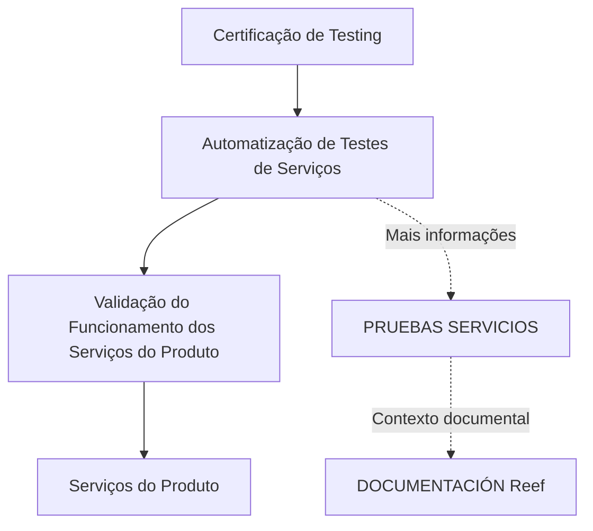
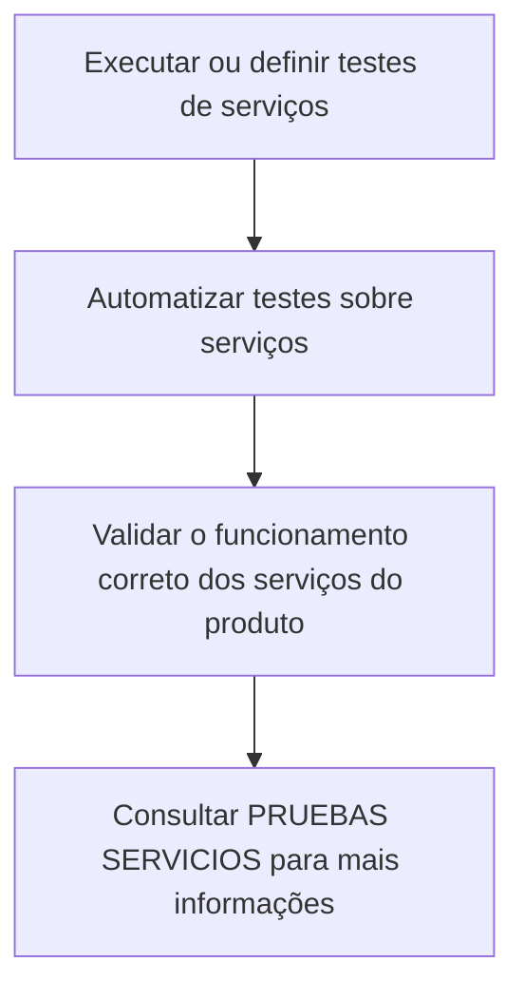

# Certificação de Testing — Automatização de Testes de Serviços

## 1. Metadados do Documento
- **Arquivo de Origem:** `Não identificado no texto extraído`
- **Tipo de Documento:** `Apresentação Executiva / Material de Certificação`
- **Domínio / Sistema:** `Testing; Automatização de Testes de Serviços; documentação Reef; Mapfre`
- **Público-Alvo:** `Desenvolvedores, profissionais de testes e equipes envolvidas na validação de serviços do produto`
- **Data/Versão Identificada:** `Não identificada`

---

## 2. Resumo Executivo & Contexto de Negócio

O documento apresenta o módulo **“CERTIFICACIÓN de TESTING - Automatización de Pruebas de Servicios”**, cujo objetivo declarado é automatizar testes executados sobre serviços. O conteúdo associa a automatização ao processo de certificação de testing.

A finalidade do módulo é automatizar as provas ou testes de serviços. O texto também determina que deve ser validado o funcionamento correto dos serviços pertencentes ao produto, posicionando a validação de serviços como foco funcional do material.

Como fonte complementar, o documento indica a referência **“PRUEBAS SERVICIOS”**, disponível no contexto de documentação Reef. A navegação exibida também contém referências a soluções, arquiteturas, APIs, componentes, cloud, documentação, Zeus, Reef e ajuda.

O conteúdo extraído é resumido e não descreve ferramentas de automação, frameworks de testes, contratos de API, métodos HTTP, critérios de aprovação, casos de teste, ambientes, pipelines ou resultados esperados. Portanto, o escopo confirmado limita-se à automatização e à validação do funcionamento de serviços do produto.

---

## 3. Arquitetura, Componentes & Tecnologias Envolvidas

Os elementos explicitamente citados são:

| Componente / Elemento | Papel identificado no documento | Detalhamento disponível |
| :--- | :--- | :--- |
| Módulo de certificação de testing | Contexto do material apresentado | Relacionado à automatização de testes de serviços |
| Testes de serviços | Objeto das validações automatizadas | Devem validar o funcionamento correto dos serviços do produto |
| Serviços do produto | Elementos que devem ser testados | Não há identificação individual dos serviços |
| PRUEBAS SERVICIOS | Referência para informações adicionais | Não há URL ou conteúdo detalhado na extração |
| DOCUMENTACIÓN Reef | Contexto documental referenciado | Aparece como área de documentação |
| Mapfredocument | Elemento de navegação ou repositório citado | Sem explicação adicional |
| Zeus | Elemento de navegação citado | Sem explicação adicional |
| Cloud | Categoria de navegação citada | Sem tecnologia ou ambiente especificado |
| APIs | Categoria de navegação citada | Sem APIs, endpoints ou contratos identificados |



**Nota de Análise:** O documento não fornece uma arquitetura técnica de sistemas, integrações, camadas, protocolos, tecnologias de automação ou fluxos detalhados entre serviços. O diagrama representa apenas as relações explicitamente declaradas no conteúdo.

---

## 4. Regras de Negócio, Especificações Funcionais & Processos

### Objetivo funcional identificado

1. O módulo tem a finalidade de automatizar testes sobre serviços.
2. Os testes devem validar o funcionamento correto dos serviços do produto.
3. Informações adicionais sobre testes de serviços podem ser consultadas na referência denominada **PRUEBAS SERVICIOS**.
4. A documentação relacionada é apresentada no contexto de **DOCUMENTACIÓN Reef**.

### Processo explicitamente descrito



### Restrições de interpretação

- O documento não informa como os testes são automatizados.
- O documento não define ferramentas, linguagens, frameworks ou bibliotecas de testes.
- O documento não especifica serviços, APIs, operações ou endpoints.
- O documento não apresenta critérios objetivos de sucesso, falha, cobertura ou aprovação.
- O documento não descreve dados de teste, massa de dados, mocks, stubs, autenticação ou contratos JSON.
- O documento não detalha responsabilidades operacionais, fluxo de aprovação ou tratamento de falhas.

---

## 5. Tabelas de Parâmetros, Ambientes e Estruturas de Dados

| Item / Parâmetro | Descrição / Função | Tipo / Valores / Formato | Ambiente / Observações |
| :--- | :--- | :--- | :--- |
| Módulo | Automatização de testes de serviços | Módulo de certificação de testing | Não há ambiente informado |
| Objetivo | Automatizar provas/testes sobre serviços | Objetivo funcional | Declarado na seção “OBJETIVO” |
| Validação requerida | Validar o funcionamento correto dos serviços do produto | Atividade de teste | Não há critérios técnicos detalhados |
| Serviços do produto | Alvo dos testes de serviços | Serviços não identificados individualmente | Não há lista de serviços |
| PRUEBAS SERVICIOS | Fonte complementar de informação | Referência documental | URL, localização e conteúdo não informados |
| DOCUMENTACIÓN Reef | Contexto ou área documental relacionada | Repositório/área de documentação citada | Sem detalhamento técnico |
| Owner | `user:agonzalez_mapfre.com` | Identificador de proprietário exibido | Aparece no conteúdo de navegação documental |
| Lifecycle | `Approved` | Estado de ciclo de vida exibido | Não há explicação adicional |
| Source | `VL` | Valor exibido como origem | Significado de “VL” não é definido |
| Idioma de navegação | `ES` | Código exibido na interface | Sugere contexto em espanhol, sem especificação adicional |

---

## 6. Bateria de Perguntas & Respostas para RAG (FAQ Sintético)

### P1: Qual é o objetivo do módulo “CERTIFICACIÓN de TESTING - Automatización de Pruebas de Servicios”?
**R:** O objetivo declarado é automatizar testes sobre serviços. O documento apresenta essa automatização como a finalidade central do módulo de certificação de testing.

### P2: O que precisa ser validado nos testes de serviços?
**R:** Os testes de serviços devem validar o funcionamento correto dos serviços do produto. O documento não apresenta critérios técnicos adicionais para determinar esse funcionamento correto.

### P3: Quais serviços do produto devem ser testados?
**R:** O documento menciona genericamente os “serviços do produto”, mas não identifica os nomes dos serviços, APIs, microsserviços, endpoints ou contratos que devem ser testados.

### P4: Onde o documento indica que há mais informações sobre testes de serviços?
**R:** O documento aponta a referência denominada **PRUEBAS SERVICIOS** como fonte para encontrar mais informações sobre testes de serviços.

### P5: O documento define qual ferramenta deve ser usada para automatizar os testes de serviços?
**R:** Não. O conteúdo extraído não cita ferramentas, frameworks, linguagens, plataformas de automação ou bibliotecas para implementação dos testes de serviços.

### P6: O documento descreve métodos HTTP ou contratos JSON dos serviços?
**R:** Não. O documento não detalha métodos HTTP, URLs, endpoints, requisições, respostas, contratos JSON, autenticação ou esquemas de dados.

### P7: Há ambientes de desenvolvimento, homologação ou produção descritos?
**R:** Não. Embora o conteúdo de navegação mencione “Cloud”, não há ambientes, servidores, URLs, portas, credenciais ou configurações de execução especificados.

### P8: Qual é a relação entre a certificação de testing e os testes de serviços?
**R:** O material é intitulado como uma certificação de testing voltada à automatização de testes de serviços. O texto define que a finalidade do módulo é automatizar testes e validar o funcionamento correto dos serviços do produto.

### P9: O documento informa critérios de aprovação ou reprovação dos testes?
**R:** Não. Não há métricas, limiares, regras de aprovação, níveis de cobertura, códigos de retorno esperados ou condições de falha descritos no conteúdo.

### P10: O que é DOCUMENTACIÓN Reef no contexto do documento?
**R:** DOCUMENTACIÓN Reef é uma referência documental exibida no conteúdo. O texto não explica sua estrutura, localização, responsáveis técnicos ou relação operacional detalhada com a automatização dos testes.

### P11: Quem aparece como owner no conteúdo documental?
**R:** O conteúdo apresenta `user:agonzalez_mapfre.com` no campo **Owner**. O documento não descreve as responsabilidades associadas a esse proprietário.

### P12: Qual é o estado de lifecycle exibido?
**R:** O estado de lifecycle exibido é **Approved**. A extração não define as regras, o processo ou os critérios associados a esse estado.

---

## 7. Glossário de Termos, Siglas & Conceitos-Chave

- **Certificación de Testing:** Contexto de certificação relacionado ao módulo de automatização de testes de serviços.
- **Automatización de Pruebas de Servicios:** Automatização de testes realizados sobre serviços.
- **Pruebas de Servicios:** Testes destinados a validar o funcionamento dos serviços do produto.
- **PRUEBAS SERVICIOS:** Referência documental indicada para obter mais informações sobre testes de serviços.
- **DOCUMENTACIÓN Reef:** Área ou contexto de documentação Reef citado no material.
- **Reef:** Nome citado em referências de documentação e navegação; o documento não define o significado funcional ou técnico.
- **Mapfredocument:** Termo exibido no conteúdo de navegação; não é definido no texto.
- **Zeus:** Termo exibido no conteúdo de navegação; não é definido no texto.
- **APIs:** Categoria exibida na navegação; nenhuma API específica é detalhada.
- **Cloud:** Categoria exibida na navegação; nenhuma infraestrutura, provedor ou ambiente é detalhado.
- **Lifecycle:** Campo exibido com o valor `Approved`.
- **Approved:** Valor exibido para o campo Lifecycle; critérios não especificados.
- **VL:** Valor exibido no campo Source; significado não definido pelo documento.
- **ES:** Código exibido na navegação, associado ao idioma espanhol.

---

## 8. Notas Críticas, Riscos & Limitações

- **Detalhamento técnico insuficiente:** O documento não especifica ferramentas, tecnologias, frameworks ou padrões para automatização dos testes de serviços.
- **Ausência de inventário de serviços:** Não existe lista de serviços, APIs, endpoints, operações ou contratos a serem validados.
- **Ausência de critérios de aceite:** O documento não define condições mensuráveis para aprovação, falha, cobertura ou qualidade dos testes.
- **Dependência documental externa:** O texto direciona o leitor para **PRUEBAS SERVICIOS**, porém não apresenta URL, caminho, conteúdo ou mecanismo de acesso a essa referência.
- **Sem ambientes operacionais:** Não são informados ambientes, servidores, configurações, variáveis, portas ou rotas de logs.
- **Termos não definidos:** Reef, Mapfredocument, Zeus e VL são citados, mas não recebem definição no conteúdo extraído.
- **Nota de Análise:** O documento lista testes de serviços e a referência “PRUEBAS SERVICIOS”, porém não detalha os métodos HTTP, contratos JSON, estratégias de automação, dados de teste ou processos de execução associados.

---

## 9. Conteúdo Bruto Estruturado (Referência Fiel)

```text
--- [PÁGINA 1 DE 1] ---

CERTIFICACIÓN de TESTING - Automatización de Pruebas de
Servicios

OBJETIVO

La finalidad de este módulo es automatizar las pruebas sobre servicios.

Pruebas de Servicios

Pruebas de Servicios

Tendremos que validar el correcto funcionamiento de los servicios del producto.

Podemos encontrar más información en: PRUEBAS SERVICIOS

Documentation / DOCUMENTACIÓN Reef

DOCUMENTACIÓN Reef

Mapfredocument

DOCUMENTACIÓN Reef

Owner
user:agonzalez_mapfre.com

Lifecycle
Approved

Source
VL

Buscar Inicio Soluciones Arquitecturas APIs Componentes Cloud Documentación Zeus Reef Ayuda

ES
```
