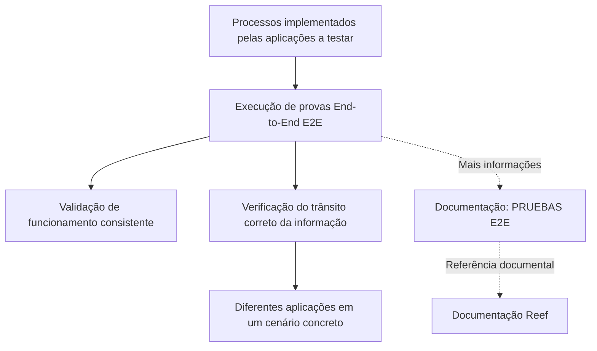

# Certificação de Testing Octane — Execução de Testes End-to-End (E2E)

## 1. Metadados do Documento
- **Arquivo de Origem:** Não identificado no conteúdo fornecido
- **Tipo de Documento:** Procedimento
- **Domínio / Sistema:** Testing Octane; documentação Reef; Mapfre
- **Público-Alvo:** Desenvolvedores, QA/Testes e Operação
- **Data/Versão Identificada:** Não identificada

---

## 2. Resumo Executivo & Contexto de Negócio

O documento “CERTIFICACIÓN de TESTING - Octane” apresenta o objetivo de um módulo voltado ao entendimento da execução de testes End-to-End (E2E). O conteúdo indica que a finalidade principal é validar processos implementados pelas aplicações submetidas a teste.

Os testes E2E devem verificar a consistência do funcionamento dos processos em um cenário concreto. A validação não se restringe ao comportamento isolado de uma aplicação: o foco declarado é assegurar que a informação trafegue corretamente pelas diferentes aplicações envolvidas.

O material referencia a documentação “PRUEBAS E2E” como fonte para informações adicionais. Também há referências ao portal de documentação Reef, incluindo itens de navegação como Soluções, Arquiteturas, APIs, Componentes, Cloud, Documentação e Zeus.

O documento não detalha casos de teste específicos, aplicações participantes, critérios mensuráveis de aprovação, ferramentas de automação, ambientes de execução, contratos de integração ou procedimentos operacionais para execução das provas E2E.

---

## 3. Arquitetura, Componentes & Tecnologias Envolvidas

Os elementos explicitamente citados no conteúdo são:

| Componente / Referência | Papel identificado no documento |
| :--- | :--- |
| Testing Octane | Contexto da certificação de testes mencionada no título. |
| Módulo de testes | Módulo cuja finalidade é entender a execução de provas End-to-End. |
| Pruebas E2E | Tipo de teste abordado para validação de processos e trânsito de informação entre aplicações. |
| Aplicações a testar | Aplicações que implementam os processos submetidos à validação E2E. |
| Documentación Reef | Repositório ou área documental referenciada para consulta. |
| PRUEBAS E2E | Referência documental indicada como fonte de mais informações. |
| Mapfredocument | Termo exibido na navegação ou identificação da documentação. |
| Zeus | Item citado na navegação do portal de documentação. |



**Nota de Análise:** o documento descreve uma relação geral entre processos, aplicações e testes E2E, mas não identifica nomes de aplicações, interfaces, APIs, protocolos, fluxos de dados específicos ou ambientes técnicos.

---

## 4. Regras de Negócio, Especificações Funcionais & Processos

### Objetivo do módulo

A finalidade declarada do módulo é compreender como são executadas as provas End-to-End.

### Critérios de validação dos testes E2E

Os testes E2E devem validar os seguintes aspectos:

1. Os processos implementados pelas aplicações sob teste devem funcionar de maneira consistente.
2. A informação deve trafegar corretamente através das diferentes aplicações.
3. A validação deve ocorrer dentro de um cenário concreto.

### Processo lógico extraído

1. Identificar os processos implementados nas aplicações a testar.
2. Executar provas End-to-End sobre esses processos.
3. Verificar se os processos funcionam de forma consistente.
4. Confirmar se a informação percorre corretamente as diferentes aplicações.
5. Consultar a referência documental “PRUEBAS E2E” para informações adicionais.

**Nota de Análise:** o documento não define condições de entrada, dados de teste, resultados esperados, critérios de aceite, tratamento de falhas, responsáveis pela aprovação ou frequência de execução.

---

## 5. Tabelas de Parâmetros, Ambientes e Estruturas de Dados

| Item / Parâmetro | Descrição / Função | Tipo / Valores / Formato | Ambiente / Observações |
| :--- | :--- | :--- | :--- |
| Tipo de teste | Validação de processos entre aplicações. | Pruebas E2E / End-to-End | Cenário concreto não especificado. |
| Critério de consistência | Os processos implementados devem funcionar de forma consistente. | Regra de validação funcional | Não há métrica ou limiar definido. |
| Fluxo de informação | A informação deve viajar corretamente entre aplicações. | Regra de integração | Aplicações não identificadas. |
| Referência adicional | Fonte apontada para aprofundamento em provas E2E. | “PRUEBAS E2E” | Referenciada por meio da documentação Reef. |
| Proprietário exibido | Identificação de owner na documentação. | `user:agonzalez_mapfre.com` | Exibido no conteúdo bruto. |
| Lifecycle | Estado do documento no portal. | Approved | Exibido no conteúdo bruto. |
| Idioma exibido | Idioma selecionado no portal. | ES | Exibido no conteúdo bruto. |
| Navegação do portal | Áreas disponíveis na documentação. | Buscar, Inicio, Soluciones, Arquitecturas, APIs, Componentes, Cloud, Documentación, Zeus, Reef, Ayuda | Não há detalhamento funcional das áreas. |

---

## 6. Bateria de Perguntas & Respostas para RAG (FAQ Sintético)

### P1: Qual é a finalidade do módulo de certificação de Testing Octane?
**R:** A finalidade do módulo é entender como são executadas as provas End-to-End, também chamadas de testes E2E.

### P2: O que os testes E2E devem validar nas aplicações?
**R:** Os testes E2E devem validar que os processos implementados pelas aplicações a testar funcionam de maneira consistente.

### P3: Qual é o requisito relacionado ao fluxo de informação nos testes E2E?
**R:** Os testes E2E devem assegurar que a informação viaje corretamente através das diferentes aplicações envolvidas no cenário de teste.

### P4: Os testes E2E descritos avaliam apenas uma aplicação isolada?
**R:** Não. O documento afirma que a validação considera a informação trafegando através de distintas aplicações, caracterizando uma validação End-to-End de integração entre aplicações.

### P5: Em que contexto deve ocorrer a validação E2E?
**R:** A validação deve ocorrer em um cenário concreto. O documento não descreve qual é esse cenário, seus ambientes, seus dados ou suas aplicações participantes.

### P6: Onde buscar mais informações sobre as provas E2E?
**R:** O documento indica a referência “PRUEBAS E2E” como fonte para mais informações e também aponta a documentação Reef.

### P7: O documento informa quais aplicações participam dos testes E2E?
**R:** Não. O documento menciona “aplicações a testar” e “distintas aplicações”, mas não identifica os nomes, módulos, interfaces ou responsabilidades dessas aplicações.

### P8: O documento define critérios quantitativos de aprovação para testes E2E?
**R:** Não. O material estabelece que os processos devem funcionar de maneira consistente e que a informação deve trafegar corretamente, mas não define métricas, limites, percentuais ou evidências exigidas para aprovação.

### P9: Há especificação de APIs, métodos HTTP ou contratos JSON no documento?
**R:** Não. Apesar de o portal referenciar uma área denominada “APIs”, o conteúdo fornecido não descreve métodos HTTP, endpoints, payloads, contratos JSON, autenticação ou protocolos de integração.

### P10: Qual é o estado de ciclo de vida exibido para a documentação?
**R:** O conteúdo bruto exibe o lifecycle como “Approved”.

### P11: Quem é o owner exibido no conteúdo do portal documental?
**R:** O owner exibido é `user:agonzalez_mapfre.com`.

### P12: O documento descreve ferramentas de automação de testes?
**R:** Não. O documento cita “Testing Octane” no título, mas não detalha ferramentas, configurações, pipelines, scripts, frameworks ou procedimentos de automação.

---

## 7. Glossário de Termos, Siglas & Conceitos-Chave

- **E2E / End-to-End:** Tipo de teste destinado a validar processos de ponta a ponta, incluindo o correto trânsito de informação através de diferentes aplicações.
- **Testing Octane:** Contexto de certificação indicado no título do documento; o conteúdo não detalha suas funcionalidades.
- **Aplicações a testar:** Aplicações que implementam os processos sujeitos à validação E2E.
- **Cenário concreto:** Contexto específico no qual os testes E2E devem validar consistência de processos e fluxo de informação.
- **Documentación Reef:** Referência a um espaço de documentação associado a Reef.
- **PRUEBAS E2E:** Referência documental indicada para obtenção de informações adicionais sobre testes E2E.
- **Lifecycle:** Campo de ciclo de vida documental exibido como “Approved”.
- **Owner:** Campo de propriedade documental exibido como `user:agonzalez_mapfre.com`.

---

## 8. Notas Críticas, Riscos & Limitações

- O documento é resumido e não descreve aplicações, componentes, ambientes, versões, URLs, servidores ou rotas de log.
- Não há detalhamento de casos de teste E2E, massa de dados, pré-requisitos, passos de execução ou resultados esperados.
- Não há critérios mensuráveis para determinar consistência dos processos ou correção do fluxo de informação.
- Não há definição de responsáveis por execução, aprovação, tratamento de incidentes ou gestão de evidências.
- Embora “Testing Octane” seja citado no título, não há informação suficiente para afirmar funcionalidades, integrações ou configuração dessa ferramenta.
- **Nota de Análise:** o documento lista “PRUEBAS E2E” e “Documentación Reef”, porém não fornece URL, localização navegável ou conteúdo detalhado dessas referências.

---

## 9. Conteúdo Bruto Estruturado (Referência Fiel)

```text
--- [PÁGINA 1 DE 1] ---

CERTIFICACIÓN de TESTING - Octane
OBJETIVO
La nalidad de este módulo es entender cómo se ejecutan las pruebas End to End.
Pruebas E2E
Pruebas E2E
Tendremos que validar que los procesos, que se implementan con las aplicaciones a probar, funcionan de manera consistente, asegurando
que la información viaja correctamente a través de las distintas aplicaciones en un escenario concreto.
Podemos encontrar más información en: PRUEBAS E2E
Documentation / DOCUMENTACIÓN Reef
DOCUMENTACIÓN Reef
Mapfredocument
DOCUMENTACIÓN Reef
Owner
user:agonzalez_mapfre.com
Lifecycle
Approved Source
 /
 VL
Buscar Inicio Soluciones Arquitecturas APIs Componentes Cloud Documentación Zeus Reef Ayuda
ES
```
