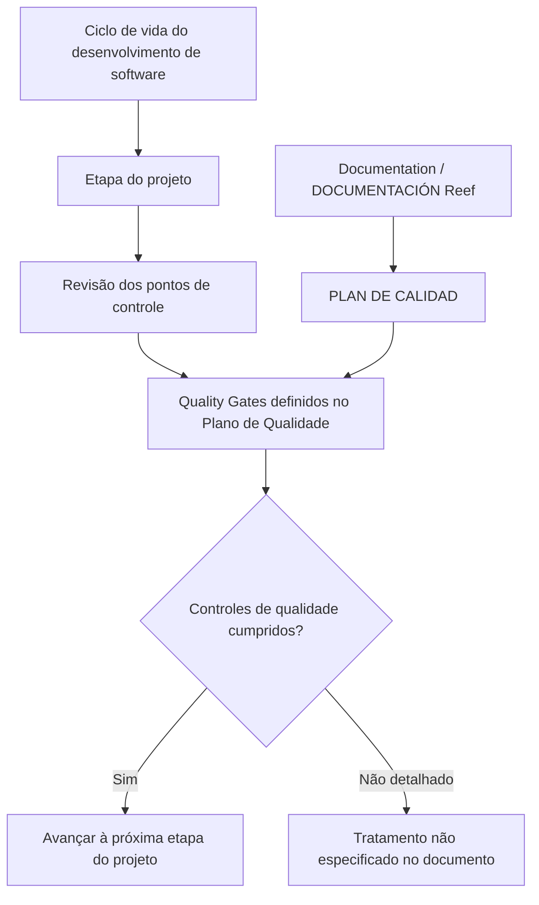

# Certificação de Testing — Plano de Qualidade e Quality Gates no Ciclo de Vida de Desenvolvimento de Software

## 1. Metadados do Documento
- **Arquivo de Origem:** Não identificado
- **Tipo de Documento:** Procedimento / Apresentação de Certificação de Testing
- **Domínio / Sistema:** Plano de Qualidade, Reef, Mapfre
- **Público-Alvo:** Desenvolvedores, equipes de Testing, Arquitetos e Operação
- **Data/Versão Identificada:** Não identificada

---

## 2. Resumo Executivo & Contexto de Negócio

O documento apresenta o módulo **“CERTIFICACIÓN de TESTING - Plan de Calidad”**, cujo objetivo é revisar os pontos de controle existentes no ciclo de vida do desenvolvimento de software. Esses pontos de controle avaliam a qualidade do software antes que o projeto avance para sua etapa seguinte.

O mecanismo de controle de qualidade mencionado é denominado **Quality Gates**. O documento determina que os controles de qualidade definidos como Quality Gates devem ser cumpridos durante o ciclo de vida de desenvolvimento de software.

A documentação relacionada ao Plano de Qualidade está disponível por meio da referência **“PLAN DE CALIDAD”** e da área **“Documentation / DOCUMENTACIÓN Reef”**. O conteúdo também apresenta referências a **Reef**, **Mapfredocument** e uma área de documentação com estado de ciclo de vida aprovado.

O documento não detalha critérios individuais dos Quality Gates, responsáveis por cada ponto de controle, métricas de qualidade, ferramentas de teste, condições de aprovação ou procedimentos de exceção. A finalidade apresentada limita-se à revisão dos controles de qualidade antes da progressão entre etapas do projeto.

---

## 3. Arquitetura, Componentes & Tecnologias Envolvidas

Os elementos explicitamente citados no conteúdo são:

| Componente / Referência | Papel descrito no documento |
| :--- | :--- |
| CERTIFICACIÓN de TESTING | Módulo relacionado à revisão de pontos de controle de qualidade. |
| Plan de Calidad | Referência principal para os controles de qualidade do ciclo de vida de desenvolvimento. |
| Quality Gates | Controles de qualidade que devem ser cumpridos antes do avanço à próxima etapa do projeto. |
| Documentation / DOCUMENTACIÓN Reef | Localização ou área de consulta para documentação relacionada. |
| Reef | Domínio ou plataforma documental mencionada. |
| Mapfredocument | Referência documental apresentada na navegação. |
| Owner `user:agonzalez_mapfre.com` | Proprietário identificado no conteúdo exibido. |
| Lifecycle `Approved Source` | Estado de ciclo de vida indicado para o conteúdo documental. |
| VL | Identificador exibido junto ao estado de ciclo de vida. |
| Zeus | Item disponível na navegação documental. |



> **Nota de Análise:** O documento descreve o fluxo conceitual de validação por Quality Gates, mas não informa ferramentas, integrações, microsserviços, APIs, contratos, ambientes técnicos ou métricas de avaliação.

---

## 4. Regras de Negócio, Especificações Funcionais & Processos

1. O módulo de Certificação de Testing tem como finalidade revisar os pontos de controle no ciclo de vida do desenvolvimento de software.
2. A revisão de qualidade ocorre antes de o software avançar para a próxima etapa do projeto.
3. Os controles de qualidade definidos devem ser cumpridos como **Quality Gates**.
4. O Plano de Qualidade é a referência indicada para obter informações adicionais sobre os controles de qualidade.
5. A documentação relacionada é apresentada na área **Documentation / DOCUMENTACIÓN Reef**.
6. O conteúdo documental exibido possui ciclo de vida identificado como **Approved Source**.
7. O proprietário apresentado para o conteúdo é `user:agonzalez_mapfre.com`.

> **Nota de Análise:** O documento não especifica quais são os Quality Gates, quais evidências devem ser apresentadas, quais papéis aprovam os controles, quais critérios bloqueiam uma passagem de etapa ou como são tratadas reprovações.

---

## 5. Tabelas de Parâmetros, Ambientes e Estruturas de Dados

| Item / Parâmetro | Descrição / Função | Tipo / Valores / Formato | Ambiente / Observações |
| :--- | :--- | :--- | :--- |
| Módulo | Certificação de Testing | `CERTIFICACIÓN de TESTING - Plan de Calidad` | Relacionado à revisão de qualidade no desenvolvimento de software. |
| Objetivo | Revisar pontos de controle de qualidade | Texto descritivo | A revisão ocorre antes da progressão para a etapa seguinte do projeto. |
| Controles de qualidade | Quality Gates | Termo de processo | Devem ser cumpridos conforme o Plano de Qualidade. |
| Documento de referência | Plano de Qualidade | `PLAN DE CALIDAD` | Indicado como fonte de informações adicionais. |
| Área documental | Documentação Reef | `Documentation / DOCUMENTACIÓN Reef` | Área mencionada para consulta documental. |
| Plataforma / domínio | Reef | `Reef` | Citado em referências documentais e navegação. |
| Referência documental | Mapfredocument | `Mapfredocument` | Exibido na navegação do conteúdo. |
| Proprietário | Owner | `user:agonzalez_mapfre.com` | Identificador literal apresentado no documento. |
| Estado do documento | Lifecycle | `Approved Source` | Estado de ciclo de vida exibido. |
| Identificador adicional | VL | `VL` | Apresentado junto ao estado de ciclo de vida; sem detalhamento adicional. |
| Idioma da navegação | Idioma | `ES` | Exibido na interface documental. |
| Itens de navegação | Seções disponíveis | Buscar, Inicio, Soluciones, Arquitecturas, APIs, Componentes, Cloud, Documentación, Zeus, Reef, Ayuda | Não há descrição funcional desses itens no conteúdo fornecido. |

---

## 6. Bateria de Perguntas & Respostas para RAG (FAQ Sintético)

### P1: Qual é o objetivo do módulo “CERTIFICACIÓN de TESTING - Plan de Calidad”?
**R:** O objetivo do módulo é revisar os pontos de controle existentes no ciclo de vida do desenvolvimento de software. A revisão avalia a qualidade do software antes que o projeto avance para a etapa seguinte.

### P2: Em que momento os controles de qualidade devem ser avaliados?
**R:** Os controles de qualidade devem ser avaliados antes de o software avançar para a próxima etapa do projeto dentro do ciclo de vida de desenvolvimento de software.

### P3: O que são Quality Gates no contexto do Plano de Qualidade?
**R:** Quality Gates são os controles de qualidade definidos que devem ser cumpridos durante o ciclo de vida do desenvolvimento de software. O documento não detalha os critérios individuais, métricas ou evidências exigidas para cada Quality Gate.

### P4: Onde o documento orienta buscar mais informações sobre os controles de qualidade?
**R:** O documento orienta buscar mais informações na referência identificada como **PLAN DE CALIDAD**, apresentada na área **Documentation / DOCUMENTACIÓN Reef**.

### P5: Qual é a consequência documentada para o avanço do projeto após a avaliação de qualidade?
**R:** A avaliação de qualidade ocorre antes do avanço para a próxima etapa do projeto. O documento estabelece que os Quality Gates devem ser cumpridos, mas não descreve o procedimento aplicado quando um controle não é cumprido.

### P6: Quais sistemas ou áreas documentais são mencionados?
**R:** O conteúdo menciona **Documentation / DOCUMENTACIÓN Reef**, **Reef**, **Mapfredocument** e o item de navegação **Zeus**. Não são descritas integrações técnicas, responsabilidades ou funcionalidades específicas para esses elementos.

### P7: Quem é o proprietário identificado para o conteúdo documental?
**R:** O proprietário exibido no conteúdo é `user:agonzalez_mapfre.com`.

### P8: Qual é o estado de ciclo de vida exibido para o documento?
**R:** O estado de ciclo de vida apresentado é **Approved Source**. O identificador **VL** também aparece associado a essa informação, sem explicação adicional.

### P9: O documento especifica ferramentas de automação de testes ou tecnologias de qualidade?
**R:** Não. O documento menciona a revisão de qualidade e os Quality Gates, mas não identifica ferramentas de teste, tecnologias de automação, pipelines de CI/CD, repositórios, ambientes ou métricas técnicas.

### P10: O documento define critérios de aprovação ou reprovação para os Quality Gates?
**R:** Não. O conteúdo informa apenas que os controles de qualidade definidos como Quality Gates devem ser cumpridos. Critérios de aprovação, responsáveis, níveis de severidade e fluxos de exceção não são detalhados.

---

## 7. Glossário de Termos, Siglas & Conceitos-Chave

- **CERTIFICACIÓN de TESTING:** Módulo mencionado para revisão dos pontos de controle de qualidade no ciclo de vida de desenvolvimento de software.
- **Plan de Calidad / Plano de Qualidade:** Referência documental indicada para os controles de qualidade.
- **Quality Gates:** Controles de qualidade que devem ser cumpridos antes da progressão para a próxima etapa de um projeto.
- **Lifecycle:** Campo de ciclo de vida do conteúdo documental.
- **Approved Source:** Estado de ciclo de vida exibido para o documento.
- **Reef:** Nome citado como área, referência ou domínio de documentação.
- **Mapfredocument:** Referência documental exibida na navegação.
- **VL:** Identificador exibido junto ao campo de ciclo de vida, sem definição no conteúdo.
- **Zeus:** Item de navegação citado, sem descrição adicional.

---

## 8. Notas Críticas, Riscos & Limitações

- O documento não enumera os Quality Gates que devem ser verificados.
- Não há métricas, indicadores, limiares, critérios de aprovação ou critérios de reprovação.
- Não são identificados responsáveis por executar, validar ou aprovar os controles de qualidade.
- Não há detalhamento sobre ferramentas de teste, automação, CI/CD, ambientes, APIs, logs ou evidências requeridas.
- O tratamento para Quality Gates não cumpridos não é apresentado.
- As referências a Reef, Mapfredocument, Zeus e VL não possuem definição funcional ou técnica adicional.
- O arquivo de origem, data, versão e autoria formal do documento não foram identificados no conteúdo fornecido.

---

## 9. Conteúdo Bruto Estruturado (Referência Fiel)

```text
--- [PÁGINA 1 DE 1] ---

CERTIFICACIÓN de TESTING - Plan de Calidad
OBJETIVO
La nalidad de este módulo es revisar los puntos de control en el ciclo de vida del desarrollo de software, donde se evalúa la calidad del
software antes de avanzar a la siguiente etapa del proyecto.
Plan de Calidad
Plan de Calidad
Tendremos que cumplir con los controles de calidad denidos como Quality Gates.
Podemos encontrar más información en: PLAN DE CALIDAD
Documentation / DOCUMENTACIÓN Reef
DOCUMENTACIÓN Reef
Mapfredocument
DOCUMENTACIÓN Reef
Owner
user:agonzalez_mapfre.com
Lifecycle
Approved Source
 / 
 VL
Buscar Inicio Soluciones Arquitecturas APIs Componentes Cloud Documentación Zeus Reef Ayuda
ES
```
