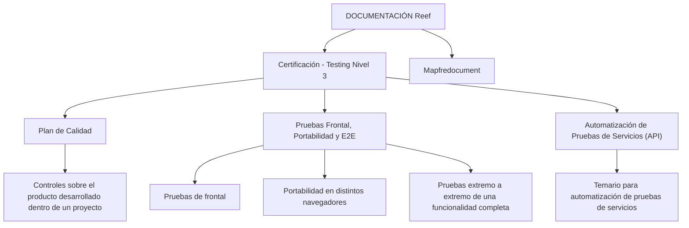

# Certificación — Testing Nivel 3: Plano de Qualidade, Testes Frontais, Portabilidade, E2E e Automação de APIs

## 1. Metadados do Documento
- **Arquivo de Origem:** Não identificado no conteúdo fornecido
- **Tipo de Documento:** Apresentação Executiva / Material de Certificação
- **Domínio / Sistema:** Reef / Mapfre
- **Público-Alvo:** Profissionais de testes, desenvolvedores, arquitetos e equipes de qualidade
- **Data/Versão Identificada:** Não identificada

---

## 2. Resumo Executivo & Contexto de Negócio

O conteúdo descreve o material denominado **“Certificación - Testing Nivel 3”**, associado a uma iniciativa de certificação em testes. O documento organiza temas de qualidade aplicáveis ao produto desenvolvido dentro de um projeto.

O primeiro eixo apresentado é o **Plano de Qualidade**, definido como a seção que contém o detalhamento dos controles realizados sobre o produto desenvolvido no contexto de um projeto. O conteúdo fornecido não especifica quais controles, critérios de aceitação, métricas ou responsáveis compõem esse plano.

O segundo eixo abrange **testes frontais, testes de portabilidade e testes E2E (end-to-end)**. O material indica que essa seção contém o temário para execução de testes de interface, validação de portabilidade em navegadores distintos e testes ponta a ponta voltados à validação de uma funcionalidade completa.

O terceiro eixo é a **automação de testes de serviços (API)**. O documento informa que existe um temário dedicado à automação desses testes, mas não identifica ferramentas, protocolos, métodos HTTP, contratos de API, frameworks, ambientes ou estratégias de execução.

O material está inserido no contexto de documentação do **Reef**, com referência a **Mapfredocument**, proprietário identificado como `user:agonzalez_mapfre.com` e ciclo de vida indicado como **Approved**.

---

## 3. Arquitetura, Componentes & Tecnologias Envolvidas

Os componentes e áreas explicitamente citados são:

| Componente / Área | Papel identificado no conteúdo |
| :--- | :--- |
| Certificación Testing nivel 3 | Material ou nível de certificação relacionado a testes. |
| Plan de Calidad | Seção com detalhamento de controles aplicados ao produto de um projeto. |
| Pruebas Frontal | Temário para execução de testes de interface frontal. |
| Portabilidad | Temário para validação em distintos navegadores. |
| E2E | Testes extremo a extremo para validar uma funcionalidade completa. |
| Automatización de Pruebas de Servicios (API) | Temário de automação de testes de serviços. |
| Reef | Contexto ou repositório de documentação citado como “DOCUMENTACIÓN Reef”. |
| Mapfredocument | Sistema, fonte documental ou referência identificada no conteúdo. |
| Zeus | Item de navegação citado no portal de documentação. |



> **Nota de Análise:** O conteúdo não apresenta uma arquitetura de software, integrações entre sistemas, tecnologias de implementação, ambientes, endpoints ou contratos de serviço. O diagrama representa somente a organização temática explicitamente descrita.

---

## 4. Regras de Negócio, Especificações Funcionais & Processos

### 4.1 Plano de Qualidade

O documento estabelece que o **Plano de Qualidade** contém o detalhamento dos controles executados sobre o produto desenvolvido dentro de um projeto.

Não foram fornecidos detalhes sobre:

- Tipos de controles de qualidade.
- Critérios de aprovação ou reprovação.
- Métricas de qualidade.
- Responsáveis pelos controles.
- Periodicidade de execução.
- Evidências exigidas.
- Ferramentas de gestão ou execução.

### 4.2 Testes Frontais, Portabilidade e E2E

A seção de testes frontais, portabilidade e E2E apresenta um temário para a execução de três modalidades:

1. **Testes de frontal:** execução de testes relacionados à camada frontal ou interface.
2. **Testes de portabilidade:** validação do comportamento em distintos navegadores.
3. **Testes E2E:** testes extremo a extremo que validam uma funcionalidade completa.

Não foram identificados navegadores específicos, cenários de teste, critérios de compatibilidade, ferramentas de automação, dados de teste, fluxos funcionais ou critérios de sucesso para os testes E2E.

### 4.3 Automação de Testes de Serviços (API)

A seção de automação de testes de serviços informa que contém um temário para automação de testes de serviços identificados como **API**.

Não foram especificados:

- Protocolos utilizados pelas APIs.
- Métodos HTTP.
- Estruturas JSON, XML ou outros formatos de payload.
- Ferramentas de automação.
- Estratégias de autenticação.
- Ambientes de execução.
- Contratos, endpoints ou critérios de validação.

---

## 5. Tabelas de Parâmetros, Ambientes e Estruturas de Dados

| Item / Parâmetro | Descrição / Função | Tipo / Valores / Formato | Ambiente / Observações |
| :--- | :--- | :--- | :--- |
| Certificación - Testing Nivel 3 | Título do material de certificação de testes. | Texto | Não há versão ou data identificada. |
| Plan de Calidad | Seção com detalhes dos controles realizados sobre o produto de um projeto. | Seção temática | Os controles não são enumerados no conteúdo. |
| Pruebas Frontal | Tema destinado à execução de testes de frontal. | Seção temática | Não há cenários ou ferramentas identificados. |
| Portabilidad | Tema de validação em diferentes navegadores. | Seção temática | Navegadores não identificados. |
| E2E | Testes extremo a extremo para validação de funcionalidade completa. | Seção temática | Fluxos E2E não detalhados. |
| Automatización de Pruebas de Servicios (API) | Tema para automação de testes de serviços. | Seção temática | APIs, métodos e ferramentas não identificados. |
| Reef | Contexto de documentação mencionado no portal. | Sistema / domínio documental | Aparece como “DOCUMENTACIÓN Reef”. |
| Mapfredocument | Referência documental citada no conteúdo. | Sistema / fonte documental | Sem detalhamento adicional. |
| Owner | Proprietário do conteúdo documental. | `user:agonzalez_mapfre.com` | Valor textual extraído literalmente. |
| Lifecycle | Estado do ciclo de vida do documento. | `Approved` | O conteúdo também apresenta “Source / VL”. |
| Idioma da interface | Idioma exibido na navegação do portal. | `ES` | Interface em espanhol. |
| Itens de navegação | Opções apresentadas no portal documental. | Buscar, Inicio, Soluciones, Arquitecturas, APIs, Componentes, Cloud, Documentación, Zeus, Reef, Ayuda | Não representam necessariamente componentes da certificação. |

---

## 6. Bateria de Perguntas & Respostas para RAG (FAQ Sintético)

### P1: Qual é o objetivo do Plano de Qualidade na certificação Testing Nivel 3?
**R:** O Plano de Qualidade é apresentado como a seção que contém o detalhamento dos controles realizados sobre o produto desenvolvido dentro de um projeto. O conteúdo fornecido não descreve os controles específicos, suas métricas, responsáveis ou critérios de aprovação.

### P2: O que a seção de testes frontais cobre?
**R:** A seção “Pruebas Frontal, Portabilidad y E2E” contém um temário para execução de testes de frontal. O documento não detalha telas, cenários, ferramentas, navegadores, tecnologias de interface ou critérios de aceite.

### P3: Como a portabilidade é tratada no documento?
**R:** O documento indica que a portabilidade envolve testes realizados em distintos navegadores. Não informa quais navegadores devem ser utilizados, quais versões são suportadas ou quais regras de compatibilidade devem ser avaliadas.

### P4: O que os testes E2E devem validar?
**R:** Os testes E2E, ou extremo a extremo, devem validar uma funcionalidade completa. O conteúdo não apresenta o fluxo funcional a ser testado, as integrações envolvidas, os dados de entrada ou as condições de sucesso.

### P5: O documento define ferramentas para automação de testes de APIs?
**R:** Não. O documento apenas informa que existe um temário para automação de testes de serviços (API). Não são citadas ferramentas, frameworks, linguagens, protocolos, endpoints ou contratos de serviço.

### P6: Existem métodos HTTP ou contratos JSON documentados para as APIs?
**R:** Não. O conteúdo menciona “Automatización de Pruebas de Servicios (API)”, mas não detalha métodos HTTP, URLs, payloads, contratos JSON, mecanismos de autenticação ou códigos de resposta.

### P7: Qual sistema ou contexto documental é citado no material?
**R:** O conteúdo faz referência a “DOCUMENTACIÓN Reef”, além de citar “Mapfredocument”. Com base exclusivamente no texto fornecido, não é possível determinar a arquitetura, função técnica ou relação operacional entre Reef e Mapfredocument.

### P8: Qual é o status do ciclo de vida identificado para o documento?
**R:** O campo “Lifecycle” aparece com o valor “Approved”. O conteúdo também exibe “Source / VL”, sem explicação adicional sobre o significado de “VL”.

### P9: Quem é identificado como proprietário do conteúdo?
**R:** O campo “Owner” contém o valor literal `user:agonzalez_mapfre.com`. O documento não apresenta nome completo, equipe, papel organizacional ou informações de contato adicionais.

### P10: Há ambientes, servidores ou URLs de testes documentados?
**R:** Não. O texto fornecido não contém URLs de ambientes, nomes de servidores, portas, credenciais, variáveis de configuração ou rotas de logs.

---

## 7. Glossário de Termos, Siglas & Conceitos-Chave

- **API:** “Application Programming Interface”; no documento, o termo aparece no contexto de automação de testes de serviços.
- **E2E:** Abreviação de “end-to-end” ou “extremo a extremo”; testes destinados a validar uma funcionalidade completa.
- **Plano de Qualidade / Plan de Calidad:** Seção que reúne o detalhamento de controles realizados sobre o produto desenvolvido em um projeto.
- **Portabilidade / Portabilidad:** Validação do comportamento de uma solução em distintos navegadores.
- **Reef:** Termo citado como contexto de documentação: “DOCUMENTACIÓN Reef”. O significado expandido não é informado.
- **Mapfredocument:** Referência documental exibida no conteúdo; sua função não é detalhada.
- **VL:** Valor exibido junto de “Source / VL”; o significado não é definido no texto.

---

## 8. Notas Críticas, Riscos & Limitações

- O conteúdo é resumido e não fornece detalhamento operacional suficiente para implementar ou executar os testes descritos.
- Não há especificação de ferramentas, frameworks, tecnologias, pipelines, repositórios, ambientes ou mecanismos de integração.
- Não foram apresentados critérios de aceite, métricas, evidências, responsáveis ou regras de aprovação do Plano de Qualidade.
- Os testes de portabilidade são mencionados, mas os navegadores e versões-alvo não são identificados.
- Os testes E2E são descritos genericamente como validação de uma funcionalidade completa, sem cenários ou jornadas documentadas.
- A automação de APIs é citada apenas como temário; não há métodos HTTP, endpoints, contratos, payloads, autenticação ou validações técnicas.
- **Nota de Análise:** O documento lista a automação de testes de serviços (API), porém não detalha métodos HTTP, contratos JSON, tecnologias de automação ou ambientes de execução.
- **Nota de Análise:** Reef, Mapfredocument e Zeus são mencionados no conteúdo, mas suas responsabilidades técnicas e relações arquiteturais não são descritas.

---

## 9. Conteúdo Bruto Estruturado (Referência Fiel)

```text
--- [PÁGINA 1 DE 1] ---

CERTIFICACIÓN - TESTING NIVEL 3
CERTIFICACIÓN Testing nivel 3
PLAN DE CALIDAD
En este apartado se encuentra el detalle
de los controles, que se realizan sobre el
producto que se desarrolla dentro de un
proyecto
PRUEBAS FRONTAL, PORTABILIDAD Y
E2E
En este apartado se encuentra el temario
para la ejecución de pruebas de frontal, de
portabilidad en distintos navegadores y de
pruebas extremo a extremo que validan
una funcionalidad completa
AUTOMATIZACIÓN DE PRUEBAS DE
SERVICIOS (API)
En este apartado se encuentra el temario
para la automatización de pruebas de
servicios
Documentation / DOCUMENTACIÓN Reef
DOCUMENTACIÓN Reef
Mapfredocument
DOCUMENTACIÓN Reef
Owner
user:agonzalez_mapfre.com
Lifecycle
Approved Source
 / 
 VL
Buscar Inicio Soluciones Arquitecturas APIs Componentes Cloud Documentación Zeus Reef Ayuda
ES
```
