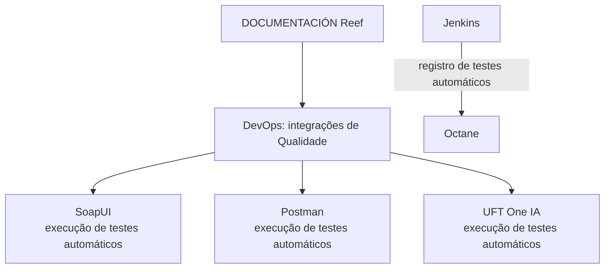

# Certificação de Testing — Integrações de Qualidade em DevOps

## 1. Metadados do Documento
- **Arquivo de Origem:** Não identificado no conteúdo fornecido
- **Tipo de Documento:** Procedimento / Material de treinamento
- **Domínio / Sistema:** Testing em DevOps; Reef; Octane; Jenkins
- **Público-Alvo:** Desenvolvedores, equipes de Qualidade, operação de DevOps
- **Data/Versão Identificada:** Não identificada

---

## 2. Resumo Executivo & Contexto de Negócio

O documento “CERTIFICACIÓN de TESTING - Testing en DevOps” apresenta um módulo cujo objetivo declarado é revisar as integrações de Qualidade disponíveis em DevOps. O conteúdo relaciona ferramentas usadas para execução de testes automáticos e para registro de testes.

As ferramentas explicitamente citadas são SoapUI, Postman e UFT One IA, todas associadas à execução de testes automáticos. O documento também cita o registro de testes automáticos através de Jenkins em Octane.

O material aponta para referências adicionais identificadas como “SOAPUI”, “POSTMAN”, “UFT ONE IA” e “REGISTRO OCTANE”, mas não fornece URLs, procedimentos detalhados, configurações, versões, credenciais, contratos de integração ou exemplos de execução.

O conteúdo está inserido no contexto de “DOCUMENTACIÓN Reef” e apresenta o proprietário `user:agonzalez_mapfre.com`. A fonte mostra estado de ciclo de vida “Approved Source”, porém não detalha critérios de aprovação, governança documental ou responsabilidades operacionais.

---

## 3. Arquitetura, Componentes & Tecnologias Envolvidas

| Componente / Tecnologia | Papel explicitamente indicado |
| :--- | :--- |
| DevOps | Contexto no qual as integrações de Qualidade disponíveis são revisadas. |
| SoapUI | Ferramenta citada para execução de testes automáticos. |
| Postman | Ferramenta citada para execução de testes automáticos. |
| UFT One IA | Ferramenta citada para execução de testes automáticos. |
| Jenkins | Ferramenta citada como meio para registro de testes automáticos em Octane. |
| Octane | Destino citado para o registro de testes automáticos através de Jenkins. |
| Reef | Contexto de documentação identificado como “DOCUMENTACIÓN Reef”. |
| Mapfredocument | Termo exibido na navegação/fonte documental, sem detalhamento adicional. |
| Zeus | Termo exibido na navegação/fonte documental, sem detalhamento adicional. |



> **Nota de Análise:** O documento não descreve como SoapUI, Postman ou UFT One IA se conectam a Jenkins, Octane ou aos sistemas sob teste. Também não detalha pipelines, endpoints, métodos HTTP, arquivos de configuração, contratos JSON, agentes ou credenciais.

---

## 4. Regras de Negócio, Especificações Funcionais & Processos

### Objetivo do módulo
O objetivo declarado é “repasar las integraciones de Calidad disponibles en DevOps”, isto é, revisar as integrações de Qualidade disponíveis no contexto de DevOps.

### Execução de testes automáticos
O documento associa as seguintes ferramentas à execução de testes automáticos:

1. **SoapUI:** execução de testes automáticos com SoapUI.
2. **Postman:** execução de testes automáticos com Postman.
3. **UFT One IA:** execução de testes automáticos com UFT One IA.

### Registro de testes automáticos
O documento define que o registro de testes automáticos é realizado:

1. Através de **Jenkins**.
2. Com destino em **Octane**.

### Referências complementares citadas
O material informa que há mais informações para cada tópico, utilizando as referências nomeadas:

- `SOAPUI`
- `POSTMAN`
- `UFT ONE IA`
- `REGISTRO OCTANE`

> **Nota de Análise:** Os conteúdos dessas referências não foram fornecidos. Portanto, não é possível afirmar procedimentos de configuração, regras de aprovação, critérios de sucesso/falha, formatos de resultado ou mecanismos de autenticação.

---

## 5. Tabelas de Parâmetros, Ambientes e Estruturas de Dados

| Item / Parâmetro | Descrição / Função | Tipo / Valores / Formato | Ambiente / Observações |
| :--- | :--- | :--- | :--- |
| Módulo | Certificação de Testing — Testing em DevOps | Material de treinamento | Objetivo: revisar integrações de Qualidade disponíveis em DevOps. |
| SoapUI | Execução de testes automáticos | Ferramenta de teste citada | Referência adicional indicada como `SOAPUI`. |
| Postman | Execução de testes automáticos | Ferramenta de teste citada | Referência adicional indicada como `POSTMAN`. |
| UFT One IA | Execução de testes automáticos | Ferramenta de teste citada | Referência adicional indicada como `UFT ONE IA`. |
| Jenkins | Registro de testes automáticos em Octane | Ferramenta citada | Não há detalhes de job, pipeline ou configuração. |
| Octane | Registro de testes automáticos provenientes de Jenkins | Plataforma citada | Referência adicional indicada como `REGISTRO OCTANE`. |
| Documentação | DOCUMENTACIÓN Reef | Repositório/contexto documental | Exibe “Approved Source”. |
| Owner | `user:agonzalez_mapfre.com` | Identificador de usuário | Informado no conteúdo bruto. |
| Lifecycle | Approved Source | Estado documental | Não há definição adicional no documento. |
| Idioma exibido | ES | Código exibido na interface | O conteúdo principal está em espanhol. |

---

## 6. Bateria de Perguntas & Respostas para RAG (FAQ Sintético)

### P1: Qual é o objetivo do módulo “CERTIFICACIÓN de TESTING - Testing en DevOps”?
**R:** O objetivo declarado do módulo é revisar as integrações de Qualidade disponíveis em DevOps.

### P2: Quais ferramentas são citadas para execução de testes automáticos?
**R:** O documento cita SoapUI, Postman e UFT One IA como ferramentas para execução de testes automáticos.

### P3: Como o documento descreve o uso de SoapUI?
**R:** SoapUI é descrito como uma ferramenta para execução de testes automáticos. O documento aponta para uma referência adicional identificada como `SOAPUI`, mas não apresenta detalhes de configuração ou execução.

### P4: Qual é a finalidade do Postman no material?
**R:** Postman é citado para execução de testes automáticos. Há uma referência complementar denominada `POSTMAN`, sem conteúdo adicional fornecido na extração.

### P5: Para que UFT One IA é utilizado segundo o documento?
**R:** UFT One IA é citado para execução de testes automáticos. O documento referencia conteúdo adicional chamado `UFT ONE IA`, mas não especifica fluxos, cenários ou parâmetros técnicos.

### P6: Como ocorre o registro de testes automáticos em Octane?
**R:** O documento informa que o registro de testes automáticos em Octane ocorre através de Jenkins. Não são descritos os jobs Jenkins, as integrações técnicas ou os campos registrados em Octane.

### P7: O documento informa URLs ou links diretos para SoapUI, Postman, UFT One IA ou registro em Octane?
**R:** Não. O texto apenas menciona referências denominadas `SOAPUI`, `POSTMAN`, `UFT ONE IA` e `REGISTRO OCTANE`; nenhuma URL é apresentada.

### P8: Qual é o repositório ou contexto documental associado ao material?
**R:** O conteúdo apresenta “DOCUMENTACIÓN Reef” como contexto documental e também exibe os termos “Reef”, “Mapfredocument” e “Zeus” na navegação. O papel técnico de Mapfredocument e Zeus não é detalhado.

### P9: Quem é o proprietário identificado no documento?
**R:** O campo Owner contém o valor `user:agonzalez_mapfre.com`.

### P10: Qual ciclo de vida documental é exibido?
**R:** O documento exibe o estado de ciclo de vida `Approved Source`. Não há explicação sobre seu significado ou processo de aprovação.

---

## 7. Glossário de Termos, Siglas & Conceitos-Chave

- **DevOps:** Contexto no qual o documento revisa integrações de Qualidade.
- **SoapUI:** Ferramenta citada para execução de testes automáticos.
- **Postman:** Ferramenta citada para execução de testes automáticos.
- **UFT One IA:** Ferramenta citada para execução de testes automáticos.
- **Jenkins:** Ferramenta citada como canal para registro de testes automáticos em Octane.
- **Octane:** Plataforma citada como destino do registro de testes automáticos através de Jenkins.
- **Reef:** Nome associado ao contexto “DOCUMENTACIÓN Reef”.
- **Approved Source:** Estado de ciclo de vida exibido no material, sem definição adicional.
- **ES:** Código de idioma exibido na interface de documentação.

---

## 8. Notas Críticas, Riscos & Limitações

- O conteúdo é resumido e não descreve procedimentos completos para nenhuma integração de testes.
- Não há URLs, versões, portas, endpoints, credenciais, configurações de agente ou variáveis de ambiente.
- Não há definição de critérios de aprovação, sucesso, falha, retentativa ou publicação de resultados de testes.
- Não são apresentados métodos HTTP, contratos de API, payloads, coleções Postman, projetos SoapUI ou scripts UFT One IA.
- O fluxo Jenkins → Octane é citado, mas não há detalhes sobre configuração, plugins, autenticação, mapeamento de campos ou tratamento de falhas.
- Os termos Reef, Mapfredocument e Zeus aparecem na fonte, mas suas funções não são detalhadas.

---

## 9. Conteúdo Bruto Estruturado (Referência Fiel)

```text
--- [PÁGINA 1 DE 1] ---

CERTIFICACIÓN de TESTING - Testing en DevOps
OBJETIVO
La nalidad de este módulo es repasar las integraciones de Calidad disponibles en DevOps.
SoapUI
Postman
UFT One IA
Registro en Octane
SoapUI
Ejecución de pruebas automáticas con SoapUI.
Podemos encontrar más información en: SOAPUI
Postman
Ejecución de pruebas automáticas con Postman.
Podemos encontrar más información en: POSTMAN
UFT One IA
Ejecución de pruebas automáticas con UFT One IA.
Podemos encontrar más información en: UFT ONE IA
Registro en Octane
Registro de pruebas automáticas a través de Jenkins en Octane.
Podemos encontrar más información en: REGISTRO OCTANE
Documentation / DOCUMENTACIÓN Reef
DOCUMENTACIÓN Reef
Mapfredocument
DOCUMENTACIÓN Reef
Owner
user:agonzalez_mapfre.com
Lifecycle
Approved Source
 / 
 VL
Buscar Inicio Soluciones Arquitecturas APIs Componentes Cloud Documentación Zeus Reef Ayuda
ES
```
