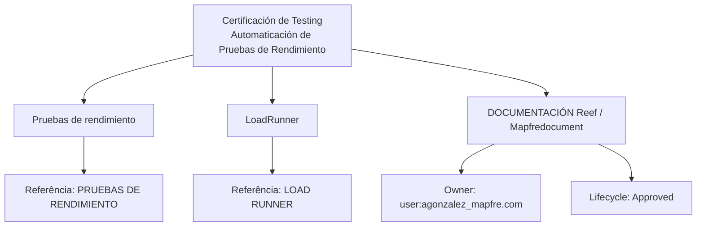

# Certificação de Testing — Automatização de Testes de Desempenho com LoadRunner

## 1. Metadados do Documento
- **Arquivo de Origem:** Não identificado no conteúdo extraído
- **Tipo de Documento:** Apresentação Executiva / Material de Certificação
- **Domínio / Sistema:** DOCUMENTACIÓN Reef / Mapfredocument
- **Público-Alvo:** Profissionais envolvidos em testes, desenvolvedores, equipes de qualidade e operação
- **Data/Versão Identificada:** Não identificada

---

## 2. Resumo Executivo & Contexto de Negócio

O documento apresenta um módulo de certificação de testing dedicado à automatização de testes de desempenho. O objetivo declarado é permitir o entendimento do que são testes de desempenho e revisar as funcionalidades disponibilizadas pela ferramenta LoadRunner.

O conteúdo estrutura o módulo em dois tópicos principais: **Pruebas de rendimiento** e **Load Runner**. Para o primeiro tópico, o material indica que será revisado o conceito de testes de desempenho e referencia uma fonte complementar denominada **PRUEBAS DE RENDIMIENTO**.

Para o segundo tópico, o documento informa que será revisada a funcionalidade da ferramenta LoadRunner, indicando como referência complementar o recurso denominado **LOAD RUNNER**. O conteúdo extraído não detalha cenários de carga, métricas de desempenho, protocolos, scripts, métodos HTTP, configuração de agentes ou resultados de execução.

O material está associado ao ambiente de documentação **Reef**, identificado também como **DOCUMENTACIÓN Reef** e **Mapfredocument**. O estado de ciclo de vida exibido é `Approved`, e o proprietário registrado é `user:agonzalez_mapfre.com`.

---

## 3. Arquitetura, Componentes & Tecnologias Envolvidas

Os elementos identificados são:

| Componente / Elemento | Papel identificado no documento |
| :--- | :--- |
| Certificación de Testing | Módulo ou contexto de certificação relacionado à automatização de testes de desempenho. |
| Pruebas de rendimiento | Tema de revisão conceitual sobre testes de desempenho. |
| LoadRunner | Ferramenta cuja funcionalidade será revisada no módulo. |
| PRUEBAS DE RENDIMIENTO | Referência para informações adicionais sobre testes de desempenho. |
| LOAD RUNNER | Referência para informações adicionais sobre a ferramenta LoadRunner. |
| DOCUMENTACIÓN Reef | Ambiente ou área de documentação onde o conteúdo está publicado. |
| Mapfredocument | Identificador textual exibido junto à documentação. |
| Reef | Área documental mencionada na navegação e no rótulo `DOCUMENTACIÓN Reef`. |
| Owner `user:agonzalez_mapfre.com` | Proprietário identificado para o conteúdo documental. |
| Lifecycle `Approved` | Estado de ciclo de vida do documento. |



**Nota de Análise:** O documento não descreve uma arquitetura de software, integração entre serviços, ambiente de execução, servidores, protocolos de teste ou fluxo operacional do LoadRunner.

---

## 4. Regras de Negócio, Especificações Funcionais & Processos

### Objetivo do módulo
1. Entender em que consistem os testes de desempenho.
2. Revisar as funcionalidades fornecidas pela ferramenta LoadRunner.

### Processo de aprendizagem apresentado
1. Revisar o conceito de **Pruebas de rendimiento**.
2. Consultar a referência adicional denominada **PRUEBAS DE RENDIMIENTO** para obter mais informações.
3. Revisar a funcionalidade da ferramenta **LoadRunner**.
4. Consultar a referência adicional denominada **LOAD RUNNER** para obter mais informações.

### Restrições de informação
- O documento não define critérios de aprovação ou reprovação de testes de desempenho.
- O documento não especifica métricas como tempo de resposta, throughput, taxa de erro, usuários concorrentes, percentis ou consumo de recursos.
- O documento não descreve automações, scripts, cenários, integrações ou procedimentos de operação da ferramenta LoadRunner.
- O documento não apresenta regras de negócio corporativas além do objetivo educacional do módulo.

---

## 5. Tabelas de Parâmetros, Ambientes e Estruturas de Dados

| Item / Parâmetro | Descrição / Função | Tipo / Valores / Formato | Ambiente / Observações |
| :--- | :--- | :--- | :--- |
| Objetivo | Entender testes de desempenho e revisar funcionalidades do LoadRunner. | Texto descritivo | Módulo de certificação de testing |
| Pruebas de rendimiento | Tema que será revisado no módulo. | Tópico de conteúdo | Referência adicional: `PRUEBAS DE RENDIMIENTO` |
| LoadRunner | Ferramenta cuja funcionalidade será revisada. | Ferramenta de testes de desempenho | Referência adicional: `LOAD RUNNER` |
| Documentation | Rótulo de navegação documental. | Texto | Exibido como `Documentation / DOCUMENTACIÓN Reef` |
| DOCUMENTACIÓN Reef | Área ou contexto documental identificado no conteúdo. | Sistema / área documental | Associado a Reef |
| Mapfredocument | Identificador exibido junto à documentação. | Texto / identificador | Sem detalhamento adicional |
| Owner | Proprietário do documento. | `user:agonzalez_mapfre.com` | Metadado documental |
| Lifecycle | Estado de ciclo de vida do documento. | `Approved` | Metadado documental |
| Source | Campo exibido no conteúdo. | Não detalhado | O trecho mostra `Source / VL` |
| Idioma | Idioma indicado na navegação. | `ES` | Interface exibida em espanhol |
| Navegação | Opções apresentadas na página documental. | Buscar, Inicio, Soluciones, Arquitecturas, APIs, Componentes, Cloud, Documentación, Zeus, Reef, Ayuda | Interface de DOCUMENTACIÓN Reef |

---

## 6. Bateria de Perguntas & Respostas para RAG (FAQ Sintético)

### P1: Qual é o objetivo da certificação de testing apresentada no documento?
**R:** O objetivo do módulo é entender em que consistem os testes de desempenho e revisar as funcionalidades oferecidas pela ferramenta LoadRunner.

### P2: Quais são os dois tópicos principais abordados no módulo?
**R:** O módulo aborda os tópicos **Pruebas de rendimiento** e **LoadRunner**.

### P3: O que será revisado no tópico “Pruebas de rendimiento”?
**R:** O documento informa que será revisado em que consistem os testes de desempenho. Para informações adicionais, o material aponta a referência denominada `PRUEBAS DE RENDIMIENTO`.

### P4: Qual ferramenta de testes de desempenho é mencionada no documento?
**R:** A ferramenta mencionada é o **LoadRunner**. O documento afirma que a funcionalidade da ferramenta será revisada durante o módulo.

### P5: Onde o documento indica que podem ser encontradas informações adicionais sobre testes de desempenho?
**R:** O documento orienta a buscar mais informações na referência identificada como `PRUEBAS DE RENDIMIENTO`.

### P6: Onde o documento indica que podem ser encontradas informações adicionais sobre LoadRunner?
**R:** O documento orienta a buscar mais informações na referência identificada como `LOAD RUNNER`.

### P7: O documento descreve métricas ou critérios de aceitação para testes de desempenho?
**R:** Não. O conteúdo extraído não apresenta métricas, limites de tempo de resposta, volume de usuários, throughput, taxa de erro, percentis, critérios de aceitação ou procedimentos de análise de resultados.

### P8: Quem é o proprietário registrado da documentação?
**R:** O proprietário registrado no conteúdo é `user:agonzalez_mapfre.com`.

### P9: Qual é o estado de ciclo de vida identificado para o documento?
**R:** O campo `Lifecycle` está identificado com o valor `Approved`.

### P10: Em qual contexto documental o material está apresentado?
**R:** O material está associado a `DOCUMENTACIÓN Reef`, também exibido junto ao identificador textual `Mapfredocument`.

---

## 7. Glossário de Termos, Siglas & Conceitos-Chave

- **Certificación de Testing:** Módulo de certificação relacionado a testes, conforme o título do documento.
- **Automaticación de Pruebas de Rendimiento:** Automatização de testes de desempenho, tema central do material.
- **Pruebas de rendimiento:** Testes de desempenho; tópico que será revisado no módulo.
- **LoadRunner:** Ferramenta mencionada para revisão de funcionalidades no contexto de testes de desempenho.
- **DOCUMENTACIÓN Reef:** Área ou contexto de documentação em que o material está apresentado.
- **Mapfredocument:** Identificador textual exibido no conteúdo documental.
- **Owner:** Campo que identifica o proprietário da documentação.
- **Lifecycle:** Campo que identifica o estado de ciclo de vida do documento.
- **Approved:** Valor exibido para o estado de ciclo de vida.
- **ES:** Indicador de idioma exibido na navegação, correspondente ao espanhol.

---

## 8. Notas Críticas, Riscos & Limitações

- **Nota de Análise:** O conteúdo é resumido e não fornece detalhamento técnico sobre o uso do LoadRunner.
- O documento não apresenta versão da ferramenta LoadRunner, sistema operacional, licenciamento, protocolos suportados, configuração de controladores, geradores de carga ou arquitetura de execução.
- O documento não descreve os métodos de automatização de testes de desempenho.
- O documento não especifica requisitos de entrada, resultados esperados, indicadores de desempenho ou limiares de aprovação.
- As referências `PRUEBAS DE RENDIMIENTO` e `LOAD RUNNER` são citadas, mas seus conteúdos, URLs e localizações não estão presentes no texto extraído.
- O campo `Source / VL` aparece de forma incompleta e não permite determinar com fidelidade seu significado.

---

## 9. Conteúdo Bruto Estruturado (Referência Fiel)

```text
--- [PÁGINA 1 DE 1] ---

CERTIFICACIÓN de TESTING - Automaticación de Pruebas de
Rendimiento
OBJETIVO
La finalidad de este módulo es entender en qué consisten las pruebas de rendimiento, y repasar las funcionalidades que proporciona la
herramienta Load Runner.
Pruebas de rendimiento
Load Runner
Pruebas de rendimiento
Se revisará en qué consisten las pruebas de rendimiento.
Podemos encontrar más información en: PRUEBAS DE RENDIMIENTO
Load Runner
Se revisará la funcionalidad de la herramienta Load Runner.
Podemos encontrar más información en: LOAD RUNNER
Documentation / DOCUMENTACIÓN Reef
DOCUMENTACIÓN Reef
Mapfredocument
DOCUMENTACIÓN Reef
Owner
user:agonzalez_mapfre.com
Lifecycle
Approved Source
 /
 VL
Buscar Inicio Soluciones Arquitecturas APIs Componentes Cloud Documentación Zeus Reef Ayuda
ES
```
