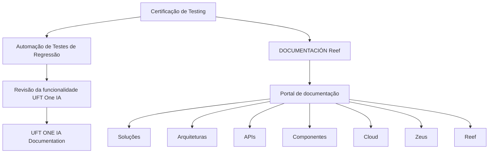

# Certificação de Testing — Automação de Testes de Regressão com UFT One IA

## 1. Metadados do Documento
- **Arquivo de Origem:** `Não identificado`
- **Tipo de Documento:** `Apresentação Executiva / Material de Treinamento`
- **Domínio / Sistema:** `Certificação de Testing; automação de testes de regressão; UFT One IA; documentação Reef`
- **Público-Alvo:** `Profissionais de testes, desenvolvedores e equipes envolvidas com automação de testes de regressão`
- **Data/Versão Identificada:** `Não identificada`

---

## 2. Resumo Executivo & Contexto de Negócio

O conteúdo apresenta um módulo de certificação de testing voltado à automação de testes de regressão. O objetivo declarado é revisar ferramentas utilizadas para automatizar testes de regressão.

A ferramenta explicitamente citada no material é o **UFT One IA**. O documento informa que a funcionalidade da ferramenta UFT One IA será revisada, sem detalhar recursos específicos, configurações, fluxos de execução, linguagens, integrações ou critérios de aprovação dos testes.

O material também aponta para fontes de documentação adicionais, incluindo uma referência denominada **“UFT ONE IA Documentation”** e páginas de **DOCUMENTACIÓN Reef**. A navegação exibida inclui áreas como Soluções, Arquiteturas, APIs, Componentes, Cloud, Documentação, Zeus, Reef e Ajuda.

O conteúdo disponível é resumido e não apresenta uma arquitetura técnica completa de automação, contratos de integração, pipelines de CI/CD, ambientes de execução ou procedimentos operacionais detalhados.

---

## 3. Arquitetura, Componentes & Tecnologias Envolvidas

### Componentes e referências identificados

| Componente / Referência | Papel identificado no conteúdo | Detalhamento disponível |
| :--- | :--- | :--- |
| Certificação de Testing | Contexto do módulo apresentado | O material trata de automação de testes de regressão. |
| Automação de Testes de Regressão | Tema e objetivo do módulo | Não há definição de escopo, cobertura, periodicidade ou critérios de sucesso. |
| UFT One IA | Ferramenta cuja funcionalidade será revisada | Não são descritas funcionalidades, versões, métodos ou integrações. |
| UFT ONE IA Documentation | Fonte adicional de informação | A URL ou o conteúdo da documentação não são apresentados. |
| DOCUMENTACIÓN Reef | Área de documentação referenciada | O texto mostra uma navegação de portal/documentação. |
| Reef | Nome presente na documentação e no menu de navegação | Não há descrição funcional ou arquitetural de Reef. |
| Mapfredocument | Referência exibida no portal | Não há detalhamento sobre finalidade ou integração. |
| Zeus | Item presente no menu de navegação | Não há detalhamento adicional. |
| `user:agonzalez_mapfre.com` | Owner exibido no portal de documentação | O documento não explica responsabilidades, equipe ou permissões associadas. |
| Lifecycle: Approved | Estado exibido no portal | O texto sugere que o conteúdo está aprovado, sem definir o processo de aprovação. |
| Source: VL | Campo exibido no portal | O significado de `VL` não é explicado. |

### Fluxo conceitual identificado



> **Nota de Análise:** O diagrama representa apenas relações explicitamente sugeridas pelo texto. O documento não descreve uma arquitetura de software, comunicação entre serviços, interfaces, protocolos, bancos de dados ou pipeline de execução de testes.

---

## 4. Regras de Negócio, Especificações Funcionais & Processos

### Objetivo funcional declarado

1. O módulo tem como finalidade revisar ferramentas de automação de testes de regressão.
2. A funcionalidade da ferramenta **UFT One IA** será revisada.
3. O material direciona o leitor para documentação adicional relacionada ao UFT One IA.
4. O material também apresenta referências à documentação Reef.

### Processo identificado

| Etapa | Descrição |
| :--- | :--- |
| 1 | Acessar ou participar do módulo de certificação de testing. |
| 2 | Revisar ferramentas de automação de testes de regressão. |
| 3 | Revisar a funcionalidade da ferramenta UFT One IA. |
| 4 | Consultar a referência “UFT ONE IA Documentation” para informações adicionais. |
| 5 | Consultar a área DOCUMENTACIÓN Reef quando aplicável. |

> **Nota de Análise:** O documento não informa como criar testes no UFT One IA, como executar suítes de regressão, quais aplicações são cobertas, quais são os dados de teste, como registrar evidências, quais falhas bloqueiam uma liberação ou como os resultados devem ser reportados.

---

## 5. Tabelas de Parâmetros, Ambientes e Estruturas de Dados

| Item / Parâmetro | Descrição / Função | Tipo / Valores / Formato | Ambiente / Observações |
| :--- | :--- | :--- | :--- |
| Objetivo do módulo | Revisar ferramentas de automação de testes de regressão | Texto descritivo | Associado à certificação de testing |
| Ferramenta revisada | UFT One IA | Nome de ferramenta | Não há versão identificada |
| Documentação adicional | UFT ONE IA Documentation | Referência documental | URL não informada |
| Área documental | DOCUMENTACIÓN Reef | Portal ou seção de documentação | Não há URL identificada |
| Owner | `user:agonzalez_mapfre.com` | Identificador de usuário exibido | Não há descrição de responsabilidades |
| Lifecycle | Approved | Estado do conteúdo | Processo de ciclo de vida não detalhado |
| Source | VL | Campo de origem | Significado de `VL` não identificado |
| Idioma da interface | ES | Código/indicador exibido | Provavelmente relacionado a Espanhol; o documento não define explicitamente |
| Menus visíveis | Buscar, Inicio, Soluciones, Arquitecturas, APIs, Componentes, Cloud, Documentación, Zeus, Reef, Ayuda | Itens de navegação | Exibidos no portal/documentação |

---

## 6. Bateria de Perguntas & Respostas para RAG (FAQ Sintético)

### P1: Qual é o objetivo do módulo de Certificação de Testing?
**R:** O objetivo do módulo é revisar ferramentas de automação de testes de regressão. O texto não detalha um escopo de aplicação, produto, sistema ou processo de certificação adicional.

### P2: Qual ferramenta de automação é citada no material?
**R:** A ferramenta citada é o **UFT One IA**. O documento informa que a funcionalidade dessa ferramenta será revisada.

### P3: O documento explica como configurar ou executar testes com UFT One IA?
**R:** Não. O documento apenas informa que a funcionalidade do UFT One IA será revisada. Não apresenta instruções de instalação, configuração, criação de scripts, execução de testes ou análise de resultados.

### P4: Onde o documento orienta buscar mais informações sobre UFT One IA?
**R:** O material indica a referência **“UFT ONE IA Documentation”** como fonte de informação adicional. Entretanto, não apresenta uma URL, caminho de acesso ou conteúdo dessa documentação.

### P5: Qual é a relação entre a documentação Reef e o módulo de automação de testes?
**R:** O conteúdo apresenta referências à **DOCUMENTACIÓN Reef** no mesmo material. Contudo, não descreve tecnicamente como Reef se integra ao UFT One IA ou ao processo de automação de testes de regressão.

### P6: Quais áreas aparecem no menu da documentação apresentada?
**R:** O menu exibido contém os itens: Buscar, Inicio, Soluciones, Arquitecturas, APIs, Componentes, Cloud, Documentación, Zeus, Reef e Ayuda.

### P7: Quem é identificado como owner do conteúdo exibido?
**R:** O campo **Owner** apresenta o valor `user:agonzalez_mapfre.com`. O documento não explica se esse identificador representa uma pessoa, conta técnica, responsável funcional ou responsável pela documentação.

### P8: Qual é o estado de ciclo de vida mostrado para o documento?
**R:** O campo **Lifecycle** contém o valor **Approved**. O texto não informa os critérios, responsáveis ou etapas que levaram à aprovação.

### P9: Existe informação sobre ambientes, servidores, URLs ou credenciais?
**R:** Não. O conteúdo não fornece ambientes de desenvolvimento, homologação ou produção, endereços de servidores, portas, URLs, credenciais ou parâmetros de conexão.

### P10: O documento define critérios de aprovação para testes de regressão?
**R:** Não. Embora o material trate de automação de testes de regressão, não apresenta critérios de aprovação, metas de cobertura, limites de falha, regras de bloqueio ou formatos de evidência.

---

## 7. Glossário de Termos, Siglas & Conceitos-Chave

- **Automação de Testes de Regressão:** Tema central do módulo; o documento não apresenta uma definição formal.
- **Certificação de Testing:** Contexto de treinamento ou certificação mencionado no título do material.
- **UFT One IA:** Ferramenta de automação cuja funcionalidade será revisada. O documento não expande a sigla ou descreve recursos técnicos.
- **UFT ONE IA Documentation:** Referência documental indicada para obter mais informações sobre UFT One IA.
- **DOCUMENTACIÓN Reef:** Área ou referência de documentação exibida no material.
- **Reef:** Nome presente em referências de documentação e navegação; não definido no conteúdo.
- **Zeus:** Item de menu exibido; não definido no conteúdo.
- **Lifecycle:** Campo de ciclo de vida exibido com o valor `Approved`.
- **Approved:** Estado apresentado para o ciclo de vida do conteúdo.
- **Source:** Campo de origem exibido com o valor `VL`.
- **VL:** Valor associado ao campo Source; significado não identificado no texto.

---

## 8. Notas Críticas, Riscos & Limitações

- O documento contém conteúdo resumido e não detalha a implementação da automação de testes de regressão.
- Não há informações sobre versão, licenciamento, instalação, arquitetura ou pré-requisitos do UFT One IA.
- Não há contratos, APIs, integrações, métodos HTTP, formatos de dados ou fluxos de comunicação descritos.
- Não há definição de ambientes, servidores, URLs, pipelines de CI/CD, repositórios ou mecanismos de execução automatizada.
- Não há critérios de cobertura, aprovação, reprovação, priorização ou tratamento de falhas de regressão.
- A referência **“UFT ONE IA Documentation”** é mencionada, mas o material não fornece URL ou caminho de acesso.
- Os termos **Reef**, **Zeus**, **Mapfredocument** e **VL** aparecem sem detalhamento contextual suficiente.
- O texto extraído contém o caractere inválido ou corrompido `` na palavra `nalidad`, preservado na transcrição bruta para fidelidade de auditoria.

---

## 9. Conteúdo Bruto Estruturado (Referência Fiel)

```text
--- [PÁGINA 1 DE 1] ---

CERTIFICACIÓN de TESTING - Automaticación de Pruebas de
Regresión
OBJETIVO
La nalidad de este módulo es repasar las herramientas de automatización de pruebas de regresión.
Automatización con UFT One IA
Automatización con UFT One IA
Se revisará la funcionalidad de la herramienta UFT One IA.
Podemos encontrar más información en: UFT ONE IA
Documentation / DOCUMENTACIÓN Reef
DOCUMENTACIÓN Reef
Mapfredocument
DOCUMENTACIÓN Reef
Owner
user:agonzalez_mapfre.com
Lifecycle
Approved Source
 / 
 VL
Buscar Inicio Soluciones Arquitecturas APIs Componentes Cloud Documentación Zeus Reef Ayuda
ES
```
