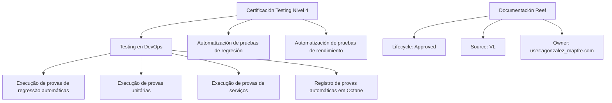

# Certificación Testing Nivel 4 — Temário de Testing em DevOps e Documentação Reef

## 1. Metadados do Documento
- **Arquivo de Origem:** Não identificado no conteúdo extraído
- **Tipo de Documento:** Apresentação Executiva / Material de Certificação
- **Domínio / Sistema:** Testing em DevOps; Reef; Octane; Mapfredocument
- **Público-Alvo:** Profissionais envolvidos com testes, DevOps e documentação
- **Data/Versão Identificada:** Não identificada

---

## 2. Resumo Executivo & Contexto de Negócio

O conteúdo apresenta a **Certificación Testing Nivel 4**, centrada em atividades de testing no contexto de DevOps. O material indica que existe um temário destinado à execução de provas de regressão automáticas, provas unitárias, provas de serviços e ao registro de provas automáticas em Octane.

A apresentação também relaciona o conteúdo de certificação a dois tópicos específicos: **automatização de provas de regressão** e **automatização de provas de rendimento**. Para ambos, o documento afirma que há um temário, mas não fornece procedimentos, ferramentas, métricas, critérios de aceite, comandos ou configurações técnicas.

O documento referencia a área de **Documentación Reef**, com status de ciclo de vida indicado como **Approved** e origem identificada como **VL**. Também há referência visual a navegação por soluções, arquiteturas, APIs, componentes, cloud, documentação, Zeus, Reef e ajuda.

> *Nota de Análise: O documento enumera atividades de testes em DevOps e automação de testes, porém não detalha fluxos de execução, tecnologias utilizadas, contratos de integração, métodos HTTP, pipelines de CI/CD, ambientes ou configurações de Octane.*

---

## 3. Arquitetura, Componentes & Tecnologias Envolvidas

Os componentes e contextos explicitamente citados são:

- **Testing en DevOps:** contexto do temário e das tarefas de teste.
- **Pruebas de regresión automáticas:** atividade de execução e tema de automação.
- **Pruebas unitarias:** atividade de execução.
- **Pruebas de servicios:** atividade de execução.
- **Octane:** destino ou ferramenta para registro de provas automáticas.
- **Automatización de pruebas de rendimiento:** tema de automação de testes de rendimento.
- **Reef:** área ou domínio de documentação.
- **Mapfredocument:** termo presente no conteúdo de documentação.
- **Zeus:** item citado na navegação da documentação.



> *Nota de Análise: O diagrama representa exclusivamente relações explícitas de agrupamento e referência presentes no texto. O conteúdo não descreve integrações técnicas entre Reef, Octane, Mapfredocument ou Zeus.*

---

## 4. Regras de Negócio, Especificações Funcionais & Processos

### 4.1 Escopo de Testing em DevOps

O temário de **Testing en DevOps** é apresentado como suporte para realizar as seguintes tarefas:

1. Execução de provas de regressão automáticas.
2. Execução de provas unitárias.
3. Execução de provas de serviços.
4. Registro de provas automáticas em Octane.

### 4.2 Automação de Provas de Regressão

O documento informa que há um temário para **automatización de pruebas de regresión**.

Não são apresentados:

- Critérios para selecionar cenários de regressão.
- Frameworks, linguagens ou ferramentas de automação.
- Dados de teste.
- Ambientes de execução.
- Gatilhos de pipeline.
- Evidências esperadas.
- Critérios de aprovação ou reprovação.
- Estratégias de tratamento de falhas.

### 4.3 Automação de Provas de Rendimento

O documento informa que há um temário para **automatización de pruebas de rendimiento**.

Não são apresentados:

- Indicadores de desempenho.
- Metas de tempo de resposta.
- Limites de carga, concorrência, throughput ou disponibilidade.
- Ferramentas de carga ou monitoramento.
- Topologias de ambiente.
- Critérios de aceite de desempenho.
- Processo de registro de resultados.

### 4.4 Registro de Provas Automáticas em Octane

O conteúdo estabelece que o registro de provas automáticas em **Octane** faz parte das tarefas abordadas pelo temário de Testing em DevOps.

> *Nota de Análise: O documento não esclarece se Octane é utilizado para execução, gestão, armazenamento de evidências, rastreabilidade ou reporte de testes. Também não são especificados campos obrigatórios, integrações, permissões ou fluxos de aprovação.*

---

## 5. Tabelas de Parâmetros, Ambientes e Estruturas de Dados

| Item / Parâmetro | Descrição / Função | Tipo / Valores / Formato | Ambiente / Observações |
| :--- | :--- | :--- | :--- |
| Certificación Testing nivel 4 | Certificação ou material identificado no documento | Título | Não há versão ou data informada |
| Testing en DevOps | Seção que contém temário para tarefas de teste | Área / contexto | Relacionado a regressão automática, testes unitários, testes de serviços e Octane |
| Pruebas de regresión automáticas | Tarefa de execução abordada pelo temário | Tipo de teste | Também possui tópico específico de automatização |
| Pruebas unitarias | Tarefa de execução abordada pelo temário | Tipo de teste | Sem detalhamento adicional |
| Pruebas de servicios | Tarefa de execução abordada pelo temário | Tipo de teste | Sem detalhamento adicional |
| Octane | Ferramenta ou destino mencionado para registro de provas automáticas | Sistema / ferramenta | Finalidade detalhada não informada |
| Automatización de pruebas de regresión | Tópico de temário sobre automação de regressão | Tema de capacitação | Sem ferramentas, cenários ou regras descritas |
| Automatización de pruebas de rendimiento | Tópico de temário sobre automação de rendimento | Tema de capacitação | Sem métricas ou critérios técnicos descritos |
| Documentation / DOCUMENTACIÓN Reef | Área documental citada | Repositório ou seção documental | Interface exibida em idioma ES |
| Owner | Proprietário indicado para a documentação Reef | Identificador de usuário | `user:agonzalez_mapfre.com` |
| Lifecycle | Estado do ciclo de vida da documentação | Status | `Approved` |
| Source | Origem identificada na documentação | Código / referência | `VL` |
| Mapfredocument | Termo exibido no conteúdo documental | Sistema ou identificador não detalhado | Não há explicação adicional |
| Zeus | Item de navegação mencionado | Área ou sistema não detalhado | Não há explicação adicional |
| Idioma | Idioma exibido na navegação | Código de idioma | `ES` |

---

## 6. Bateria de Perguntas & Respostas para RAG (FAQ Sintético)

### P1: Qual é o foco da Certificación Testing nivel 4?
**R:** A Certificación Testing nivel 4 aborda Testing em DevOps. O conteúdo indica um temário para execução de provas de regressão automáticas, provas unitárias, provas de serviços e registro de provas automáticas em Octane.

### P2: Quais tarefas de teste são citadas no temário de Testing en DevOps?
**R:** O temário cita quatro tarefas: execução de provas de regressão automáticas, execução de provas unitárias, execução de provas de serviços e registro de provas automáticas em Octane.

### P3: O documento informa como automatizar testes de regressão?
**R:** Não. O documento apenas afirma que existe um temário para automatização de provas de regressão. Não informa ferramentas, linguagens, cenários, dados de teste, critérios de aprovação ou etapas operacionais.

### P4: O documento define métricas para testes de rendimento?
**R:** Não. O documento menciona um temário para automatização de provas de rendimento, mas não apresenta métricas de desempenho, metas, volume de carga, concorrência, tempos de resposta ou critérios de aceite.

### P5: Qual é o papel de Octane descrito no material?
**R:** Octane é mencionado como o local ou ferramenta para registro de provas automáticas no contexto de Testing em DevOps. O documento não detalha o processo de registro, os campos necessários, os tipos de evidência ou as integrações envolvidas.

### P6: O material descreve um pipeline CI/CD para execução dos testes?
**R:** Não. Embora o documento trate de Testing em DevOps, ele não descreve pipeline CI/CD, gatilhos de execução, estágios de build, ambientes, artefatos, aprovações ou mecanismos de publicação de resultados.

### P7: Quem é o proprietário indicado para a documentação Reef?
**R:** O proprietário indicado no conteúdo de Documentación Reef é `user:agonzalez_mapfre.com`.

### P8: Qual é o status do ciclo de vida da documentação Reef?
**R:** O campo `Lifecycle` da documentação Reef está identificado como `Approved`.

### P9: Qual origem está associada à documentação Reef?
**R:** A documentação Reef apresenta `VL` como valor do campo `Source`.

### P10: Quais áreas aparecem na navegação da documentação?
**R:** A navegação exibida contém Buscar, Inicio, Soluciones, Arquitecturas, APIs, Componentes, Cloud, Documentación, Zeus, Reef e Ayuda.

---

## 7. Glossário de Termos, Siglas & Conceitos-Chave

- **Testing en DevOps:** seção de temário relacionada a tarefas de testes no contexto de DevOps.
- **DevOps:** termo citado como contexto para atividades de testing; o documento não fornece expansão ou definição formal.
- **Pruebas de regresión automáticas:** provas de regressão executadas de forma automática, conforme terminologia do documento.
- **Pruebas unitarias:** provas unitárias citadas como atividade do temário.
- **Pruebas de servicios:** provas de serviços citadas como atividade do temário.
- **Octane:** sistema ou ferramenta citado para registro de provas automáticas; sua função detalhada não é definida.
- **Automatización de pruebas de rendimiento:** tema de automação de provas de rendimento; métricas e ferramentas não são especificadas.
- **Reef:** área ou domínio de documentação citado no material.
- **Mapfredocument:** termo exibido na seção de documentação, sem definição adicional.
- **Zeus:** item citado na navegação documental, sem definição adicional.
- **Lifecycle:** campo que indica o ciclo de vida da documentação; o valor apresentado é `Approved`.
- **Source:** campo de origem da documentação; o valor apresentado é `VL`.
- **ES:** código exibido para o idioma da interface.

---

## 8. Notas Críticas, Riscos & Limitações

- O conteúdo extraído é resumido e não apresenta procedimentos técnicos executáveis para nenhum tipo de teste.
- Não há informação sobre ferramentas de automação além da referência a Octane para registro de provas automáticas.
- Não há URLs, nomes de ambientes, servidores, portas, credenciais, repositórios, pipelines, branches ou parâmetros de execução.
- Não são definidos critérios de sucesso, falha, cobertura, qualidade, desempenho ou aprovação de testes.
- Não há contratos de serviços, métodos HTTP, esquemas JSON, dados de teste ou dependências externas documentadas.
- Os termos Reef, Mapfredocument e Zeus são mencionados sem descrição funcional ou arquitetural.
- A documentação Reef aparece com ciclo de vida `Approved`, porém o documento não explica a governança, responsáveis por aprovação ou processo de atualização.

---

## 9. Conteúdo Bruto Estruturado (Referência Fiel)

```text
--- [PÁGINA 1 DE 1] ---

CERTIFICACIÓN - TESTING NIVEL 4
CERTIFICACIÓN Testing nivel 4
TESTING EN DEVOPS
En este apartado se encuentra el temario
para poder realizar las siguientes tareas
en DevOps: ejecución de pruebas de
regresión automáticas, ejecución de
pruebas unitarias y de servicios, y registro
de pruebas automáticas en Octane
AUTOMATIZACIÓN DE PRUEBAS DE
REGRESIÓN
En este apartado se encuentra el temario
para la automatización de pruebas de
regresión
AUTOMATIZACIÓN DE PRUEBAS DE
RENDIMIENTO
En este apartado se encuentra el temario
para la automatización de pruebas de
rendimiento
Documentation / DOCUMENTACIÓN Reef
DOCUMENTACIÓN Reef
Mapfredocument
DOCUMENTACIÓN Reef
Owner
user:agonzalez_mapfre.com
Lifecycle
Approved Source
 / 
 VL
Buscar Inicio Soluciones Arquitecturas APIs Componentes Cloud Documentación Zeus Reef Ayuda
ES
```
