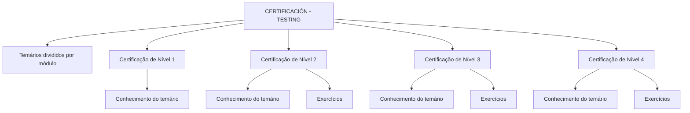

# Certificação de Testing — Temários por Nível de Certificação de Qualidade

## 1. Metadados do Documento
- **Arquivo de Origem:** `Não identificado no conteúdo fornecido`
- **Tipo de Documento:** `Procedimento / Documento de certificação`
- **Domínio / Sistema:** `Testing, Certificação de Qualidade, Reef`
- **Público-Alvo:** `Profissionais que buscam certificação de Qualidade`
- **Data/Versão Identificada:** `Não identificada`

---

## 2. Resumo Executivo & Contexto de Negócio

O documento apresenta a seção **CERTIFICACIÓN - TESTING**, destinada a organizar os temários exigidos para os níveis de certificação de Qualidade. Os temários são informados como divididos por módulo.

A estrutura contempla quatro níveis de certificação: Nível 1, Nível 2, Nível 3 e Nível 4. Cada nível possui um temário que o candidato deve conhecer para obter a certificação correspondente.

O Nível 1 menciona somente o conhecimento do temário necessário para a primeira certificação de Qualidade. Os níveis 2, 3 e 4 acrescentam a necessidade de exercícios, além do conhecimento do temário, para obtenção de cada nível.

O conteúdo está associado à área de documentação **Reef**, com indicação de ciclo de vida **Approved**, fonte **VL** e proprietário identificado como `user:agonzalez_mapfre.com`. O documento não especifica os módulos, os exercícios, critérios de aprovação, métodos de avaliação ou pré-requisitos entre os níveis.

---

## 3. Arquitetura, Componentes & Tecnologias Envolvidas

Os elementos identificados no conteúdo são:

- **CERTIFICACIÓN - TESTING:** seção que reúne os temários de certificação.
- **Certificação de Qualidade:** objetivo dos quatro níveis apresentados.
- **Níveis 1 a 4:** progressão de certificações.
- **Temários por módulo:** organização declarada para os conteúdos de certificação.
- **Exercícios:** requisito adicional explicitamente mencionado para os níveis 2, 3 e 4.
- **Reef:** área de documentação associada ao conteúdo.
- **Mapfredocument:** item presente na navegação/documentação.
- **VL:** fonte indicada no cabeçalho de ciclo de vida.
- **Zeus:** item presente no menu de navegação.



> **Nota de Análise:** o conteúdo não descreve arquitetura de software, integrações, APIs, tecnologias de implementação ou fluxos automatizados de avaliação.

---

## 4. Regras de Negócio, Especificações Funcionais & Processos

1. A seção de certificação de Testing contém os temários de cada nível de certificação.
2. Os temários estão divididos por módulo.
3. Para obter a **Certificação de Nível 1**, é necessário conhecer o temário do primeiro nível de certificação de Qualidade.
4. Para obter a **Certificação de Nível 2**, é necessário conhecer o temário e realizar exercícios relacionados ao segundo nível de certificação de Qualidade.
5. Para obter a **Certificação de Nível 3**, é necessário conhecer o temário e realizar exercícios relacionados ao terceiro nível de certificação de Qualidade.
6. Para obter a **Certificação de Nível 4**, é necessário conhecer o temário e realizar exercícios relacionados ao quarto nível de certificação de Qualidade.
7. O documento não estabelece critérios objetivos de aprovação, nota mínima, quantidade de exercícios, ordem obrigatória entre certificações ou regras de recertificação.

---

## 5. Tabelas de Parâmetros, Ambientes e Estruturas de Dados

| Item / Parâmetro | Descrição / Função | Tipo / Valores / Formato | Ambiente / Observações |
| :--- | :--- | :--- | :--- |
| Área principal | Seção de certificação relacionada a Testing | `CERTIFICACIÓN - TESTING` | Temários divididos por módulo |
| Certificação de Nível 1 | Primeiro nível de certificação de Qualidade | Conhecimento do temário | Não há menção a exercícios |
| Certificação de Nível 2 | Segundo nível de certificação de Qualidade | Conhecimento do temário + exercícios | Não há detalhamento dos exercícios |
| Certificação de Nível 3 | Terceiro nível de certificação de Qualidade | Conhecimento do temário + exercícios | Não há detalhamento dos exercícios |
| Certificação de Nível 4 | Quarto nível de certificação de Qualidade | Conhecimento do temário + exercícios | Não há detalhamento dos exercícios |
| Organização do conteúdo | Estrutura declarada para os temários | Divisão por módulo | Módulos não identificados |
| Documentação | Área documental associada | `Reef` | Também aparece como `DOCUMENTACIÓN Reef` |
| Owner | Proprietário indicado no conteúdo | `user:agonzalez_mapfre.com` | Valor literal exibido |
| Lifecycle | Estado do ciclo de vida | `Approved` | Valor literal exibido |
| Source | Fonte indicada | `VL` | Valor literal exibido |
| Navegação | Itens de menu exibidos | Buscar, Inicio, Soluciones, Arquitecturas, APIs, Componentes, Cloud, Documentación, Zeus, Reef, Ayuda | Interface em espanhol; idioma exibido: `ES` |

---

## 6. Bateria de Perguntas & Respostas para RAG (FAQ Sintético)

### P1: Qual é o objetivo da seção CERTIFICACIÓN - TESTING?
**R:** A seção CERTIFICACIÓN - TESTING reúne os temários de cada nível de certificação de Qualidade. O documento informa que os temários são divididos por módulo.

### P2: Quantos níveis de certificação de Qualidade são apresentados?
**R:** O documento apresenta quatro níveis: Certificação de Nível 1, Certificação de Nível 2, Certificação de Nível 3 e Certificação de Nível 4.

### P3: O que é necessário para obter a Certificação de Nível 1?
**R:** Para a Certificação de Nível 1, o documento informa que é necessário conhecer o temário exigido para obter o primeiro nível de certificação de Qualidade.

### P4: A Certificação de Nível 2 exige exercícios?
**R:** Sim. O documento informa que, para obter a Certificação de Nível 2, é necessário conhecer o temário e realizar exercícios relacionados ao segundo nível de certificação de Qualidade.

### P5: Quais níveis incluem temário e exercícios?
**R:** Os níveis 2, 3 e 4 incluem conhecimento do temário juntamente com exercícios. O Nível 1 menciona somente o conhecimento do temário.

### P6: O documento detalha quais módulos compõem os temários de certificação?
**R:** Não. O documento declara que os temários são divididos por módulo, mas não identifica os nomes, conteúdos ou sequência dos módulos.

### P7: Existem critérios de aprovação, notas mínimas ou quantidade de exercícios no documento?
**R:** Não. O conteúdo não informa critérios de aprovação, notas mínimas, quantidade de exercícios, prazos, avaliações ou evidências exigidas.

### P8: Qual é a área de documentação associada ao conteúdo de certificação?
**R:** A documentação está associada a **Reef**, exibida no conteúdo como `Documentation / DOCUMENTACIÓN Reef` e `DOCUMENTACIÓN Reef`.

### P9: Qual é o ciclo de vida indicado para o documento?
**R:** O ciclo de vida indicado é `Approved`.

### P10: Quem é identificado como proprietário do documento?
**R:** O proprietário exibido no conteúdo é `user:agonzalez_mapfre.com`.

### P11: O documento estabelece pré-requisitos entre os níveis de certificação?
**R:** Não. Embora existam quatro níveis de certificação, o conteúdo não informa se a aprovação em um nível é pré-requisito para iniciar ou obter o nível seguinte.

### P12: O documento descreve a plataforma, ferramenta ou método usado para executar os exercícios?
**R:** Não. O documento cita exercícios para os níveis 2, 3 e 4, mas não descreve plataforma, ferramenta, formato, prazo ou método de correção.

---

## 7. Glossário de Termos, Siglas & Conceitos-Chave

- **CERTIFICACIÓN - TESTING:** seção que apresenta temários para níveis de certificação relacionados a Testing.
- **Certificação de Qualidade:** certificação mencionada como objetivo dos quatro níveis apresentados.
- **Temário:** conjunto de conteúdos que deve ser conhecido para a obtenção de uma certificação.
- **Módulo:** unidade de divisão dos temários, sem detalhamento de conteúdo no documento.
- **Reef:** área de documentação associada ao conteúdo.
- **Lifecycle:** campo de ciclo de vida do documento; o valor apresentado é `Approved`.
- **Approved:** estado de ciclo de vida exibido no documento.
- **VL:** valor exibido como fonte do documento.
- **Owner:** campo que identifica o proprietário do conteúdo.
- **Mapfredocument:** termo exibido na área de documentação, sem definição adicional.
- **Zeus:** item de navegação exibido, sem definição adicional.

---

## 8. Notas Críticas, Riscos & Limitações

- O conteúdo não apresenta os módulos que compõem os temários de cada nível.
- Os exercícios requeridos nos níveis 2, 3 e 4 não são descritos.
- Não há critérios de aprovação, nota mínima, prazo, certificação anterior obrigatória ou mecanismo de avaliação.
- Não são informados responsáveis pela execução das avaliações, canais de suporte ou procedimentos de inscrição.
- Não há detalhamento adicional sobre Reef, Mapfredocument, Zeus ou a fonte `VL`.
- Não são descritos componentes técnicos, sistemas integrados, APIs, URLs, ambientes ou rotas de logs.
- **Nota de Análise:** o documento fornece uma visão resumida dos níveis de certificação, sem detalhamento operacional suficiente para executar o processo de certificação de ponta a ponta.

---

## 9. Conteúdo Bruto Estruturado (Referência Fiel)

```text
--- [PÁGINA 1 DE 1] ---

CERTIFICACIÓN - TESTING
 En este apartado se encuentran los temarios de cada uno de los niveles de certicación. Los temarios están
divididas por módulo.
CERTIFICACIÓN DE NIVEL 1
En este apartado se encuentra el temario
que se necesita conocer para obtener el
primer nivel de certicación de Calidad
CERTIFICACIÓN DE NIVEL 2
En este apartado se encuentra el temario
que se necesita conocer junto con
ejercicios para obtener el segundo nivel de
certicación de Calidad
CERTIFICACIÓN DE NIVEL 3
En este apartado se encuentra el temario
que se necesita conocer junto con
ejercicios para obtener el tercer nivel de
certicación de Calidad
CERTIFICACIÓN DE NIVEL 4
En este apartado se encuentra el temario
que se necesita conocer junto con
ejercicios para obtener el cuarto nivel de
certicación de Calidad
Documentation / DOCUMENTACIÓN Reef
DOCUMENTACIÓN Reef
Mapfredocument
DOCUMENTACIÓN Reef
Owner
user:agonzalez_mapfre.com
Lifecycle
Approved Source
 / 
 VL
Buscar Inicio Soluciones Arquitecturas APIs Componentes Cloud Documentación Zeus Reef Ayuda
ES
```
