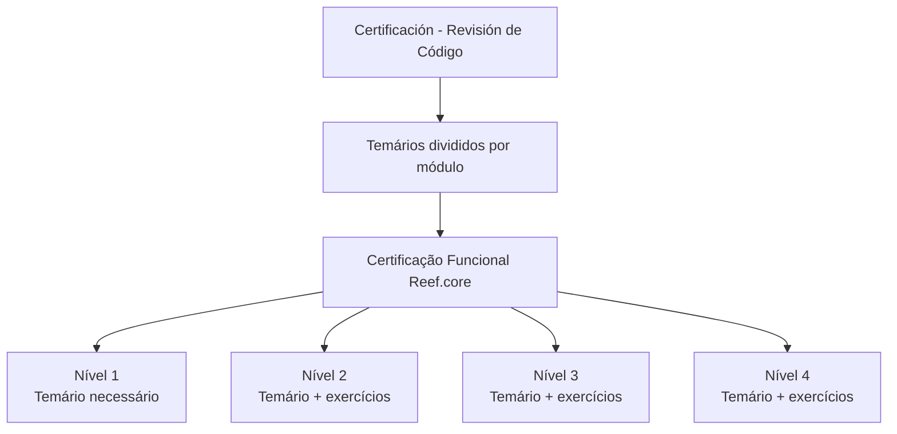

# Certificação Funcional Reef.core — Revisão de Código e Níveis 1 a 4

## 1. Metadados do Documento
- **Arquivo de Origem:** Não identificado no conteúdo fornecido
- **Tipo de Documento:** Procedimento / guia de certificação funcional
- **Domínio / Sistema:** Reef.core / Reef
- **Público-Alvo:** Profissionais que buscam certificação funcional Reef.core
- **Data/Versão Identificada:** Não identificada

---

## 2. Resumo Executivo & Contexto de Negócio

O documento apresenta a seção **“CERTIFICACIÓN - REVISIÓN DE CÓDIGO”**, destinada a organizar os temas de certificação funcional relacionados a **Reef.core**. O conteúdo informa que os temários de cada nível de certificação estão divididos por módulo.

A estrutura de certificação possui quatro níveis: **Nível 1**, **Nível 2**, **Nível 3** e **Nível 4**. Cada nível indica o conhecimento necessário para obtenção da respectiva certificação funcional de Reef.core.

O Nível 1 é apresentado como o primeiro patamar de certificação funcional e contém o temário que precisa ser conhecido. Os Níveis 2, 3 e 4 também apresentam temários necessários, porém incluem exercícios como parte do processo de obtenção das certificações correspondentes.

O conteúdo aparece associado à área de documentação Reef, com referências a **Mapfredocument**, proprietário identificado como `user:agonzalez_mapfre.com` e ciclo de vida marcado como **Approved**. Não há detalhamento dos módulos, critérios de aprovação, exercícios, avaliação, duração, pré-requisitos ou conteúdos programáticos de cada nível.

---

## 3. Arquitetura, Componentes & Tecnologias Envolvidas

Os elementos identificados no conteúdo são:

| Componente / Elemento | Papel identificado no documento | Detalhamento disponível |
| :--- | :--- | :--- |
| Reef.core | Sistema ou domínio da certificação funcional | O documento não descreve arquitetura, módulos internos ou tecnologias. |
| Reef | Área ou conjunto de documentação referenciado como “DOCUMENTACIÓN Reef” | Não há detalhamento adicional. |
| Mapfredocument | Referência de documentação exibida no conteúdo | Não há explicação funcional ou técnica. |
| Certificação de Nível 1 | Primeiro nível de certificação funcional Reef.core | Exige conhecimento do temário apresentado para o nível. |
| Certificação de Nível 2 | Segundo nível de certificação funcional Reef.core | Exige temário e exercícios. |
| Certificação de Nível 3 | Terceiro nível de certificação funcional Reef.core | Exige temário e exercícios. |
| Certificação de Nível 4 | Quarto nível de certificação funcional Reef.core | Exige temário e exercícios. |



**Nota de Análise:** O conteúdo não descreve componentes de software, integrações, microsserviços, APIs, infraestrutura, ambientes, fluxos de dados ou tecnologias de implementação. O diagrama representa exclusivamente a hierarquia documental de certificação explicitamente apresentada.

---

## 4. Regras de Negócio, Especificações Funcionais & Processos

1. A seção de certificação está identificada como **“CERTIFICACIÓN - REVISIÓN DE CÓDIGO”**.
2. Os temários de certificação são organizados por módulo.
3. A certificação funcional de Reef.core possui quatro níveis explicitamente listados.
4. Para obter a certificação funcional de **Nível 1**, é necessário conhecer o temário correspondente ao primeiro nível.
5. Para obter a certificação funcional de **Nível 2**, é necessário conhecer o temário correspondente e realizar exercícios.
6. Para obter a certificação funcional de **Nível 3**, é necessário conhecer o temário correspondente e realizar exercícios.
7. Para obter a certificação funcional de **Nível 4**, é necessário conhecer o temário correspondente e realizar exercícios.
8. O documento não informa se os níveis devem ser realizados sequencialmente.
9. O documento não estabelece notas mínimas, critérios de aprovação, quantidade de exercícios, formato de avaliação, responsáveis pela avaliação ou mecanismos de emissão da certificação.
10. O documento não descreve os módulos ou os temas efetivamente incluídos nos temários de cada nível.

---

## 5. Tabelas de Parâmetros, Ambientes e Estruturas de Dados

| Item / Parâmetro | Descrição / Função | Tipo / Valores / Formato | Ambiente / Observações |
| :--- | :--- | :--- | :--- |
| Seção documental | Área apresentada no topo do conteúdo | `CERTIFICACIÓN - REVISIÓN DE CÓDIGO` | Relacionada à certificação Reef.core. |
| Organização dos temários | Forma de divisão dos conteúdos de certificação | Divididos por módulo | Os módulos não são enumerados. |
| Nível de certificação | Primeiro nível funcional Reef.core | Nível 1 | Requer conhecimento do temário. |
| Nível de certificação | Segundo nível funcional Reef.core | Nível 2 | Requer conhecimento do temário e exercícios. |
| Nível de certificação | Terceiro nível funcional Reef.core | Nível 3 | Requer conhecimento do temário e exercícios. |
| Nível de certificação | Quarto nível funcional Reef.core | Nível 4 | Requer conhecimento do temário e exercícios. |
| Área de documentação | Referência exibida no conteúdo | `Documentation / DOCUMENTACIÓN Reef` | Não há URL ou localização técnica fornecida. |
| Sistema documental | Nome exibido no conteúdo | `Mapfredocument` | Sem detalhamento funcional. |
| Owner | Proprietário registrado | `user:agonzalez_mapfre.com` | Valor reproduzido literalmente do conteúdo. |
| Lifecycle | Estado do ciclo de vida | `Approved` | O documento não define o processo de aprovação. |
| Navegação exibida | Itens de menu presentes na extração | Buscar, Inicio, Soluciones, Arquitecturas, APIs, Componentes, Cloud, Documentación, Zeus, Reef, Ayuda | Itens de interface; não há URLs associadas. |
| Idioma exibido | Código de idioma na interface | `ES` | O conteúdo principal está em espanhol. |

---

## 6. Bateria de Perguntas & Respostas para RAG (FAQ Sintético)

### P1: Qual é o objetivo da seção “Certificación - Revisión de Código”?
**R:** A seção apresenta os temários associados aos níveis de certificação funcional de Reef.core. O documento informa que os temários estão divididos por módulo, mas não descreve quais módulos ou tópicos compõem cada nível.

### P2: Quantos níveis de certificação funcional Reef.core são apresentados?
**R:** O documento apresenta quatro níveis: Certificação de Nível 1, Certificação de Nível 2, Certificação de Nível 3 e Certificação de Nível 4.

### P3: O que é necessário para obter a certificação funcional Reef.core de Nível 1?
**R:** Para obter o primeiro nível de certificação funcional Reef.core, o documento informa que é necessário conhecer o temário correspondente ao Nível 1. Não são informados exercícios, provas, critérios de aprovação ou pré-requisitos adicionais.

### P4: O que diferencia a certificação Reef.core de Nível 2 da certificação de Nível 1?
**R:** O Nível 2 requer o conhecimento do temário correspondente e exercícios. Para o Nível 1, o conteúdo apenas declara a necessidade de conhecer o temário do primeiro nível.

### P5: Os Níveis 3 e 4 de certificação Reef.core incluem exercícios?
**R:** Sim. O documento afirma que os temários dos Níveis 3 e 4 devem ser conhecidos juntamente com exercícios para obtenção das respectivas certificações funcionais Reef.core.

### P6: Quais módulos fazem parte dos temários de certificação Reef.core?
**R:** O conteúdo informa que os temários estão divididos por módulo, mas não identifica os nomes dos módulos nem detalha seus conteúdos.

### P7: O documento informa critérios de aprovação ou nota mínima para as certificações?
**R:** Não. Não há critérios de aprovação, notas mínimas, tipos de prova, quantidade de exercícios, duração de avaliação ou requisitos formais de conclusão.

### P8: Existe informação sobre uma sequência obrigatória entre os quatro níveis de certificação?
**R:** Não. Embora os níveis sejam numerados de 1 a 4, o documento não declara explicitamente que um nível seja pré-requisito para o seguinte.

### P9: Quem aparece como proprietário do documento?
**R:** O campo **Owner** está registrado como `user:agonzalez_mapfre.com`.

### P10: Qual é o estado de ciclo de vida registrado para o documento?
**R:** O campo **Lifecycle** está registrado com o valor `Approved`.

### P11: O documento descreve APIs, microsserviços ou arquitetura técnica de Reef.core?
**R:** Não. O conteúdo apenas menciona Reef.core no contexto de certificação funcional; não apresenta APIs, microsserviços, contratos, tecnologias, ambientes, URLs ou diagramas de arquitetura técnica.

### P12: Qual sistema documental é mencionado no conteúdo?
**R:** O nome `Mapfredocument` aparece no conteúdo, associado à documentação Reef. O documento não explica o papel funcional ou técnico desse sistema.

---

## 7. Glossário de Termos, Siglas & Conceitos-Chave

- **Reef.core:** Nome do sistema ou domínio associado às certificações funcionais apresentadas.
- **Reef:** Referência à área de documentação exibida como “DOCUMENTACIÓN Reef”.
- **Certificación:** Processo de certificação funcional estruturado em quatro níveis.
- **Temario:** Conjunto de conteúdos que precisa ser conhecido para uma certificação.
- **Módulo:** Unidade de organização dos temários; os módulos não são nomeados no conteúdo.
- **Ejercicios:** Exercícios requeridos, segundo o documento, para os níveis 2, 3 e 4.
- **Mapfredocument:** Nome exibido como referência documental; sem definição adicional no conteúdo.
- **Owner:** Campo de propriedade documental, identificado como `user:agonzalez_mapfre.com`.
- **Lifecycle:** Campo de ciclo de vida do documento, identificado como `Approved`.
- **Approved:** Estado de ciclo de vida exibido para o documento.
- **ES:** Código de idioma exibido na interface; o conteúdo está apresentado em espanhol.

---

## 8. Notas Críticas, Riscos & Limitações

- O conteúdo não informa o nome do arquivo de origem, data, versão, autor editorial ou histórico de alterações.
- Os temários são mencionados, porém os temas, módulos e conteúdos programáticos não foram extraídos ou não estão presentes no texto fornecido.
- Não há critérios objetivos de aprovação, modelo de exercícios, evidências requeridas, notas mínimas ou regras de reprovação.
- Não há informação explícita sobre pré-requisitos ou progressão obrigatória entre os níveis de certificação.
- O documento não detalha arquitetura de Reef.core, APIs, contratos, integrações, ambientes, servidores, URLs, rotas de logs ou tecnologias.
- **Nota de Análise:** O conteúdo lista Reef.core e quatro níveis de certificação funcional, porém não detalha os métodos de avaliação, o conteúdo dos módulos ou os procedimentos operacionais para solicitar e concluir uma certificação.

---

## 9. Conteúdo Bruto Estruturado (Referência Fiel)

```text
--- [PÁGINA 1 DE 1] ---

CERTIFICACIÓN - REVISIÓN DE CÓDIGO
 En este apartado se encuentran los temarios de cada uno de los niveles de certicación. Los temarios están
divididas por módulo.
CERTIFICACIÓN DE NIVEL 1
En este apartado se encuentra el temario
que se necesita conocer para obtener el
primer nivel de certicación funcional de
Reef.core
CERTIFICACIÓN DE NIVEL 2
En este apartado se encuentra el temario
que se necesita conocer junto con
ejercicios para obtener el segundo nivel de
certicación funcional de Reef.core
CERTIFICACIÓN DE NIVEL 3
En este apartado se encuentra el temario
que se necesita conocer junto con
ejercicios para obtener el tercer nivel de
certicación funcional de Reef.core
CERTIFICACIÓN DE NIVEL 4
En este apartado se encuentra el temario
que se necesita conocer junto con
ejercicios para obtener el cuarto nivel de
certicación funcional de Reef.core
Documentation / DOCUMENTACIÓN Reef
DOCUMENTACIÓN Reef
Mapfredocument
DOCUMENTACIÓN Reef
Owner
user:agonzalez_mapfre.com
Lifecycle
Approved Source
 / 
 VL
Buscar Inicio Soluciones Arquitecturas APIs Componentes Cloud Documentación Zeus Reef Ayuda
ES
```
