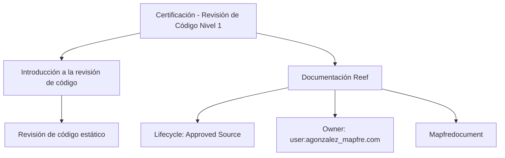

# Certificación — Revisión de Código Nivel 1

## 1. Metadados do Documento
- **Arquivo de Origem:** Não identificado
- **Tipo de Documento:** Procedimento
- **Domínio / Sistema:** Reef / Mapfre
- **Público-Alvo:** Não identificado
- **Data/Versão Identificada:** Não identificada

---

## 2. Resumo Executivo & Contexto de Negócio

O conteúdo apresenta a documentação intitulada **“Certificación — Revisión de Código Nivel 1”**, associada ao ambiente ou repositório documental **Reef** e à organização **Mapfre**. O foco declarado é a introdução à revisão estática de código.

A introdução informa que a seção contém os conceitos necessários para a realização da revisão de código estático. Entretanto, o trecho extraído não descreve critérios de aprovação, ferramentas de análise, etapas operacionais, responsabilidades, métricas ou evidências exigidas para a certificação.

O material aparenta estar publicado em uma plataforma de documentação com navegação para soluções, arquiteturas, APIs, componentes, cloud, documentação, Zeus, Reef e ajuda. O estado de ciclo de vida identificado é **Approved Source**.

---

## 3. Arquitetura, Componentes & Tecnologias Envolvidas

Os elementos explicitamente identificados são:

| Componente / Termo | Papel identificado no conteúdo |
| :--- | :--- |
| Certificación — Revisión de Código Nivel 1 | Título do conteúdo documental |
| Revisión de Código | Tema principal da documentação |
| Revisão de código estático | Prática abordada na introdução |
| Reef | Área, sistema ou repositório documental citado |
| Mapfre | Organização ou domínio corporativo citado |
| Mapfredocument | Termo exibido na interface documental |
| Zeus | Área de navegação citada |
| Cloud | Área de navegação citada |
| Soluciones | Área de navegação citada |
| Arquitecturas | Área de navegação citada |
| APIs | Área de navegação citada |
| Componentes | Área de navegação citada |
| Approved Source | Estado de ciclo de vida identificado |
| VL | Valor ou marcador exibido junto ao ciclo de vida, sem detalhamento |



**Nota de Análise:** O conteúdo não detalha uma arquitetura de software, integrações, serviços, endpoints, contratos, tecnologias de implementação ou fluxo operacional de revisão de código.

---

## 4. Regras de Negócio, Especificações Funcionais & Processos

O conteúdo estabelece somente os seguintes pontos funcionais:

1. Existe uma certificação denominada **“Revisión de Código Nivel 1”**.
2. A documentação possui uma seção intitulada **“Introducción a la revisión de código”**.
3. A finalidade declarada da seção é introduzir a revisão estática de código.
4. A introdução busca identificar os conceitos necessários para a realização da revisão de código estático.
5. O ciclo de vida exibido para a documentação é **Approved Source**.

**Nota de Análise:** O trecho não apresenta regras de negócio adicionais, critérios de aceite, níveis de severidade, checklist de revisão, responsáveis, prazos, fluxos de aprovação, exceções ou mecanismos de validação.

---

## 5. Tabelas de Parâmetros, Ambientes e Estruturas de Dados

| Item / Parâmetro | Descrição / Função | Tipo / Valores / Formato | Ambiente / Observações |
| :--- | :--- | :--- | :--- |
| Título | Nome do conteúdo | `CERTIFICACIÓN - REVISIÓN DE CÓDIGO NIVEL 1` | Documento apresentado |
| Tema | Área funcional do conteúdo | `Revisión de Código` | Associado à certificação de nível 1 |
| Seção | Seção introdutória | `INTRODUCCIÓN A LA REVISIÓN DE CÓDIGO` | Apresenta conceitos para revisão estática |
| Objetivo declarado | Descrever a finalidade da introdução | Identificar conceitos necessários para a revisão de código estático | Sem detalhamento adicional |
| Repositório / plataforma | Local ou domínio documental citado | `Reef` | Exibido como “DOCUMENTACIÓN Reef” |
| Organização / domínio | Referência corporativa | `Mapfre` | Exibido também como `Mapfredocument` |
| Owner | Proprietário identificado | `user:agonzalez_mapfre.com` | Valor literal exibido |
| Lifecycle | Estado do conteúdo | `Approved Source` | Estado exibido na documentação |
| Marcador adicional | Valor associado ao lifecycle | `VL` | Significado não detalhado |
| Idioma da interface | Idioma indicado | `ES` | Espanhol |
| Áreas de navegação | Itens de menu visíveis | Buscar, Inicio, Soluciones, Arquitecturas, APIs, Componentes, Cloud, Documentación, Zeus, Reef, Ayuda | Não são especificações funcionais da revisão de código |

---

## 6. Bateria de Perguntas & Respostas para RAG (FAQ Sintético)

### P1: Qual é o tema principal do documento “Certificación — Revisión de Código Nivel 1”?
**R:** O documento trata de revisão de código, especificamente de uma introdução à revisão estática de código no contexto de uma certificação de nível 1.

### P2: Qual é o objetivo declarado da introdução à revisão de código?
**R:** O objetivo declarado é identificar os conceitos necessários para realizar uma revisão de código estático.

### P3: O documento descreve um processo completo de revisão de código?
**R:** Não. O trecho disponível apenas informa que a documentação introduz os conceitos necessários para revisão de código estático. Não há etapas, responsáveis, critérios de aprovação ou checklist descritos.

### P4: Qual é o nível de certificação mencionado?
**R:** O conteúdo menciona a certificação de revisão de código de **nível 1**.

### P5: Em qual repositório ou área documental o conteúdo está associado?
**R:** O conteúdo está associado à documentação **Reef**, exibida como “DOCUMENTACIÓN Reef”.

### P6: Qual é o estado de ciclo de vida identificado para a documentação?
**R:** O ciclo de vida identificado é **Approved Source**.

### P7: Quem é o owner identificado no conteúdo?
**R:** O owner exibido é `user:agonzalez_mapfre.com`.

### P8: O documento informa quais ferramentas devem ser usadas na revisão estática de código?
**R:** Não. O trecho não cita ferramentas de análise estática, plataformas de CI/CD, linguagens de programação ou mecanismos automatizados de revisão.

### P9: O documento informa regras de aprovação ou reprovação da certificação?
**R:** Não. Não foram identificadas regras, parâmetros, severidades, métricas, exceções ou condições de aprovação e reprovação.

### P10: Quais áreas de navegação aparecem na plataforma documental?
**R:** A interface apresenta as áreas Buscar, Inicio, Soluciones, Arquitecturas, APIs, Componentes, Cloud, Documentación, Zeus, Reef e Ayuda.

---

## 7. Glossário de Termos, Siglas & Conceitos-Chave

- **Certificación:** Certificação relacionada à revisão de código de nível 1.
- **Revisión de Código:** Tema central do documento; revisão de código.
- **Revisión de código estático:** Prática mencionada como foco da introdução documental.
- **Reef:** Nome da documentação, área ou sistema de documentação citado.
- **Mapfre:** Organização ou domínio corporativo citado no conteúdo.
- **Mapfredocument:** Termo apresentado na interface; não possui definição adicional no trecho.
- **Lifecycle:** Campo de ciclo de vida da documentação.
- **Approved Source:** Estado de ciclo de vida exibido para o conteúdo.
- **VL:** Marcador exibido próximo ao ciclo de vida; significado não informado.
- **Zeus:** Área de navegação citada, sem descrição adicional.

---

## 8. Notas Críticas, Riscos & Limitações

- O arquivo de origem não foi identificado no texto bruto fornecido.
- O conteúdo não apresenta data, versão, autor documental formal ou histórico de alterações.
- A finalidade da revisão estática de código é mencionada de forma introdutória, mas sem detalhamento técnico.
- Não há critérios de certificação, fluxos de aprovação, matriz de papéis, ferramentas, métricas, evidências ou regras de exceção.
- O significado do campo ou marcador **VL** não é explicado.
- Não é possível inferir métodos HTTP, contratos JSON, tecnologias, servidores, URLs, portas ou ambientes a partir do conteúdo fornecido.

---

## 9. Conteúdo Bruto Estruturado (Referência Fiel)

```text
--- [PÁGINA 1 DE 1] ---

CERTIFICACIÓN - REVISIÓN DE CÓDIGO NIVEL 1
CERTIFICACIÓN Revisión de Código
nivel 1
INTRODUCCIÓN A LA REVISIÓN DE CÓDIGO
En este apartado se encuentra la introducción a la revisión de código estático, identicando los conceptos necesarios para su realización
Documentation / DOCUMENTACIÓN Reef
DOCUMENTACIÓN Reef
Mapfredocument
DOCUMENTACIÓN Reef
Owner
user:agonzalez_mapfre.com
Lifecycle
Approved Source
 / 
 VL
Buscar Inicio Soluciones Arquitecturas APIs Componentes Cloud Documentación Zeus Reef Ayuda
ES
```
