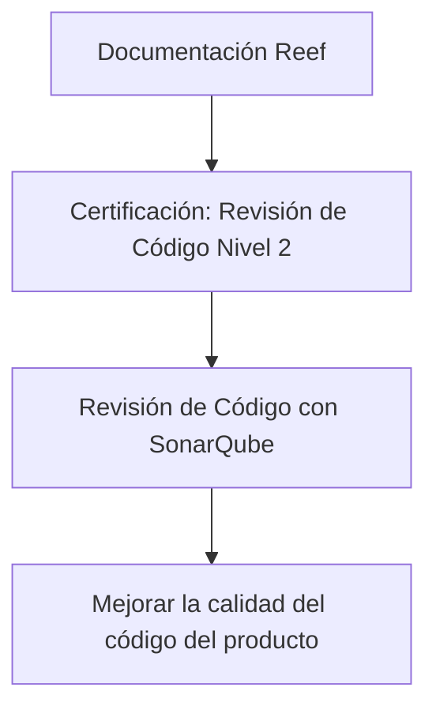

# Certificación de Revisión de Código Nivel 2 con SonarQube — Documentación Reef

## 1. Metadados do Documento
- **Arquivo de Origem:** Não identificado
- **Tipo de Documento:** Procedimento
- **Domínio / Sistema:** Documentación Reef / SonarQube
- **Público-Alvo:** Desenvolvedores
- **Data/Versão Identificada:** Não identificada

---

## 2. Resumo Executivo & Contexto de Negócio

O documento apresenta o tema **“Certificación - Revisión de Código Nivel 2”**, associado à revisão de código com **SonarQube**. O conteúdo indica que existe um temário voltado ao uso da ferramenta como parte da certificação de revisão de código em nível 2.

O objetivo explicitamente declarado é utilizar SonarQube para contribuir com a melhoria da qualidade do código do produto. O documento não detalha critérios de aprovação, métricas de qualidade, regras de bloqueio, quality gates ou etapas formais de certificação.

A fonte está identificada visualmente como parte da **Documentación Reef**, em um contexto que também contém referências a “Mapfredocument”, “VL”, “Zeus”, “Cloud”, “APIs”, “Componentes” e “Arquitecturas”. Entretanto, o trecho fornecido não descreve relações técnicas, integrações ou responsabilidades entre esses itens.

**Nota de Análise:** O documento menciona a revisão de código com SonarQube, mas não especifica versões, configurações, linguagens suportadas, projetos analisados, métricas, procedimentos operacionais ou evidências necessárias para a certificação.

---

## 3. Arquitetura, Componentes & Tecnologias Envolvidas

Os elementos identificados no conteúdo são:

- **Certificación Revisión de Código nivel 2:** Tema central do documento.
- **SonarQube:** Ferramenta citada para apoiar a melhoria da qualidade do código do produto.
- **Documentación Reef / Reef:** Espaço ou contexto documental mencionado no cabeçalho e na navegação.
- **Mapfredocument:** Nome exibido no conteúdo, sem descrição funcional adicional.
- **Zeus, Cloud, APIs, Componentes, Arquitecturas, Soluciones:** Categorias ou áreas presentes na navegação da documentação; não há detalhamento técnico no trecho.



**Nota de Análise:** O diagrama representa exclusivamente a relação explicitamente apresentada entre certificação, revisão de código, SonarQube e melhoria da qualidade do produto. O conteúdo não descreve arquitetura de software, ambientes, serviços, APIs ou fluxos de integração.

---

## 4. Regras de Negócio, Especificações Funcionais & Processos

1. O documento está associado à **certificação de revisão de código nível 2**.
2. A revisão de código é apresentada no contexto do uso de **SonarQube**.
3. Existe um **temário para o uso de SonarQube**.
4. A finalidade declarada para o uso de SonarQube é ajudar a melhorar a qualidade do código do produto.
5. O documento está classificado como **Approved Source** no conteúdo extraído.
6. O proprietário indicado no conteúdo é `user:agonzalez_mapfre.com`.

**Limitação funcional identificada:** Não foram encontrados critérios objetivos de aprovação ou reprovação, regras de tratamento de vulnerabilidades, limites de duplicação, requisitos de cobertura de testes, indicadores de dívida técnica ou passos operacionais para executar uma análise no SonarQube.

---

## 5. Tabelas de Parâmetros, Ambientes e Estruturas de Dados

| Item / Parâmetro | Descrição / Função | Tipo / Valores / Formato | Ambiente / Observações |
| :--- | :--- | :--- | :--- |
| Certificación | Certificação relacionada à revisão de código | Revisión de Código nivel 2 | Não detalhado |
| Ferramenta de revisão | Ferramenta mencionada para uso no temário de revisão de código | SonarQube | Não detalhado |
| Objetivo do uso do SonarQube | Ajudar a melhorar a qualidade do código do produto | Objetivo de qualidade | Não detalhado |
| Documentação | Área documental indicada no conteúdo | Documentación Reef | Não detalhado |
| Owner | Proprietário exibido no documento | `user:agonzalez_mapfre.com` | Não detalhado |
| Lifecycle | Estado de ciclo de vida exibido | Approved Source | Não detalhado |
| Navegação documental | Itens visíveis no menu da fonte | Inicio, Soluciones, Arquitecturas, APIs, Componentes, Cloud, Documentación, Zeus, Reef, Ayuda | Interface documental |
| Idioma | Idioma indicado na navegação | ES | Espanhol |
| Referência adicional | Nome exibido no conteúdo | Mapfredocument | Sem detalhamento funcional |
| Referência adicional | Texto exibido junto ao lifecycle | VL | Significado não identificado |

---

## 6. Bateria de Perguntas & Respostas para RAG (FAQ Sintético)

### P1: Qual é o tema principal do documento?
**R:** O documento trata da **Certificación - Revisión de Código Nivel 2**, com foco em revisão de código utilizando SonarQube.

### P2: Qual ferramenta é mencionada para a revisão de código?
**R:** A ferramenta mencionada é o **SonarQube**, apresentado como recurso para apoiar a melhoria da qualidade do código do produto.

### P3: Qual é o objetivo declarado do uso de SonarQube?
**R:** O objetivo declarado é que o uso de SonarQube ajude a melhorar a qualidade do código do produto.

### P4: O documento informa quais métricas do SonarQube devem ser avaliadas?
**R:** Não. O conteúdo fornecido não especifica métricas como cobertura de testes, bugs, vulnerabilidades, code smells, duplicação de código, dívida técnica ou quality gates.

### P5: O documento descreve o processo completo para obter a certificação de revisão de código nível 2?
**R:** Não. O conteúdo apenas informa que há um temário para uso de SonarQube no contexto da certificação de revisão de código nível 2; etapas, responsáveis, evidências e critérios de aprovação não são detalhados.

### P6: Qual área documental é citada como fonte do conteúdo?
**R:** O conteúdo referencia repetidamente a **Documentación Reef** ou **DOCUMENTACIÓN Reef**.

### P7: Quem é identificado como proprietário do documento?
**R:** O campo **Owner** apresenta o valor `user:agonzalez_mapfre.com`.

### P8: Qual é o status de ciclo de vida exibido para a documentação?
**R:** O campo **Lifecycle** apresenta o status **Approved Source**.

### P9: O documento informa versões do SonarQube ou configurações de análise?
**R:** Não. Não há versão do SonarQube, URL de acesso, configuração de scanner, linguagem de programação, projeto ou parâmetros técnicos de execução.

### P10: Quais áreas aparecem na navegação da documentação?
**R:** A navegação apresenta: Inicio, Soluciones, Arquitecturas, APIs, Componentes, Cloud, Documentación, Zeus, Reef e Ayuda.

---

## 7. Glossário de Termos, Siglas & Conceitos-Chave

- **SonarQube:** Ferramenta mencionada para uso na revisão de código e para apoiar a melhoria da qualidade do código do produto.
- **Revisión de Código:** Processo de revisão de código referido no contexto da certificação de nível 2.
- **Nivel 2:** Nível da certificação de revisão de código citado no documento; os requisitos desse nível não são detalhados.
- **Documentación Reef:** Área ou contexto documental identificado no conteúdo.
- **Approved Source:** Estado exibido no campo Lifecycle; o documento não define seu significado operacional.
- **Owner:** Campo que identifica o proprietário do documento como `user:agonzalez_mapfre.com`.
- **VL:** Termo exibido no conteúdo sem definição adicional.

---

## 8. Notas Críticas, Riscos & Limitações

- O conteúdo é resumido e não fornece o temário efetivo de SonarQube.
- Não há critérios de qualidade, quality gates, métricas, limiares ou regras de aprovação para a certificação de nível 2.
- Não há descrição de arquitetura, integração, repositórios, pipelines de CI/CD, APIs ou ambientes.
- Não são informados URL, credenciais, permissões, portas, servidores ou versões de SonarQube.
- Os termos **VL**, **Mapfredocument**, **Zeus** e a relação entre eles e a certificação não são explicados.
- A classificação “Approved Source” aparece no conteúdo, mas o significado, a data de aprovação e a autoridade aprovadora não são identificados.

---

## 9. Conteúdo Bruto Estruturado (Referência Fiel)

```text
--- [PÁGINA 1 DE 1] ---

CERTIFICACIÓN - REVISIÓN DE CÓDIGO NIVEL 2
CERTIFICACIÓN Revisión de Código
nivel 2
REVISIÓN DE CÓDIGO CON SONARQUBE
En este apartado se encuentra el temario para el uso de SonarQube, de forma que nos ayude a mejorar la calidad del código de nuestro
producto
Documentation / DOCUMENTACIÓN Reef
DOCUMENTACIÓN Reef
Mapfredocument
DOCUMENTACIÓN Reef
Owner
user:agonzalez_mapfre.com
Lifecycle
Approved Source
 / 
 VL
Buscar Inicio Soluciones Arquitecturas APIs Componentes Cloud Documentación Zeus Reef Ayuda
ES
```
