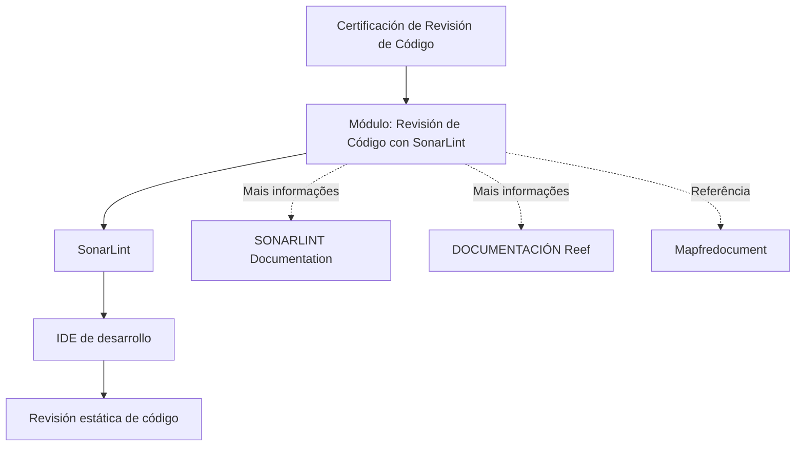

# Certificación de Revisión de Código com SonarLint — Módulo de Funcionalidades e Revisão Estática

## 1. Metadados do Documento
- **Arquivo de Origem:** Não identificado no conteúdo fornecido
- **Tipo de Documento:** Procedimento / material de treinamento
- **Domínio / Sistema:** Certificação de Revisão de Código; SonarLint; documentação Reef
- **Público-Alvo:** Desenvolvedores
- **Data/Versão Identificada:** Não identificada
- **Owner Identificado:** `user:agonzalez_mapfre.com`
- **Lifecycle Identificado:** `Approved Source / VL`

---

## 2. Resumo Executivo & Contexto de Negócio

O documento apresenta um módulo denominado **“Certificación de Revisión de Código - Revisión de Código con SonarLint”**. O objetivo declarado é revisar as funcionalidades fornecidas pelo plugin SonarLint.

O conteúdo descreve o SonarLint como um plugin utilizado no IDE de desenvolvimento para realizar revisão estática de código. A finalidade do módulo é explicar como esse plugin funciona e quais funcionalidades ele oferece no contexto de revisão de código.

O material também aponta fontes adicionais de informação, citando “SONARLINT”, “Documentation / DOCUMENTACIÓN Reef”, “Mapfredocument” e “DOCUMENTACIÓN Reef”. A navegação exibida inclui áreas como Soluções, Arquiteturas, APIs, Componentes, Cloud, Documentação, Zeus, Reef e Ajuda.

O documento não especifica linguagens de programação, IDEs compatíveis, regras de qualidade, métodos HTTP, integrações de CI/CD, configuração de servidores, métricas de análise ou procedimentos detalhados de uso do SonarLint.

---

## 3. Arquitetura, Componentes & Tecnologias Envolvidas

### Componentes e referências identificados

| Componente / Referência | Papel descrito no documento |
| :--- | :--- |
| SonarLint | Plugin que permite realizar revisão estática de código no IDE de desenvolvimento. |
| IDE de desenvolvimento | Ambiente no qual o plugin SonarLint é utilizado. O documento não identifica produtos específicos de IDE. |
| Certificación de Revisión de Código | Módulo cujo objetivo é revisar as funcionalidades do plugin SonarLint. |
| DOCUMENTACIÓN Reef | Referência documental adicional mencionada. |
| Mapfredocument | Referência documental mencionada no conteúdo. |
| Zeus | Área de navegação mencionada, sem detalhamento de função. |
| Cloud | Área de navegação mencionada, sem detalhamento de função. |
| APIs | Área de navegação mencionada, sem detalhamento de função. |
| Arquitecturas | Área de navegação mencionada, sem detalhamento de função. |
| Componentes | Área de navegação mencionada, sem detalhamento de função. |



> **Nota de Análise:** O documento estabelece a relação entre SonarLint, IDE de desenvolvimento e revisão estática de código, mas não detalha instalação, configuração, regras de análise, conectividade, linguagens suportadas ou integração com outros sistemas.

---

## 4. Regras de Negócio, Especificações Funcionais & Processos

### Objetivo funcional declarado

1. O módulo tem como finalidade revisar as funcionalidades fornecidas pelo plugin SonarLint.
2. O conteúdo revisará como funciona o plugin SonarLint.
3. O plugin SonarLint permite realizar revisão estática de código no IDE de desenvolvimento.

### Processo funcional identificável

1. Um desenvolvedor utiliza um IDE de desenvolvimento.
2. O plugin SonarLint é utilizado nesse IDE.
3. O SonarLint permite a realização de revisão estática de código.
4. O módulo de certificação revisa as funcionalidades e o funcionamento desse plugin.

### Restrições de escopo identificadas

- O documento não apresenta regras de negócio adicionais.
- O documento não informa critérios de aprovação ou reprovação de código.
- O documento não especifica quais problemas de código são detectados pelo SonarLint.
- O documento não descreve ações corretivas após a identificação de problemas.
- O documento não informa se a revisão estática é local, remota, obrigatória ou integrada a pipelines.
- O documento não detalha autenticação, permissões, URLs, ambientes, portas ou credenciais.

---

## 5. Tabelas de Parâmetros, Ambientes e Estruturas de Dados

| Item / Parâmetro | Descrição / Função | Tipo / Valores / Formato | Ambiente / Observações |
| :--- | :--- | :--- | :--- |
| SonarLint | Plugin para revisão estática de código. | Plugin | Utilizado no IDE de desenvolvimento. |
| IDE de desarrollo | Ambiente de desenvolvimento no qual o SonarLint é utilizado. | Ferramenta / ambiente | Produto específico não informado. |
| Objetivo do módulo | Revisar as funcionalidades fornecidas pelo plugin SonarLint. | Objetivo funcional | Declarado explicitamente no documento. |
| Funcionalidade revisada | Funcionamento do plugin SonarLint para revisão estática de código. | Processo / capacidade | Sem etapas detalhadas. |
| Owner | Responsável identificado nos metadados exibidos. | `user:agonzalez_mapfre.com` | Apresentado na área de documentação. |
| Lifecycle | Estado/ciclo de vida informado no conteúdo. | `Approved Source / VL` | Sem explicação adicional no documento. |
| Idioma da interface | Idioma exibido na navegação. | `ES` | A interface apresentada está em espanhol. |
| Referência adicional | Fonte adicional sobre SonarLint. | `SONARLINT Documentation` | O conteúdo não fornece URL explícita. |
| Referência adicional | Documentação Reef. | `DOCUMENTACIÓN Reef` | O conteúdo não fornece URL explícita. |
| Referência adicional | Referência documental. | `Mapfredocument` | Papel e endereço não detalhados. |
| Navegação disponível | Áreas apresentadas na interface. | Buscar, Inicio, Soluciones, Arquitecturas, APIs, Componentes, Cloud, Documentación, Zeus, Reef, Ayuda | Sem descrição funcional detalhada. |

---

## 6. Bateria de Perguntas & Respostas para RAG (FAQ Sintético)

### P1: Qual é o objetivo do módulo “Certificación de Revisión de Código - Revisión de Código con SonarLint”?
**R:** O objetivo declarado do módulo é revisar as funcionalidades disponibilizadas pelo plugin SonarLint.

### P2: O que é o SonarLint segundo o documento?
**R:** O SonarLint é descrito como um plugin que permite realizar revisão estática de código no IDE de desenvolvimento.

### P3: Em qual ambiente o SonarLint é utilizado?
**R:** O documento informa que o SonarLint é utilizado no IDE de desenvolvimento, mas não identifica qual IDE específico é suportado ou utilizado.

### P4: O documento explica como instalar ou configurar o SonarLint?
**R:** Não. O documento informa que o módulo revisará o funcionamento e as funcionalidades do plugin SonarLint, mas não apresenta etapas de instalação, configuração ou conexão.

### P5: Quais tipos de problemas de código o SonarLint identifica?
**R:** O conteúdo fornecido não especifica quais categorias de problemas, regras, vulnerabilidades, bugs ou padrões de qualidade são identificados pelo SonarLint.

### P6: O material apresenta integração do SonarLint com pipeline de CI/CD?
**R:** Não. Não há menção a pipeline de CI/CD, ferramentas de automação, repositórios, builds ou mecanismos de execução automatizada.

### P7: Onde o documento indica que podem ser encontradas informações adicionais sobre SonarLint?
**R:** O documento cita “SONARLINT”, “Documentation / DOCUMENTACIÓN Reef”, “Mapfredocument” e “DOCUMENTACIÓN Reef” como referências adicionais. Nenhuma URL explícita é fornecida no conteúdo extraído.

### P8: Quem é o owner identificado no conteúdo?
**R:** O owner exibido é `user:agonzalez_mapfre.com`.

### P9: Qual lifecycle é identificado no documento?
**R:** O lifecycle apresentado é `Approved Source / VL`. O documento não explica o significado operacional de “VL”.

### P10: Quais áreas aparecem na navegação da interface documental?
**R:** A navegação mostra: Buscar, Inicio, Soluciones, Arquitecturas, APIs, Componentes, Cloud, Documentación, Zeus, Reef e Ayuda.

### P11: O documento define critérios para aprovar uma revisão de código?
**R:** Não. O texto apenas estabelece que o SonarLint permite revisão estática de código no IDE, sem definir critérios de aceitação, severidades, limiares ou fluxos de aprovação.

---

## 7. Glossário de Termos, Siglas & Conceitos-Chave

- **SonarLint:** Plugin mencionado no documento para realizar revisão estática de código no IDE de desenvolvimento.
- **Revisión de Código:** Tema da certificação e do módulo apresentado; o texto o relaciona ao uso do SonarLint.
- **Revisión estática de código:** Capacidade atribuída ao SonarLint no documento. Não há definição técnica adicional no conteúdo.
- **IDE:** Ambiente de desenvolvimento integrado. O documento menciona “IDE de desarrollo”, mas não explicita o significado da sigla nem produtos compatíveis.
- **Reef:** Referência documental e área de navegação mencionada no conteúdo.
- **Zeus:** Área de navegação citada no conteúdo, sem detalhamento funcional.
- **Owner:** Campo que identifica `user:agonzalez_mapfre.com`.
- **Lifecycle:** Campo de ciclo de vida apresentado como `Approved Source / VL`.
- **VL:** Sigla exibida como parte do lifecycle; o documento não define seu significado.

---

## 8. Notas Críticas, Riscos & Limitações

- O documento é conciso e não detalha procedimentos operacionais para utilização do SonarLint.
- Não há informação sobre instalação, configuração, versões, dependências, compatibilidade de IDEs ou linguagens de programação.
- Não são descritas regras de qualidade, severidades, políticas de bloqueio, métricas ou critérios de aceitação.
- Não há URLs completas, endereços de ambiente, portas, credenciais ou rotas de logs.
- Não há especificação de integração com repositórios, plataformas de análise, pipelines de CI/CD ou ferramentas de gestão de código.
- O campo `Approved Source / VL` é apresentado sem definição; qualquer interpretação adicional seria especulativa.
- **Nota de Análise:** O documento lista SonarLint como plugin de revisão estática no IDE, porém não detalha métodos de configuração, regras analisadas, contratos de integração ou ações após a detecção de problemas.

---

## 9. Conteúdo Bruto Estruturado (Referência Fiel)

```text
--- [PÁGINA 1 DE 1] ---

CERTIFICACIÓN de REVISIÓN de CÓDIGO - Revisión de Código con
SonarLint
OBJETIVO
La nalidad de este módulo es repasar las funcionalidades que proporciona el plugin SonarLint.
SonarLint
SonarLint
Se revisará cómo funciona el plugin SonarLint, que nos permite hacer revisión de código estático en nuestro IDE de desarrollo.
Podemos encontrar más información en: SONARLINT
Documentation / DOCUMENTACIÓN Reef
DOCUMENTACIÓN Reef
Mapfredocument
DOCUMENTACIÓN Reef
Owner
user:agonzalez_mapfre.com
Lifecycle
Approved Source
 / 
 VL
Buscar Inicio Soluciones Arquitecturas APIs Componentes Cloud Documentación Zeus Reef Ayuda
ES
```
