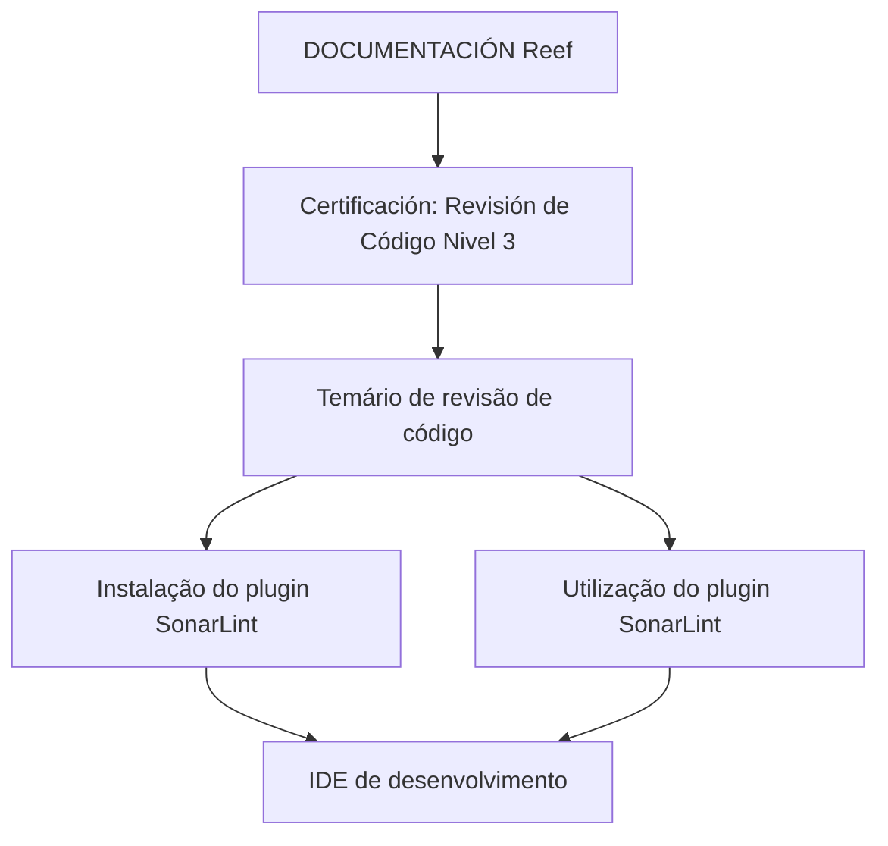

# Certificación — Revisión de Código Nivel 3 con SonarLint

## 1. Metadados do Documento
- **Arquivo de Origem:** Não identificado
- **Tipo de Documento:** Procedimento
- **Domínio / Sistema:** Reef / Mapfre
- **Público-Alvo:** Desenvolvedores
- **Data/Versão Identificada:** Não identificada

---

## 2. Resumo Executivo & Contexto de Negócio

O conteúdo apresenta uma certificação de **Revisión de Código Nivel 3**, com foco específico na revisão de código usando o plugin **SonarLint** no ambiente de desenvolvimento integrado (IDE).

O objetivo declarado é disponibilizar um temário que ajude profissionais a instalar e utilizar o plugin SonarLint no IDE de desenvolvimento. O texto não descreve etapas de instalação, configurações, regras de análise, versões compatíveis ou critérios de aprovação da certificação.

A documentação está vinculada ao espaço **DOCUMENTACIÓN Reef**, identificado também como **Mapfredocument**. O conteúdo apresenta o status de ciclo de vida como **Approved** e indica `user:agonzalez_mapfre.com` como owner.

O trecho extraído evidencia uma navegação corporativa contendo áreas como Soluções, Arquiteturas, APIs, Componentes, Cloud, Documentação, Zeus, Reef e Ajuda. Não há detalhamento adicional sobre a relação funcional entre essas áreas.

---

## 3. Arquitetura, Componentes & Tecnologias Envolvidas

| Componente / Tecnologia | Papel identificado |
| :--- | :--- |
| SonarLint | Plugin citado para instalação e utilização em um IDE de desenvolvimento durante a revisão de código. |
| IDE de desenvolvimento | Ambiente no qual o plugin SonarLint deve ser instalado e utilizado. O IDE específico não foi identificado. |
| Reef | Espaço ou domínio de documentação citado como `DOCUMENTACIÓN Reef`. |
| Mapfredocument | Identificador textual associado à documentação. |
| Zeus | Área disponível na navegação corporativa; sua função não foi detalhada. |
| APIs | Área disponível na navegação corporativa; nenhuma API específica foi descrita. |
| Cloud | Área disponível na navegação corporativa; nenhum serviço de nuvem específico foi descrito. |



> **Nota de Análise:** O conteúdo não descreve arquitetura de software, integração entre sistemas, métodos HTTP, contratos de API, pipelines de CI/CD, regras de SonarLint ou configuração de IDE.

---

## 4. Regras de Negócio, Especificações Funcionais & Processos

1. O conteúdo está associado à certificação denominada **Revisión de Código Nivel 3**.
2. A certificação aborda **revisão de código com SonarLint**.
3. O documento declara que contém um temário para auxiliar na instalação do plugin SonarLint.
4. O documento declara que contém um temário para auxiliar no uso do plugin SonarLint em um IDE de desenvolvimento.
5. O documento não informa:
   - O IDE suportado ou recomendado.
   - A versão do SonarLint.
   - O processo passo a passo de instalação.
   - Regras de qualidade, severidades ou perfis de análise.
   - Integração com SonarQube, SonarCloud ou outro servidor.
   - Critérios para aprovação, reprovação ou conclusão da certificação.
   - Responsáveis pela execução técnica ou suporte operacional.

---

## 5. Tabelas de Parâmetros, Ambientes e Estruturas de Dados

| Item / Parâmetro | Descrição / Função | Tipo / Valores / Formato | Ambiente / Observações |
| :--- | :--- | :--- | :--- |
| Certificação | Tema principal do conteúdo | `Revisión de Código Nivel 3` | Não há critérios de certificação detalhados. |
| Revisão de código | Assunto funcional abordado | Revisão de código com SonarLint | Não há processo de revisão detalhado. |
| SonarLint | Plugin citado para análise ou revisão de código | Plugin para IDE | Versão não identificada. |
| IDE de desenvolvimento | Ambiente de uso do SonarLint | Não identificado | O documento não cita IDE específico. |
| Espaço documental | Área de documentação indicada no trecho | `DOCUMENTACIÓN Reef` | Associado a Reef. |
| Identificador documental | Texto apresentado junto à documentação | `Mapfredocument` | Finalidade não detalhada. |
| Owner | Responsável indicado no documento | `user:agonzalez_mapfre.com` | Apresentado no bloco de documentação. |
| Lifecycle | Estado de ciclo de vida do conteúdo | `Approved` | Não há data de aprovação. |
| Idioma de interface | Idioma exibido na navegação | `ES` | Interface em espanhol. |
| Áreas de navegação | Opções exibidas no portal | Buscar, Inicio, Soluciones, Arquitecturas, APIs, Componentes, Cloud, Documentación, Zeus, Reef, Ayuda | Nenhuma função individual foi explicada. |

---

## 6. Bateria de Perguntas & Respostas para RAG (FAQ Sintético)

### P1: Qual é o tema da certificação apresentada no documento?
**R:** A certificação apresentada é denominada **Revisión de Código Nivel 3** e trata de revisão de código com SonarLint.

### P2: Qual ferramenta é citada para apoiar a revisão de código?
**R:** A ferramenta citada é o plugin **SonarLint**, que deve ser instalado e utilizado em um IDE de desenvolvimento.

### P3: Qual é o objetivo declarado do temário de revisão de código?
**R:** O objetivo declarado é ajudar os usuários a instalar e utilizar o plugin SonarLint no respectivo IDE de desenvolvimento.

### P4: O documento informa qual IDE deve ser utilizado com SonarLint?
**R:** Não. O conteúdo menciona apenas um IDE de desenvolvimento, sem identificar produto, versão ou plataforma específica.

### P5: O documento especifica a versão do plugin SonarLint?
**R:** Não. Nenhuma versão do SonarLint é apresentada no conteúdo extraído.

### P6: A documentação descreve como integrar SonarLint a SonarQube ou SonarCloud?
**R:** Não. O conteúdo somente cita a instalação e o uso de SonarLint no IDE; não há referência a SonarQube, SonarCloud ou a outra integração externa.

### P7: Quem é indicado como owner da documentação?
**R:** O owner exibido no bloco de documentação é `user:agonzalez_mapfre.com`.

### P8: Qual é o status de ciclo de vida da documentação?
**R:** O status de ciclo de vida exibido é **Approved**.

### P9: A qual domínio documental o conteúdo está associado?
**R:** O conteúdo está associado a **DOCUMENTACIÓN Reef**, com a presença textual de `Mapfredocument`.

### P10: Existem critérios de aprovação para a certificação de revisão de código nível 3?
**R:** Não. O texto não apresenta critérios de aprovação, avaliações, exercícios, pontuações ou condições de conclusão.

---

## 7. Glossário de Termos, Siglas & Conceitos-Chave

- **SonarLint:** Plugin citado para instalação e utilização no IDE de desenvolvimento no contexto de revisão de código.
- **IDE:** Ambiente de desenvolvimento integrado. O documento não identifica qual IDE deve ser utilizado.
- **Revisión de Código Nivel 3:** Nome da certificação apresentada no conteúdo.
- **Reef:** Domínio ou área de documentação identificada como `DOCUMENTACIÓN Reef`.
- **Mapfredocument:** Identificador textual associado ao bloco documental.
- **Lifecycle:** Campo de ciclo de vida documental; o valor exibido é `Approved`.
- **Owner:** Campo que identifica o responsável pelo conteúdo; o valor exibido é `user:agonzalez_mapfre.com`.
- **Zeus:** Área disponível na navegação do portal, sem descrição funcional adicional.

---

## 8. Notas Críticas, Riscos & Limitações

- O conteúdo extraído é resumido e não contém o temário efetivo, procedimentos de instalação ou instruções operacionais do SonarLint.
- O documento não identifica o IDE, sistema operacional, versão do plugin ou requisitos técnicos.
- Não foram apresentados critérios de qualidade, regras de revisão, classificações de problemas, políticas de bloqueio ou processo de correção.
- Não há evidência textual de integração do SonarLint com plataformas externas de análise de código.
- O status **Approved** é exibido, mas não há data, versão ou histórico de aprovação.
- Não há detalhamento adicional sobre Reef, Mapfredocument, Zeus, APIs, Cloud ou demais opções da navegação corporativa.

---

## 9. Conteúdo Bruto Estruturado (Referência Fiel)

```text
--- [PÁGINA 1 DE 1] ---

CERTIFICACIÓN - REVISIÓN DE CÓDIGO NIVEL 3
CERTIFICACIÓN Revisión de Código
nivel 3
REVISIÓN DE CÓDIGO CON SONARLINT
En este apartado se encuentra el temario para ayudarnos a instalar y utilizar el plugin SonarLint en nuestro IDE de desarrollo
Documentation / DOCUMENTACIÓN Reef
DOCUMENTACIÓN Reef
Mapfredocument
DOCUMENTACIÓN Reef
Owner
user:agonzalez_mapfre.com
Lifecycle
Approved Source
 /
VL
Buscar Inicio Soluciones Arquitecturas APIs Componentes Cloud Documentación Zeus Reef Ayuda
ES
```
