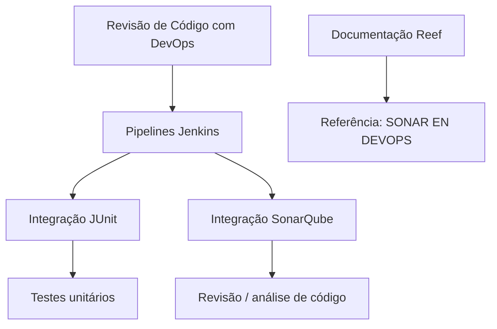

# Certificação de Revisão de Código com DevOps: JUnit, SonarQube e Jenkins

## 1. Metadados do Documento
- **Arquivo de Origem:** Não identificado
- **Tipo de Documento:** Apresentação Executiva / Material de Capacitação
- **Domínio / Sistema:** Certificação de Revisão de Código com DevOps; documentação Reef; Mapfre
- **Público-Alvo:** Desenvolvedores, Arquitetos e equipes de DevOps
- **Data/Versão Identificada:** Não identificada

---

## 2. Resumo Executivo & Contexto de Negócio

O documento apresenta o módulo **“Certificación de Revisión de Código - Revisión de Código con DevOps”**. A finalidade declarada é revisar a integração de testes unitários e de revisão de código no contexto de DevOps.

O conteúdo cita especificamente a integração de **JUnit** e **SonarQube** em pipelines de **Jenkins**. Dessa forma, o material relaciona a execução de testes unitários e a análise de código à automação de pipelines.

O documento também aponta a existência de uma referência adicional denominada **“SONAR EN DEVOPS”**, indicada como fonte para mais informações sobre Sonar em DevOps.

A documentação está associada ao ambiente de documentação **Reef**, com referências a **Mapfredocument**, navegação por soluções, arquiteturas, APIs, componentes, cloud, Zeus, Reef e ajuda. O ciclo de vida apresentado é **Approved**, e o proprietário identificado é `user:agonzalez_mapfre.com`.

> **Nota de Análise:** O documento não detalha a configuração dos pipelines Jenkins, os comandos JUnit, os quality gates do SonarQube, os critérios de aprovação de código ou contratos de integração entre as ferramentas.

---

## 3. Arquitetura, Componentes & Tecnologias Envolvidas

Os componentes e tecnologias explicitamente mencionados são:

- **DevOps:** contexto no qual testes unitários e revisão de código são integrados.
- **JUnit:** ferramenta ou framework citado para integração de testes unitários.
- **SonarQube:** ferramenta citada para revisão ou análise de código.
- **Jenkins:** plataforma de pipelines na qual JUnit e SonarQube serão integrados.
- **Reef:** ambiente ou portal de documentação mencionado.
- **Mapfredocument:** referência exibida na navegação documental.
- **Zeus:** item de navegação citado, sem detalhamento técnico.



> **Nota de Análise:** O diagrama representa somente as relações explicitamente declaradas: JUnit e SonarQube são integrados em pipelines Jenkins no contexto de DevOps. O documento não informa sequência de execução, gatilhos, repositórios, servidores, URLs, portas ou mecanismos de autenticação.

---

## 4. Regras de Negócio, Especificações Funcionais & Processos

1. O módulo possui como finalidade revisar a integração de testes unitários e revisão de código em DevOps.
2. O documento estabelece que serão revisadas as integrações de **JUnit** e **SonarQube** nos pipelines de **Jenkins**.
3. Existe uma referência complementar denominada **“SONAR EN DEVOPS”** para consulta de informações adicionais.
4. O material está registrado na documentação Reef com ciclo de vida **Approved**.
5. O proprietário indicado para o conteúdo é `user:agonzalez_mapfre.com`.

### Processo identificado

1. Consultar o módulo de certificação de revisão de código com DevOps.
2. Revisar o tema de integração de testes unitários no processo DevOps.
3. Revisar o tema de revisão de código no processo DevOps.
4. Examinar a integração de JUnit nos pipelines Jenkins.
5. Examinar a integração de SonarQube nos pipelines Jenkins.
6. Consultar a referência adicional “SONAR EN DEVOPS” quando forem necessárias informações complementares.

> **Nota de Análise:** Não foram fornecidos critérios objetivos de aprovação/reprovação, métricas de qualidade, limites de cobertura de testes, regras de quality gate, fases do pipeline ou procedimentos de tratamento de falhas.

---

## 5. Tabelas de Parâmetros, Ambientes e Estruturas de Dados

| Item / Parâmetro | Descrição / Função | Tipo / Valores / Formato | Ambiente / Observações |
| :--- | :--- | :--- | :--- |
| Módulo | Certificação de revisão de código com DevOps | `CERTIFICACIÓN de REVISIÓN de CÓDIGO - Revisión de Código con DevOps` | Material de capacitação |
| Objetivo | Revisar integração de testes unitários e revisão de código | Texto descritivo | Contexto DevOps |
| JUnit | Integração de testes unitários | Tecnologia/ferramenta citada | Pipelines Jenkins |
| SonarQube | Integração para revisão ou análise de código | Tecnologia/ferramenta citada | Pipelines Jenkins |
| Jenkins | Plataforma de pipelines mencionada | Ferramenta de automação citada | Integra JUnit e SonarQube |
| Referência adicional | Fonte para mais informações | `SONAR EN DEVOPS` | Não há URL apresentada |
| Portal documental | Ambiente de documentação | `DOCUMENTACIÓN Reef` | Reef |
| Referência documental | Item exibido no portal | `Mapfredocument` | Sem detalhamento |
| Proprietário | Responsável identificado no documento | `user:agonzalez_mapfre.com` | Campo `Owner` |
| Ciclo de vida | Estado do conteúdo | `Approved` | Campo `Lifecycle` |
| Fonte | Classificação exibida | `VL` | Campo `Source`; significado não detalhado |
| Idioma | Idioma exibido na interface | `ES` | Espanhol |
| Navegação | Categorias visíveis | Buscar, Inicio, Soluciones, Arquitecturas, APIs, Componentes, Cloud, Documentación, Zeus, Reef, Ayuda | Interface documental |

---

## 6. Bateria de Perguntas & Respostas para RAG (FAQ Sintético)

### P1: Qual é o objetivo do módulo de Certificação de Revisão de Código com DevOps?
**R:** O objetivo declarado é repassar ou revisar a integração de testes unitários e revisão de código no contexto de DevOps.

### P2: Quais ferramentas são citadas para integração nos pipelines Jenkins?
**R:** O documento cita a integração de JUnit e SonarQube nos pipelines de Jenkins.

### P3: Qual ferramenta está associada aos testes unitários?
**R:** JUnit é a ferramenta explicitamente citada no documento no contexto de integração de testes unitários em pipelines Jenkins.

### P4: Qual ferramenta está associada à revisão de código no documento?
**R:** SonarQube é citado como ferramenta integrada aos pipelines Jenkins no módulo sobre revisão de código com DevOps. O documento não detalha funcionalidades específicas, regras ou métricas do SonarQube.

### P5: O documento informa como configurar JUnit no Jenkins?
**R:** Não. O documento afirma que a integração de JUnit será revisada nos pipelines Jenkins, mas não apresenta configuração, comandos, plugins, arquivos ou exemplos de pipeline.

### P6: O documento define quality gates ou limites de cobertura no SonarQube?
**R:** Não. Não há métricas, quality gates, percentuais de cobertura, limites de vulnerabilidades, regras de lint ou critérios de aprovação descritos.

### P7: Onde buscar mais informações sobre Sonar em DevOps?
**R:** O documento indica a referência denominada “SONAR EN DEVOPS” como fonte para obter mais informações. Nenhum URL ou caminho detalhado é fornecido no conteúdo extraído.

### P8: Qual é o portal de documentação relacionado ao material?
**R:** O material faz referência a “DOCUMENTACIÓN Reef”, indicando Reef como o ambiente ou portal documental associado.

### P9: Qual é o ciclo de vida do documento?
**R:** O campo `Lifecycle` está identificado como `Approved`.

### P10: Quem é o proprietário identificado do documento?
**R:** O campo `Owner` informa `user:agonzalez_mapfre.com`.

### P11: O documento apresenta uma arquitetura detalhada dos componentes DevOps?
**R:** Não. O documento apenas estabelece a relação entre DevOps, pipelines Jenkins, JUnit e SonarQube. Não há informações sobre camadas, servidores, repositórios, redes, ambientes ou interfaces técnicas.

---

## 7. Glossário de Termos, Siglas & Conceitos-Chave

- **DevOps:** Contexto citado para a integração de testes unitários e revisão de código.
- **JUnit:** Tecnologia mencionada para integração de testes unitários nos pipelines Jenkins.
- **SonarQube:** Tecnologia mencionada para integração em pipelines Jenkins no contexto de revisão de código.
- **Jenkins:** Plataforma de pipelines mencionada para integrar JUnit e SonarQube.
- **Reef:** Ambiente ou portal de documentação citado no conteúdo.
- **Mapfredocument:** Referência exibida na navegação do ambiente documental.
- **VL:** Valor exibido no campo `Source`; o documento não define seu significado.
- **Owner:** Campo que identifica o responsável pelo conteúdo documental.
- **Lifecycle:** Campo que indica o estado do ciclo de vida do documento.
- **Approved:** Estado de ciclo de vida exibido para o conteúdo.

---

## 8. Notas Críticas, Riscos & Limitações

- O conteúdo extraído possui caráter resumido e não fornece detalhes operacionais para implementação das integrações.
- Não há URLs, identificadores de projetos, nomes de jobs Jenkins, versões de ferramentas, comandos, arquivos de configuração ou credenciais.
- Não são descritos critérios de revisão de código, regras de aprovação, métricas de qualidade ou tratamento de falhas de pipeline.
- O documento não especifica se JUnit e SonarQube são executados em etapas distintas, paralelas ou condicionais dentro do Jenkins.
- O significado de `VL`, exibido como fonte, não é definido.
- Não há detalhamento técnico sobre Reef, Mapfredocument ou Zeus além de suas menções na navegação documental.

---

## 9. Conteúdo Bruto Estruturado (Referência Fiel)

```text
--- [PÁGINA 1 DE 1] ---

CERTIFICACIÓN de REVISIÓN de CÓDIGO - Revisión de Código con
DevOps
OBJETIVO
La nalidad de este módulo es repasar la integración de pruebas unitarias y revisión de código en DevOps.
Sonar en DevOps
Sonar en DevOps
Se revisará las integración de JUnit y SonarQube en los pipelines de Jenkins.
Podemos encontrar más información en: SONAR EN DEVOPS
Documentation / DOCUMENTACIÓN Reef
DOCUMENTACIÓN Reef
Mapfredocument
DOCUMENTACIÓN Reef
Owner
user:agonzalez_mapfre.com
Lifecycle
Approved Source
 / 
 VL
Buscar Inicio Soluciones Arquitecturas APIs Componentes Cloud Documentación Zeus Reef Ayuda
ES
```
