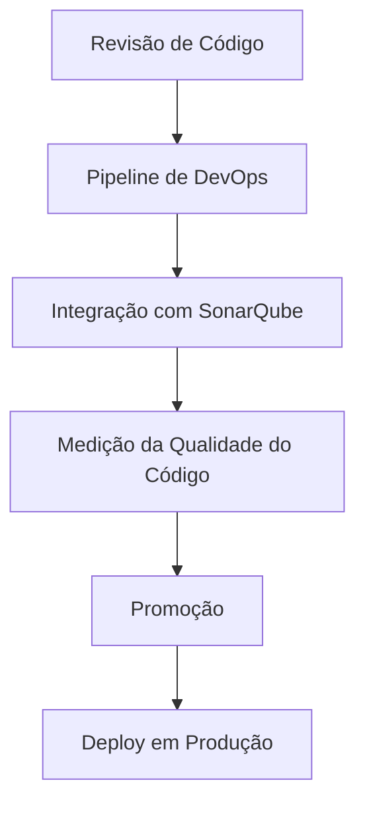

# Certificação — Revisão de Código Nível 4 com DevOps e SonarQube

## 1. Metadados do Documento
- **Arquivo de Origem:** Não identificado no conteúdo fornecido
- **Tipo de Documento:** Material de certificação / documentação técnica
- **Domínio / Sistema:** Reef / Mapfre / DevOps
- **Público-Alvo:** Desenvolvedores, equipes DevOps e profissionais em certificação de revisão de código
- **Data/Versão Identificada:** Nível 4; data e versão documental não identificadas

---

## 2. Resumo Executivo & Contexto de Negócio

O documento apresenta material de **Certificação de Revisão de Código nível 4**, com foco explícito em revisão de código integrada a práticas de DevOps. O conteúdo identifica a documentação como parte do contexto de **Reef**, também associado a referências de navegação e documentação corporativa Mapfre.

O objetivo declarado é integrar o **SonarQube** aos pipelines de DevOps. A integração tem como finalidade permitir a medição da qualidade do código antes da promoção e do deploy para o ambiente de Produção.

O conteúdo disponível é resumido e não descreve configurações técnicas, comandos, critérios de qualidade, limiares de aprovação, linguagens de programação, repositórios, pipelines específicos ou contratos de integração. Portanto, a análise preserva somente a relação explicitamente apresentada entre revisão de código, DevOps, SonarQube, qualidade de código, promoção e implantação em Produção.

O documento também contém referências à navegação de um portal de documentação, incluindo áreas como Soluções, Arquiteturas, APIs, Componentes, Cloud, Zeus, Reef e Ajuda. Não há detalhamento funcional adicional dessas áreas no texto fornecido.

---

## 3. Arquitetura, Componentes & Tecnologias Envolvidas

Os componentes e conceitos explicitamente citados são:

| Componente / Conceito | Papel identificado no documento |
| :--- | :--- |
| Revisão de Código | Tema central da certificação de nível 4. |
| DevOps | Contexto no qual a revisão de código e a integração de qualidade são abordadas. |
| SonarQube | Ferramenta a ser integrada aos pipelines de DevOps para medir a qualidade do código. |
| Pipelines de DevOps | Fluxo no qual o SonarQube deve ser integrado. |
| Promoção | Etapa posterior à medição de qualidade do código. |
| Produção | Ambiente de destino citado para o deploy. |
| Reef | Contexto de documentação citado no documento. |
| Mapfre | Referência corporativa presente no conteúdo. |
| Zeus | Área ou referência de navegação citada, sem detalhamento técnico. |



**Nota de Análise:** O documento estabelece que o SonarQube deve medir a qualidade do código antes da promoção e do deploy em Produção, mas não detalha critérios de aprovação, quality gates, métricas, responsáveis, ferramentas de CI/CD ou mecanismos de bloqueio do pipeline.

---

## 4. Regras de Negócio, Especificações Funcionais & Processos

### Processo identificado: medição de qualidade antes da promoção e deploy

1. O conteúdo aborda a revisão de código no contexto de DevOps.
2. O SonarQube deve ser integrado aos pipelines de DevOps.
3. A integração deve permitir medir a qualidade do código.
4. A medição de qualidade deve ocorrer antes da promoção do código.
5. A medição de qualidade também deve ocorrer antes do deploy em Produção.

### Restrições e detalhes não especificados

- O documento não informa quais métricas de qualidade devem ser medidas pelo SonarQube.
- O documento não informa valores mínimos, limites, quality gates ou regras de bloqueio.
- O documento não informa se a promoção é automática ou manual.
- O documento não identifica ferramentas de integração contínua ou entrega contínua.
- O documento não define fluxos de aprovação, papéis responsáveis ou níveis de permissão.
- O documento não apresenta URLs, portas, servidores, credenciais, caminhos de log ou variáveis de configuração.

---

## 5. Tabelas de Parâmetros, Ambientes e Estruturas de Dados

| Item / Parâmetro | Descrição / Função | Tipo / Valores / Formato | Ambiente / Observações |
| :--- | :--- | :--- | :--- |
| Certificação | Material identificado como “Certificación - Revisión de Código Nivel 4”. | Nível 4 | Sem data ou versão adicional. |
| Revisão de Código | Tema central do documento. | Processo técnico | Associado ao contexto DevOps. |
| SonarQube | Ferramenta mencionada para medição da qualidade do código. | Ferramenta de qualidade de código | Deve ser integrada aos pipelines de DevOps. |
| Pipeline de DevOps | Fluxo no qual a integração com SonarQube deve ocorrer. | Pipeline | Tecnologia de CI/CD não identificada. |
| Medição de qualidade | Resultado esperado da integração do SonarQube. | Processo de avaliação | Deve acontecer antes de promoção e deploy. |
| Promoção | Etapa posterior à medição de qualidade do código. | Etapa de entrega | Critérios e processo não detalhados. |
| Produção | Ambiente de destino para deploy citado no texto. | Ambiente | Não há URL, servidor ou configuração identificada. |
| Owner | Campo exibido na referência documental. | `user:agonzalez_mapfre.com` | O texto não descreve o papel ou responsabilidades do owner. |
| Lifecycle | Campo exibido na referência documental. | `Approved Source / VL` | O significado de `VL` não é detalhado. |
| Idioma | Idioma exibido na navegação. | `ES` | Provavelmente indica espanhol, sem explicação adicional. |

---

## 6. Bateria de Perguntas & Respostas para RAG (FAQ Sintético)

### P1: Qual é o objetivo da integração do SonarQube nos pipelines de DevOps?
**R:** O objetivo declarado é medir a qualidade do código antes que o código seja promovido e implantado no ambiente de Produção.

### P2: Em qual momento a qualidade do código deve ser medida segundo o documento?
**R:** A qualidade do código deve ser medida antes da promoção e antes do deploy em Produção.

### P3: Qual ferramenta de qualidade de código é mencionada no material de certificação?
**R:** A ferramenta mencionada é o SonarQube, que deve ser integrado aos pipelines de DevOps.

### P4: Qual é o nível da certificação de revisão de código apresentada?
**R:** O documento identifica a certificação como “Revisión de Código nivel 4”.

### P5: O documento define quais métricas do SonarQube devem ser avaliadas?
**R:** Não. O documento informa somente que o SonarQube deve permitir medir a qualidade do código; métricas, limiares e quality gates não são detalhados.

### P6: O documento informa qual ferramenta de CI/CD executa os pipelines de DevOps?
**R:** Não. O texto menciona pipelines de DevOps, mas não identifica nenhuma ferramenta específica de integração contínua ou entrega contínua.

### P7: O documento detalha regras que bloqueiam a promoção para Produção?
**R:** Não. O documento apenas estabelece que a qualidade do código deve ser medida antes da promoção e do deploy em Produção; não há critérios de bloqueio ou aprovação descritos.

### P8: Qual contexto documental é citado para o material de revisão de código?
**R:** O conteúdo faz referência a “Documentation / DOCUMENTACIÓN Reef”, “DOCUMENTACIÓN Reef” e “Mapfredocument”, indicando associação com o contexto documental Reef e Mapfre.

### P9: Quais áreas de navegação são listadas no portal de documentação?
**R:** O texto lista Buscar, Inicio, Soluciones, Arquitecturas, APIs, Componentes, Cloud, Documentación, Zeus, Reef e Ayuda. O documento não detalha o conteúdo ou a função de cada área.

### P10: O documento fornece URLs, servidores ou caminhos de logs para a integração do SonarQube?
**R:** Não. Não foram identificados URLs, servidores, portas, rotas de logs ou parâmetros de configuração no conteúdo fornecido.

---

## 7. Glossário de Termos, Siglas & Conceitos-Chave

- **DevOps:** Contexto operacional citado para integração do SonarQube em pipelines e medição da qualidade de código.
- **SonarQube:** Ferramenta mencionada para medir a qualidade do código em pipelines de DevOps.
- **Pipeline de DevOps:** Fluxo de automação no qual o SonarQube deve ser integrado.
- **Promoção:** Etapa citada que ocorre após a medição de qualidade do código.
- **Produção:** Ambiente citado como destino do deploy.
- **Reef:** Contexto ou área de documentação identificada no conteúdo.
- **Mapfre:** Referência corporativa presente no texto.
- **Zeus:** Área ou referência de navegação mencionada sem definição adicional.
- **VL:** Sigla exibida no campo Lifecycle; significado não definido no documento.
- **ES:** Código exibido na navegação; o documento não o explica.

---

## 8. Notas Críticas, Riscos & Limitações

- **Nota de Análise:** O conteúdo é resumido e não descreve a implementação técnica da integração entre SonarQube e os pipelines de DevOps.
- Não há especificação de quality gates, métricas, thresholds, severidades, regras de aprovação ou critérios de falha.
- Não há identificação de ferramentas de CI/CD, repositórios, branches, linguagens, ambientes intermediários ou responsáveis operacionais.
- Não há detalhes sobre autenticação, credenciais, URLs, servidores, portas, variáveis de ambiente ou rotas de logs.
- O campo `Lifecycle` apresenta `Approved Source / VL`, mas o documento não explica o ciclo de vida documental nem o significado de `VL`.
- O documento menciona Reef, Mapfre e Zeus, porém não apresenta detalhamento adicional sobre suas relações, responsabilidades ou arquitetura.

---

## 9. Conteúdo Bruto Estruturado (Referência Fiel)

```text
--- [PÁGINA 1 DE 1] ---

CERTIFICACIÓN - REVISIÓN DE CÓDIGO NIVEL 4
CERTIFICACIÓN Revisión de Código
nivel 4
REVISIÓN DE CÓDIGO CON DEVOPS
En este apartado se encuentra el temario para integrar SonarQube en los pipelines de DevOps, de forma que podamos medir la calidad de
nuestro código antes de su promoción y despliegue en Producción
Documentation / DOCUMENTACIÓN Reef
DOCUMENTACIÓN Reef
Mapfredocument
DOCUMENTACIÓN Reef
Owner
user:agonzalez_mapfre.com
Lifecycle
Approved Source
 / 
 VL
Buscar Inicio Soluciones Arquitecturas APIs Componentes Cloud Documentación Zeus Reef Ayuda
ES
```
