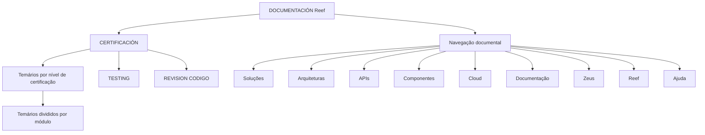

# Documentação Reef — Temários de Certificação, Testing e Revisão de Código

## 1. Metadados do Documento
- **Arquivo de Origem:** `Não identificado`
- **Tipo de Documento:** `Documentação / índice de conteúdo`
- **Domínio / Sistema:** `Reef / Mapfre`
- **Público-Alvo:** `Não identificado; conteúdo sugere usuários de documentação, testing e revisão de código`
- **Data/Versão Identificada:** `Não identificada`

---

## 2. Resumo Executivo & Contexto de Negócio

O conteúdo apresenta uma área de documentação associada a **Reef**, identificada também como **DOCUMENTACIÓN Reef** e **Documentation / DOCUMENTACIÓN Reef**. O material inclui uma seção denominada **CERTIFICACIÓN**.

A seção de certificação informa que contém os **temários de cada um dos níveis de certificação**. Esses temários são organizados e divididos por módulo, porém o documento não lista os níveis, os módulos, os requisitos ou os critérios de aprovação.

Os tópicos **TESTING** e **REVISION CODIGO** são mencionados como itens de conteúdo relacionados à certificação ou documentação. O texto também apresenta elementos de navegação para áreas como Soluções, Arquiteturas, APIs, Componentes, Cloud, Documentação, Zeus, Reef e Ajuda.

---

## 3. Arquitetura, Componentes & Tecnologias Envolvidas

O texto não descreve arquitetura de software, integrações, tecnologias, APIs, microsserviços, ambientes ou fluxos de dados. Os únicos elementos estruturais explicitamente identificados são a documentação Reef, a seção de certificação, os temas Testing e Revisão de Código, e a navegação documental.



**Nota de Análise:** O diagrama representa exclusivamente a organização conceitual e os itens de navegação visíveis no conteúdo. O documento não detalha relações técnicas ou operacionais entre Reef, Zeus, Testing, Revisão de Código, APIs ou Cloud.

---

## 4. Regras de Negócio, Especificações Funcionais & Processos

1. A seção **CERTIFICACIÓN** concentra os temários associados aos níveis de certificação.
2. Cada nível de certificação possui um temário correspondente, conforme informado no texto.
3. Os temários de certificação são divididos por módulo.
4. **TESTING** é listado como tópico de conteúdo.
5. **REVISION CODIGO** é listado como tópico de conteúdo.
6. A documentação Reef disponibiliza navegação para: Buscar, Inicio, Soluciones, Arquitecturas, APIs, Componentes, Cloud, Documentación, Zeus, Reef e Ayuda.
7. O conteúdo apresenta o idioma **ES**.
8. O documento indica o proprietário como `user:agonzalez_mapfre.com`.
9. O ciclo de vida exibido é `Approved`.
10. A origem exibida é `Source / VL`.

**Nota de Análise:** O documento não detalha regras de aprovação, pré-requisitos de certificação, conteúdos dos módulos, procedimentos de testing, critérios de revisão de código ou responsabilidades operacionais.

---

## 5. Tabelas de Parâmetros, Ambientes e Estruturas de Dados

| Item / Parâmetro | Descrição / Função | Tipo / Valores / Formato | Ambiente / Observações |
| :--- | :--- | :--- | :--- |
| CERTIFICACIÓN | Seção que contém os temários dos níveis de certificação. | Seção documental | Os níveis não são identificados. |
| Temários | Conteúdo associado aos níveis de certificação. | Dividido por módulo | Os módulos não são detalhados. |
| TESTING | Tópico listado no conteúdo. | Texto / item documental | Não há detalhamento funcional ou técnico. |
| REVISION CODIGO | Tópico listado no conteúdo. | Texto / item documental | Não há critérios, ferramentas ou processo descritos. |
| DOCUMENTACIÓN Reef | Identificação da área ou documento de documentação Reef. | Título / identificação documental | Também exibido como `Documentation / DOCUMENTACIÓN Reef`. |
| Owner | Proprietário exibido para o conteúdo. | `user:agonzalez_mapfre.com` | Valor apresentado literalmente no texto. |
| Lifecycle | Estado de ciclo de vida do conteúdo. | `Approved` | Não há descrição do fluxo de aprovação. |
| Source | Origem indicada para o conteúdo. | `VL` | Exibido como `Source / VL`. |
| Idioma | Idioma exibido na interface documental. | `ES` | O conteúdo inclui texto em espanhol. |
| Navegação | Áreas disponíveis na interface. | Buscar, Inicio, Soluciones, Arquitecturas, APIs, Componentes, Cloud, Documentación, Zeus, Reef, Ayuda | Não representa necessariamente componentes técnicos integrados. |

---

## 6. Bateria de Perguntas & Respostas para RAG (FAQ Sintético)

### P1: Qual é a finalidade da seção CERTIFICACIÓN na documentação Reef?
**R:** A seção **CERTIFICACIÓN** contém os temários associados a cada nível de certificação. O documento informa que esses temários estão divididos por módulo.

### P2: Como os temários de certificação estão organizados?
**R:** Os temários estão organizados por níveis de certificação e divididos por módulo. O documento não identifica os nomes ou conteúdos dos módulos.

### P3: Quais tópicos técnicos são explicitamente citados no conteúdo?
**R:** Os tópicos explicitamente citados são **TESTING** e **REVISION CODIGO**. O texto não fornece detalhamento sobre processos, ferramentas ou critérios desses tópicos.

### P4: O documento descreve os critérios necessários para aprovação em uma certificação?
**R:** Não. O documento apenas informa que existem temários para cada nível de certificação e que eles são divididos por módulo.

### P5: Quais áreas estão disponíveis na navegação da documentação Reef?
**R:** A navegação apresenta: Buscar, Inicio, Soluciones, Arquitecturas, APIs, Componentes, Cloud, Documentación, Zeus, Reef e Ayuda.

### P6: Quem é identificado como proprietário do conteúdo?
**R:** O proprietário exibido no documento é `user:agonzalez_mapfre.com`.

### P7: Qual é o status de ciclo de vida do documento?
**R:** O campo **Lifecycle** está identificado como `Approved`.

### P8: Qual origem é indicada para a documentação?
**R:** O documento apresenta a origem como `Source / VL`.

### P9: O documento especifica APIs, URLs, portas ou contratos de integração?
**R:** Não. Embora a navegação inclua uma área chamada **APIs**, o conteúdo não apresenta endpoints, URLs, métodos HTTP, portas, contratos ou integrações.

### P10: O documento detalha uma arquitetura do sistema Reef?
**R:** Não. O conteúdo cita áreas de navegação como Arquiteturas, Componentes e Cloud, mas não descreve componentes, camadas, tecnologias, servidores ou fluxos arquiteturais.

---

## 7. Glossário de Termos, Siglas & Conceitos-Chave

- **CERTIFICACIÓN:** Seção que reúne temários para níveis de certificação.
- **Temário:** Conteúdo programático associado a um nível de certificação.
- **Módulo:** Unidade de organização dos temários de certificação.
- **TESTING:** Tópico citado no documento sem detalhamento adicional.
- **REVISION CODIGO:** Tópico de revisão de código citado sem detalhamento adicional.
- **Reef:** Nome associado à documentação apresentada.
- **Zeus:** Área listada na navegação documental; o documento não define seu significado.
- **Lifecycle:** Campo de ciclo de vida do conteúdo, apresentado com o valor `Approved`.
- **Source:** Campo de origem do conteúdo, apresentado com o valor `VL`.
- **VL:** Valor associado ao campo Source; o documento não expande a sigla.

---

## 8. Notas Críticas, Riscos & Limitações

- O conteúdo é extremamente resumido e não apresenta detalhes operacionais ou técnicos sobre a certificação.
- Não foram identificados nomes de níveis de certificação, módulos, ementas, avaliações, pré-requisitos ou critérios de aprovação.
- O documento cita **TESTING** e **REVISION CODIGO**, mas não descreve práticas, ferramentas, responsáveis ou fluxos associados.
- Não há informações sobre arquitetura, integrações, APIs, ambientes, servidores, logs, credenciais, URLs ou versões.
- **Nota de Análise:** O texto lista Reef e Zeus na navegação, mas não estabelece uma relação técnica entre esses elementos.
- **Nota de Análise:** O documento não permite inferir o significado da origem `VL` nem a função do item `Mapfredocument`.

---

## 9. Conteúdo Bruto Estruturado (Referência Fiel)

```text
--- [PÁGINA 1 DE 1] ---

CERTIFICACIÓN
 En este apartado se encuentran los temarios de cada uno de los niveles de certicación. Los temarios están
divididas por módulo.
 TESTING
  REVISION CODIGO
Documentation / DOCUMENTACIÓN Reef
DOCUMENTACIÓN Reef
Mapfredocument
DOCUMENTACIÓN Reef
Owner
user:agonzalez_mapfre.com
Lifecycle
Approved Source
 / 
 VL
Buscar Inicio Soluciones Arquitecturas APIs Componentes Cloud Documentación Zeus Reef Ayuda
ES
```
