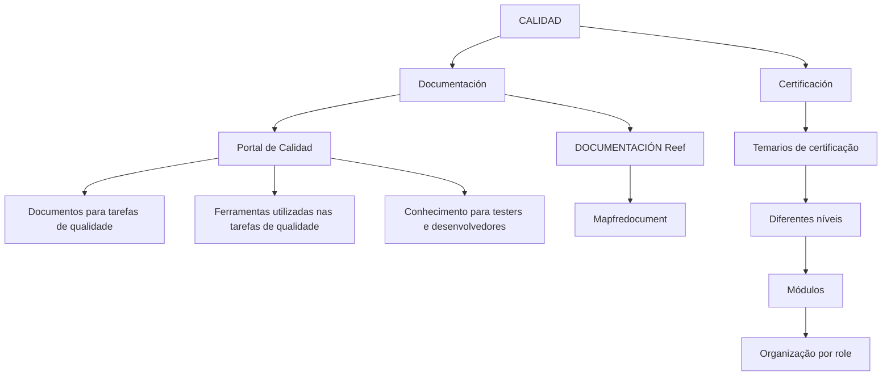

# Portal de Qualidade — Documentação e Certificação Reef

## 1. Metadados do Documento
- **Arquivo de Origem:** `Não identificado no conteúdo fornecido`
- **Tipo de Documento:** Página de portal de documentação corporativa
- **Domínio / Sistema:** Qualidade de Produto, Portal de Calidad, Reef, Mapfredocument
- **Público-Alvo:** Testers, desenvolvedores e pessoas que realizam tarefas por função/role
- **Data/Versão Identificada:** Não identificada

---

## 2. Resumo Executivo & Contexto de Negócio

O conteúdo apresenta a seção **CALIDAD**, destinada a centralizar documentação para aquisição de conhecimentos funcionais e técnicos relacionados à qualidade de um produto. A informação é organizada em duas perspectivas explícitas: **Documentación** e **Certificación**.

A perspectiva de **Documentación** fornece acesso ao **Portal de Calidad**, local em que estão disponíveis documentos para apoiar a realização das tarefas de qualidade de um produto. O portal também reúne informações sobre as ferramentas utilizadas na execução dessas atividades.

O documento informa que testers e desenvolvedores podem utilizar o Portal de Calidad para compreender como são realizadas as atividades necessárias para garantir a qualidade do produto. Não são apresentados procedimentos detalhados, tecnologias específicas, critérios de aceite ou fluxos operacionais de qualidade.

A perspectiva de **Certificación** reúne conteúdos programáticos de diferentes níveis de certificação. Esses conteúdos são divididos por módulos conforme o papel da pessoa responsável pelas tarefas.

---

## 3. Arquitetura, Componentes & Tecnologias Envolvidas

Os elementos identificados no conteúdo são:

| Componente / Elemento | Função descrita |
| :--- | :--- |
| CALIDAD | Seção que contém documentação para conhecimento funcional e técnico. |
| Documentación | Perspectiva que direciona ao Portal de Calidad e à documentação de qualidade. |
| Certificación | Perspectiva que reúne temários de certificação por nível, módulo e role. |
| Portal de Calidad | Portal onde estão documentos e ferramentas relacionadas às tarefas de qualidade de produto. |
| Reef | Item identificado como “DOCUMENTACIÓN Reef” e como opção de navegação. |
| Mapfredocument | Nome exibido no conteúdo sem detalhamento adicional. |
| Zeus | Opção de navegação exibida sem detalhamento adicional. |
| Soluciones | Opção de navegação exibida sem detalhamento adicional. |
| Arquitecturas | Opção de navegação exibida sem detalhamento adicional. |
| APIs | Opção de navegação exibida sem detalhamento adicional. |
| Componentes | Opção de navegação exibida sem detalhamento adicional. |
| Cloud | Opção de navegação exibida sem detalhamento adicional. |



> **Nota de Análise:** O conteúdo não descreve integrações, protocolos, APIs, métodos HTTP, tecnologias de implementação, ambientes ou fluxos de dados entre os itens apresentados.

---

## 4. Regras de Negócio, Especificações Funcionais & Processos

### Organização da informação de qualidade

1. A seção **CALIDAD** disponibiliza documentação voltada à aquisição de conhecimentos funcionais e técnicos.
2. A informação de qualidade é organizada em duas perspectivas:
   - **Documentación**
   - **Certificación**

### Perspectiva de documentação

1. A área de **Documentación** disponibiliza acesso ao **Portal de Calidad**.
2. O Portal de Calidad contém documentos que auxiliam na execução das tarefas de qualidade de um produto.
3. O Portal de Calidad também permite conhecer as ferramentas utilizadas na realização das tarefas de qualidade.
4. Testers e desenvolvedores podem utilizar a documentação para compreender as atividades necessárias para garantir a qualidade do produto.

### Perspectiva de certificação

1. A área de **Certificación** contém temários de diferentes níveis de certificação.
2. Os temários de certificação são divididos por módulos.
3. A divisão dos módulos considera o **rol/role** da pessoa que executa as tarefas.

> **Nota de Análise:** O documento não detalha quais são os níveis de certificação, módulos, roles, ferramentas de qualidade, critérios de aprovação ou procedimentos específicos.

---

## 5. Tabelas de Parâmetros, Ambientes e Estruturas de Dados

| Item / Parâmetro | Descrição / Função | Tipo / Valores / Formato | Ambiente / Observações |
| :--- | :--- | :--- | :--- |
| Seção principal | Área de conhecimento relacionada à qualidade. | `CALIDAD` | Não há ambiente técnico informado. |
| Perspectiva documental | Acesso a documentos e ferramentas para tarefas de qualidade. | `Documentación` | Direciona ao Portal de Calidad. |
| Perspectiva de certificação | Acesso a conteúdos programáticos de certificação. | `Certificación` | Organizada por níveis, módulos e role. |
| Portal | Reúne documentos e informações sobre ferramentas de qualidade. | `Portal de Calidad` | Destinado a apoiar tarefas de qualidade de produto. |
| Público mencionado | Pessoas que podem compreender atividades de garantia da qualidade. | Testers e desenvolvedores | Não há matriz de permissões apresentada. |
| Documentação Reef | Item de documentação exibido no portal. | `DOCUMENTACIÓN Reef` | Sem descrição funcional adicional. |
| Mapfredocument | Nome exibido no conteúdo. | `Mapfredocument` | Sem detalhamento adicional. |
| Owner | Identificador de proprietário exibido. | `user:agonzalez_mapfre.com` | O significado operacional do identificador não é detalhado. |
| Lifecycle | Estado de ciclo de vida exibido. | `Approved` | Não há explicação sobre o processo de aprovação. |
| Fonte | Indicação de origem exibida. | `Source / VL` | Não há explicação para `VL`. |
| Idioma | Idioma exibido na navegação. | `ES` | O conteúdo principal está em espanhol. |
| Navegação | Itens de menu exibidos. | Buscar, Inicio, Soluciones, Arquitecturas, APIs, Componentes, Cloud, Documentación, Zeus, Reef, Ayuda | Não são detalhados no texto. |

---

## 6. Bateria de Perguntas & Respostas para RAG (FAQ Sintético)

### P1: Qual é o objetivo da seção CALIDAD?
**R:** A seção CALIDAD reúne documentação para aquisição de conhecimentos funcionais e técnicos relacionados à qualidade. A informação é organizada nas perspectivas Documentación e Certificación.

### P2: Quais são as duas perspectivas de organização da informação no conteúdo de qualidade?
**R:** O conteúdo organiza a informação nas perspectivas **Documentación** e **Certificación**. Documentación direciona ao Portal de Calidad; Certificación reúne temários de diferentes níveis de certificação.

### P3: O que pode ser encontrado no Portal de Calidad?
**R:** O Portal de Calidad contém documentos que ajudam a realizar tarefas de qualidade de um produto e informações para conhecer as ferramentas utilizadas na execução dessas tarefas.

### P4: Quem pode usar a documentação do Portal de Calidad?
**R:** O conteúdo menciona testers e desenvolvedores como públicos que podem compreender as atividades necessárias para garantir a qualidade do produto por meio da documentação disponível.

### P5: O que a área de Certificación disponibiliza?
**R:** A área de Certificación disponibiliza temários de diferentes níveis de certificação. Os temários são divididos por módulos em função do role da pessoa que realiza as tarefas.

### P6: O documento informa quais ferramentas de qualidade são utilizadas?
**R:** Não. O conteúdo afirma que o Portal de Calidad permite conhecer as ferramentas utilizadas nas tarefas de qualidade, mas não identifica nem descreve nenhuma ferramenta específica.

### P7: Quais detalhes existem sobre DOCUMENTACIÓN Reef?
**R:** O conteúdo exibe o item “DOCUMENTACIÓN Reef” e também apresenta Reef na navegação. Não há descrição adicional sobre o escopo, os documentos, funcionalidades ou integrações de Reef.

### P8: Qual é o estado de lifecycle apresentado para a documentação?
**R:** O conteúdo apresenta o lifecycle como **Approved**. Não há detalhamento sobre as regras, responsáveis ou etapas que levaram a esse estado.

### P9: Existe uma URL ou ambiente técnico do Portal de Calidad?
**R:** Não. O conteúdo não apresenta URL, hostname, porta, ambiente, credenciais técnicas ou instruções de acesso ao Portal de Calidad.

### P10: O que significa o identificador `user:agonzalez_mapfre.com`?
**R:** O identificador aparece no campo **Owner**. O conteúdo não explica se representa usuário, grupo, conta corporativa ou outro tipo de proprietário.

---

## 7. Glossário de Termos, Siglas & Conceitos-Chave

- **CALIDAD:** Seção destinada à documentação sobre qualidade, incluindo conhecimentos funcionais e técnicos.
- **Documentación:** Perspectiva que fornece acesso a documentos e ao Portal de Calidad.
- **Certificación:** Perspectiva que reúne temários para níveis de certificação divididos em módulos.
- **Portal de Calidad:** Local que reúne documentação para tarefas de qualidade de produto e informações sobre ferramentas utilizadas nessas tarefas.
- **Role / Rol:** Papel da pessoa que realiza tarefas; utilizado como critério para dividir os temários de certificação em módulos.
- **DOCUMENTACIÓN Reef:** Item de documentação identificado no conteúdo, sem detalhamento funcional adicional.
- **Reef:** Item presente na navegação e associado à documentação exibida.
- **Mapfredocument:** Nome exibido no conteúdo sem definição adicional.
- **Lifecycle:** Campo que indica o estado de ciclo de vida da documentação; o valor exibido é `Approved`.
- **Approved:** Estado de lifecycle exibido para o conteúdo.
- **VL:** Sigla exibida no campo `Source / VL`, sem significado definido no documento.
- **ES:** Indicador de idioma exibido na interface.

---

## 8. Notas Críticas, Riscos & Limitações

- O conteúdo fornecido corresponde a uma única página e possui caráter introdutório.
- Não há URL, rota, ambiente, porta, credencial ou mecanismo técnico de acesso ao Portal de Calidad.
- Não são descritas ferramentas concretas, fluxos de teste, critérios de qualidade, métricas, processos de aprovação ou regras de certificação.
- Não há detalhamento sobre os módulos, níveis ou roles de certificação.
- Os itens Reef, Zeus, Mapfredocument, Soluciones, Arquitecturas, APIs, Componentes e Cloud aparecem na navegação ou como nomes, mas não são explicados.
- O campo `Owner` apresenta `user:agonzalez_mapfre.com`, porém o documento não define seu significado operacional.
- O campo `Source / VL` contém a sigla `VL`, sem expansão ou contexto.

---

## 9. Conteúdo Bruto Estruturado (Referência Fiel)

```text
--- [PÁGINA 1 DE 1] ---

CALIDAD
 En este apartado se encuentra la documentación que permite adquirir conocimientos tanto funcionales como
técnicos. La información está organizada en dos perspectivas:
Documentación
Certicación
DOCUMENTACIÓN
En este lugar se encuentra el acceso al Portal de Calidad, dónde se ubican los documentos que ayudan a realizar las tareas de Calidad de un
Producto, así como conocer las herramientas que se utilizan para su realización. Es un lugar donde los tester y desarrolladores pueden
comprender como se realizan las actividades necesarias para garantizar la Calidad del Producto.
CERTIFICACIÓN
Aquí se encuentran los temarios de los distintos niveles de certicación divididos por módulos, en función del rol de la persona que realiza las
tareas.
Documentation / DOCUMENTACIÓN Reef
DOCUMENTACIÓN Reef
Mapfredocument
DOCUMENTACIÓN Reef
Owner
user:agonzalez_mapfre.com
Lifecycle
Approved Source
 / 
 VL
Buscar Inicio Soluciones Arquitecturas APIs Componentes Cloud Documentación Zeus Reef Ayuda
ES
```
