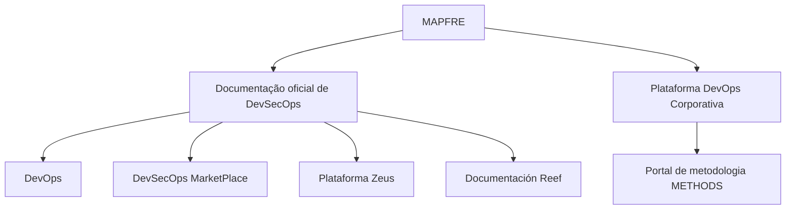

# Documentação Reef — Referências Oficiais de DevSecOps e Plataforma DevOps Corporativa MAPFRE

## 1. Metadados do Documento
- **Arquivo de Origem:** Não identificado no conteúdo fornecido
- **Tipo de Documento:** Documentação / página de portal corporativo
- **Domínio / Sistema:** Reef, DevSecOps, DevOps, Zeus, MAPFRE
- **Público-Alvo:** Desenvolvedores, Arquitetos, Operação e usuários da documentação corporativa
- **Data/Versão Identificada:** Não identificada

---

## 2. Resumo Executivo & Contexto de Negócio

O conteúdo apresenta uma seção de documentação relacionada a DevSecOps na MAPFRE. O texto declara que esse espaço aborda a documentação oficial vinculada a todos os temas relacionados a DevSecOps na organização.

A documentação associada à Plataforma DevOps Corporativa da MAPFRE está referenciada no portal de metodologia denominado **METHODS**. O conteúdo também aponta referências separadas para os domínios **DevOps**, **DevSecOps MarketPlace** e **Plataforma Zeus**.

A página é identificada como **Documentación Reef** e **DOCUMENTACIÓN Reef**, indicando que Reef é o contexto ou área documental apresentada. O estado de ciclo de vida exibido é **Approved**, e o proprietário registrado é `user:agonzalez_mapfre.com`.

O texto disponibilizado é resumido e predominantemente navegacional. Não há especificações técnicas sobre arquitetura, interfaces, tecnologias implementadas, métodos HTTP, contratos de API, ambientes, versões, processos operacionais ou regras de negócio detalhadas.

---

## 3. Arquitetura, Componentes & Tecnologias Envolvidas

Os componentes, portais e áreas explicitamente mencionados são:

| Componente / Área | Papel identificado no conteúdo |
| :--- | :--- |
| MAPFRE | Organização associada à documentação e à Plataforma DevOps Corporativa. |
| DevSecOps | Tema central da documentação apresentada. |
| DevOps | Área referenciada na navegação ou documentação. |
| DevSecOps MarketPlace | Local indicado para acesso a conteúdos de DevSecOps. |
| Plataforma Zeus | Plataforma referenciada como Zeus. |
| Reef | Contexto ou seção documental nomeada como “Documentación Reef”. |
| METHODS | Portal de metodologia onde está a documentação relacionada à Plataforma DevOps Corporativa da MAPFRE. |
| Mapfredocument | Termo exibido no conteúdo, sem descrição adicional. |



**Nota de Análise:** O conteúdo não descreve uma arquitetura de software, comunicação entre serviços, integrações, infraestrutura, protocolos, tecnologias ou fluxos transacionais. O diagrama representa exclusivamente as relações documentais explicitamente indicadas.

---

## 4. Regras de Negócio, Especificações Funcionais & Processos

Não foram identificadas regras de negócio, cálculos, condições de validação, fluxos operacionais ou especificações funcionais detalhadas.

As afirmações factuais presentes no conteúdo são:

1. A seção aborda a documentação oficial relacionada a DevSecOps na MAPFRE.
2. A documentação vinculada à Plataforma DevOps Corporativa da MAPFRE está disponível no portal de metodologia **METHODS**.
3. O conteúdo referencia as áreas ou destinos **DevOps**, **DevSecOps MarketPlace** e **Plataforma Zeus**.
4. A página ou seção está identificada como **Documentación Reef**.
5. O proprietário exibido é `user:agonzalez_mapfre.com`.
6. O ciclo de vida exibido é **Approved**.
7. A interface listada contém as opções de navegação: `Buscar`, `Inicio`, `Soluciones`, `Arquitecturas`, `APIs`, `Componentes`, `Cloud`, `Documentación`, `Zeus`, `Reef` e `Ayuda`.
8. O idioma exibido é `ES`.

**Nota de Análise:** O documento não detalha o significado operacional do estado **Approved**, o processo de aprovação, as permissões de acesso, nem os critérios para publicação ou manutenção da documentação Reef.

---

## 5. Tabelas de Parâmetros, Ambientes e Estruturas de Dados

| Item / Parâmetro | Descrição / Função | Tipo / Valores / Formato | Ambiente / Observações |
| :--- | :--- | :--- | :--- |
| Owner | Proprietário exibido para a documentação Reef. | `user:agonzalez_mapfre.com` | Nenhum ambiente identificado. |
| Lifecycle | Estado de ciclo de vida mostrado no conteúdo. | `Approved` | O significado e o processo associado não são detalhados. |
| Idioma | Idioma exibido na interface. | `ES` | Indica espanhol. |
| Portal de metodologia | Local indicado para a documentação da Plataforma DevOps Corporativa MAPFRE. | `METHODS` | Nenhuma URL foi fornecida. |
| Referência DevOps | Destino documental ou área citada. | `DevOps` | Não há URL ou descrição funcional adicional. |
| Referência DevSecOps | Destino documental ou área citada. | `DevSecOps MarketPlace` | Não há URL ou descrição funcional adicional. |
| Referência Zeus | Destino documental ou área citada. | `Plataforma Zeus` | Não há URL ou descrição funcional adicional. |
| Contexto documental | Nome da documentação ou seção apresentada. | `Documentación Reef` / `DOCUMENTACIÓN Reef` | Não há detalhamento adicional sobre Reef. |
| Navegação | Itens de navegação apresentados na interface. | Buscar, Inicio, Soluciones, Arquitecturas, APIs, Componentes, Cloud, Documentación, Zeus, Reef, Ayuda | A função de cada item não é detalhada. |
| Mapfredocument | Termo mostrado na interface ou conteúdo. | `Mapfredocument` | Não definido no texto. |

---

## 6. Bateria de Perguntas & Respostas para RAG (FAQ Sintético)

### P1: Qual é o tema principal da documentação Reef apresentada?
**R:** A documentação Reef apresentada aborda a documentação oficial relacionada a DevSecOps na MAPFRE. O conteúdo não fornece detalhes técnicos adicionais sobre processos, produtos ou serviços específicos de DevSecOps.

### P2: Onde está localizada a documentação relacionada à Plataforma DevOps Corporativa da MAPFRE?
**R:** O texto informa que a documentação relacionada à Plataforma DevOps Corporativa da MAPFRE está localizada no portal de metodologia **METHODS**. Nenhuma URL ou caminho de acesso detalhado foi informado.

### P3: Quais referências de plataforma ou documentação são citadas no conteúdo?
**R:** O conteúdo cita as referências **DevOps**, **DevSecOps MarketPlace**, **Plataforma Zeus**, **METHODS** e **Documentación Reef**.

### P4: Quem é o proprietário identificado para a documentação Reef?
**R:** O proprietário exibido no conteúdo é `user:agonzalez_mapfre.com`.

### P5: Qual é o estado de ciclo de vida da documentação Reef?
**R:** O estado de ciclo de vida exibido é **Approved**. O documento não explica os critérios, responsáveis ou etapas que levam a esse estado.

### P6: O documento descreve APIs, endpoints ou contratos de integração da Plataforma Zeus?
**R:** Não. O conteúdo apenas menciona a **Plataforma Zeus** como uma referência. Não há métodos HTTP, endpoints, contratos JSON, mecanismos de autenticação ou detalhes de integração.

### P7: O que é o DevSecOps MarketPlace segundo o documento?
**R:** O **DevSecOps MarketPlace** é citado como uma referência ou local associado a DevSecOps. O documento não define seu propósito funcional, conteúdo, processo de acesso ou serviços disponíveis.

### P8: Quais opções de navegação aparecem na interface documental?
**R:** As opções exibidas são: `Buscar`, `Inicio`, `Soluciones`, `Arquitecturas`, `APIs`, `Componentes`, `Cloud`, `Documentación`, `Zeus`, `Reef` e `Ayuda`.

### P9: Qual idioma está indicado na página apresentada?
**R:** A página exibe `ES`, indicando espanhol como idioma apresentado na interface.

### P10: A documentação Reef contém detalhes de arquitetura de microsserviços?
**R:** Não. O conteúdo não menciona microsserviços, componentes de execução, bancos de dados, filas, protocolos, tecnologias, ambientes ou fluxos de dados técnicos.

### P11: Existe uma URL explícita para o portal METHODS ou para a Plataforma Zeus?
**R:** Não. O texto menciona o portal **METHODS** e a **Plataforma Zeus**, mas não fornece URLs explícitas.

### P12: O termo Mapfredocument é definido no conteúdo?
**R:** Não. O termo `Mapfredocument` aparece no conteúdo, mas não recebe uma definição ou explicação adicional.

---

## 7. Glossário de Termos, Siglas & Conceitos-Chave

- **MAPFRE:** Organização mencionada como contexto da documentação oficial de DevSecOps e da Plataforma DevOps Corporativa.
- **DevOps:** Termo citado como referência documental; o conteúdo não apresenta definição adicional.
- **DevSecOps:** Tema central da documentação oficial apresentada; o conteúdo não detalha práticas, ferramentas ou processos.
- **DevSecOps MarketPlace:** Referência ou destino documental associado a DevSecOps; sem detalhamento funcional.
- **METHODS:** Portal de metodologia indicado como local da documentação relacionada à Plataforma DevOps Corporativa da MAPFRE.
- **Plataforma DevOps Corporativa:** Plataforma da MAPFRE mencionada no texto; sem especificação técnica adicional.
- **Plataforma Zeus:** Plataforma citada como referência; não detalhada no conteúdo.
- **Reef:** Contexto ou área identificada como “Documentación Reef”; sem definição adicional.
- **Lifecycle:** Campo de ciclo de vida exibido com o valor `Approved`.
- **Approved:** Estado de ciclo de vida mostrado para o conteúdo; critérios e implicações não especificados.
- **Owner:** Campo que identifica o proprietário da documentação.
- **ES:** Código de idioma exibido na interface, associado ao espanhol.

---

## 8. Notas Críticas, Riscos & Limitações

- O conteúdo fornecido não identifica o nome do arquivo de origem, data, versão, autor formal ou URL da página.
- Não há descrição de arquitetura de software, infraestrutura, topologia, componentes de execução, integrações ou tecnologias.
- Não foram fornecidos ambientes, servidores, credenciais, portas, URLs, rotas de logs, endpoints ou configurações.
- As referências a **DevOps**, **DevSecOps MarketPlace**, **Plataforma Zeus** e **METHODS** não incluem links ou instruções de acesso.
- O termo `Mapfredocument` é exibido sem definição.
- O estado `Approved` é apresentado sem contexto sobre governança documental, critérios de aprovação ou data de aprovação.
- Não há regras de negócio, requisitos funcionais, processos operacionais ou procedimentos de suporte detalhados.
- **Nota de Análise:** O documento lista a Plataforma Zeus e o DevSecOps MarketPlace, porém não detalha as capacidades, integrações, métodos de acesso ou contratos técnicos dessas referências.

---

## 9. Conteúdo Bruto Estruturado (Referência Fiel)

```text
--- [PÁGINA 1 DE 1] ---

DOCUMENTACIÓN
 En este apartado se aborda la documentación ocial de todo los relacionado con DevSecOps en MAPFRE.
La documentación relacionada con la Plataforma DevOps Corporativa de MAPFRE se encuentra en: - El portal de metodología 🧰  METHODS
DevOps - DevOps se encuetra: 🧰  DevSecOps MarketPlace - Zeus se encuentra:🧰  Plataforma Zeus
Documentation / DOCUMENTACIÓN Reef
DOCUMENTACIÓN Reef
Mapfredocument
DOCUMENTACIÓN Reef
Owner
user:agonzalez_mapfre.com
Lifecycle
Approved Source
 / 
 VL
Buscar Inicio Soluciones Arquitecturas APIs Componentes Cloud Documentación Zeus Reef Ayuda
ES
```
