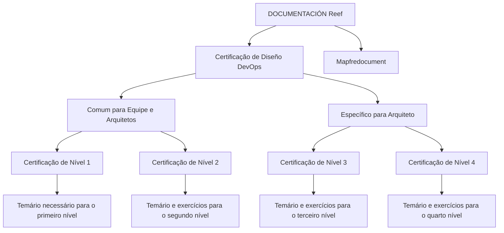

# Certificación de Diseño DevOps — Temarios por Nivel

## 1. Metadados do Documento
- **Arquivo de Origem:** Não identificado
- **Tipo de Documento:** Apresentação Executiva
- **Domínio / Sistema:** Certificação de Diseño DevOps; documentação Reef / Mapfredocument
- **Público-Alvo:** Equipe e Arquitetos
- **Data/Versão Identificada:** Não identificada

---

## 2. Resumo Executivo & Contexto de Negócio

O documento apresenta uma estrutura de certificação de Diseño DevOps organizada em quatro níveis. A certificação é segmentada entre conteúdo comum para a equipe e arquitetos, além de conteúdo específico para arquitetos.

O primeiro nível de certificação de DevOps requer o conhecimento de um temário não detalhado no material extraído. O segundo, terceiro e quarto níveis também apresentam temários e exercícios necessários para a obtenção das respectivas certificações.

A documentação está associada ao ambiente ou repositório identificado como **DOCUMENTACIÓN Reef**, com referências a **Mapfredocument**. O conteúdo apresenta uma navegação que inclui áreas como Soluciones, Arquitecturas, APIs, Componentes, Cloud, Documentación, Zeus, Reef e Ayuda.

O material não descreve os temas efetivos de cada nível, os exercícios, critérios de aprovação, duração, pré-requisitos, responsáveis técnicos ou processo operacional de certificação. A estrutura disponível permite identificar somente a divisão hierárquica dos níveis e o público indicado.

---

## 3. Arquitetura, Componentes & Tecnologias Envolvidas

Os elementos identificados no documento são:

- Certificação de Diseño DevOps.
- Certificação de nível 1.
- Certificação de nível 2.
- Certificação de nível 3.
- Certificação de nível 4.
- Conteúdo comum para equipe e arquitetos.
- Conteúdo específico para arquitetos.
- DOCUMENTACIÓN Reef.
- Mapfredocument.
- Menu de navegação com Soluciones, Arquitecturas, APIs, Componentes, Cloud, Documentación, Zeus, Reef e Ayuda.
- Lifecycle identificado como `Approved Source / VL`.
- Owner identificado como `user:agonzalez_mapfre.com`.



> **Nota de Análise:** O documento não descreve componentes de software, microsserviços, protocolos, integrações, tecnologias de implementação ou fluxos de CI/CD. O diagrama representa exclusivamente a hierarquia de certificação explicitamente apresentada.

---

## 4. Regras de Negócio, Especificações Funcionais & Processos

1. A certificação de Diseño DevOps possui quatro níveis identificados: nível 1, nível 2, nível 3 e nível 4.
2. Existe uma separação entre conteúdo comum para **Equipo y Arquitecto** e conteúdo específico para **Arquitecto**.
3. O nível 1 requer o conhecimento de um temário para obtenção do primeiro nível de certificação de DevOps.
4. O nível 2 requer o conhecimento de um temário e exercícios para obtenção do segundo nível de certificação de DevOps.
5. O nível 3 requer o conhecimento de um temário e exercícios para obtenção do terceiro nível de certificação de DevOps.
6. O nível 4 requer o conhecimento de um temário e exercícios para obtenção do quarto nível de certificação de DevOps.
7. O material apresenta o status de ciclo de vida `Approved Source / VL`.
8. O documento não especifica quais conteúdos pertencem exatamente à trilha comum e quais pertencem à trilha específica de arquiteto.
9. O documento não detalha os exercícios, métodos de avaliação, notas mínimas, pré-requisitos ou critérios de progressão entre níveis.

---

## 5. Tabelas de Parâmetros, Ambientes e Estruturas de Dados

| Item / Parâmetro | Descrição / Função | Tipo / Valores / Formato | Ambiente / Observações |
| :--- | :--- | :--- | :--- |
| Certificação | Certificação de Diseño DevOps | Estrutura com 4 níveis | Conteúdo principal do documento |
| Público comum | Público indicado para conteúdo comum | Equipo y Arquitecto | Não há detalhamento do conteúdo comum |
| Público específico | Público indicado para conteúdo específico | Arquitecto | Não há detalhamento dos requisitos específicos |
| Nível 1 | Primeiro nível da certificação DevOps | Temário necessário | Exercícios não são mencionados neste trecho |
| Nível 2 | Segundo nível da certificação DevOps | Temário e exercícios | Conteúdo dos exercícios não detalhado |
| Nível 3 | Terceiro nível da certificação DevOps | Temário e exercícios | Conteúdo dos exercícios não detalhado |
| Nível 4 | Quarto nível da certificação DevOps | Temário e exercícios | Conteúdo dos exercícios não detalhado |
| Repositório / área documental | Área identificada para documentação | DOCUMENTACIÓN Reef | Também há referência a Mapfredocument |
| Owner | Proprietário identificado no material | `user:agonzalez_mapfre.com` | Identificador literal extraído |
| Lifecycle | Estado de ciclo de vida exibido | `Approved Source / VL` | Significado de `VL` não detalhado |
| Idioma | Idioma exibido no menu | `ES` | Interface em espanhol |
| Navegação | Áreas acessíveis pelo menu | Buscar, Inicio, Soluciones, Arquitecturas, APIs, Componentes, Cloud, Documentación, Zeus, Reef, Ayuda | Nenhuma função adicional é descrita |

---

## 6. Bateria de Perguntas & Respostas para RAG (FAQ Sintético)

### P1: Quantos níveis possui a certificação de Diseño DevOps?
**R:** A certificação de Diseño DevOps possui quatro níveis identificados: certificação de nível 1, nível 2, nível 3 e nível 4.

### P2: Qual conteúdo é necessário para obter a certificação DevOps de nível 1?
**R:** O documento informa que é necessário conhecer um temário para obter o primeiro nível de certificação de DevOps. O conteúdo desse temário não é detalhado no texto extraído.

### P3: O que é exigido para a certificação DevOps de nível 2?
**R:** Para o segundo nível, o documento informa a necessidade de conhecer um temário e realizar exercícios. O material não detalha os temas nem os exercícios aplicáveis.

### P4: Quais são os requisitos documentados para os níveis 3 e 4 da certificação DevOps?
**R:** Os níveis 3 e 4 requerem conhecimento de um temário e exercícios para obtenção dos respectivos níveis. Não há descrição dos conteúdos, exercícios, avaliações ou critérios de aprovação.

### P5: A certificação de Diseño DevOps é destinada somente a arquitetos?
**R:** Não. O documento indica uma área comum para equipe e arquitetos, além de uma área específica para arquitetos. Entretanto, o texto não detalha quais níveis ou temas pertencem a cada uma dessas áreas.

### P6: Onde a documentação de certificação DevOps está referenciada?
**R:** O documento referencia `Documentation / DOCUMENTACIÓN Reef`, `DOCUMENTACIÓN Reef` e `Mapfredocument`. Não é fornecida uma URL ou rota técnica completa para acesso ao conteúdo.

### P7: Quem é o owner identificado no documento?
**R:** O owner exibido no conteúdo é `user:agonzalez_mapfre.com`.

### P8: Qual é o lifecycle apresentado para o documento?
**R:** O lifecycle exibido é `Approved Source / VL`. O documento não explica o significado operacional de `VL`.

### P9: O documento define critérios de aprovação ou notas mínimas para a certificação?
**R:** Não. O documento somente menciona temários e exercícios para determinados níveis; não apresenta critérios de aprovação, notas mínimas, duração, pré-requisitos ou processo de avaliação.

### P10: Quais áreas aparecem no menu de navegação da documentação?
**R:** O menu apresenta Buscar, Inicio, Soluciones, Arquitecturas, APIs, Componentes, Cloud, Documentación, Zeus, Reef e Ayuda, além da indicação de idioma `ES`.

---

## 7. Glossário de Termos, Siglas & Conceitos-Chave

- **DevOps:** Termo presente no contexto da certificação; o documento não fornece definição formal.
- **Diseño DevOps:** Nome da certificação apresentada no documento.
- **Equipo:** Equipe; público mencionado na área comum da certificação.
- **Arquitecto:** Arquiteto; público mencionado tanto na área comum quanto na área específica.
- **Reef:** Nome associado à área ou documentação identificada como `DOCUMENTACIÓN Reef`.
- **Mapfredocument:** Nome exibido junto à documentação; o documento não detalha sua função.
- **Lifecycle:** Campo de ciclo de vida exibido como `Approved Source / VL`.
- **VL:** Sigla exibida no lifecycle; significado não identificado no texto.
- **Owner:** Campo que identifica o proprietário do documento ou conteúdo.

---

## 8. Notas Críticas, Riscos & Limitações

- O documento não informa o nome do arquivo de origem, data, versão, autor ou identificador documental.
- Os temários dos quatro níveis não foram apresentados no conteúdo extraído.
- Os exercícios mencionados para os níveis 2, 3 e 4 não possuem descrição, critérios de execução ou forma de avaliação.
- Não há critérios explícitos para aprovação, reprovação, recertificação ou progressão entre níveis.
- Não há URLs, APIs, contratos, ambientes técnicos, servidores, tecnologias de implementação ou parâmetros operacionais.
- A divisão entre conteúdo comum para equipe e arquitetos e conteúdo específico para arquitetos é citada, mas não é detalhada.
- **Nota de Análise:** O documento lista a certificação de Diseño DevOps e seus quatro níveis, porém não detalha o conteúdo programático, os métodos de avaliação ou os requisitos de cada nível.

---

## 9. Conteúdo Bruto Estruturado (Referência Fiel)

```text
--- [PÁGINA 1 DE 1] ---

Imagen LOGO
CERTIFICACIÓN - Diseño DevOps
 En este apartado se encuentran los temarios de cada uno de los niveles de certicación.
Común para Equipo y Arquitecto
 En este apartado se encuentran
los temarios de cada uno de los niveles
de certicación. 
  En este
apartado se encuentran los temarios de
cada uno de los niveles de certicación.
- CERTIFICACIÓN DE NIVEL 1
CERTIFICACIÓN DE NIVEL 2
En este apartado se encuentra el temario
que se necesita conocer junto con
ejercicios para obtener el segundo nivel de
certicación de DevOps
Especico para Arquitecto
 En este apartado se encuentran
los temarios de cada uno de los niveles
de certicación.
CERTIFICACIÓN DE NIVEL 3
En este apartado se encuentra el temario
que se necesita conocer junto con
ejercicios para obtener el tercer nivel de
certicación de DevOps
CERTIFICACIÓN DE NIVEL 4
En este apartado se encuentra el temario
que se necesita conocer junto con
ejercicios para obtener el cuarto nivel de
certicación de DevOps
1
2
3
---
En este apartado se encuentra el 
temario que se necesita conocer 
para obtener el primer nivel de 
certificación de DevOps
Documentation / DOCUMENTACIÓN Reef
DOCUMENTACIÓN Reef
Mapfredocument
DOCUMENTACIÓN Reef
Owner
user:agonzalez_mapfre.com
Lifecycle
Approved Source
 / 
 VL
Buscar Inicio Soluciones Arquitecturas APIs Componentes Cloud Documentación Zeus Reef Ayuda
ES
```
