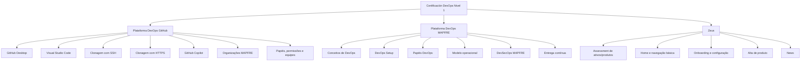

# Certificación DevOps Nivel 1 — Plataforma DevOps GitHub, MAPFRE y Zeus

## 1. Metadados do Documento
- **Arquivo de Origem:** `Não identificado no conteúdo bruto`
- **Tipo de Documento:** `Apresentação Executiva`
- **Domínio / Sistema:** `Certificación DevOps Nivel 1; Plataforma DevOps GitHub; MAPFRE; Zeus; REEF`
- **Público-Alvo:** `Desenvolvedores e participantes da certificação DevOps`
- **Data/Versão Identificada:** `Não identificada`

---

## 2. Resumo Executivo & Contexto de Negócio

O documento apresenta o conteúdo de uma certificação de nível 1 em DevOps. A certificação abrange a Plataforma DevOps GitHub, conceitos de DevOps, a Plataforma DevOps MAPFRE e o sistema Zeus.

A seção sobre GitHub destaca a preparação do ambiente local, incluindo GitHub Desktop como ferramenta visual para operações de clonagem e merge quando não se utiliza Visual Studio Code (VSC). A apresentação também cita clonagem por SSH e HTTPS, integração do GitHub com VSC, GitHub Copilot, organizações MAPFRE, equipes, papéis e permissões.

A seção sobre Plataforma DevOps inclui os tópicos “Qué es DevOps”, configuração de DevOps, papéis DevOps, modelo operacional, DevSecOps MAPFRE e entrega contínua. O conteúdo identifica explicitamente a entrega contínua como relevante.

Zeus é apresentado com introdução, assessment de ativos/produtos, página inicial, navegação básica, onboarding, configuração, alta de produto e notícias. O material usa o símbolo `‼` para destacar conteúdo relevante.

O documento também mostra uma referência de documentação REEF, com elementos de navegação como Soluções, Arquiteturas, APIs, Componentes, Cloud, Documentação, Zeus, Reef e Ajuda. Não há detalhamento técnico adicional sobre APIs, contratos, infraestrutura, pipelines ou configurações de ambientes.

---

## 3. Arquitetura, Componentes & Tecnologias Envolvidas

| Componente / Tecnologia | Papel mencionado |
| :--- | :--- |
| GitHub | Plataforma DevOps abordada na certificação. |
| GitHub Desktop | Ferramenta visual para clonagem e merge, especialmente quando não se trabalha com VSC. |
| Visual Studio Code (VSC) | Ferramenta de desenvolvimento e configuração de plugin para clonagem e merge. |
| GitHub Copilot | Tópico listado no módulo GitHub em VSC. |
| Plataforma DevOps MAPFRE | Plataforma abordada nos tópicos de DevOps e DevSecOps MAPFRE. |
| DevSecOps MAPFRE | Tópico listado como parte da introdução à Plataforma DevOps MAPFRE. |
| Zeus | Sistema abordado para assessment de ativos/produtos, onboarding, configuração e alta de produto. |
| REEF.academy | Referência a uma charla. |
| REEF / Reef | Referência de documentação e opção de navegação. |
| Organizações MAPFRE | Estruturas organizacionais no GitHub mencionadas no material. |
| Equipes em GitHub | Estruturas de equipes citadas no módulo de GitHub. |



> **Nota de Análise:** O documento lista GitHub, VSC, GitHub Desktop, GitHub Copilot, Plataforma DevOps MAPFRE e Zeus, mas não detalha versões, integrações técnicas, métodos HTTP, contratos JSON, URLs de ambiente, portas ou configurações de infraestrutura.

---

## 4. Regras de Negócio, Especificações Funcionais & Processos

### Configuração local para trabalho com GitHub
1. O documento indica a necessidade de configuração do GitHub para permitir trabalho local.
2. GitHub Desktop é apresentado como ferramenta visual para realizar clonagem e merge quando não se utiliza VSC.
3. Visual Studio Code é apresentado como ferramenta de desenvolvimento.
4. O material menciona a configuração de plugin no VSC para executar tarefas de clonagem e merge.
5. A clonagem de repositórios é tratada por dois mecanismos:
   - Clonagem com SSH.
   - Clonagem com HTTPS.

### Governança de acesso no GitHub
1. O conteúdo cita organizações MAPFRE no GitHub.
2. O conteúdo destaca papéis e permissões como tópico relevante.
3. O material cita permissões GitHub e equipes em GitHub.
4. Não são fornecidas matrizes de acesso, nomes de papéis específicos, regras de aprovação ou níveis de privilégio.

### Plataforma DevOps MAPFRE
1. O documento inclui definição de DevOps.
2. O documento inclui DevOps Setup.
3. O documento inclui papéis DevOps e modelo operacional.
4. O conteúdo menciona a Plataforma DevOps MAPFRE e DevSecOps MAPFRE.
5. O conceito de entrega contínua é destacado como conteúdo relevante.
6. Não há detalhamento sobre ferramentas de pipeline, estágios de CI/CD, políticas de segurança ou critérios de promoção entre ambientes.

### Zeus
1. Zeus inclui introdução e assessment de ativos/produtos.
2. Zeus inclui página inicial e navegação básica.
3. Onboarding e configuração em Zeus são identificados como conteúdo relevante.
4. A funcionalidade de alta de produto é citada.
5. News é citada como tópico de Zeus.
6. O documento não descreve campos obrigatórios, validações, responsáveis, workflow de aprovação ou integração entre Zeus e outras plataformas.

---

## 5. Tabelas de Parâmetros, Ambientes e Estruturas de Dados

| Item / Parâmetro | Descrição / Função | Tipo / Valores / Formato | Ambiente / Observações |
| :--- | :--- | :--- | :--- |
| GitHub Desktop | Ferramenta visual para clonagem e merge. | Aplicação desktop. | Indicada quando não se trabalha com VSC. |
| Visual Studio Code | Ferramenta de desenvolvimento. | IDE / editor. | O documento menciona configuração de plugin para clonagem e merge. |
| Clonagem com SSH | Método de clonagem de repositório. | SSH. | Sem detalhes de chaves, URLs ou configuração. |
| Clonagem com HTTPS | Método de clonagem de repositório. | HTTPS. | Sem detalhes de credenciais, URLs ou configuração. |
| GitHub Copilot | Tópico relacionado a GitHub no VSC. | Ferramenta / recurso citado. | Sem detalhamento adicional. |
| Organizações MAPFRE | Estruturas organizacionais GitHub citadas. | Organização GitHub. | Sem nomes de organizações ou regras de associação. |
| Papéis e permissões | Governança de acesso no GitHub. | Conteúdo relevante. | Sem matriz de permissões. |
| Equipes em GitHub | Agrupamentos de usuários no GitHub. | Estrutura organizacional. | Sem nomes de equipes ou regras de associação. |
| DevSecOps MAPFRE | Tópico da Plataforma DevOps MAPFRE. | Prática / abordagem citada. | Sem controles, ferramentas ou processo detalhado. |
| Entrega contínua | Conceito destacado como relevante. | Conceito DevOps. | Sem pipeline, critérios ou ambientes descritos. |
| Zeus — Alta Produto | Tópico funcional do Zeus. | Processo / funcionalidade citada. | Sem campos, regras ou workflow. |
| Documentação REEF | Área de documentação mostrada no conteúdo. | Navegação / documentação. | Itens citados: Soluções, Arquiteturas, APIs, Componentes, Cloud, Documentação, Zeus, Reef e Ajuda. |
| Owner | Informação apresentada na referência de documentação. | `user:agonzalez_mapfre.com` | Valor preservado conforme conteúdo bruto. |
| Lifecycle | Estado apresentado na referência de documentação. | `Approved Source / VL` | Significado de `VL` não detalhado. |
| Idioma | Seletor mostrado na referência de documentação. | `ES` | Indica espanhol na tela exibida. |

---

## 6. Bateria de Perguntas & Respostas para RAG (FAQ Sintético)

### P1: Qual é o objetivo da Certificación DevOps Nivel 1?
**R:** A Certificación DevOps Nivel 1 apresenta conteúdos sobre a Plataforma DevOps GitHub, conceitos e configuração de DevOps, Plataforma DevOps MAPFRE, DevSecOps MAPFRE, entrega contínua e Zeus.

### P2: Quando o GitHub Desktop deve ser utilizado segundo o documento?
**R:** O GitHub Desktop é apresentado como uma ferramenta visual para operações como clonagem e merge, especialmente quando o usuário não trabalha com Visual Studio Code.

### P3: Quais métodos de clonagem de repositório são citados?
**R:** O documento cita clonagem de repositórios por SSH e clonagem por HTTPS. Não são fornecidos exemplos de URLs, comandos, credenciais ou configuração de chaves SSH.

### P4: Qual é o papel do Visual Studio Code no conteúdo da certificação?
**R:** O Visual Studio Code é citado como ferramenta de desenvolvimento e como ambiente no qual se configura um plugin para realizar atividades de clonagem e merge relacionadas ao GitHub.

### P5: Quais tópicos de governança GitHub são abordados?
**R:** O conteúdo aborda organizações MAPFRE, papéis e permissões, permissões GitHub e equipes em GitHub. O documento não define quais papéis existem nem quais permissões são associadas a cada papel.

### P6: Quais assuntos da Plataforma DevOps MAPFRE são mencionados?
**R:** O material menciona o que é DevOps, DevOps Setup, papéis DevOps, modelo operacional, Plataforma DevOps MAPFRE, DevSecOps MAPFRE e o conceito de entrega contínua.

### P7: A apresentação descreve um pipeline de entrega contínua?
**R:** Não. A entrega contínua é marcada como conteúdo relevante, mas o documento não descreve estágios de pipeline, ferramentas de CI/CD, ambientes, gates de aprovação ou mecanismos de deploy.

### P8: Quais funcionalidades de Zeus são apresentadas?
**R:** Zeus é apresentado com introdução e assessment de ativos/produtos, página inicial, navegação básica, onboarding, configuração, alta de produto e News.

### P9: O documento detalha como realizar a alta de um produto no Zeus?
**R:** Não. O documento apenas lista “Alta Producto” como tópico. Não há campos, critérios de validação, responsabilidades, workflow de aprovação ou integração descritos.

### P10: O que o símbolo `‼` representa no documento?
**R:** O símbolo `‼` é definido na legenda como indicador de conteúdo relevante. Ele aparece associado, entre outros tópicos, a papéis e permissões, conceito de entrega contínua, introdução e assessment de Zeus, e onboarding e configuração.

### P11: Quais áreas aparecem na navegação da documentação REEF?
**R:** A referência mostra as áreas Buscar, Inicio, Soluciones, Arquitecturas, APIs, Componentes, Cloud, Documentación, Zeus, Reef e Ayuda, além do idioma `ES`.

---

## 7. Glossário de Termos, Siglas & Conceitos-Chave

- **DevOps:** Tema abordado na certificação; o documento não fornece uma definição formal.
- **DevSecOps:** Tópico associado à Plataforma DevOps MAPFRE; o documento não detalha práticas, ferramentas ou controles.
- **GitHub:** Plataforma DevOps abordada para trabalho com repositórios, organizações, permissões e equipes.
- **GitHub Desktop:** Ferramenta visual citada para clonagem e merge.
- **HTTPS:** Método de clonagem de repositório citado no documento.
- **MAPFRE:** Organização referenciada em organizações GitHub, Plataforma DevOps MAPFRE e DevSecOps MAPFRE.
- **REEF / Reef:** Nome citado em REEF.academy, documentação REEF e navegação da plataforma.
- **SSH:** Método de clonagem de repositório citado no documento.
- **VSC:** Abreviação utilizada para Visual Studio Code.
- **Zeus:** Sistema citado para assessment de ativos/produtos, navegação, onboarding, configuração, alta de produto e News.
- **VL:** Sigla exibida em `Approved Source / VL`; o significado não é detalhado no conteúdo.

---

## 8. Notas Críticas, Riscos & Limitações

- O material é predominantemente uma agenda ou lista de tópicos de certificação, sem detalhamento técnico operacional.
- Não há URLs, nomes de repositórios, nomes de organizações, ambientes, servidores, portas, credenciais ou configurações de rede.
- Não há matriz de papéis e permissões GitHub, apesar de o tópico ser marcado como relevante.
- Não há descrição de pipeline, ferramentas de CI/CD, critérios de entrega contínua ou regras de promoção entre ambientes.
- Não há especificação funcional detalhada de Zeus, incluindo dados de entrada, validações, workflow, APIs ou responsabilidades.
- O valor `user:agonzalez_mapfre.com` é preservado como conteúdo de origem; o documento não esclarece se representa usuário, proprietário, identificador corporativo ou outro atributo.
- A referência visual contém caracteres possivelmente corrompidos em palavras como `congurar` e `Onbording`, preservados na transcrição fiel.

---

## 9. Conteúdo Bruto Estruturado (Referência Fiel)

```text
--- [PÁGINA 1 DE 1] ---

CERTIFICACIÓN - DevOps Nivel 1
 
CERTIFICACIÓN nivel 1 DevOps
# Plataforma DevOps GitHub**
- Set Up - GitHub desktop: (Github desktop como
herramienta visual para hacer (clonado,
merge, etc) si no se trabaja con VSC) -
Primeros pasos - Congurar editor con GitHub
Desktop - Clonado de repositorio - Clonning
with ssh - Clonning with https - Visual Studio
Code como herramienta de desarrollo: (VSC
como herramienta de desarrollo y la
conguración de su plugin para hacer las
tareas de clonado, merge, etc.) - GitHub en
VSC - GitHub Copilot - REEF.academy charla -
Organizaciones MAPFRE - ‼ Roles y permisos -
Permisos GirHub - Equipos en GitHub
# Plataforma DevOps
- Qué es DevOps - DevOps Setup - Roles
DevOps - Modelo operativo
- Que és la plataforma DevOps MAPFRE: -
DevSecOps MAPFRE - Introducción
plataforma
- ‼ Concepto de Entrega continua
# Zeus - ‼ Introducción y assesstment
activos/productos Zeus - Home y navegación
básica - ‼ Onbording & Conguración - Alta
Producto - News
‼ : Contenido relevante
1
- Configuración de Github para 
poder trabajar en local.
Leyenda
Documentation / DOCUMENTACIÓN Reef
DOCUMENTACIÓN Reef
Mapfredocument
DOCUMENTACIÓN Reef
Owner
user:agonzalez_mapfre.com
Lifecycle
Approved Source
 / 
 VL
Buscar Inicio Soluciones Arquitecturas APIs Componentes Cloud Documentación Zeus Reef Ayuda
ES
```
