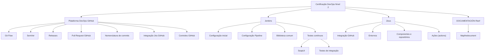

# Certificação DevOps Nível 2 — Plataforma DevOps GitHub, Jenkins, Zeus e Documentação Reef

## 1. Metadados do Documento
- **Arquivo de Origem:** Não identificado
- **Tipo de Documento:** Apresentação Executiva
- **Domínio / Sistema:** Certificação DevOps Nível 2; Plataforma DevOps GitHub; Jenkins; Zeus; Reef
- **Público-Alvo:** Desenvolvedores, Arquitetos, Operação
- **Data/Versão Identificada:** Não identificada

---

## 2. Resumo Executivo & Contexto de Negócio

O documento apresenta os tópicos de uma certificação DevOps de nível 2, com foco na Plataforma DevOps GitHub. O conteúdo relaciona práticas de Git Flow, nomenclatura de versões baseada no padrão SemVer, releases, pull requests, documentação oficial do GitHub, nomenclatura de commits e integração entre Jira e GitHub.

A apresentação também inclui controles da Plataforma DevOps GitHub e referencia ferramentas complementares, especialmente Jenkins. Para Jenkins, o documento lista configuração inicial, configuração de pipeline, biblioteca comum e práticas de testes contínuos e testes de integração.

O sistema Zeus é citado como ambiente ou plataforma relacionada ao uso de DevOps. Os temas associados a Zeus incluem integração com GitHub, ambientes, alta, detalhe, componentes, repositórios e ações (*actions*).

O documento ainda aponta repositórios ou áreas de documentação denominadas “DOCUMENTACIÓN Reef” e “Mapfredocument”. A área Reef aparece com o ciclo de vida “Approved Source / VL” e com o proprietário `user:agonzalez_mapfre.com`.

> **Nota de Análise:** O material é uma listagem resumida de tópicos. Não detalha procedimentos operacionais, contratos de integração, métodos HTTP, configurações de Jenkins, regras de aprovação de pull request, definição dos ambientes ou funcionamento interno de Zeus.

---

## 3. Arquitetura, Componentes & Tecnologias Envolvidas

| Componente / Tecnologia | Papel citado no documento | Detalhamento disponível |
| :--- | :--- | :--- |
| Plataforma DevOps GitHub | Plataforma principal da certificação DevOps Nível 2 | Git Flow, releases, pull requests, commits, controles, integração Jira GitHub e actions |
| Git Flow | Modelo de fluxo de trabalho Git | O documento cita “Modelo simple”, “Modelo” e releases; não descreve branches ou regras de merge |
| SemVer | Padrão para nomenclatura de versões | Citado como “Estándar: SemVer” |
| Pull Request GitHub | Processo ou recurso do GitHub | Há referência à documentação oficial de Pull Request GitHub |
| Jira | Ferramenta integrada ao GitHub | A integração Jira GitHub é citada sem configuração ou fluxo detalhado |
| Jenkins | Ferramenta complementar de DevOps | Configuração inicial, pipeline, biblioteca comum e testes |
| SoapUI | Ferramenta relacionada a testes de integração | Não há configuração, versões ou casos de teste descritos |
| Zeus | Plataforma ou sistema citado no uso de DevOps | Integração GitHub, ambientes, componentes, repositórios e actions |
| Reef | Área ou sistema de documentação | Contém referências a documentação, arquitetura, APIs, componentes, cloud e Zeus |
| Mapfredocument | Área ou item documental citado | Não há detalhamento adicional |
| GitHub Actions | Ações relacionadas a componentes e repositórios | Não há workflows, gatilhos ou configuração descritos |



---

## 4. Regras de Negócio, Especificações Funcionais & Processos

### 4.1 Práticas de versionamento e fluxo Git
1. O documento identifica Git Flow como modelo de trabalho para a Plataforma DevOps GitHub.
2. O material cita um “Git Flow Modelo simple” e um “Git Flow Modelo”, sem explicar diferenças, estrutura de branches ou regras de promoção.
3. A nomenclatura de versões deve considerar o padrão SemVer, conforme a indicação “Estándar: SemVer”.
4. Releases são citadas como tema associado ao Git Flow e à plataforma GitHub.
5. Existe referência a um sistema de nomenclatura de commits, porém o documento não apresenta convenções, formatos ou exemplos de mensagens.

### 4.2 Pull requests e controles GitHub
1. Pull Request GitHub é um tema explícito da certificação.
2. O documento referencia documentação oficial de Pull Request GitHub.
3. Controles GitHub são citados como parte da Plataforma DevOps.
4. Não são informadas regras de aprovação, quantidade de revisores, validações obrigatórias, proteções de branch ou critérios de merge.

### 4.3 Integração Jira GitHub
1. O documento cita integração entre Jira e GitHub.
2. Não há especificação de sincronização de tickets, commits, pull requests, autenticação, campos mapeados ou regras de rastreabilidade.

### 4.4 Jenkins e testes
1. Jenkins é listado como ferramenta complementar da Plataforma DevOps.
2. Os tópicos de Jenkins incluem configuração inicial, configuração de pipeline e biblioteca comum.
3. O documento cita testes contínuos e testes de integração.
4. SoapUI é citado no contexto de testes de integração.
5. Não são fornecidos arquivos de pipeline, estágios, agentes, bibliotecas, critérios de sucesso ou configurações de SoapUI.

### 4.5 Uso de DevOps em Zeus
1. O documento inclui o tema “Uso de DevOps en Zeus”.
2. A integração GitHub é citada no contexto de Zeus.
3. São mencionados ambientes, alta, detalhe, componentes, repositórios e ações (*actions*).
4. Não são definidos os nomes dos ambientes, fluxos de alta, tipos de componentes, estrutura de repositórios ou comportamento das actions.

---

## 5. Tabelas de Parâmetros, Ambientes e Estruturas de Dados

| Item / Parâmetro | Descrição / Função | Tipo / Valores / Formato | Ambiente / Observações |
| :--- | :--- | :--- | :--- |
| Nível de certificação | Nível identificado no título do conteúdo | DevOps Nível 2 | Não há critérios de aprovação descritos |
| Modelo Git | Modelo de fluxo de trabalho citado | Git Flow Modelo simple; Git Flow Modelo | Sem definição de branches ou etapas |
| Padrão de versão | Convenção de nomenclatura de versões | SemVer | Não há exemplos de versões |
| Releases | Tema relacionado ao Git Flow | Não especificado | Sem processo de publicação detalhado |
| Pull Request | Recurso ou processo citado do GitHub | Pull Request GitHub | Há referência à documentação oficial |
| Nomenclatura de commits | Sistema de nomeação de commits | Não especificado | Sem padrão textual descrito |
| Integração de ferramentas | Integração citada | Jira GitHub | Sem parâmetros de conexão ou sincronização |
| Controles GitHub | Controles da plataforma DevOps | Não especificado | Sem regras de governança detalhadas |
| Jenkins | Ferramenta complementar | Configuração inicial; configuração pipeline; biblioteca comum | Sem versão ou infraestrutura definida |
| Testes contínuos | Prática de testes listada | Não especificado | Sem cobertura, execução ou critérios |
| Testes de integração | Prática de teste listada | SoapUI | Sem suites, endpoints ou cenários |
| Zeus | Plataforma ou sistema citado | Uso de DevOps; integração GitHub | Sem arquitetura técnica apresentada |
| Ambientes Zeus | Entornos mencionados | Alta; Detalle | Sem nomes, URLs ou finalidades descritas |
| Componentes e repositórios | Itens associados a Zeus | Não especificado | Sem lista de componentes ou repositórios |
| Actions | Ações citadas | `actions` | Sem workflows ou gatilhos |
| Documentação Reef | Área documental citada | Reef | Interface apresenta opções como Soluções, Arquiteturas, APIs, Componentes, Cloud, Documentação e Zeus |
| Owner Reef | Proprietário identificado na documentação | `user:agonzalez_mapfre.com` | Conforme conteúdo bruto |
| Lifecycle Reef | Estado de ciclo de vida identificado | `Approved Source / VL` | Significado de “VL” não detalhado |
| Mapfredocument | Item ou área documental citada | Mapfredocument | Sem detalhamento adicional |

---

## 6. Bateria de Perguntas & Respostas para RAG (FAQ Sintético)

### P1: Qual é o tema principal da certificação DevOps apresentada?
**R:** A certificação é identificada como “DevOps Nível 2” e aborda a Plataforma DevOps GitHub, Git Flow, SemVer, releases, pull requests, nomenclatura de commits, integração Jira GitHub, Jenkins, testes e uso de DevOps em Zeus.

### P2: Qual padrão de versionamento é mencionado no documento?
**R:** O documento cita “Estándar: SemVer” como padrão de nomenclatura de versões. Não são apresentados exemplos de versões nem regras adicionais para sua aplicação.

### P3: O documento define como configurar branches no Git Flow?
**R:** Não. O conteúdo apenas menciona “Git Flow Modelo simple”, “Git Flow Modelo” e releases. Não há detalhamento de branches, políticas de merge, convenções de nomes ou estratégias de promoção.

### P4: Quais tópicos de pull request são apresentados?
**R:** O documento cita Pull Request GitHub e referencia documentação oficial de Pull Request GitHub. Não informa políticas de revisão, aprovações mínimas, validações automáticas ou regras de merge.

### P5: Existe integração entre Jira e GitHub?
**R:** Sim. A “Integración Jira GitHub” é explicitamente listada. Entretanto, o documento não especifica autenticação, dados sincronizados, automações, campos de Jira ou comportamento da integração.

### P6: Qual é o papel de Jenkins no conteúdo da certificação?
**R:** Jenkins é listado entre outras ferramentas da Plataforma DevOps. Os tópicos associados são configuração inicial, configuração de pipeline, biblioteca comum, testes contínuos e testes de integração.

### P7: O documento informa como os testes de integração são executados?
**R:** Não. O documento menciona testes de integração e SoapUI, mas não descreve endpoints, cenários, suites de teste, comandos de execução, relatórios ou critérios de aprovação.

### P8: O que é citado sobre o uso de DevOps em Zeus?
**R:** O material menciona “Uso de DevOps en Zeus”, integração GitHub, ambientes, alta, detalhe, componentes e repositórios, além de actions. Não há explicação operacional ou arquitetural adicional sobre Zeus.

### P9: Quais ambientes de Zeus são identificados?
**R:** O conteúdo apresenta “Entornos: - Alta - Detalle”. O documento não define URLs, servidores, responsáveis, objetivos ou critérios de acesso para esses ambientes.

### P10: Quem é o owner indicado para a documentação Reef?
**R:** O campo Owner exibido para “DOCUMENTACIÓN Reef” é `user:agonzalez_mapfre.com`.

### P11: Qual lifecycle é exibido para a documentação Reef?
**R:** O lifecycle apresentado é `Approved Source / VL`. O documento não explica o significado de “VL” nem os critérios para esse estado.

### P12: Quais áreas de navegação aparecem na documentação Reef?
**R:** A interface citada apresenta as áreas Buscar, Inicio, Soluciones, Arquitecturas, APIs, Componentes, Cloud, Documentación, Zeus, Reef, Ayuda e a indicação de idioma ES.

---

## 7. Glossário de Termos, Siglas & Conceitos-Chave

- **DevOps:** Termo central da certificação de nível 2 e da plataforma apresentada; o documento não fornece definição conceitual.
- **GitHub:** Plataforma DevOps citada para Git Flow, pull requests, commits, controles, integração com Jira e actions.
- **Git Flow:** Modelo de fluxo Git citado no documento, incluindo as referências “Modelo simple” e “Modelo”.
- **SemVer:** Padrão citado para nomenclatura de versões.
- **Release:** Tema citado em associação com Git Flow e versionamento.
- **Pull Request:** Recurso ou processo GitHub citado, com referência à documentação oficial.
- **Jira:** Ferramenta citada na integração Jira GitHub.
- **Jenkins:** Ferramenta citada para configuração inicial, pipeline, biblioteca comum e testes.
- **Pipeline:** Item de configuração Jenkins mencionado no documento.
- **SoapUI:** Ferramenta citada no contexto de testes de integração.
- **Zeus:** Sistema ou plataforma citada no contexto de uso de DevOps e integração GitHub.
- **Actions:** Ações citadas para componentes e repositórios; o documento utiliza o termo em inglês entre parênteses.
- **Reef:** Área ou sistema de documentação citado.
- **Mapfredocument:** Item ou área documental citada sem definição adicional.
- **VL:** Sigla exibida no lifecycle `Approved Source / VL`; significado não identificado no conteúdo.

---

## 8. Notas Críticas, Riscos & Limitações

- O conteúdo possui caráter resumido e não contém instruções executáveis de configuração.
- Não há URLs, endereços de servidores, credenciais, portas, versões de ferramentas ou topologias de ambiente.
- A integração Jira GitHub é mencionada sem contrato funcional, configuração, autenticação ou rastreabilidade detalhada.
- Jenkins é citado sem `Jenkinsfile`, estágios de pipeline, bibliotecas, agentes, variáveis ou critérios de aprovação.
- SoapUI é citado sem suites, projetos, endpoints, cenários ou resultados esperados.
- Zeus é citado sem detalhamento de arquitetura, componentes, repositórios, ambientes ou actions.
- O documento não define o significado de “Alta”, “Detalle” ou “VL”.
- A apresentação não contém Notas do Apresentador no conteúdo fornecido.
- **Nota de Análise:** Não é possível inferir políticas de Git Flow, governança de pull request ou processos de deployment além dos tópicos literalmente mencionados.

---

## 9. Conteúdo Bruto Estruturado (Referência Fiel)

```text
--- [PÁGINA 1 DE 1] ---

CERTIFICACIÓN - DevOps Nivel 2
 
CERTIFICACIÓN nivel 2 DevOps
# Plataforma DevOps GitHub** - ‼ Git Flow Modelo simple - Buenas prácticas
GitFlow - ‼ Nomenclatura de versiones -
Estándar: SemVer - ‼ Git Flow Modelo
Releases - About Git - ‼ Pull Request -
Documentación ocial GitHub Pull Request:
Pull Request GitHub - Sistema de nombrado
de commits - Integración Jira GitHub
- ‼ Controles GitHub Plataforma DevOps
Otras herramientas**
- Jenkins - Conguración Inicial -
Conguración Pipeline - ‼ Libreria común
- Pruebas continuas - Pruebas Integración
SoapUI
Zeus
- ‼ Uso de DevOps en Zeus - ‼ Integración
GitHub - Entornos: - Alta - Detalle - ‼ 
Componentes y repositorios - Acciones
(actions)
Contenido relevante
‼ 
Documentation / DOCUMENTACIÓN Reef
DOCUMENTACIÓN Reef
Mapfredocument
DOCUMENTACIÓN Reef
Owner
user:agonzalez_mapfre.com
Lifecycle
Approved Source
 / 
 VL
Buscar Inicio Soluciones Arquitecturas APIs Componentes Cloud Documentación Zeus Reef Ayuda
ES
```
