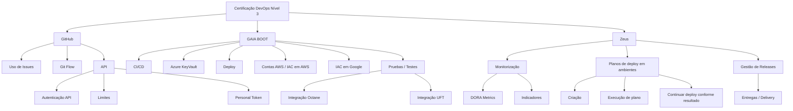
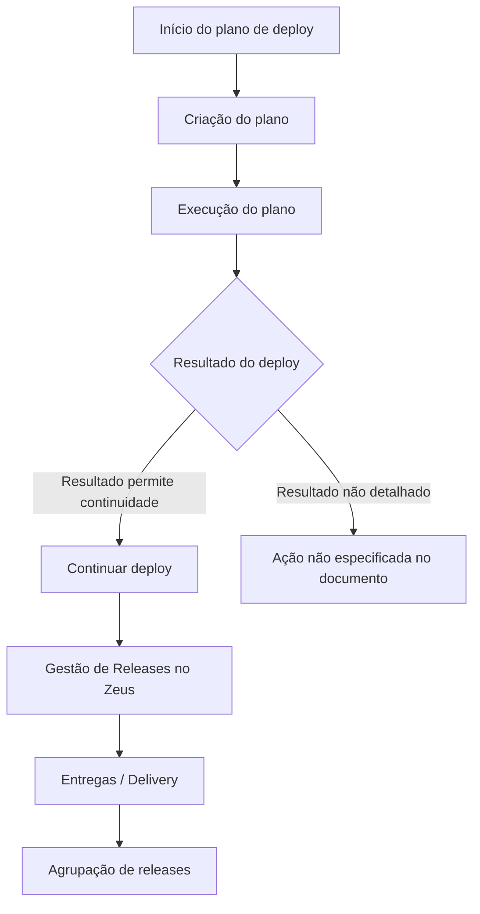

# Certificação DevOps Nível 3 — Referências de GitHub, APIs, GAIA BOOT e Zeus

## 1. Metadados do Documento
- **Arquivo de Origem:** Não identificado no conteúdo fornecido
- **Tipo de Documento:** Apresentação Executiva / Material de Certificação
- **Domínio / Sistema:** DevOps, GitHub, GAIA BOOT, Zeus, Reef, Mapfre
- **Público-Alvo:** Desenvolvedores, Arquitetos, Operação e equipes DevOps
- **Data/Versão Identificada:** Não identificada

---

## 2. Resumo Executivo & Contexto de Negócio

O conteúdo apresenta referências associadas à **Certificação DevOps Nível 3**, com foco em práticas, ferramentas e integrações relacionadas ao ciclo de vida de desenvolvimento, entrega e operação de software.

O documento cita o uso de **GitHub Issues**, documentação oficial do GitHub, **Git Flow** e tópicos de consumo de API, incluindo autenticação, limites e Personal Token. Esses elementos apontam para a necessidade de práticas padronizadas de colaboração, controle de fluxo de trabalho e integração programática com GitHub.

A plataforma **GAIA BOOT** é mencionada em associação com CI/CD, Azure KeyVault, deploy, contas AWS, infraestrutura como código em Google e AWS, testes e integrações com Octane e UFT. Contudo, o conteúdo não detalha contratos, configurações, comandos, pipelines ou responsabilidades específicas desses componentes.

O sistema **Zeus** aparece relacionado a monitorização, DORA Metrics, indicadores, planos de deploy em ambientes e gestão de releases. O material registra a criação, execução e continuidade de planos de implantação conforme o resultado, além da organização de entregas (*Delivery*) por agrupamento de releases.

O conteúdo também referencia a documentação Reef, incluindo a classificação **Lifecycle: Approved Source**, um proprietário identificado como `user:agonzalez_mapfre.com` e áreas de navegação como Soluções, Arquiteturas, APIs, Componentes, Cloud, Documentação e Zeus.

---

## 3. Arquitetura, Componentes & Tecnologias Envolvidas

Componentes, plataformas e temas identificados:

- **GitHub:** uso de Issues, documentação oficial, Git Flow e API.
- **GitHub API:** autenticação, limites e Personal Token.
- **Plataforma DevOps:** bibliotecas comuns, funções e exemplos.
- **GAIA BOOT:** CI/CD, Azure KeyVault, deploy, contas AWS, infraestrutura como código, testes e integrações.
- **Azure KeyVault:** citado como componente associado ao GAIA BOOT.
- **AWS:** contas AWS e infraestrutura como código em AWS.
- **Google:** infraestrutura como código em Google.
- **Octane:** integração citada no contexto de testes.
- **UFT:** integração citada no contexto de testes.
- **Zeus:** monitorização, métricas DORA, indicadores, planos de deploy e gestão de releases.
- **Reef:** repositório ou portal de documentação.
- **Mapfredocument:** termo exibido na área de documentação.



**Nota de Análise:** O material lista componentes e temas, mas não descreve arquitetura de rede, interfaces, protocolos, métodos HTTP, contratos JSON, versões tecnológicas, portas, URLs ou topologias de implantação.

---

## 4. Regras de Negócio, Especificações Funcionais & Processos

### Certificação DevOps Nível 3
O documento identifica a **Certificação DevOps Nível 3** como tema central. Não são apresentados critérios de aprovação, pré-requisitos, duração, avaliações ou trilhas obrigatórias.

### GitHub
Os tópicos associados ao GitHub incluem:

1. Uso de **Issues em GitHub**.
2. Referência à documentação oficial do GitHub sobre Issues.
3. Referência à documentação oficial do GitHub sobre Git Flow.
4. Uso de API.
5. Início rápido.
6. Autenticação de API.
7. Limites de API.
8. Personal Token.

**Nota de Análise:** O conteúdo não especifica convenções para criação de Issues, tipos de labels, templates, responsáveis, SLAs, fluxos de aprovação, estratégias de branch, regras de merge ou permissões de repositório.

### Plataforma DevOps e GAIA BOOT
O conteúdo associa a plataforma DevOps aos seguintes itens:

1. Bibliotecas comuns.
2. Funções.
3. Exemplo.
4. GAIA BOOT.
5. CI/CD.
6. Azure KeyVault.
7. Deploy.
8. Deploy de contas AWS.
9. Infraestrutura como código em Google.
10. Infraestrutura como código em AWS.
11. Testes.
12. Integração Octane.
13. Integração UFT.

**Nota de Análise:** O documento não detalha bibliotecas, linguagens, frameworks, pipelines, artefatos, ferramentas de infraestrutura como código ou procedimentos de deploy.

### Zeus: Deploy, Releases e Monitorização
Os tópicos registrados para Zeus são:

1. Monitorização DevOps.
2. DORA Metrics.
3. Indicadores.
4. Planos de deploy em ambientes.
5. Criação de plano de deploy.
6. Execução de plano de deploy.
7. Continuidade do deploy dependendo do resultado.
8. Gestão de Releases em Zeus.
9. Entregas (*Delivery*).
10. Agrupamento de releases.

Fluxo funcional identificado:



**Nota de Análise:** O documento informa que a continuidade do deploy depende do resultado, porém não define resultados possíveis, critérios de sucesso, critérios de falha, mecanismos de rollback ou responsáveis pela decisão.

---

## 5. Tabelas de Parâmetros, Ambientes e Estruturas de Dados

| Item / Parâmetro | Descrição / Função | Tipo / Valores / Formato | Ambiente / Observações |
| :--- | :--- | :--- | :--- |
| Certificação DevOps Nível 3 | Tema principal do conteúdo | Certificação | Não há requisitos ou critérios detalhados |
| GitHub Issues | Uso de Issues no GitHub | Funcionalidade GitHub | Há referência à documentação oficial |
| Git Flow | Fluxo de trabalho citado para GitHub | Prática de versionamento | Não detalhado |
| API | Tema de uso de API | Integração programática | Associada a início rápido, autenticação, limites e Personal Token |
| Autenticação API | Autenticação para uso da API | Segurança / acesso | Mencionada como conteúdo relevante |
| Limites | Limites relacionados à API | Restrição operacional | Valores não informados |
| Personal Token | Token pessoal associado à API | Credencial de acesso | Formato, escopo e armazenamento não informados |
| Bibliotecas comuns | Bibliotecas reutilizáveis citadas na plataforma DevOps | Biblioteca / componente | Nomes não informados |
| Funções | Funções citadas na plataforma DevOps | Função de software | Não detalhadas |
| GAIA BOOT | Plataforma ou componente citado | Plataforma DevOps | Associado a CI/CD, KeyVault, deploy, IAC e testes |
| CI/CD | Prática de integração e entrega contínuas | Processo DevOps | Não há pipeline detalhado |
| Azure KeyVault | Serviço citado em GAIA BOOT | Gestão de segredos / chaves | Configuração não informada |
| Deploy | Implantação de software | Processo operacional | Detalhes não informados |
| Contas AWS | Contas AWS relacionadas a deploy | Ambiente cloud | Identificadores não informados |
| IAC em Google | Infraestrutura como código em Google | Provisionamento de infraestrutura | Ferramenta não informada |
| IAC em AWS | Infraestrutura como código em AWS | Provisionamento de infraestrutura | Ferramenta não informada |
| Pruebas / Testes | Testes associados ao contexto DevOps | Qualidade de software | Tipos de testes não informados |
| Integração Octane | Integração com Octane | Integração de ferramenta | Contrato não informado |
| Integração UFT | Integração com UFT | Integração de ferramenta | Contrato não informado |
| Monitorização DevOps | Monitorização citada em Zeus | Operação / observabilidade | Métricas específicas não detalhadas |
| DORA Metrics | Métricas DORA citadas em Zeus | Indicadores DevOps | Valores e cálculos não informados |
| Indicadores | Indicadores associados à monitorização | Métrica operacional | Não detalhados |
| Planos de deploy em ambientes | Planejamento de deploy por ambiente | Processo de implantação | Ambientes não nomeados |
| Criação | Criação de plano de deploy | Etapa do processo | Não detalhada |
| Execução de plano | Execução de plano de deploy | Etapa do processo | Não detalhada |
| Continuar deploy dependendo do resultado | Continuidade do deploy conforme resultado | Regra de processo | Critérios de decisão não informados |
| Gestão Releases em Zeus | Gestão de releases na plataforma Zeus | Gestão de entrega | Processo detalhado parcialmente |
| Delivery | Entregas relacionadas a releases | Entrega de software | Associada a agrupação de releases |
| Agrupação releases | Agrupamento de releases em entregas | Organização de releases | Critérios não informados |
| Documentation / DOCUMENTACIÓN Reef | Área ou portal de documentação | Repositório documental | Exibe classificação de ciclo de vida |
| Lifecycle | Estado do conteúdo em Reef | `Approved Source` | Exibido no documento |
| Owner | Proprietário exibido na documentação | `user:agonzalez_mapfre.com` | Valor literal extraído |
| Idioma | Idioma exibido na interface | `ES` | Exibido no documento |

---

## 6. Bateria de Perguntas & Respostas para RAG (FAQ Sintético)

### P1: Qual é o tema principal do documento?
**R:** O tema principal é a **Certificação DevOps Nível 3**, apresentando referências a GitHub, APIs, plataforma DevOps, GAIA BOOT, Zeus, monitorização, DORA Metrics, deploys e gestão de releases.

### P2: Quais tópicos de GitHub são mencionados no material de Certificação DevOps Nível 3?
**R:** O documento menciona uso de Issues em GitHub, documentação oficial sobre Issues, documentação oficial sobre Git Flow, uso de API, início rápido, autenticação de API, limites e Personal Token.

### P3: O documento define como autenticar na API do GitHub?
**R:** Não. O documento apenas lista “Autenticación API” e “Personal Token” como tópicos relevantes. Não há instruções sobre geração, escopos, expiração, armazenamento ou uso do token.

### P4: Quais capacidades são associadas à plataforma GAIA BOOT?
**R:** O conteúdo associa GAIA BOOT a CI/CD, Azure KeyVault, deploy, deploy de contas AWS, infraestrutura como código em Google, infraestrutura como código em AWS, testes, integração Octane e integração UFT.

### P5: Quais ferramentas de testes ou qualidade são citadas?
**R:** O documento menciona testes, integração Octane e integração UFT. Não há detalhamento sobre casos de teste, tipos de execução, pipelines ou contratos de integração.

### P6: O que Zeus cobre no contexto apresentado?
**R:** Zeus é citado para monitorização DevOps, DORA Metrics, indicadores, planos de deploy em ambientes, criação e execução de planos, continuidade do deploy conforme resultado e gestão de releases associada a entregas (*Delivery*) e agrupamento de releases.

### P7: Como o documento descreve o fluxo de deploy em Zeus?
**R:** O conteúdo lista planos de deploy em ambientes, criação de plano, execução de plano e continuidade do deploy dependendo do resultado. O documento não informa quais resultados permitem continuidade, nem descreve rollback, aprovação ou tratamento de falhas.

### P8: Quais métricas operacionais são explicitamente mencionadas?
**R:** São mencionadas **DORA Metrics** e **indicadores** no contexto de monitorização DevOps em Zeus. O documento não apresenta os nomes individuais das métricas DORA, fórmulas, metas ou valores de referência.

### P9: O documento identifica ambientes específicos de implantação?
**R:** Não. O documento menciona “planes de despliegue en entornos”, mas não nomeia ambientes como desenvolvimento, homologação, teste ou produção.

### P10: Quem aparece como proprietário da documentação Reef?
**R:** O proprietário exibido é `user:agonzalez_mapfre.com`.

### P11: Qual é o ciclo de vida da documentação exibida em Reef?
**R:** O documento mostra o campo **Lifecycle** com o valor **Approved Source**.

### P12: O material detalha a arquitetura técnica dos componentes citados?
**R:** Não. O conteúdo lista plataformas, integrações e tópicos, mas não fornece diagramas originais, protocolos, endpoints, contratos de API, tecnologias de implementação, versões, URLs ou configuração de infraestrutura.

---

## 7. Glossário de Termos, Siglas & Conceitos-Chave

- **API:** Interface de Programação de Aplicações; citada no contexto de uso, autenticação, limites e Personal Token.
- **AWS:** Plataforma de computação em nuvem citada em “Deploy Cuentas AWS” e “IAC en AWS”.
- **Azure KeyVault:** Serviço citado como associado a GAIA BOOT.
- **CI/CD:** Termo citado junto de GAIA BOOT; o documento não expande a sigla.
- **DORA Metrics:** Métricas DORA citadas no contexto de monitorização DevOps em Zeus.
- **GAIA BOOT:** Plataforma ou componente DevOps citado para CI/CD, Azure KeyVault, deploy, IAC e testes.
- **Git Flow:** Fluxo de trabalho Git citado por meio de referência à documentação oficial do GitHub.
- **GitHub Issues:** Funcionalidade de gestão de itens de trabalho no GitHub, citada no documento.
- **IAC:** Sigla exibida em “IAC en Google” e “IAC en AWS”; o documento não expande a sigla.
- **Octane:** Ferramenta ou integração citada no contexto de testes.
- **Personal Token:** Token pessoal mencionado para autenticação ou acesso à API.
- **Reef:** Portal ou repositório de documentação mencionado no material.
- **UFT:** Ferramenta ou integração citada no contexto de testes; o documento não expande a sigla.
- **Zeus:** Sistema citado para monitorização, indicadores, deploys e gestão de releases.

---

## 8. Notas Críticas, Riscos & Limitações

- O conteúdo fornecido é predominantemente uma lista de tópicos e referências; não apresenta detalhamento técnico operacional suficiente para implementação direta.
- Há caracteres aparentemente corrompidos em termos como “ocial”, provavelmente pretendendo representar “oficial”.
- Não há URLs completas para documentação do GitHub, Git Flow, APIs, GAIA BOOT, Zeus ou Reef.
- Não são identificados endpoints, métodos HTTP, payloads, contratos, versões, portas, credenciais, escopos de token ou configurações de autenticação.
- Não há especificação de quais bibliotecas comuns ou funções integram a plataforma DevOps.
- Não há detalhamento da ferramenta usada para infraestrutura como código em Google ou AWS.
- O processo Zeus menciona continuidade de deploy conforme resultado, mas não define critérios de sucesso, falha, aprovação, interrupção ou rollback.
- DORA Metrics são mencionadas sem métricas individuais, fórmulas, fontes de dados, periodicidade ou metas.
- O conteúdo não define responsabilidades entre equipes de desenvolvimento, operação, arquitetura, segurança ou negócio.
- A expressão “‼ : Contenido relevante” indica que itens marcados com `‼` são considerados conteúdo relevante no documento.

---

## 9. Conteúdo Bruto Estruturado (Referência Fiel)

```text
--- [PÁGINA 1 DE 1] ---

CERTIFICACIÓN - DevOps Nivel 3
CERTIFICACIÓN nivel 3 DevOps
GitHub Uso de Issues en GitHub - Documentación
ocial GitHub sobre Issues: Issues GitHub
Documentación ocial GitHub Git Flow:
GitFlow
Uso API
Inicio rápido
‼ Autenticación API
‼ Límites
‼ Personal Token
API
Plataforma DevOps**
- ‼ Librerias comunes - Funciones - Ejemplo
GAIA BOOT CI/CD - Azure KeyVault - ‼ Deploy: -
Deploy Cuentas AWS - IAC en Google - IAC en
AWS - Pruebas - Integración Octane -
Integración UFT - Monitorización: - Monitorizar
DevOps - DORA Metrics - Indicadores
Zeus
- ‼ Planes de despliegue en entornos -
Creación -  Ejecución de plan - Continuar
despliegue dependiendo del resultado - ‼
Gestión Releases en Zeus - Entregas (Delivery)
agrupación releases
‼ : Contenido relevante
Leyenda
Documentation / DOCUMENTACIÓN Reef
DOCUMENTACIÓN Reef
Mapfredocument
DOCUMENTACIÓN Reef
Owner
user:agonzalez_mapfre.com
Lifecycle
Approved Source
 /
 VL
Buscar Inicio Soluciones Arquitecturas APIs Componentes Cloud Documentación Zeus Reef Ayuda
ES
```
