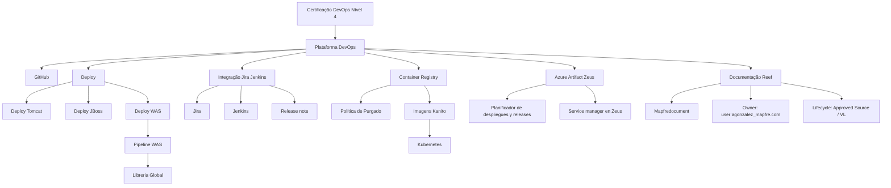

# Certificação DevOps Nível 4 — Plataforma DevOps e Documentação Reef

## 1. Metadados do Documento
- **Arquivo de Origem:** `Não identificado no conteúdo extraído`
- **Tipo de Documento:** Apresentação Executiva
- **Domínio / Sistema:** Plataforma DevOps, Reef, Zeus, Mapfredocument
- **Público-Alvo:** Desenvolvedores, Arquitetos, Operação e equipes de DevOps
- **Data/Versão Identificada:** Não identificada

---

## 2. Resumo Executivo & Contexto de Negócio

O documento apresenta tópicos associados à **Certificação DevOps Nível 4** e à **Plataforma DevOps**. O conteúdo menciona ferramentas, processos de deploy, integração de ferramentas, gestão de artefatos, imagens de contêiner e documentação corporativa.

A Plataforma DevOps é relacionada à ferramenta **GitHub**, à integração entre **Jira** e **Jenkins**, à produção de **release notes** e à gestão de imagens por meio de **Container Registry**. Também são citadas uma política de purga e imagens Kanito em Kubernetes.

O conteúdo menciona mecanismos de deploy para **Tomcat**, **JBoss** e **WAS**, além de uma *pipeline* de deploy WAS e uma biblioteca global. No entanto, o documento não especifica as etapas, critérios de aprovação, contratos, configurações ou responsabilidades operacionais desses processos.

O ecossistema documental citado inclui **Reef**, **Mapfredocument** e **Zeus**. A documentação Reef aparece como conteúdo aprovado, com ciclo de vida identificado como `Approved Source / VL` e proprietário indicado como `user:agonzalez_mapfre.com`.

> **Nota de Análise:** O conteúdo extraído é predominantemente composto por títulos e tópicos. Não há detalhamento suficiente para inferir versões de ferramentas, URLs, métodos de integração, parâmetros de pipeline, políticas de retenção ou regras operacionais adicionais.

---

## 3. Arquitetura, Componentes & Tecnologias Envolvidas

| Componente / Tecnologia | Papel indicado no documento | Detalhamento disponível |
| :--- | :--- | :--- |
| Certificação DevOps Nível 4 | Tema principal do documento | Não detalhado |
| Plataforma DevOps | Plataforma associada aos tópicos de certificação e deploy | Não detalhada |
| GitHub | Ferramenta da Plataforma DevOps | Não detalhado |
| Paginação API | Item citado junto de “Inner source” | Não detalhado |
| Inner source | Conceito ou iniciativa relacionado à Paginação API | Não detalhado |
| Tomcat | Destino ou tecnologia de deploy | Não detalhado |
| JBoss | Destino ou tecnologia de deploy | Não detalhado |
| WAS | Tecnologia com pipeline de deploy mencionada | Não detalhado |
| Libreria Global | Biblioteca global associada ao deploy WAS | Não detalhado |
| Jira | Ferramenta integrada ao Jenkins | Não detalhado |
| Jenkins | Ferramenta integrada ao Jira | Não detalhado |
| Release note | Artefato ou processo mencionado | Não detalhado |
| Container Registry | Registro de contêineres | Não detalhado |
| Política de Purgado | Política associada ao Container Registry | Não detalhada |
| Kanito | Nome associado a imagens em Kubernetes | Não detalhado |
| Kubernetes | Plataforma onde são citadas imagens Kanito | Não detalhado |
| Azure Artifact Zeus | Artefato ou serviço associado a Azure e Zeus | Não detalhado |
| Planificador de despliegues y releases | Planejador de deployments e releases | Não detalhado |
| Service manager en Zeus | Service manager associado a Zeus | Não detalhado |
| Reef | Portal ou domínio de documentação | Não detalhado |
| Mapfredocument | Sistema ou repositório documental citado | Não detalhado |
| Documentation / DOCUMENTACIÓN Reef | Área de documentação Reef | Não detalhada |



> **Nota de Análise:** O diagrama representa somente relações explicitamente sugeridas pela organização dos tópicos extraídos. O documento não descreve protocolos, direção de chamadas, interfaces, dependências técnicas ou sequências executáveis entre os componentes.

---

## 4. Regras de Negócio, Especificações Funcionais & Processos

### 4.1 Tópicos de certificação e Plataforma DevOps
- O documento identifica o tema **CERTIFICACIÓN - DevOps Nivel 4**.
- A **Plataforma DevOps** é explicitamente associada à ferramenta **GitHub**.
- O item **“Páginación API - Inner source”** é listado como tópico da Plataforma DevOps.
- Não foram identificados critérios de certificação, requisitos de elegibilidade, evidências exigidas, responsáveis ou método de avaliação para o nível 4.

### 4.2 Deploys e pipeline
- São mencionados os seguintes tipos ou destinos de deploy:
  - Deploy Tomcat.
  - Deploy JBoss.
  - Deploy WAS.
- O documento menciona uma **pipeline** de deploy WAS.
- A pipeline WAS é associada a uma **Libreria Global**.
- Não há definição de estágios da pipeline, gatilhos, aprovações, rollback, ambientes, credenciais ou estratégia de promoção entre ambientes.

### 4.3 Integração e gestão de releases
- O documento cita a integração entre **Jira** e **Jenkins**.
- O documento cita **Release note**.
- Não há especificação sobre:
  - sincronização entre Jira e Jenkins;
  - campos utilizados;
  - critérios para geração de release notes;
  - formato de release note;
  - responsáveis por publicação ou aprovação.

### 4.4 Gestão de imagens de contêiner
- O documento cita **Container Registry**.
- O documento cita uma **Política de Purgado**.
- O documento menciona **Imágenes Kanito en Kubernetes**.
- Não há informação sobre retenção, frequência de purga, convenção de tags, mecanismo de autenticação, repositórios, namespaces ou processo de publicação de imagens.

### 4.5 Zeus, artefatos e planejamento
- O documento cita **Azure Artifact Zeus**.
- O documento cita um **Planificador de despliegues y releases**.
- O documento cita **Service manager en Zeus**.
- Não foram identificadas regras de agendamento, dependências de release, fluxo de aprovação, integrações ou responsabilidades relacionadas ao planejador e ao service manager.

### 4.6 Documentação Reef
- O conteúdo apresenta referências a **Documentation / DOCUMENTACIÓN Reef**.
- O conteúdo cita **Mapfredocument**.
- O proprietário indicado é `user:agonzalez_mapfre.com`.
- O ciclo de vida indicado é `Approved Source / VL`.
- As áreas de navegação exibidas são:
  - Buscar;
  - Inicio;
  - Soluciones;
  - Arquitecturas;
  - APIs;
  - Componentes;
  - Cloud;
  - Documentación;
  - Zeus;
  - Reef;
  - Ayuda.
- O idioma identificado na interface é `ES`.

---

## 5. Tabelas de Parâmetros, Ambientes e Estruturas de Dados

| Item / Parâmetro | Descrição / Função | Tipo / Valores / Formato | Ambiente / Observações |
| :--- | :--- | :--- | :--- |
| Certificação | Certificação DevOps mencionada | `DevOps Nivel 4` | Critérios não detalhados |
| Ferramenta DevOps | Ferramenta associada à Plataforma DevOps | `GitHub` | Configuração não detalhada |
| Tópico de API | Item listado na Plataforma DevOps | `Páginación API - Inner source` | Sem detalhamento adicional |
| Deploy Tomcat | Tipo ou destino de deploy citado | `Tomcat` | Pipeline e parâmetros não detalhados |
| Deploy JBoss | Tipo ou destino de deploy citado | `JBoss` | Pipeline e parâmetros não detalhados |
| Deploy WAS | Tipo ou destino de deploy citado | `WAS` | Há menção a pipeline WAS |
| Pipeline WAS | Pipeline de deploy para WAS | `WAS pileline` | Grafia preservada do conteúdo extraído |
| Biblioteca | Biblioteca associada à pipeline WAS | `Libreria Global` | Sem detalhamento |
| Integração | Integração de ferramentas | `Jira Jenkins` | Fluxo não especificado |
| Artefato de release | Item relacionado a releases | `Release note` | Formato não especificado |
| Registro de imagens | Registro de contêineres | `Container Registry` | Sem URL, produto ou configuração |
| Política de limpeza | Política associada ao registro | `Politica de Purgado` | Regras de retenção não informadas |
| Imagens | Imagens citadas no contexto de Kubernetes | `Imágenes Kanito` | Sem tags, repositórios ou namespaces |
| Plataforma de contêineres | Plataforma mencionada | `Kubernetes` | Sem versão ou ambiente |
| Artefato / serviço | Item associado a Azure e Zeus | `Azure Artifact Zeus` | Sem detalhamento |
| Planejador | Planejador de deploys e releases | `Planificador de despliegues y releases` | Sem regras de planejamento |
| Service manager | Serviço associado a Zeus | `Service manager en Zeus` | Sem detalhamento |
| Repositório documental | Referência documental | `Mapfredocument` | Relação funcional não detalhada |
| Proprietário | Owner da documentação Reef | `user:agonzalez_mapfre.com` | Valor literal extraído |
| Ciclo de vida | Estado do conteúdo Reef | `Approved Source / VL` | Significado de `VL` não informado |
| Idioma | Idioma exibido na interface | `ES` | Espanhol |
| Áreas de navegação | Menus ou seções da interface | `Buscar, Inicio, Soluciones, Arquitecturas, APIs, Componentes, Cloud, Documentación, Zeus, Reef, Ayuda` | Interface de documentação |

---

## 6. Bateria de Perguntas & Respostas para RAG (FAQ Sintético)

### P1: Qual é o nível de certificação DevOps citado no documento?
**R:** O documento cita a **Certificação DevOps Nível 4**, apresentada como `CERTIFICACIÓN - DevOps Nivel 4` e `CERTIFICACIÓN nivel 4 DevOps`. O conteúdo não descreve critérios, avaliações ou requisitos para obtenção da certificação.

### P2: Qual ferramenta é associada à Plataforma DevOps?
**R:** A ferramenta explicitamente associada à Plataforma DevOps é o **GitHub**. O documento não informa como o GitHub é configurado, quais repositórios são utilizados ou quais práticas de desenvolvimento são aplicadas.

### P3: Quais destinos de deploy são mencionados?
**R:** O documento menciona **Deploy Tomcat**, **Deploy JBoss** e **Deploy WAS**. Também menciona uma pipeline de deploy WAS e uma Libreria Global, mas não detalha etapas, gatilhos, aprovações ou processos de rollback.

### P4: Existe integração entre Jira e Jenkins?
**R:** Sim. O conteúdo cita explicitamente a **Integración Jira Jenkins**. No entanto, não há descrição dos dados integrados, dos eventos que iniciam a integração, dos campos sincronizados ou dos mecanismos técnicos utilizados.

### P5: O documento descreve como são produzidas as release notes?
**R:** Não. O documento apenas cita `Release note` como tópico relacionado à Plataforma DevOps. Não são fornecidos formato, processo de geração, responsáveis, critérios de aprovação ou destino de publicação das release notes.

### P6: O que o documento informa sobre Container Registry e política de purga?
**R:** O documento cita **Container Registry** e **Politica de Purgado**. Também menciona imagens Kanito em Kubernetes. Não há detalhamento sobre regras de retenção, periodicidade de purga, nomenclatura de imagens ou repositórios envolvidos.

### P7: Qual é a relação entre Kanito e Kubernetes no documento?
**R:** O documento contém o tópico `Imágenes Kanito en Kubernetes`, indicando que imagens Kanito são mencionadas no contexto de Kubernetes. O conteúdo não descreve o que é Kanito, como as imagens são construídas, publicadas ou implantadas em Kubernetes.

### P8: O que é citado sobre Azure Artifact Zeus?
**R:** O documento cita `Azure Artifact Zeus`, juntamente com `Planificador de despliegues y releases` e `Service manager en Zeus`. Não há detalhamento técnico sobre Azure Artifact Zeus, seu papel no ciclo de release ou integrações com outros componentes.

### P9: Quem é o proprietário identificado para a documentação Reef?
**R:** O proprietário indicado no conteúdo é `user:agonzalez_mapfre.com`. O documento não informa o nome completo, equipe, papel organizacional ou escopo de responsabilidade desse proprietário.

### P10: Qual ciclo de vida é exibido para a documentação Reef?
**R:** O ciclo de vida apresentado é `Approved Source / VL`. O documento não define o significado de `VL`, nem os critérios ou etapas que levam um conteúdo ao estado `Approved Source`.

### P11: Quais áreas de navegação são exibidas na documentação Reef?
**R:** As áreas exibidas são: **Buscar, Inicio, Soluciones, Arquitecturas, APIs, Componentes, Cloud, Documentación, Zeus, Reef e Ayuda**. O documento não explica o conteúdo ou as permissões associadas a cada área.

### P12: O documento fornece URLs, portas, ambientes ou configurações de infraestrutura?
**R:** Não. O conteúdo extraído não apresenta URLs, portas de rede, nomes de ambientes, servidores, credenciais, versões de ferramentas ou parâmetros de infraestrutura.

---

## 7. Glossário de Termos, Siglas & Conceitos-Chave

- **API:** Termo citado em `Páginación API`; a expansão não é definida no documento.
- **Azure Artifact Zeus:** Item citado associado a Azure e Zeus; função não detalhada.
- **Container Registry:** Registro de contêineres citado no documento.
- **DevOps:** Domínio da certificação e da plataforma apresentados no documento; não definido no conteúdo.
- **GitHub:** Ferramenta associada à Plataforma DevOps.
- **Inner source:** Termo citado junto da Paginação API; não definido no documento.
- **Jenkins:** Ferramenta citada em integração com Jira.
- **Jira:** Ferramenta citada em integração com Jenkins.
- **JBoss:** Destino ou tecnologia de deploy citada.
- **Kanito:** Nome citado no contexto de imagens em Kubernetes; não definido no documento.
- **Kubernetes:** Plataforma citada no contexto de imagens Kanito.
- **Libreria Global:** Biblioteca global citada em associação com a pipeline WAS.
- **Mapfredocument:** Sistema ou repositório documental citado.
- **Reef:** Área, portal ou domínio de documentação citado.
- **Release note:** Artefato ou tópico de release citado.
- **Service manager en Zeus:** Service manager mencionado no contexto de Zeus.
- **Tomcat:** Destino ou tecnologia de deploy citada.
- **VL:** Sigla ou marcador apresentado em `Approved Source / VL`; significado não informado.
- **WAS:** Tecnologia ou destino de deploy citado; o documento não expande a sigla.
- **Zeus:** Sistema ou domínio citado junto de Azure Artifact, planejamento de deploys e service manager.

---

## 8. Notas Críticas, Riscos & Limitações

- O conteúdo extraído apresenta tópicos, títulos e elementos de interface, sem descrições operacionais aprofundadas.
- Não há especificação de fluxos técnicos executáveis para GitHub, Jira, Jenkins, Tomcat, JBoss, WAS, Kubernetes, Container Registry, Azure Artifact ou Zeus.
- Não há informações sobre ambientes, URLs, servidores, portas, versões, credenciais, contratos de API, estruturas JSON, variáveis de configuração ou permissões.
- A relação exata entre **Kanito**, **Kubernetes**, **Azure Artifact Zeus**, o planejador de deploys e o service manager não é detalhada.
- A política de purga é mencionada, mas não apresenta critérios de retenção, periodicidade, exceções ou mecanismo de execução.
- O estado `Approved Source / VL` é exibido para a documentação Reef, mas `VL` não é definido.
- O documento não permite inferir responsabilidades formais, SLAs, RTOs, RPOs, mecanismos de observabilidade, monitoramento ou rollback.
- A expressão `Planicador` contém um caractere não textual na extração bruta; foi preservada na referência fiel e interpretada apenas como tópico visualmente próximo de “Planificador”, sem alterar o dado original.

---

## 9. Conteúdo Bruto Estruturado (Referência Fiel)

```text
--- [PÁGINA 1 DE 1] ---

CERTIFICACIÓN - DevOps Nivel 4
CERTIFICACIÓN nivel 4 DevOps
Plataforma DevOps
herramienta GitHub
- ‼ Páginación API - Inner source
Plataforma DevOps ‼ Deploy: - Deploy Tomcat - Deploy JBoss -
Deploy WAS pileline Libreria Global
Integración Jira Jenkins
Release note
‼ Container Registry
Politica de Purgado
Imágenes Kanito en Kubernetes
‼ Azure Artifact Zeus
- Planicador de despliegues y releases -
Service manager en Zeus
‼ : Contenido relevante
Leyenda
Documentation / DOCUMENTACIÓN Reef
DOCUMENTACIÓN Reef
Mapfredocument
DOCUMENTACIÓN Reef
Owner
user:agonzalez_mapfre.com
Lifecycle
Approved Source
 / 
 VL
Buscar Inicio Soluciones Arquitecturas APIs Componentes Cloud Documentación Zeus Reef Ayuda
ES
```
