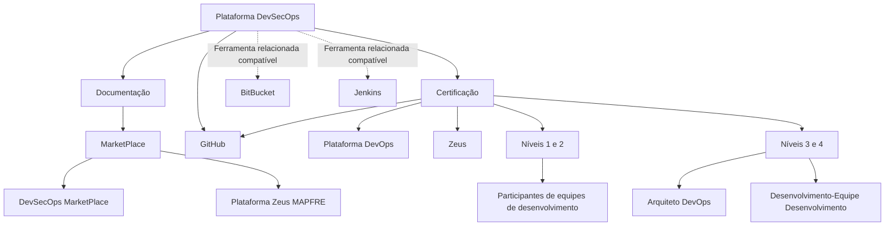

# Documentação e Certificação da Plataforma DevSecOps, MarketPlace e Zeus

## 1. Metadados do Documento
- **Arquivo de Origem:** `Não identificado no conteúdo extraído`
- **Tipo de Documento:** `Manual Operacional / Documentação de Plataforma`
- **Domínio / Sistema:** `DevSecOps, MarketPlace, Plataforma Zeus MAPFRE e Reef`
- **Público-Alvo:** `Desenvolvedores, Arquitetos DevOps e equipes de desenvolvimento`
- **Data/Versão Identificada:** `Não identificada`

---

## 2. Resumo Executivo & Contexto de Negócio

O conteúdo apresenta um ponto de referência para aquisição de conhecimentos funcionais e técnicos sobre a plataforma DevSecOps. A informação é organizada em duas perspectivas explícitas: documentação e certificação.

A documentação de referência da plataforma DevSecOps está localizada no MarketPlace. O texto indica referências distintas para DevOps e para Zeus: a documentação de DevOps aparece como “🧰 DevSecOps MarketPlace”, enquanto Zeus aparece como “🧰 Plataforma Zeus MAPFRE”.

Além da documentação de referência, o conteúdo menciona ferramentas de mercado incluídas na plataforma, especificamente GitHub. Também são mencionadas ferramentas relacionadas que permanecem compatíveis com a plataforma: BitBucket e Jenkins.

A perspectiva de certificação organiza os conteúdos por níveis, ferramentas relevantes — GitHub, Plataforma DevOps e Zeus — e função. Os níveis 1 e 2 são comuns aos participantes das equipes de desenvolvimento integradas à plataforma DevOps; os níveis 3 e 4 são destinados aos papéis de Arquiteto DevOps ou Desenvolvimento-Equipe Desenvolvimento.

---

## 3. Arquitetura, Componentes & Tecnologias Envolvidas

Os componentes e referências explicitamente citados são:

- **DevSecOps:** plataforma cujo conhecimento funcional e técnico é documentado.
- **MarketPlace:** local indicado para a documentação de referência da plataforma DevSecOps.
- **DevOps:** referência documental localizada em “🧰 DevSecOps MarketPlace”.
- **Plataforma Zeus MAPFRE:** referência para documentação de Zeus.
- **GitHub:** ferramenta de mercado incluída na plataforma e ferramenta relevante para certificação.
- **BitBucket:** ferramenta relacionada compatível com a plataforma.
- **Jenkins:** ferramenta relacionada compatível com a plataforma.
- **Reef:** área documental citada no trecho de interface “Documentation / DOCUMENTACIÓN Reef”.
- **Mapfredocument:** elemento citado no conteúdo bruto, sem detalhamento funcional adicional.

> **Nota de Análise:** O conteúdo não descreve integrações técnicas, protocolos, APIs, fluxos de dados, topologias de implantação ou responsabilidades operacionais entre DevSecOps, GitHub, BitBucket, Jenkins, Zeus e Reef. O diagrama abaixo representa exclusivamente as relações documentais e de compatibilidade declaradas.



---

## 4. Regras de Negócio, Especificações Funcionais & Processos

### 4.1 Organização do conhecimento DevSecOps

1. A documentação disponibilizada busca permitir a aquisição de conhecimentos funcionais e técnicos relativos à plataforma DevSecOps.
2. A informação é estruturada em duas perspectivas:
   - **Documentação**
   - **Certificação**

### 4.2 Referências de documentação

1. A documentação de referência da plataforma DevSecOps encontra-se no **MarketPlace**.
2. A referência documental de **DevOps** é identificada como:
   - `🧰 DevSecOps MarketPlace`
3. A referência documental de **Zeus** é identificada como:
   - `🧰 Plataforma Zeus MAPFRE`
4. O conteúdo também cita a área:
   - `Documentation / DOCUMENTACIÓN Reef`
5. O texto apresenta o elemento `Mapfredocument`, mas não descreve sua finalidade, integração ou regras de uso.

### 4.3 Ferramentas citadas

1. **GitHub** é apresentado como ferramenta de mercado incluída na plataforma.
2. **BitBucket** é apresentado como ferramenta relacionada compatível com a plataforma.
3. **Jenkins** é apresentado como ferramenta relacionada compatível com a plataforma.

### 4.4 Estrutura de certificação

1. Os conteúdos de certificação são divididos por:
   - níveis de certificação;
   - ferramentas relevantes utilizadas em DevOps;
   - função.
2. As ferramentas relevantes mencionadas para certificação são:
   - GitHub;
   - Plataforma DevOps;
   - Zeus.
3. A trilha de **Desenvolvimento DevOps** possui:
   - **Níveis 1 e 2:** comuns a todos os participantes das equipes de desenvolvimento integradas à plataforma DevOps.
   - **Níveis 3 e 4:** destinados aos papéis de Arquiteto DevOps ou Desenvolvimento-Equipe Desenvolvimento.

> **Nota de Análise:** O conteúdo não detalha ementas, critérios de aprovação, duração, pré-requisitos, responsáveis, formatos de avaliação ou processos de inscrição para os níveis de certificação.

---

## 5. Tabelas de Parâmetros, Ambientes e Estruturas de Dados

| Item / Parâmetro | Descrição / Função | Tipo / Valores / Formato | Ambiente / Observações |
| :--- | :--- | :--- | :--- |
| Documentação DevSecOps | Conteúdo para aquisição de conhecimento funcional e técnico sobre DevSecOps | Documentação de referência | Organizada junto à perspectiva de certificação |
| MarketPlace | Local indicado para a documentação de referência da plataforma DevSecOps | Repositório ou espaço documental citado | Não há URL fornecida |
| DevOps | Referência documental de DevOps | `🧰 DevSecOps MarketPlace` | O conteúdo não fornece detalhes adicionais |
| Zeus | Referência documental de Zeus | `🧰 Plataforma Zeus MAPFRE` | O conteúdo não fornece detalhes adicionais |
| GitHub | Ferramenta de mercado incluída na plataforma; também relevante na certificação | Ferramenta | Sem versão ou configuração identificada |
| BitBucket | Ferramenta relacionada compatível com a plataforma | Ferramenta compatível | Sem detalhes de integração |
| Jenkins | Ferramenta relacionada compatível com a plataforma | Ferramenta compatível | Sem detalhes de integração |
| Certificação | Organização de temários por nível, ferramenta e função | Níveis 1 a 4 | Ferramentas: GitHub, Plataforma DevOps e Zeus |
| Níveis 1 e 2 | Conteúdo comum da trilha Desenvolvimento DevOps | Níveis de certificação | Destinados a participantes das equipes de desenvolvimento integradas à plataforma DevOps |
| Níveis 3 e 4 | Conteúdo avançado da trilha Desenvolvimento DevOps | Níveis de certificação | Destinados a Arquiteto DevOps ou Desenvolvimento-Equipe Desenvolvimento |
| Reef | Área documental mencionada | `Documentation / DOCUMENTACIÓN Reef` | Sem detalhamento adicional |
| Mapfredocument | Elemento identificado no conteúdo | Nome citado literalmente | Finalidade não detalhada |
| Owner | Proprietário exibido no conteúdo | `user:agonzalez_mapfre.com` | Sintaxe preservada conforme a extração |
| Lifecycle | Estado exibido no conteúdo | `Approved` | Sem processo de aprovação descrito |
| Source | Campo exibido no conteúdo | `VL` | Significado não detalhado |

---

## 6. Bateria de Perguntas & Respostas para RAG (FAQ Sintético)

### P1: Qual é o objetivo da documentação da plataforma DevSecOps?
**R:** O objetivo informado é permitir a aquisição de conhecimentos funcionais e técnicos relativos à plataforma DevSecOps. O conteúdo organiza esse conhecimento nas perspectivas de documentação e certificação.

### P2: Onde está a documentação de referência da plataforma DevSecOps?
**R:** A documentação de referência da plataforma DevSecOps está localizada no MarketPlace, conforme indicado explicitamente no conteúdo.

### P3: Qual referência deve ser consultada para documentação de DevOps?
**R:** A referência indicada para DevOps é `🧰 DevSecOps MarketPlace`. O conteúdo não apresenta URL, procedimento de acesso ou detalhamento adicional dessa referência.

### P4: Qual referência deve ser consultada para documentação de Zeus?
**R:** A referência indicada para Zeus é `🧰 Plataforma Zeus MAPFRE`. O documento não detalha conteúdos, URLs, permissões ou integrações da Plataforma Zeus MAPFRE.

### P5: Quais ferramentas de mercado são citadas na plataforma DevSecOps?
**R:** GitHub é citado como uma ferramenta de mercado incluída na plataforma. BitBucket e Jenkins são citados como ferramentas relacionadas compatíveis com a plataforma.

### P6: Quais ferramentas são relevantes para os conteúdos de certificação DevOps?
**R:** Os conteúdos de certificação são divididos considerando as ferramentas relevantes GitHub, Plataforma DevOps e Zeus, além da divisão por função.

### P7: Quem deve realizar os níveis 1 e 2 da certificação de Desenvolvimento DevOps?
**R:** Os níveis 1 e 2 são comuns para todos os participantes de equipes de desenvolvimento que estejam integrados à plataforma DevOps.

### P8: Para quais funções são destinados os níveis 3 e 4 da certificação de Desenvolvimento DevOps?
**R:** Os níveis 3 e 4 são destinados aos papéis de Arquiteto DevOps ou Desenvolvimento-Equipe Desenvolvimento.

### P9: O documento descreve como GitHub, BitBucket e Jenkins são integrados tecnicamente?
**R:** Não. O conteúdo apenas classifica GitHub como ferramenta incluída na plataforma e BitBucket e Jenkins como ferramentas relacionadas compatíveis. Não há descrição de integração técnica, pipelines, credenciais, APIs, configurações ou responsabilidades operacionais.

### P10: O que é Reef no contexto do conteúdo fornecido?
**R:** Reef aparece como `Documentation / DOCUMENTACIÓN Reef` e como item de navegação na interface exibida. O conteúdo não fornece uma definição funcional, arquitetura, processo de uso ou relação técnica detalhada entre Reef e os demais componentes.

### P11: Há informações sobre URLs, ambientes, servidores ou rotas de logs?
**R:** Não. O conteúdo não apresenta URLs, ambientes, servidores, portas, caminhos de log, variáveis de configuração ou parâmetros operacionais.

### P12: Qual estado de ciclo de vida aparece no conteúdo de documentação Reef?
**R:** O campo `Lifecycle` aparece com o valor `Approved`. O documento não descreve o significado operacional desse estado nem o fluxo de aprovação associado.

---

## 7. Glossário de Termos, Siglas & Conceitos-Chave

- **DevSecOps:** plataforma abordada pelo conteúdo, com documentação e certificação voltadas a conhecimentos funcionais e técnicos.
- **DevOps:** referência documental e contexto de certificação citados no conteúdo.
- **MarketPlace:** local indicado para acesso à documentação de referência da plataforma DevSecOps.
- **Zeus:** plataforma ou referência documental identificada como `Plataforma Zeus MAPFRE`.
- **MAPFRE:** termo presente no nome `Plataforma Zeus MAPFRE`; o conteúdo não expande ou define a sigla/nome.
- **GitHub:** ferramenta de mercado incluída na plataforma e ferramenta relevante na certificação.
- **BitBucket:** ferramenta relacionada compatível com a plataforma.
- **Jenkins:** ferramenta relacionada compatível com a plataforma.
- **Reef:** área de documentação mencionada como `Documentation / DOCUMENTACIÓN Reef`.
- **Mapfredocument:** elemento citado literalmente, sem definição adicional.
- **Lifecycle:** campo de ciclo de vida exibido com o valor `Approved`.
- **Owner:** campo de proprietário exibido como `user:agonzalez_mapfre.com`.
- **VL:** valor apresentado no campo `Source`; significado não detalhado.

---

## 8. Notas Críticas, Riscos & Limitações

- O conteúdo não identifica o nome do arquivo de origem, data, versão, autor formal ou histórico de alterações.
- Não há URLs para o MarketPlace, DevSecOps MarketPlace ou Plataforma Zeus MAPFRE.
- Não há descrição técnica de integrações entre DevSecOps, GitHub, BitBucket, Jenkins, Zeus, Reef ou Mapfredocument.
- Não são informados métodos de acesso, papéis de permissão, autenticação, ambientes, servidores, endpoints, logs ou procedimentos de suporte.
- A estrutura de certificação informa públicos e níveis, mas não apresenta temários detalhados, critérios de avaliação, pré-requisitos ou procedimentos de conclusão.
- O valor `VL` no campo `Source` não é explicado no conteúdo.
- O termo `Mapfredocument` é citado sem contexto funcional ou técnico adicional.

---

## 9. Conteúdo Bruto Estruturado (Referência Fiel)

```text
--- [PÁGINA 1 DE 1] ---

DevSecOps
 En este apartado se encuentra la documentación que permite adquirir conocimientos tanto funcionales como
técnicos relativos a DevSecOps. La información está organizada en dos perspectivas:
Documentación
Certicación
DOCUMENTACIÓN
La documentación de referencia de la plataforma DevSecOps se encuentra en MarketPlace: - DevOps se encuetra: 🧰  DevSecOps
MarketPlace - Zeus se encuentra:🧰  Plataforma Zeus MAPFRE
Adicionalmente, hay una serie de herramientas de mercado incluidas en la plataforma - GitHub
Herramientas relacionadas compatibles aún con la plataforma: - BitBucket - Jenkins
CERTIFICACIÓN
Aquí se encuentran los temarios de los distintos niveles de certicación divididos por lsa herramientas relevantes utilizadas en DevOps
(GitHub, Plataforma DevOps y Zeus) y por función - Desarrollo DevOps: niveles 1 y 2 comunes para todos los participantes de equipos de
desarrollo que esté integrado dentro de la plataforma DevOps - Diseño: niveles 3 y 4 destinado a los roles de Arquitecto DevOps o Desarrollo-
Equipo Desarrollo)
Documentation / DOCUMENTACIÓN Reef
DOCUMENTACIÓN Reef
Mapfredocument
DOCUMENTACIÓN Reef
Owner
user:agonzalez_mapfre.com
Lifecycle
Approved Source
 / 
 VL
Buscar Inicio Soluciones Arquitecturas APIs Componentes Cloud Documentación Zeus Reef Ayuda
ES
```
