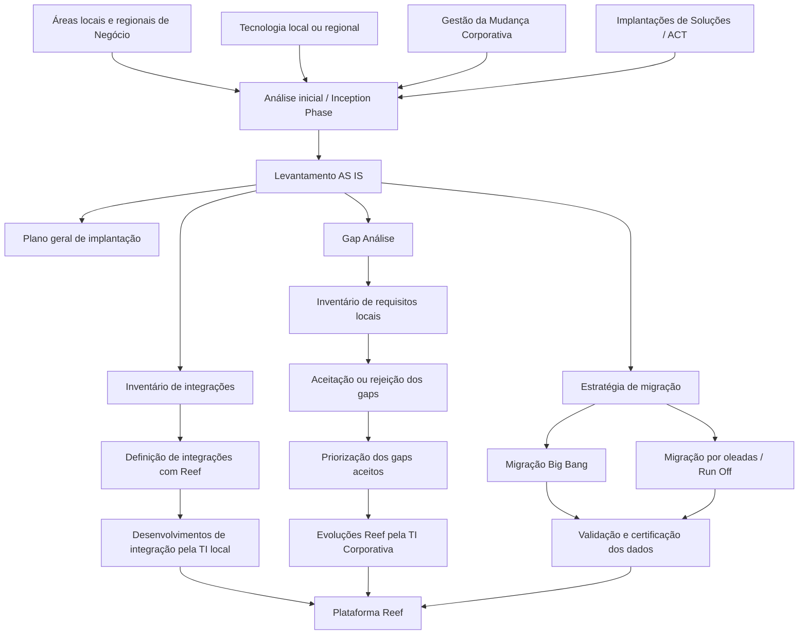

# Metodologia de Implantação da Plataforma Asseguradora Reef em Países e Entidades

## 1. Metadados do Documento
- **Arquivo de Origem:** `Não identificado`
- **Tipo de Documento:** `Procedimento`
- **Domínio / Sistema:** `Plataforma asseguradora Reef / TRON`
- **Público-Alvo:** `Negócio, Tecnologia local e regional, Arquitetura, Operação, Gestão da Mudança e equipes corporativas`
- **Data/Versão Identificada:** `Não identificada`

---

## 2. Resumo Executivo & Contexto de Negócio

O documento define a metodologia de implantação da Plataforma asseguradora Reef em países ou entidades Mapfre. A responsabilidade central é atribuída à Área de Implantações de Soluções, que implementa ativos corporativos da plataforma asseguradora Reef, incluindo ativos de Vida, Não Vida e Saúde, além de estabelecer a operação e a governança da plataforma durante a implementação.

A implantação exige participação conjunta das áreas locais e regionais de Negócio, Tecnologia do país ou região, Gestão da Mudança da Área Corporativa de Operações e Implantações de Soluções da Área Corporativa de Tecnologia (ACT). O processo busca compreender tanto os processos de negócio locais quanto a plataforma tecnológica existente, suas aplicações, integrações, dados, requisitos legais e processos de fechamento.

A metodologia é estruturada em quatro grandes frentes: plano geral de implantação, análise de gaps, integrações e migração. A análise inicial, ou *inception phase*, determina o escopo, os objetivos, os benefícios, o cronograma definitivo, o modelo organizacional, a governança, as interrelações com soluções externas, as limitações e os requisitos de segurança e proteção de dados.

A fase de Gap Análise compara os requisitos funcionais e não funcionais locais com as capacidades já implementadas em Reef. Os requisitos ausentes ou parcialmente atendidos são inventariados, avaliados, aceitos ou rejeitados e priorizados. O documento também diferencia a responsabilidade entre a TI Corporativa, que desenvolve adequações mandatórias, legislativas ou específicas do negócio do país, e a TI local, responsável por adequações necessárias à integração com Reef.

A migração é tratada como um elemento crítico para a continuidade do negócio. A estratégia deve garantir qualidade, completude, validação e operação das apólices no Reef, bem como acesso aos dados históricos não migrados, sincronização entre ambientes quando aplicável e capacidade de tratar sinistros de automóveis sem exigir migração integral.

---

## 3. Arquitetura, Componentes & Tecnologias Envolvidas

### Componentes e atores identificados

| Componente / Ator | Papel identificado no documento |
| :--- | :--- |
| Plataforma Reef | Plataforma asseguradora corporativa a ser implantada em países ou entidades. |
| TRON | Core da Plataforma Reef. O documento não detalha sua arquitetura interna, tecnologias ou interfaces. |
| Satélites Reef | Componentes que compõem a Plataforma Reef, incluindo Autosserviços e Cotizadores. |
| Sistemas locais | Soluções e aplicações existentes no país que suportam o negócio segurador antes ou durante a convivência com Reef. |
| Aplicações externas | Sistemas que se integram com Reef para suportar processos de negócio. |
| Área de Implantações de Soluções | Área responsável por implementar os ativos corporativos da Plataforma Reef nas regiões Mapfre. |
| ACT | Área Corporativa de Tecnologia, mencionada como origem do time de Implantações de Soluções. |
| TI Corporativa | Responsável por evoluções mandatórias, legislativas ou específicas do negócio do país que afetem as funcionalidades de Reef. |
| TI local | Responsável por adequações necessárias para a correta integração com Reef. |
| Gestão da Mudança | Time da Área Corporativa de Operações que participa da implantação. |
| Plataforma de migração de dados | Plataforma a ser disponibilizada para análise, estatísticas, relatórios, enriquecimento, tratamento e carga de dados no Reef. |

### Fluxo representativo de implantação



### Nota de Análise

O documento apresenta Reef, TRON, Autosserviços e Cotizadores como elementos da plataforma, mas não descreve tecnologias de implementação, protocolos, métodos HTTP, contratos JSON, bancos de dados específicos, versões, URLs, portas ou topologia de infraestrutura.

---

## 4. Regras de Negócio, Especificações Funcionais & Processos

### 4.1. Escopo da metodologia de implantação

A metodologia de implantação de Reef inclui:

1. Definição de um plano geral de implantação.
2. Análise de gaps entre requisitos locais e capacidades existentes em Reef.
3. Identificação e adequação de integrações entre Reef e aplicações locais.
4. Definição e execução da estratégia de migração de dados.
5. Estabelecimento de operação e governança da Plataforma Reef.

### 4.2. Levantamento da situação atual — AS IS

O levantamento AS IS deve estudar a situação da gestão do negócio segurador no país, incluindo:

- Programa de seguros do país.
- Processos de negócio existentes, tais como:
  - emissão;
  - sinistros;
  - cobranças;
  - resseguro;
  - administração;
  - tesouraria.
- Linhas de negócio operadas no país e respectivas características.
- Plataforma tecnológica existente.
- Soluções e aplicações que dão suporte ao negócio segurador em pré-venda, venda e pós-venda.
- Integrações existentes entre soluções e aplicações.
- Ramos de negócio.
- Volumetrias.
- Origens de dados.
- Requisitos legais.
- Processos de fechamento da companhia.
- Análise diferencial entre os processos de fechamento locais e os processos de fechamento existentes no Reef.

### 4.3. Apresentação funcional da Plataforma Reef

A apresentação de Reef deve cobrir:

- Funcionamento do Core TRON.
- Funcionamento dos satélites da Plataforma Reef.
- Autosserviços.
- Cotizadores.
- Funcionalidades e características dos componentes.
- Forma de interação de Reef com sistemas externos.
- Características técnicas das integrações.

### 4.4. Análise de gaps

A análise de gaps deve comparar os requisitos locais com os requisitos já implementados em Reef.

O inventário de requisitos deve incluir requisitos que:

- não existem na Plataforma Reef; ou
- existem apenas parcialmente e cobrem parte da funcionalidade solicitada.

Cada requisito do inventário deve conter:

- área de negócio ou processo de negócio;
- breve descrição funcional;
- possível solução em Reef;
- grau de cobertura do requisito;
- necessidade: *must have*, *should have* ou *nice to have*;
- tipo de requisito: melhoria ou personalização.

Após a criação do inventário:

1. Os gaps identificados devem ser aceitos ou rejeitados.
2. Os gaps aceitos devem ser priorizados.
3. Deve ser identificada a divisão de responsabilidade entre TI local e TI Corporativa.

### 4.5. Responsabilidades de desenvolvimento

| Responsável | Responsabilidades identificadas |
| :--- | :--- |
| TI Corporativa | Desenvolver adequações ou incorporações às funcionalidades oferecidas por Reef necessárias pelas características específicas do negócio do país, incluindo evolutivos mandatórios e legislativos. |
| TI local | Desenvolver adequações necessárias para a correta integração com Reef. |

### 4.6. Regras para inventário de integrações

Para cada integração existente no mapa de aplicações do país, devem ser identificados:

- aplicação relacionada;
- produto específico suportado pela aplicação;
- modo de processamento: *on line* ou *batch*;
- sentido da integração: unidirecional ou bidirecional;
- tipo de relação: frontal, ETL, Web Service ou outro;
- processo de negócio suportado;
- solução correspondente em Reef;
- necessidade de construção quando não houver solução existente em Reef.

Também deve ser produzido um inventário dos processos batch, contendo:

- processo suportado;
- periodicidade de execução;
- BBDD;
- resultado;
- destino.

### 4.7. Objetivos e regras da estratégia de migração

A estratégia de migração deve garantir continuidade do negócio no Reef e atender aos seguintes objetivos:

1. Garantir que as apólices incorporadas ao Reef tenham dados completos e com qualidade mínima necessária.
2. Facilitar a verificação da funcionalidade das apólices no Reef.
3. Disponibilizar acesso aos dados históricos não migrados de apólices anuladas.
4. Permitir a retirada dos sistemas antigos com custo inferior ao das aplicações existentes.
5. Resolver problemas de obsolescência dos sistemas antigos.
6. Possibilitar sincronização de dados entre os dois ambientes quando existirem dados nos dois sistemas.
7. Garantir que uma alteração realizada em um ambiente seja replicada no outro, mantendo os dados equivalentes.
8. Permitir que apólices migradas sejam geridas integralmente no Reef, sem uso do sistema antigo.
9. Facilitar a tramitação de expedientes de sinistros de automóveis no Reef sem realizar migração completa.

### 4.8. Alternativas de migração

#### Migração em uma única carga — Big Bang

A migração em uma única carga é recomendada quando todos os dados precisam estar disponíveis simultaneamente no novo sistema.

O documento determina que a abordagem Big Bang é necessária para:

- dados de parâmetros;
- configuração;
- estruturas comerciais;
- definição de produtos;
- figuras intervenientes nas apólices, incluindo:
  - agentes;
  - corretores;
  - mediadores;
  - equipes comerciais.

#### Migração por oleadas — Run Off

A migração por oleadas ocorre:

- no momento da renovação anual das apólices; ou
- no aniversário de apólices plurianuais ou sem renovação.

A abordagem Run Off é adequada somente para:

- dados das apólices;
- operações das apólices, incluindo:
  - sinistros;
  - subscrições;
  - suplementos.

### 4.9. Processo de carga de dados

O processo de carga de dados deve incluir, na ordem apresentada:

1. Extração de dados.
2. Análise da qualidade dos dados de origem.
3. Incorporação de dados externos, quando aplicável.
4. Decisão de ações complementares para completar dados, quando aplicável.
5. Carga dos dados no Reef para migração.
6. Validação dos dados carregados.
7. Carga dos dados no Reef.
8. Processos de controle, verificação e certificação da migração.

### 4.10. Atividades de planejamento da migração

Devem ser definidas as seguintes atividades:

- Identificar os dados necessários no Reef.
- Identificar características e validações aplicáveis aos dados.
- Identificar conversões de códigos e campos entre os dois sistemas.
- Identificar dados históricos necessários.
- Identificar o tempo mínimo de retenção legal.
- Definir a ferramenta de acesso aos dados históricos.
- Avaliar a possível integração do acesso histórico com sistemas atuais.
- Definir perfis de acesso necessários.
- Definir cópias de segurança dos dados históricos.
- Definir formato da cópia e período de retenção.
- Definir testes, verificações e validações dos dados migrados.
- Estabelecer correspondência entre dados de origem e dados Reef.
- Analisar diferenças e alternativas de solução.
- Definir a plataforma para análise e manipulação de dados antes da carga final no Reef.
- Definir equipe e responsabilidades.
- Definir relatórios de qualidade dos dados.
- Definir relatórios de avanço do processo de migração.
- Estabelecer orçamento do projeto de migração.
- Estabelecer orçamento da plataforma de migração de dados.
- Planejar detalhadamente todas as atividades necessárias.

---

## 5. Tabelas de Parâmetros, Ambientes e Estruturas de Dados

### 5.1. Informações obrigatórias do inventário de gaps

| Item / Parâmetro | Descrição / Função | Tipo / Valores / Formato | Ambiente / Observações |
| :--- | :--- | :--- | :--- |
| Área de negócio / processo de negócio | Identifica a área ou processo ao qual o requisito pertence. | Texto | Inventário de gaps. |
| Descrição funcional | Resume a funcionalidade requerida. | Texto | Inventário de gaps. |
| Possível solução em Reef | Indica a possível resposta da Plataforma Reef ao requisito. | Texto | Inventário de gaps. |
| Grau de cobertura | Indica o quanto Reef cobre o requisito. | Não detalhado | Inventário de gaps. |
| Necessidade | Classifica a importância do requisito. | Must have / Should have / Nice to have | Inventário de gaps. |
| Tipo de requisito | Classifica a natureza do requisito. | Melhoria / Personalização | Inventário de gaps. |
| Decisão do gap | Define se o gap identificado será tratado. | Aceito / Rejeitado | Gaps aceitos devem ser priorizados. |
| Priorização | Define a ordem de abordagem dos gaps aceitos. | Não detalhado | Aplicável apenas a gaps aceitos. |

### 5.2. Informações obrigatórias do inventário de integrações

| Item / Parâmetro | Descrição / Função | Tipo / Valores / Formato | Ambiente / Observações |
| :--- | :--- | :--- | :--- |
| Aplicação relacionada | Identifica a aplicação integrada. | Texto | Mapa de aplicações do país. |
| Produto específico | Identifica o produto suportado pela aplicação. | Texto | Integração local. |
| Processamento | Define o modo de execução da integração. | On line / Batch | Integração local. |
| Sentido da integração | Define a direção da troca de informações. | Unidirecional / Bidirecional | Integração local. |
| Tipo de relação | Define a forma técnica de integração. | Frontal / ETL / Web Service / Outros | O documento não detalha protocolos ou contratos. |
| Processo suportado | Identifica o processo de negócio atendido. | Texto | Integração local. |
| Solução em Reef | Indica se há solução em Reef ou se deve ser construída. | Existe / Deve ser construída | Integração com Reef. |

### 5.3. Informações obrigatórias do inventário batch

| Item / Parâmetro | Descrição / Função | Tipo / Valores / Formato | Ambiente / Observações |
| :--- | :--- | :--- | :--- |
| Processo suportado | Identifica o processo atendido pelo batch. | Texto | Inventário de processos batch. |
| Periodicidade de execução | Define a frequência de execução. | Não detalhado | Inventário de processos batch. |
| BBDD | Identifica a base de dados associada ao batch. | Não detalhado | O documento usa a sigla BBDD sem detalhar tecnologias. |
| Resultado | Identifica a saída produzida pelo batch. | Não detalhado | Inventário de processos batch. |
| Destino | Identifica o destino da saída do batch. | Não detalhado | Inventário de processos batch. |

### 5.4. Estratégias de migração

| Item / Parâmetro | Descrição / Função | Tipo / Valores / Formato | Ambiente / Observações |
| :--- | :--- | :--- | :--- |
| Big Bang | Migração em uma única carga. | Carga única | Recomendada quando todos os dados devem estar disponíveis simultaneamente no novo sistema. |
| Run Off | Migração por oleadas associada à renovação ou aniversário da apólice. | Migração progressiva | Adequada somente para dados de apólices e suas operações. |
| Carteira a migrar | Define quais apólices serão migradas. | Carteira viva ou outros critérios | Deve ser identificada no estudo de migração. |
| Negócio de cauda longa / curta | Critério para determinar desde quando os dados devem ser migrados. | Longa / Curta | Mencionado como critério de estudo. |
| Integridade | Controle sobre consistência dos dados na extração e carga. | Critério de qualidade | Obrigatório no processo de migração. |
| Precisão | Controle sobre exatidão dos dados migrados. | Critério de qualidade | Obrigatório no processo de migração. |
| Consistência | Controle sobre coerência dos dados migrados. | Critério de qualidade | Obrigatório no processo de migração. |
| Retenção legal | Tempo mínimo de retenção de dados históricos. | Não detalhado | Deve ser identificado e definido. |
| Perfis de acesso | Define permissões para acesso aos históricos. | Não detalhado | Deve ser definido durante o planejamento. |

---

## 6. Bateria de Perguntas & Respostas para RAG (FAQ Sintético)

### P1: Qual é o objetivo da Área de Implantações de Soluções no processo de implantação do Reef?
**R:** A Área de Implantações de Soluções tem como objetivo implementar, nas regiões Mapfre, os ativos corporativos da Plataforma asseguradora Reef, incluindo ativos de Vida, Não Vida e Saúde. A área também estabelece a operação e o governo da plataforma para dar suporte à implementação.

### P2: Quais equipes devem participar da implantação da Plataforma Reef em um país?
**R:** A implantação requer participação conjunta das áreas locais e regionais de Negócio envolvidas, da Tecnologia do país ou região, de representantes da Gestão da Mudança da Área Corporativa de Operações e de representantes do time de Implantações de Soluções da Área Corporativa de Tecnologia, identificado no documento como ACT.

### P3: Quais informações devem ser levantadas na fase AS IS?
**R:** A fase AS IS deve levantar o programa de seguros do país, processos de negócio como emissão, sinistros, cobranças, resseguro, administração e tesouraria, linhas de negócio, plataforma tecnológica existente, aplicações de pré-venda, venda e pós-venda, integrações, ramos de negócio, volumetrias, origens de dados, requisitos legais e processos de fechamento da companhia.

### P4: O que deve constar no inventário de requisitos da fase de Gap Análise?
**R:** O inventário deve indicar a área ou processo de negócio, descrição funcional breve, possível solução em Reef, grau de cobertura, nível de necessidade — must have, should have ou nice to have — e tipo de requisito, classificado como melhoria ou personalização.

### P5: Como os gaps identificados são tratados após a criação do inventário?
**R:** Os gaps identificados devem ser aceitos ou rejeitados. Os gaps aceitos devem passar por priorização para definir a ordem de abordagem. Também deve ser definida a parcela de desenvolvimento atribuída à TI local e à TI Corporativa.

### P6: Como são divididas as responsabilidades entre TI Corporativa e TI local?
**R:** A TI Corporativa desenvolve adequações e incorporações nas funcionalidades oferecidas por Reef que sejam necessárias devido às características específicas do negócio do país, incluindo evolutivos mandatórios e legislativos. A TI local desenvolve adequações necessárias para a correta integração com Reef.

### P7: Quais informações devem ser documentadas para cada integração com Reef?
**R:** Cada integração deve registrar a aplicação relacionada, o produto específico suportado, o processamento on line ou batch, o sentido unidirecional ou bidirecional, o tipo de relação — como frontal, ETL ou Web Service —, o processo suportado e a solução em Reef, indicando quando uma solução precisa ser construída.

### P8: Quando a estratégia de migração Big Bang é recomendada?
**R:** A migração Big Bang é recomendada quando todos os dados precisam estar disponíveis ao mesmo tempo no novo sistema. O documento determina que ela é necessária para dados de parâmetros, configuração, estruturas comerciais, definição de produtos e intervenientes nas apólices, como agentes, corretores, mediadores e equipes comerciais.

### P9: Para quais dados a migração por oleadas, ou Run Off, é adequada?
**R:** A migração Run Off é adequada apenas para dados das apólices e suas operações, incluindo sinistros, subscrições e suplementos. Ela ocorre no momento da renovação anual das apólices ou em seu aniversário, quando as apólices são plurianuais ou não possuem renovação.

### P10: Quais garantias a estratégia de migração deve fornecer para o negócio?
**R:** A estratégia deve garantir qualidade e completude dos dados das apólices, verificação de funcionalidade no Reef, acesso a históricos não migrados, retirada econômica e não obsoleta dos sistemas antigos, sincronização entre ambientes quando houver dados em ambos e gestão integral das apólices migradas no Reef.

### P11: Quais são as etapas do processo de carga de dados no Reef?
**R:** O processo contempla extração de dados, análise da qualidade da origem, incorporação de dados externos quando aplicável, decisão de ações para complementar dados, carga para migração, validação dos dados carregados, carga no Reef e processos de controle, verificação e certificação da migração.

### P12: O documento define tecnologias, APIs, URLs ou bancos de dados específicos para Reef?
**R:** Não. O documento cita TRON, Autosserviços, Cotizadores, ETL, Web Service, BBDD e sistemas externos, mas não apresenta versões, tecnologias de infraestrutura, URLs, portas, contratos de API, métodos HTTP, esquemas de banco de dados ou produtos de banco de dados específicos.

---

## 7. Glossário de Termos, Siglas & Conceitos-Chave

- **ACT:** Área Corporativa de Tecnologia.
- **AS IS:** Levantamento e análise da situação atual do negócio, processos, sistemas, integrações e dados do país.
- **BBDD:** Sigla utilizada no documento para bases de dados. O documento não expande formalmente a sigla.
- **Big Bang:** Estratégia de migração em uma única carga, usada quando todos os dados devem estar disponíveis simultaneamente no novo sistema.
- **ETL:** Tipo de relação de integração citado no documento. O documento não detalha a expansão ou a implementação técnica.
- **Gap Análise:** Fase que compara requisitos funcionais e não funcionais locais com requisitos já implementados na Plataforma Reef.
- **Inception Phase:** Fase inicial de análise cujas conclusões determinam o cronograma definitivo da implantação em cada país.
- **Must Have:** Classificação de necessidade de requisito citada no inventário de gaps.
- **Nice to Have:** Classificação de necessidade de requisito citada no inventário de gaps.
- **Reef:** Plataforma asseguradora corporativa a ser implantada nas regiões Mapfre.
- **Run Off:** Estratégia de migração por oleadas, associada à renovação ou aniversário das apólices.
- **Should Have:** Classificação de necessidade de requisito citada no inventário de gaps.
- **TRON:** Core da Plataforma Reef.
- **Web Service:** Tipo de relação de integração citado no documento; não há detalhamento técnico adicional.

---

## 8. Notas Críticas, Riscos & Limitações

- O cronograma definitivo de implantação depende das conclusões da fase de análise inicial ou *inception phase*; o documento apresenta somente uma referência de tarefas e durações aproximadas, sem disponibilizar essa relação no conteúdo fornecido.
- A migração deve garantir continuidade do negócio, qualidade, completude, precisão, consistência, validação, certificação e sincronização entre ambientes quando houver coexistência de dados.
- A retirada dos sistemas antigos depende de uma solução para acesso aos dados históricos de apólices anuladas, com custo inferior ao das aplicações existentes e capaz de mitigar obsolescência.
- Os dados históricos exigem definição de retenção legal mínima, backups, formato de cópia, período de retenção, ferramenta de acesso, perfis de acesso e possível integração com sistemas atuais.
- A integração local é responsabilidade da TI local, enquanto evoluções mandatórias, legislativas ou específicas das funcionalidades Reef são atribuídas à TI Corporativa; a definição incompleta dessa divisão pode representar risco de governança e atraso.
- O documento não detalha critérios objetivos para aceitação, rejeição ou priorização de gaps.
- O documento não apresenta tecnologias, APIs, modelos de dados, URLs de ambientes, servidores, credenciais, mecanismos de autenticação, protocolos específicos ou contratos técnicos.
- **Nota de Análise:** O documento menciona a apresentação das características técnicas das integrações, mas o conteúdo extraído não inclui tais características.

---

## 9. Conteúdo Bruto Estruturado (Referência Fiel)

```text
--- [PÁGINA 1 DE 4] ---

INTRODUCCIÓN
El objetivo del Área de Implantaciones de Soluciones es implementar en las regiones de Mapfre los activos corporativos de la Plataforma
aseguradora Reef: activos Vida, No Vida, Salud, así como establecer la operación y gobierno de la Plataforma dando soporte a la
implementación. El presente documento incluye los siguientes apartados que determinan la metodología a seguir en el proceso de una
implantación de Reef en un país / entidad:
1. Plan general de Implantación: Fases de trabajo / etapas a realizar para la implementación de Reef, con una breve descripción de las
actividades realizadas en cada fase. Elaboración del cronograma de actividades general del proyecto de implantación, identificando las
fases del proyecto y plazos aproximados de ejecución.
2. Gap Análisis: Análisis de requisitos funcionales / no funcionales del negocio asegurador del país y compararlos con los requisitos ya
implementados en Reef. Realizar un inventario de diferencias entre ambos ambientes.
3. Integraciones: Identificación del mapa de aplicaciones e integraciones existentes entre las mismas, con el objeto de adecuar y
reestablecer aquellas que definitivamente deben seguir existiendo para la convivencia de Reef con el resto de sistemas locales.
4. Migración: Establecimiento de la estrategia de migración para garantizar que los datos que se incorporen a Reef cumplen con los
requisitos esperados con completitud y calidad, así como dar accesibilidad a los datos históricos.

PLAN GENERAL DE IMPLANTACIÓN
La implantación de Reef en los países se llevará a cabo mediante la participación conjunta de equipos de las áreas de Negocio locales /
regionales involucradas, el área de Tecnología del país/región, representantes del equipo de Gestión del Cambio del Área Corporativa de
Operaciones y representantes del equipo de Implantaciones de Soluciones del Área Corporativa de Tecnología (ACT).

Las principales actividades a llevar a cabo son:

Levantamiento de la situación (AS IS)
Se llevará a cabo un estudio de situación de la gestión del negocio asegurador en el país:
Se profundizará en el entendimiento del programa de seguros del país, identificando todos los procesos de Negocio que están
establecidos (emisión, siniestros, cobranzas, reaseguro, administración, tesorería, etc.), así como las líneas de Negocio que son operados
por el mismo y sus características.
Se levantará la situación de la plataforma tecnológica existente en el país, identificando cada una de las soluciones / aplicaciones que
están gestionando y dando soporte al negocio asegurador en todos sus frentes (preventa / venta y postventa). Asimismo, se levantará la
situación en cuanto a la integración existente entre cada una de las soluciones/aplicaciones.
Se estudiarán los ramos de negocio, volumetrías, orígenes de datos, requerimientos legales y otros necesarios para la correcta gestión
del negocio.
Se analizarán los procesos de cierre de la compañía y se llevará a cabo un análisis diferencial conforme a los procesos de cierre de cierre
existentes en Reef.

Presentación Reef - funcionamiento
Se mostrará el funcionamiento de Reef, tanto del Core (TRON) como de los satélites que conforman la Plataforma Reef (Autoservicios,
Cotizadores, etc.), sus funcionalidades y características.
Asimismo, se presentará la forma en la que Reef interactúa con los sistemas externos, así como las características técnicas de la
integración.

Documentation / DOCUMENTACIÓN Reef
DOCUMENTACIÓN Reef
Mapfredocument
DOCUMENTACIÓN Reef
Owner
user:agonzalez_mapfre.com
Lifecycle
Approved Source
 / 
 VL
Buscar Inicio Soluciones Arquitecturas APIs Componentes Cloud Documentación Zeus Reef Ayuda
ES

--- [PÁGINA 2 DE 4] ---

Análisis GAP
Se llevará a cabo un análisis comparativo entre los requisitos locales y los requisitos implementados en Reef.
Se relacionarán el conjunto de requisitos faltantes que serán necesarios implementar en Reef.

Migración datos
Se llevará a cabo el estudio de migración de datos de los sistemas locales al sistema Reef y se identificará la cartera que se debe migrar
(cartera viva u otros criterios), desde cuándo (negocios de cola larga vs cola corta) y qué controles llevar a cabo para garantizar la integridad,
precisión, consistencia, etc. en la extracción y carga de los datos.
En definitiva, se establecerá el criterio de migración de la cartera en modo big bang versus vencimiento de la cartera vigente.

Conclusiones
Tras esta fase de análisis se definirán:
el alcance, los objetivos y los beneficios esperados de la implantación de la Plataforma Reef,
el enfoque y los aspectos organizativos: fases, resultados y metas, los usuarios y la estructura de gobierno del proyecto,
entendimiento preliminar de las interrelaciones con otras soluciones, posibles limitaciones y requisitos de seguridad y de protección de
datos.

Cronograma de actividades
El cronograma de implantación definitivo en cada país dependerá de las conclusiones de la fase de análisis inicial o inception phase.
No obstante, incluimos a continuación, como referencia, la relación de tareas y su duración aproximada para la implantación de la solución.

GAP ANÁLISIS
La fase de Gap Análisis es de suma importancia para detectar aquellas necesidades funcionales / no funcionales que requieren ser
incorporadas en la plataforma Reef.
Para ello, se realizará un inventario de requerimientos que, o bien no existen como tal en Reef, o bien cumplen con parte de la funcionalidad
solicitada. Dicho inventario deberá contener la siguiente información:
- Área de negocio/proceso de negocio del requerimiento
- Información breve / descripción funcionalidad del requerimiento
- Posible solución en Reef y grado de cobertura del requerimiento
- Necesidad (must have / should have / nice to have)
- Tipo requerimiento: Mejora / personalización

--- [PÁGINA 3 DE 4] ---

En base a este inventario, se aceptarán / rechazarán los gaps identificados. Sobre los gaps aceptados, se realizará una priorización de
abordaje de los mismos.
Por otra parte, se deberá identificar qué parte de los desarrollos se deberán abordar por los equipos de TI locales y por los equipos de TI
Corporativos.
En principio, el equipo Corporativo será el encargado de desarrollar todas aquellas adecuaciones y/o incorporaciones a las funcionalidades
que ofrece Reef que sean necesarias por las características específicas del negocio del país (evolutivos mandatorios, legislativos, etc.). El
equipo TI local será el encargado de desarrollar aquellas adecuaciones necesarias para la correcta integración con Reef.

INTEGRACIONES
Atendiendo al mapa de aplicaciones existente en el país, se deben identificar y relacionar todas y cada una de las integraciones,
especificando:
Aplicación / aplicación con la que se relaciona
Producto específico que soporta la aplicación
Procesamiento (on line/batch)
Sentido integración (unidireccional / bidireccional)
Tipo de relación (frontal, ETL, web Service..)
Proceso que soporta
Solución en Reef (se indica si existe, de lo contrario se indica qué se debe construir)

Se realizará un inventario de los procesos batch especificando el proceso que soporta, periodicidad de ejecución, bbdd, resultado y destino.

MIGRACIÓN
La estrategia de migración debe garantizar la continuidad del negocio en Reef. Por ello, debe:
Garantizar que las pólizas incorporadas a Reef tienen los datos con la calidad mínima necesaria y son completos.
Facilitar la verificación de la funcionalidad de las pólizas en Reef.
Proporcionar una solución para el acceso a los datos históricos no migrados correspondientes a pólizas anuladas y que permita retirar
los sistemas antiguos con un coste inferior a las aplicaciones existentes y que además resuelva los problemas de obsolescencia.
Proporcionar una solución a la nivelación de datos entre los dos entornos (“sincronización de datos”), de manera que cuando existen
datos en los dos sistemas se garantice que una modificación de los datos en uno de ellos se replique en el otro, manteniéndolos iguales.
Permitir que las pólizas ya migradas a Reef se gestionen completamente en Reef, sin necesidad de utilizar el sistema antiguo.
Facilitar la tramitación de expedientes de siniestros de autos en Reef, sin realizar la migración completa.

Alternativas de migración de datos
Para definir la estrategia del momento en que deben incorporarse a Reef los datos existen varias alternativas:
Migración en una sola carga (en “Big Bang”): opción recomendada cuando se deben disponer de todos los datos a la vez en el sistema
nuevo. Necesario para todos los datos de parámetros, configuración, estructuras comerciales, definición de productos, figuras
intervinientes en las pólizas (agentes, corredores, mediadores, equipos comerciales, etc.)
Migración por oleadas (“Run Off”): esta migración se produce en el momento de renovación anual de las pólizas, o en su aniversario, si es
que son pólizas plurianuales o que no tienen renovación. Este tipo de migración es adecuado solo para los datos de las pólizas y sus
operaciones (siniestros, suscripciones, suplementos, etc.).

Proceso de carga de datos
El proceso de carga de los datos contendrá los siguientes pasos:
Extracción de datos.
Análisis de la calidad de los datos de origen.

--- [PÁGINA 4 DE 4] ---

Incorporación de datos externos, si procede.
Decisión de acciones complementarias a realizar para complementar datos, si procede.
Carga de los datos en Reef-migración.
Validación de los datos cargados.
Carga de los datos en Reef.
Procesos de control, verificación y certificación de la migración.

Para el análisis, obtención de estadísticas, informes, incorporación de información externa y tratamiento de los datos desde su extracción
hasta su incorporación a Reef se proporcionará una plataforma que contará con las herramientas necesarias para estas tareas.

Actividades a realizar y planificación.
Identificar qué datos son los necesarios en Reef y que características y validaciones se deben realizar.
Identificar las conversiones de códigos y campos entre los dos sistemas.
Identificar que datos históricos son necesarios, el tiempo de retención legal mínimo y que herramienta se va a utilizar para estos
accesos, así como su posible integración con los sistemas actuales y los perfiles de acceso necesarios.
Definir las copias de seguridad necesarias de los datos históricos, el formato de la copia y el periodo de retención.
Definir las pruebas, chequeos y validaciones de los datos migrados.
Correspondencia entre los datos de origen y de Reef. Análisis de las diferencias y alternativas de solución.
Definir la plataforma para el análisis y manipulación de datos previa a la carga final en Reef.
Definir el equipo y las responsabilidades.
Definir los informes necesarios de calidad de los datos.
Definir los informes de avance del proceso de migración.
Establecer el presupuesto del proyecto de migración.
Establecer el presupuesto de la plataforma de migración de datos.
Planificar en detalle todas las actividades necesarias.
```
