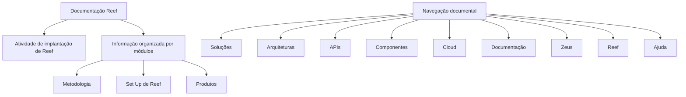

# Documentação Reef — Atividade de Implantação, Módulos e Navegação Corporativa

## 1. Metadados do Documento
- **Arquivo de Origem:** `Não identificado`
- **Tipo de Documento:** `Documentação`
- **Domínio / Sistema:** `Reef / Mapfre`
- **Público-Alvo:** `Não identificado`
- **Data/Versão Identificada:** `Não identificada`

---

## 2. Resumo Executivo & Contexto de Negócio

O documento apresenta a área de documentação relacionada à atividade de implantação do sistema Reef. A informação é declaradamente organizada por módulos, indicando uma estrutura documental modular para consulta sobre a implantação.

Os tópicos explicitamente listados são **Metodologia**, **Set Up de Reef** e **Produtos**. O material também apresenta referências de navegação para soluções, arquiteturas, APIs, componentes, cloud, documentação, Zeus, Reef e ajuda.

O contexto corporativo contém referências a Mapfre e ao endereço `mapfre.com`, além da identificação de ciclo de vida como **Approved Source**. Não há detalhamento sobre arquitetura técnica, integrações, produtos, procedimentos operacionais, APIs, ambientes ou regras de negócio.

> **Nota de Análise:** O documento menciona a implantação de Reef e seus módulos documentais, porém não descreve etapas de implantação, responsáveis, pré-requisitos, tecnologias ou critérios de conclusão.

---

## 3. Arquitetura, Componentes & Tecnologias Envolvidas

Os elementos identificados no conteúdo são:

- **Reef:** sistema ou domínio central da documentação.
- **Mapfre:** referência corporativa associada ao documento.
- **Metodologia:** módulo documental listado.
- **Set Up de Reef:** módulo documental listado.
- **Produtos:** módulo documental listado.
- **Zeus:** item disponível na navegação documental.
- **Soluções, Arquiteturas, APIs, Componentes e Cloud:** categorias de navegação disponíveis.



> **Nota de Análise:** O conteúdo não apresenta uma arquitetura de software, relações técnicas entre sistemas, protocolos, contratos de API, infraestrutura, ambientes ou fluxo de dados.

---

## 4. Regras de Negócio, Especificações Funcionais & Processos

1. A documentação aborda assuntos relacionados à atividade de implantação de Reef.
2. A informação da documentação Reef é organizada por módulos.
3. Os módulos explicitamente apresentados são:
   - Metodologia;
   - Set Up de Reef;
   - Produtos.
4. O documento apresenta uma interface ou contexto de navegação com as categorias Soluções, Arquiteturas, APIs, Componentes, Cloud, Documentação, Zeus, Reef e Ajuda.
5. O ciclo de vida apresentado é **Approved Source**.
6. O idioma de navegação identificado é **ES**.

> **Nota de Análise:** Não foram identificadas regras condicionais, cálculos, validações, permissões, etapas operacionais detalhadas, contratos funcionais ou fluxos transacionais.

---

## 5. Tabelas de Parâmetros, Ambientes e Estruturas de Dados

| Item / Parâmetro | Descrição / Função | Tipo / Valores / Formato | Ambiente / Observações |
| :--- | :--- | :--- | :--- |
| Sistema / domínio | Reef | Nome citado no documento | Relacionado à atividade de implantação |
| Organização / referência | Mapfre | Referência textual e domínio `mapfre.com` | Contexto corporativo |
| Organização documental | Informação organizada por módulos | Estrutura documental | Aplicável à documentação Reef |
| Módulo | Metodologia | Tópico listado | Sem detalhamento adicional |
| Módulo | Set Up de Reef | Tópico listado | Sem detalhamento adicional |
| Módulo | Produtos | Tópico listado | Sem detalhamento adicional |
| Lifecycle | Approved Source | Estado textual | Não há definição adicional |
| Owner | `user:agonzalez_mapfre.com` | Identificador textual | Apresentado como proprietário |
| Idioma | ES | Código exibido na navegação | Não há legenda adicional |
| Navegação | Soluções | Categoria de navegação | Sem detalhamento adicional |
| Navegação | Arquiteturas | Categoria de navegação | Sem detalhamento adicional |
| Navegação | APIs | Categoria de navegação | Sem detalhamento adicional |
| Navegação | Componentes | Categoria de navegação | Sem detalhamento adicional |
| Navegação | Cloud | Categoria de navegação | Sem detalhamento adicional |
| Navegação | Zeus | Item de navegação | Sem detalhamento adicional |
| Navegação | Ajuda | Item de navegação | Sem detalhamento adicional |

---

## 6. Bateria de Perguntas & Respostas para RAG (FAQ Sintético)

### P1: Qual é o assunto principal da documentação Reef?
**R:** A documentação Reef aborda assuntos relacionados à atividade de implantação de Reef. O conteúdo informa que as informações estão organizadas por módulos.

### P2: Como a informação da documentação Reef é estruturada?
**R:** A informação da documentação Reef é organizada por módulos. Os módulos explicitamente listados são Metodologia, Set Up de Reef e Produtos.

### P3: Quais módulos aparecem na documentação Reef?
**R:** Os módulos apresentados são Metodologia, Set Up de Reef e Produtos. O documento não fornece detalhamento adicional sobre o conteúdo de cada módulo.

### P4: O documento descreve o procedimento completo de implantação de Reef?
**R:** Não. O documento afirma que trata da atividade de implantação de Reef, mas não apresenta etapas, pré-requisitos, responsáveis, critérios de validação ou procedimentos detalhados.

### P5: Quem é indicado como owner do documento Reef?
**R:** O campo Owner apresenta o valor `user:agonzalez_mapfre.com`.

### P6: Qual é o ciclo de vida indicado para o documento?
**R:** O ciclo de vida exibido no documento é **Approved Source**. Não há definição adicional para esse estado no conteúdo fornecido.

### P7: Quais categorias estão disponíveis na navegação documental?
**R:** A navegação apresenta Soluções, Arquiteturas, APIs, Componentes, Cloud, Documentação, Zeus, Reef e Ajuda.

### P8: O documento informa tecnologias, protocolos ou URLs de ambiente de Reef?
**R:** Não. O conteúdo não informa tecnologias, protocolos, portas, URLs de ambiente, servidores, microsserviços ou contratos de API de Reef.

### P9: Qual empresa ou contexto corporativo é citado no documento?
**R:** O documento contém referências a Mapfre, incluindo o texto `Mapfredocument` e o domínio `mapfre.com`.

### P10: Qual idioma é identificado na interface apresentada?
**R:** A interface apresenta o código `ES`. O documento não fornece uma descrição adicional desse código.

---

## 7. Glossário de Termos, Siglas & Conceitos-Chave

- **Reef:** Sistema ou domínio central citado na documentação; relacionado à atividade de implantação.
- **Set Up de Reef:** Módulo documental listado; não há detalhamento adicional.
- **Mapfre:** Referência corporativa citada no conteúdo.
- **APIs:** Categoria de navegação apresentada; o documento não descreve interfaces ou contratos.
- **Cloud:** Categoria de navegação apresentada; o documento não descreve serviços ou infraestrutura.
- **Zeus:** Item disponível na navegação; não há definição adicional.
- **Lifecycle:** Campo de ciclo de vida exibido como `Approved Source`.
- **Approved Source:** Valor exibido para Lifecycle; não definido adicionalmente.
- **ES:** Código exibido na navegação; não definido adicionalmente.

---

## 8. Notas Críticas, Riscos & Limitações

- O conteúdo é resumido e não detalha a implantação de Reef.
- Não há descrição de arquitetura, componentes técnicos, integrações, APIs, infraestrutura ou ambientes.
- Não foram identificados procedimentos operacionais, critérios de aceite, regras de negócio ou matriz de responsabilidades.
- Não há informações sobre versões, datas, URLs, credenciais, caminhos de log ou parâmetros de configuração.
- Os módulos Metodologia, Set Up de Reef e Produtos são apenas listados, sem conteúdo explicativo adicional.
- O significado operacional de **Approved Source** não é explicado no documento.

---

## 9. Conteúdo Bruto Estruturado (Referência Fiel)

```text
--- [PÁGINA 1 DE 1] ---

DOCUMENTACIÓN
 En este apartado se aborda todo aquello relacionado con la actividad de implantación de Reef.
La información está organizada por módulos.
 METODOLOGIA
  SET UP DE REEF
  PRODUCTOS
Documentation / DOCUMENTACIÓN Reef
DOCUMENTACIÓN Reef
Mapfredocument
DOCUMENTACIÓN Reef
Owner
user:agonzalez_mapfre.com
Lifecycle
Approved Source
 / 
 VL
Buscar Inicio Soluciones Arquitecturas APIs Componentes Cloud Documentación Zeus Reef Ayuda
ES
```
