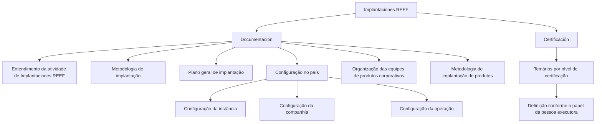
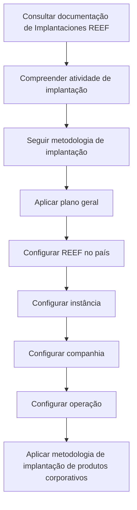

# Implantaciones REEF — Documentação, Certificação e Organização da Atividade de Implantação

## 1. Metadados do Documento
- **Arquivo de Origem:** `Não identificado no conteúdo extraído`
- **Tipo de Documento:** `Procedimento`
- **Domínio / Sistema:** `REEF / Implantaciones REEF`
- **Público-Alvo:** `Equipes responsáveis por implantação, configuração, produtos corporativos e certificação`
- **Data/Versão Identificada:** `Não identificada`

---

## 2. Resumo Executivo & Contexto de Negócio

O conteúdo apresenta a área **Implantaciones REEF**, destinada a concentrar documentação para aquisição de conhecimento sobre a atividade de implantação do REEF em países. O objetivo declarado é organizar informações relacionadas ao processo de implantação segundo duas perspectivas: **Documentación** e **Certificación**.

A perspectiva de **Documentación** descreve o entendimento da atividade de Implantações REEF, a metodologia a seguir e um plano geral para realizar uma implantação. A documentação também relaciona atividades necessárias durante a configuração do REEF no país, da instância, da companhia e da operação.

A área inclui referências à organização das equipes de produtos corporativos e à metodologia de implantação desses produtos. Portanto, o conteúdo posiciona a documentação como um ponto de referência para coordenação de atividades, configuração e implantação no contexto REEF.

A perspectiva de **Certificación** aponta para temários de diferentes níveis de certificação, definidos de acordo com o papel exercido pela pessoa que realiza as tarefas. O conteúdo não detalha os níveis, os papéis, os critérios de aprovação ou os temários de certificação.

---

## 3. Arquitetura, Componentes & Tecnologias Envolvidas

Os elementos explicitamente citados no conteúdo são:

| Componente / Elemento | Papel identificado no documento |
| :--- | :--- |
| **Implantaciones REEF** | Área de documentação sobre a atividade de implantação do REEF em países. |
| **REEF** | Sistema ou domínio ao qual se aplicam as atividades de implantação, configuração e operação. |
| **Documentación** | Perspectiva que abrange metodologia, plano geral, atividades de configuração e organização de equipes de produtos corporativos. |
| **Certificación** | Perspectiva que contém temários de níveis de certificação conforme o papel da pessoa executora. |
| **País** | Contexto geográfico onde ocorre a implantação e a configuração do REEF. |
| **Instância** | Elemento de configuração citado durante a implantação do REEF. |
| **Companhia** | Elemento de configuração citado durante a implantação do REEF. |
| **Operação** | Elemento de configuração ou execução citado durante a implantação do REEF. |
| **Produtos corporativos** | Produtos cujas equipes e metodologia de implantação são mencionadas. |
| **Mapfredocument** | Identificador exibido na navegação ou na seção de documentação. |
| **Zeus** | Item disponível na navegação apresentada. |



> **Nota de Análise:** O conteúdo não descreve arquitetura de software, integrações, APIs, tecnologias, protocolos, ambientes técnicos, servidores, contratos JSON ou métodos HTTP.

---

## 4. Regras de Negócio, Especificações Funcionais & Processos

### 4.1 Organização da informação

A documentação de **Implantaciones REEF** está organizada em duas perspectivas:

1. **Documentación**
2. **Certificación**

### 4.2 Escopo da perspectiva Documentación

A documentação tem como finalidade apresentar:

1. O entendimento da atividade de implantação do REEF em países.
2. A metodologia a ser seguida para conduzir uma implantação.
3. Um plano geral para executar uma implantação.
4. A relação de atividades necessárias para configurar o REEF no país.
5. A configuração da instância.
6. A configuração da companhia.
7. A configuração da operação.
8. A organização das equipes de produtos corporativos.
9. A metodologia de implantação de produtos corporativos.

### 4.3 Escopo da perspectiva Certificación

A certificação contém:

1. Temários de diferentes níveis de certificação.
2. Níveis de certificação estabelecidos de acordo com o papel da pessoa que executa as tarefas.

> **Nota de Análise:** O documento não informa quais são os níveis de certificação, os papéis existentes, os conteúdos dos temários, requisitos de participação, critérios de avaliação ou processo de aprovação.

### 4.4 Fluxo conceitual de implantação identificado



> **Nota de Análise:** O fluxo acima representa somente a sequência conceitual derivada dos tópicos do conteúdo. O documento não especifica ordem obrigatória, responsáveis, entradas, saídas, critérios de aceite ou dependências entre as etapas.

---

## 5. Tabelas de Parâmetros, Ambientes e Estruturas de Dados

| Item / Parâmetro | Descrição / Função | Tipo / Valores / Formato | Ambiente / Observações |
| :--- | :--- | :--- | :--- |
| Implantaciones REEF | Área que reúne documentação sobre implantação do REEF em países. | Área documental | Não há ambiente técnico identificado. |
| Documentación | Perspectiva voltada ao entendimento da atividade, metodologia, plano geral e atividades de configuração. | Categoria documental | Parte da organização da área Implantaciones REEF. |
| Certificación | Perspectiva que reúne temários de certificação por nível e papel. | Categoria documental | Referência apresentada como link `./02-Certicacion/zzz.md`. |
| País | Contexto no qual o REEF é implantado e configurado. | Entidade de contexto | Não há lista de países. |
| Instância | Elemento citado como objeto de configuração durante a implantação. | Elemento de configuração | Não há nomes, tipos ou parâmetros de instância. |
| Companhia | Elemento citado como objeto de configuração durante a implantação. | Elemento de configuração | Não há nomes, regras ou parâmetros de companhia. |
| Operação | Elemento citado como objeto de configuração durante a implantação. | Elemento de configuração | Não há procedimentos operacionais detalhados. |
| Produtos corporativos | Produtos cujas equipes e metodologia de implantação são mencionadas. | Domínio organizacional / produto | Não há catálogo de produtos. |
| Mapfredocument | Termo exibido na área de documentação. | Identificador exibido | O papel funcional não é detalhado. |
| Owner | Campo de propriedade exibido no conteúdo. | Metadado | Valor: `user:agonzalez_mapfre.com`. |
| Lifecycle | Campo de ciclo de vida exibido no conteúdo. | Metadado | Valor: `Approved`. |
| Source | Campo de origem exibido no conteúdo. | Metadado | Valor exibido: `/ VL`. |
| Idioma | Idioma exibido na navegação. | Configuração de interface | Valor: `ES`. |

---

## 6. Bateria de Perguntas & Respostas para RAG (FAQ Sintético)

### P1: Qual é o objetivo da área Implantaciones REEF?
**R:** A área Implantaciones REEF reúne documentação para aquisição de conhecimento sobre a atividade de implantação do REEF em países. O conteúdo organiza essa informação nas perspectivas de Documentación e Certificación.

### P2: Quais são as duas perspectivas de informação da documentação Implantaciones REEF?
**R:** As duas perspectivas apresentadas são **Documentación** e **Certificación**. Documentación trata da atividade, metodologia, plano geral e configurações relacionadas à implantação; Certificación trata dos temários de diferentes níveis de certificação conforme o papel da pessoa executora.

### P3: O que a documentação REEF informa sobre a metodologia de implantação?
**R:** O conteúdo afirma que a documentação aborda a metodologia a seguir e um plano geral para realizar uma implantação do REEF. No entanto, o texto extraído não detalha etapas específicas, responsáveis, cronogramas, ferramentas ou critérios de aceite dessa metodologia.

### P4: Quais elementos devem ser configurados durante uma implantação do REEF?
**R:** O conteúdo menciona atividades para configurar o REEF no país, a instância, a companhia e a operação. Não são fornecidos parâmetros técnicos, sequenciamento obrigatório ou procedimentos detalhados para essas configurações.

### P5: A documentação apresenta detalhes de APIs, microsserviços ou contratos de integração do REEF?
**R:** Não. O conteúdo extraído não descreve APIs, microsserviços, endpoints, métodos HTTP, contratos JSON, protocolos, bancos de dados ou integrações técnicas.

### P6: O que está incluído na seção Certificación?
**R:** A seção Certificación contém temários de distintos níveis de certificação estabelecidos em função do papel da pessoa que realiza as tarefas. O conteúdo não informa os nomes dos níveis, os papéis, os temários completos ou os critérios de certificação.

### P7: Qual é a relação entre produtos corporativos e a implantação REEF?
**R:** A documentação menciona a organização das equipes de produtos corporativos e a metodologia de implantação de produtos. Não há identificação dos produtos corporativos, das equipes responsáveis ou das dependências entre esses produtos e o REEF.

### P8: Existe um país específico indicado para a implantação do REEF?
**R:** Não. O documento menciona a implantação do REEF em países e a configuração no país, mas não lista países, regiões, unidades organizacionais ou ambientes específicos.

### P9: Qual é o status de ciclo de vida da documentação apresentada?
**R:** O metadado exibido para Lifecycle é **Approved**.

### P10: Quem é o owner exibido para o conteúdo Implantaciones REEF?
**R:** O campo Owner apresentado no conteúdo possui o valor `user:agonzalez_mapfre.com`.

### P11: Onde está referenciada a documentação de certificação?
**R:** A seção Certificación é apresentada com a referência de link `./02-Certicacion/zzz.md`. O conteúdo extraído não permite confirmar se o link é válido ou detalhar o arquivo referenciado.

### P12: O documento descreve ambientes técnicos, URLs, servidores ou rotas de log?
**R:** Não. Não foram identificados ambientes técnicos, URLs, servidores, portas, rotas de logs, variáveis de configuração ou caminhos operacionais além da referência relativa `./02-Certicacion/zzz.md`.

---

## 7. Glossário de Termos, Siglas & Conceitos-Chave

- **REEF:** Sistema ou domínio mencionado como objeto da atividade de implantação em países.
- **Implantaciones REEF:** Área de documentação dedicada ao conhecimento sobre implantação do REEF.
- **Documentación:** Perspectiva documental que trata da atividade de implantação, metodologia, plano geral e configurações.
- **Certificación:** Perspectiva documental que reúne temários associados a níveis de certificação conforme o papel da pessoa executora.
- **Instância:** Elemento citado como objeto de configuração durante a implantação do REEF; o documento não apresenta definição técnica adicional.
- **Companhia:** Elemento citado como objeto de configuração durante a implantação do REEF; o documento não apresenta definição adicional.
- **Operação:** Elemento citado como objeto de configuração durante a implantação do REEF; o documento não apresenta procedimento operacional adicional.
- **Produtos corporativos:** Produtos associados a equipes corporativas e a uma metodologia de implantação mencionada no conteúdo.
- **Lifecycle:** Campo de metadado exibido para indicar o ciclo de vida do conteúdo, com valor `Approved`.
- **Owner:** Campo de metadado que identifica a propriedade do conteúdo, com valor `user:agonzalez_mapfre.com`.
- **Mapfredocument:** Termo exibido na documentação; o significado funcional não é definido no conteúdo extraído.
- **Zeus:** Item exibido na navegação; o significado funcional não é definido no conteúdo extraído.

---

## 8. Notas Críticas, Riscos & Limitações

- O conteúdo é resumido e não especifica procedimentos técnicos detalhados para implantar ou configurar o REEF.
- Não foram identificados nomes de países, ambientes, servidores, URLs, APIs, integrações, tecnologias, versões ou responsáveis operacionais.
- A referência de certificação `./02-Certicacion/zzz.md` é exibida, mas o documento extraído não inclui o conteúdo do arquivo referenciado.
- Os níveis de certificação, os papéis abrangidos, os temários e os critérios de avaliação não são detalhados.
- O documento cita configuração de país, instância, companhia e operação, mas não apresenta parâmetros, dependências, ordem obrigatória ou critérios de conclusão.
- Alguns caracteres do texto extraído apresentam codificação inconsistente, como `Certicación`, `congurar` e `conguración`; estes trechos foram preservados na referência bruta para auditoria.

---

## 9. Conteúdo Bruto Estruturado (Referência Fiel)

```text
--- [PÁGINA 1 DE 1] ---

IMPLANTACIONES REEF
 En este apartado se encuentra la documentación que permite adquirir conocimientos acerca de la actividad que
conlleva la implantación de Reef en países. La información está organizada en dos perspectivas:
Documentación
Certicación
DOCUMENTACIÓN
Entendimiento de la actividad de Implantaciones Reef, metodología a seguir y plan general para llevar a cabo una implantación.
Relación de actividades a llevar a cabo en el momendo de congurar Reef en el país, instancia, conguración de la compañía y operación.
Organización de los equipos de productos corporativos. Metodología de despliegue de productos.
[CERTIFICACIÓN](./02-Certicacion/zzz.md
Aquí se encuentran los temarios de los distintos niveles de certicación establecidos en función del rol de la persona que realiza las tareas.
Documentation / DOCUMENTACIÓN Reef
DOCUMENTACIÓN Reef
Mapfredocument
DOCUMENTACIÓN Reef
Owner
user:agonzalez_mapfre.com
Lifecycle
Approved Source
 / 
 VL
Buscar Inicio Soluciones Arquitecturas APIs Componentes Cloud Documentación Zeus Reef Ayuda
ES
```
