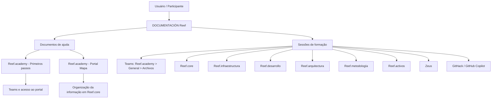

# DOCUMENTACIÓN Reef — Catálogo de Documentos de Ajuda e Sessões de Formação

## 1. Metadados do Documento
- **Arquivo de Origem:** Não identificado no conteúdo extraído
- **Tipo de Documento:** Manual Operacional / Catálogo de Documentação e Formação
- **Domínio / Sistema:** Reef, Reef.core, Reef.academy, Teams, Zeus
- **Público-Alvo:** Desenvolvedores, Arquitetos, Operação, Negócio e participantes das sessões Reef
- **Data/Versão Identificada:** Conteúdo de sessões entre setembro de 2023 e setembro de 2024; versão do documento não identificada

---

## 2. Resumo Executivo & Contexto de Negócio

O documento **DOCUMENTACIÓN Reef** funciona como um índice corporativo de materiais de apoio e sessões de formação relacionadas ao ecossistema Reef. A página é identificada como documentação aprovada, com proprietário `user:agonzalez_mapfre.com`, e disponibiliza acesso a conteúdos sobre Reef.core, infraestrutura, arquitetura, desenvolvimento, metodologia, ativos, chatbots e Zeus.

A documentação organiza os recursos em duas categorias principais: **Documentos de ajuda** e **Sessões de formação**. Os documentos de ajuda incluem um material de primeiros passos para Reef.academy e um mapa do portal Reef.core. As sessões de formação registram tema, conteúdo, nível, idioma e localização do material no Microsoft Teams.

O repositório de materiais das sessões está localizado no Teams, no caminho geral `Equipo Reef.academy > General > Archivos`. O catálogo também informa que existe um link para uma versão em Microsoft Excel, mas o URL ou destino desse link não foi incluído no conteúdo extraído.

O catálogo evidencia uma trilha de capacitação progressiva. Há conteúdos básicos sobre introdução a Reef.core, emissão, sinistros, tesouraria/contabilidade, infraestrutura, DevOps, experiência de usuário e metodologia. Também há conteúdos de nível médio e avançado, como definição de plano de tramitação, novo modelo de terceiros, detalhamento de importes, planos de pagamento, liquidações, APIs de canal e visão técnica sobre mudanças de plano de pagamento.

> **Nota de Análise:** O documento é um catálogo de sessões e materiais, não uma especificação funcional ou técnica detalhada. Ele não descreve contratos de API, métodos HTTP, topologias de infraestrutura, regras de cálculo, URLs completas, credenciais, versões técnicas ou fluxos internos dos módulos Reef.

---

## 3. Arquitetura, Componentes & Tecnologias Envolvidas

Os componentes, portais e domínios explicitamente mencionados são:

| Componente / Domínio | Descrição sustentada pelo documento |
| :--- | :--- |
| **Reef** | Ecossistema principal ao qual pertencem documentação, sessões e temas de formação. |
| **Reef.core** | Domínio recorrente nas sessões; abrange emissão, terceiros, sinistros, tesouraria, contabilidade e funcionalidades comuns. |
| **Reef.academy** | Equipe/área utilizada para sessões de formação e documentos de primeiros passos. |
| **Reef.infraestructura** | Área com sessões de introdução à observabilidade e DevOps. |
| **Reef.arquitectura** | Área com sessão denominada “Arquitectura Reef”. |
| **Reef.desarrollo** | Área com sessões sobre API de canal, traças backend, frontal, API e nova versão. |
| **Reef.metodología** | Área com sessões sobre portal Methods e metodologia de ideias e projeto simplificada. |
| **Reef.activos - Autoservicio** | Área com sessão sobre autosserviço de cliente. |
| **Reef.activos - Chatbots** | Área com sessão sobre plataforma corporativa de chatbots. |
| **Teams** | Plataforma indicada para armazenamento dos arquivos das sessões. |
| **Zeus** | Sistema/tema citado em uma sessão de formação. |
| **GitHub Copilot** | Ferramenta mencionada nas sessões GitHack. |
| **Portal Reef.core** | Portal cuja organização da informação é descrita pelo documento `Reef.academy-Portal-Mapa`. |
| **Methods** | Portal mencionado na sessão “Metodología - portal Methods”. |



> **Nota de Análise:** O diagrama representa apenas a organização documental e de treinamento explicitamente indicada. O documento não fornece arquitetura de execução, comunicação entre microsserviços, protocolos, bancos de dados ou integrações técnicas entre os componentes.

---

## 4. Regras de Negócio, Especificações Funcionais & Processos

### 4.1 Organização documental

1. A área **Sesiones Reef** reúne referências de dois tipos:
   - Documentos de ajuda.
   - Sessões de formação.
2. Os materiais das sessões realizadas ficam localizados no Teams, no caminho:
   - `Teams > Equipo Reef.academy > General > Archivos`.
3. O catálogo oferece referência para uma versão em Microsoft Excel, porém o conteúdo extraído não apresenta o link.
4. A documentação de ajuda lista materiais em versões `pptx` e `pdf`, ambos indicados como disponíveis para descarga.
5. A informação das sessões é catalogada pelos atributos:
   - Tema.
   - Conteúdo.
   - Nível.
   - Idioma.
   - Localização do material no Teams.

### 4.2 Materiais de ajuda

| Arquivo | Descrição | Versões indicadas |
| :--- | :--- | :--- |
| `Reef.academy-Primeros-pasos` | Documento para explicar atividades como cadastro no Teams, acesso ao portal e outros tópicos não detalhados. | PPTX e PDF para descarga |
| `Reef.academy-Portal-Mapa` | Documento que mostra como a informação está organizada no Reef.core. | PPTX e PDF para descarga |

### 4.3 Temas funcionais e técnicos cobertos nas sessões

| Área | Assuntos explicitamente listados |
| :--- | :--- |
| **Reef.core - Emisión** | Criação de processo massivo; introdução à emissão; conceitos de desglose; detalhe de importes; mudanças de plano de pagamento; definição de plano de pagamento; visão técnica de mudanças de plano de pagamento. |
| **Reef.core - Terceros** | Criação de processo massivo de clientes; novo modelo de terceiros; criação de agente. |
| **Reef.core - Siniestros** | Criação de processo massivo; introdução a sinistros; definição de plano de tramitação; ferramentas do plano; definição de liquidações. |
| **Reef.core - Tesorería** | Introdução a tesouraria/contabilidade. |
| **Reef.core - Contabilidad** | Introdução a tesouraria/contabilidade. |
| **Reef.core - Común** | Introdução geral; definições do módulo; definições do módulo para ramos técnicos. |
| **Reef.infraestructura** | Introdução à observabilidade; DevOps. |
| **Reef.arquitectura** | Arquitetura Reef. |
| **Reef.desarrollo** | API de Emisión para canal; traças backend; traças frontal; traças API; nova versão com aspetos funcionais e técnicos. |
| **UX - Experiencia de usuario** | Experiência de usuário Reef. |
| **Reef.metodología** | Portal Methods; metodologia de ideias e projeto simplificada. |
| **Reef.activos** | Autosserviço de cliente; plataforma corporativa de chatbots. |
| **Reef / GitHack** | Sessões sobre desenvolvimento de habilidades com GitHub Copilot, em espanhol e inglês. |
| **Zeus** | Sessão identificada apenas como “Zeus”. |

> **Nota de Análise:** O documento apresenta títulos de sessões, mas não detalha regras operacionais, campos, critérios de validação, fluxos de aprovação, contratos de integração, procedimentos de execução ou configurações dos módulos tratados.

---

## 5. Tabelas de Parâmetros, Ambientes e Estruturas de Dados

### 5.1 Metadados e localização dos materiais

| Item / Parâmetro | Descrição / Função | Tipo / Valores / Formato | Ambiente / Observações |
| :--- | :--- | :--- | :--- |
| Proprietário | Proprietário identificado para a documentação Reef. | `user:agonzalez_mapfre.com` | Exibido como `Owner`. |
| Ciclo de vida | Situação documental indicada na página. | `Approved Source / VL` | O significado de `VL` não é detalhado. |
| Tipos de referência | Categorias principais de conteúdo. | Documentos de ajuda; Sessões de formação | Área “Sesiones Reef”. |
| Localização geral das sessões | Diretório indicado para os arquivos das sessões. | `Teams > Equipo Reef.academy > General > Archivos` | Microsoft Teams. |
| Formatos dos documentos de ajuda | Formatos disponibilizados para descarga. | PPTX; PDF | Aplicável aos dois documentos de ajuda listados. |
| Versão Excel | Referência a formato alternativo do catálogo. | Microsoft Excel | O link não foi extraído. |
| Idioma predominante | Idioma da maioria das sessões. | ESPAÑOL | Há sessões GitHack em ENGLISH. |
| Níveis de formação | Classificação de dificuldade. | N.A.; BAJO; BÁSICO; MEDIO; AVANZADO; MEDIUM | `MEDIUM` é usado nas sessões em inglês. |

### 5.2 Catálogo de sessões de formação

| Tema | Conteúdo | Nível | Idioma | Localização do material no Teams |
| :--- | :--- | :--- | :--- | :--- |
| Reef.core - Emisión | Reef.core - Emisión - CREAR proceso masivo | N.A. | ESPAÑOL | `00-Sesiones-Sessions>2023>09-Septiembre>14` |
| Reef.core - Emisión | Reef.core - Emisión - CREAR proceso masivo (2) | N.A. | ESPAÑOL | `00-Sesiones-Sessions>2023>09-Septiembre>19` |
| Reef.core - Terceros | Reef.core - Clientes - CREAR proceso masivo | N.A. | ESPAÑOL | `00-Sesiones-Sessions>2023>09-Septiembre>21` |
| Reef.core - Emisión | Reef.core - Emisión - CREAR proceso masivo (3) | N.A. | ESPAÑOL | `00-Sesiones-Sessions>2023>09-Septiembre>26` |
| Reef.core - Siniestros | Reef.core - Siniestros - CREAR proceso masivo | N.A. | ESPAÑOL | `00-Sesiones-Sessions>2023>09-Septiembre>28` |
| Reef.core - Emisión | Reef.core - Emisión - CREAR proceso masivo (4) | N.A. | ESPAÑOL | `00-Sesiones-Sessions>2023>10-Octubre>03` |
| Reef | REEF - Presentación | N.A. | ESPAÑOL | `00-Sesiones-Sessions>2023>10-Octubre>05` |
| Reef.infraestructura | REEF - Introducción a observabilidad | N.A. | ESPAÑOL | `00-Sesiones-Sessions>2023>10-Octubre>10` |
| UX - Experiencia de usuario | REEF - UX - Experiencia de Usuario | N.A. | ESPAÑOL | `00-Sesiones-Sessions>2023>10-Octubre>19` |
| Reef.arquitectura | Arquitectura Reef | N.A. | ESPAÑOL | `00-Sesiones-Sessions>2023>10-Octubre>26` |
| Reef.infraestructura | Reef.infraestructura - DevOps | BÁSICO | ESPAÑOL | `00-Sesiones-Sessions>2023>11-Noviembre>02` |
| Reef.core - Común | Reef.core - Introducción general | BÁSICO | ESPAÑOL | `00-Sesiones-Sessions>2023>11-Noviembre>07` |
| Reef.core - Común | Reef.core - Introducción general (2) | BÁSICO | ESPAÑOL | `00-Sesiones-Sessions>2023>11-Noviembre>14` |
| Reef.core - Emisión | Reef.core - Introducción emisión | BÁSICO | ESPAÑOL | `00-Sesiones-Sessions>2023>11-Noviembre>16` |
| Reef.core - Emisión | Reef.core - Introducción emisión (2) | BÁSICO | ESPAÑOL | `00-Sesiones-Sessions>2023>11-Noviembre>21` |
| Reef.core - Siniestros | Reef.core - Introducción siniestros | BÁSICO | ESPAÑOL | `00-Sesiones-Sessions>2023>11-Noviembre>23` |
| Reef.core - Tesorería | Reef.core - Introducción tesorería/contabilidad | BÁSICO | ESPAÑOL | `00-Sesiones-Sessions>2023>11-Noviembre>30` |
| Reef.core - Emisión | Reef.core - Emisión - Conceptos de desglose - Detalle de importes | AVANZADO | ESPAÑOL | `00-Sesiones-Sessions>2023>12-Diciembre>05` |
| Reef.core - Contabilidad | Reef.core - Introducción tesorería/contabilidad (2) | BÁSICO | ESPAÑOL | `00-Sesiones-Sessions>2023>12-Diciembre>12` |
| Reef.core - Siniestros | Reef.core - Siniestros - Definición plan de tramitación | MEDIO | ESPAÑOL | `00-Sesiones-Sessions>2023>12-Diciembre>14` |
| Reef.core - Emisión | Reef.core - Emisión - Conceptos de desglose - Detalle de importes (2) | AVANZADO | ESPAÑOL | `00-Sesiones-Sessions>2024>01-Enero>11` |
| Reef.core - Siniestros | Reef.core - Siniestros - Definición plan de tramitación (2) | MEDIO | ESPAÑOL | `00-Sesiones-Sessions>2024>01-Enero>18` |
| Reef.core - Terceros | Reef.core - Terceros - Nuevo modelo de Terceros | MEDIO | ESPAÑOL | `00-Sesiones-Sessions>2024>01-Enero>25` |
| Reef.core - Siniestros | Reef.core - Siniestros - Plan tramitacion Herramientas- Definición - 1 | MEDIO | ESPAÑOL | `00-Sesiones-Sessions>2024>02-Febrero>01` |
| Reef.core - Siniestros | Reef.core - Siniestros - Herramientas del Plan - Definición - (2) | MEDIO | ESPAÑOL | `00-Sesiones-Sessions>2024>02-Febrero>08` |
| Reef.core - Común | Reef.core - Comunes - Definiciones del Módulo | MEDIO | ESPAÑOL | `00-Sesiones-Sessions>2024>02-Febrero>15` |
| Reef.core - Común | Reef.core - Comunes - Definiciones del módulo (2) | MEDIO | ESPAÑOL | `00-Sesiones-Sessions>2024>02-Febrero>22` |
| Reef.core - Común | Reef.core - Comunes - Definiciones del Módulo (Ramos Técnicos) | MEDIO | ESPAÑOL | `00-Sesiones-Sessions>2024>02-Febrero>27` |
| Reef.core - Emisión | Reef.core - Emisión - Cambios de plan de pago | MEDIO | ESPAÑOL | `00-Sesiones-Sessions>2024>02-Febrero>29` |
| Reef.core - Terceros | Reef.core - Terceros - Nuevo Modelo de Terceros (2) | MEDIO | ESPAÑOL | `00-Sesiones-Sessions>2024>03-Marzo>07` |
| Reef.desarrollo | Reef.core - API - Emisión - API de Canal | AVANZADO | ESPAÑOL | `00-Sesiones-Sessions>2024>03-Marzo>14` |
| Reef.core - Emisión | Reef.core - Emisión - Definición de plan de pago | MEDIO | ESPAÑOL | `00-Sesiones-Sessions>2024>03-Marzo>21` |
| Reef.core - Siniestros | Reef.core - Siniestros - Definición de liquidaciones | MEDIO | ESPAÑOL | `00-Sesiones-Sessions>2024>04-Abril>04` |
| Reef.desarrollo | Reef.core - Trazas backend | BAJO | ESPAÑOL | `00-Sesiones-Sessions>2024>04-Abril>11` |
| Reef.desarrollo | Reef.core - Trazas frontal | BAJO | ESPAÑOL | `00-Sesiones-Sessions>2024>04-Abril>18` |
| Reef.desarrollo | Reef.core - Trazas A.P.I. | BAJO | ESPAÑOL | `00-Sesiones-Sessions>2024>04-Abril>25` |
| Reef.core - Emisión | Reef.core - Emisión - Cambios de plan de pago - Visión técnica | AVANZADO | ESPAÑOL | `00-Sesiones-Sessions>2024>05-Mayo>07` |
| Reef.core - Emisión | Reef.core - Emisión - Cambios de plan de pago - Visión técnica(2) | AVANZADO | ESPAÑOL | `00-Sesiones-Sessions>2024>05-Mayo>09` |
| Reef.core - Emisión | Reef.core - Emisión - Definición de plan de pago (2) | MEDIO | ESPAÑOL | `00-Sesiones-Sessions>2024>05-Mayo>16` |
| Reef.core - Terceros | Reef.core - Terceros - CREAR agente | BAJO | ESPAÑOL | `00-Sesiones-Sessions>2024>05-Mayo>23` |
| Reef.metodología | Metodología - portal Methods | BAJO | ESPAÑOL | `00-Sesiones-Sessions>2024>05-Mayo>30` |
| Reef.core - Emisión | Reef.core - Emisión - Definición de plan de pago (3) | MEDIO | ESPAÑOL | `00-Sesiones-Sessions>2024>06-Junio>06` |
| Reef | GitHack: Eleva tus skills con GitHub Copilot | BAJO | ESPAÑOL | `00-Sesiones-Sessions>2024>06-Junio>13` |
| Reef.activos - Autoservicio | Reef - Autoservicio Cliente | BAJO | ESPAÑOL | `00-Sesiones-Sessions>2024>06-Junio>20` |
| Reef.activos - Chatbots | Plataforma Corporativa de Chatbots | BAJO | ESPAÑOL | `00-Sesiones-Sessions>2024>06-Junio>27` |
| Reef.desarrollo | Reef.core - Nueva versión - Aspectos de interés funcionales y técnicos | BAJO | ESPAÑOL | `00-Sesiones-Sessions>2024>07-Julio>04` |
| Reef | GitHack: Grow your skills with GitHub Copilot | MEDIUM | ENGLISH | `00-Sesiones-Sessions>2024>07-Julio>10` |
| Reef.metodología | Metodología de Ideas y Proyecto Simplificada | BAJO | ESPAÑOL | `00-Sesiones-Sessions>2024>07-Julio>11` |
| Reef | GitHack: Grow your skills with GitHub Copilot | MEDIUM | ENGLISH | `00-Sesiones-Sessions>2024>07-Julio>17` |
| Zeus | Zeus | MEDIO | ESPAÑOL | `00-Sesiones-Sessions>2024>07-Julio>18` |
| Reef.core - Siniestros | Reef.core - Siniestros - Definición de liquidaciones (2) | BAJO | ESPAÑOL | `00-Sesiones-Sessions>2024>07-Julio>23` |
| Reef.core - Siniestros | Reef.core - Siniestros - Definición de liquidaciones (3) | BAJO | ESPAÑOL | `00-Sesiones-Sessions>2024>09-Septiembre>12` |

---

## 6. Bateria de Perguntas & Respostas para RAG (FAQ Sintético)

### P1: Onde estão armazenados os materiais das sessões de formação Reef?
**R:** O documento informa que os arquivos das sessões estão no Microsoft Teams, no caminho `Teams > Equipo Reef.academy > General > Archivos`. Cada sessão também possui uma localização específica no padrão `00-Sesiones-Sessions>Ano>Mês>Dia`.

### P2: Quais documentos de ajuda estão disponíveis para usuários do Reef.academy?
**R:** O catálogo lista `Reef.academy-Primeros-pasos`, voltado a temas como cadastro no Teams e acesso ao portal, e `Reef.academy-Portal-Mapa`, que mostra como a informação está organizada no Reef.core. Ambos possuem indicação de versões PPTX e PDF para descarga.

### P3: Qual sessão apresenta a arquitetura do Reef?
**R:** A sessão com tema `Reef.arquitectura` e conteúdo `Arquitectura Reef` está classificada como nível `N.A.`, em espanhol, e localizada em `00-Sesiones-Sessions>2023>10-Octubre>26`.

### P4: Existe treinamento de observabilidade e DevOps no catálogo Reef?
**R:** Sim. O documento lista a sessão `REEF - Introducción a observabilidad`, em 10 de outubro de 2023, e a sessão `Reef.infraestructura - DevOps`, de nível básico, em 2 de novembro de 2023. Ambas pertencem ao tema `Reef.infraestructura` e estão em espanhol.

### P5: Quais sessões abordam rastreamento ou traças técnicas no Reef.core?
**R:** O catálogo lista três sessões de nível baixo, no tema `Reef.desarrollo`: `Reef.core - Trazas backend`, em 11 de abril de 2024; `Reef.core - Trazas frontal`, em 18 de abril de 2024; e `Reef.core - Trazas A.P.I.`, em 25 de abril de 2024. O documento não detalha ferramentas, formatos de log ou procedimentos técnicos dessas traças.

### P6: Há uma sessão sobre API de canal para emissão?
**R:** Sim. A sessão pertence ao tema `Reef.desarrollo`, tem conteúdo `Reef.core - API - Emisión - API de Canal`, é classificada como avançada, está em espanhol e possui localização `00-Sesiones-Sessions>2024>03-Marzo>14`.

### P7: Onde encontro sessões sobre definição de plano de pagamento em Reef.core?
**R:** O catálogo apresenta três sessões `Reef.core - Emisión - Definición de plan de pago`: em 21 de março de 2024, 16 de maio de 2024 e 6 de junho de 2024. Todas são de nível médio, em espanhol, com caminhos específicos no Teams para as datas informadas.

### P8: Quais treinamentos de sinistros estão disponíveis?
**R:** As sessões de `Reef.core - Siniestros` incluem criação de processo massivo, introdução a sinistros, definição de plano de tramitação, ferramentas do plano, e definição de liquidações. As sessões abrangem níveis N.A., básico, médio e baixo, entre setembro de 2023 e setembro de 2024.

### P9: Existem treinamentos sobre GitHub Copilot?
**R:** Sim. Há uma sessão em espanhol, `GitHack: Eleva tus skills con GitHub Copilot`, de nível baixo, em 13 de junho de 2024. Há também duas sessões em inglês, `GitHack: Grow your skills with GitHub Copilot`, de nível médio, em 10 e 17 de julho de 2024.

### P10: O documento apresenta detalhes de endpoints, métodos HTTP ou contratos JSON da API de Canal?
**R:** Não. O documento apenas lista uma sessão denominada `Reef.core - API - Emisión - API de Canal`. Não são fornecidos endpoints, métodos HTTP, formatos de mensagem, autenticação, contratos JSON ou regras de integração.

### P11: Há conteúdo sobre o novo modelo de terceiros?
**R:** Sim. O catálogo lista `Reef.core - Terceros - Nuevo modelo de Terceros`, de nível médio, em 25 de janeiro de 2024, e `Reef.core - Terceros - Nuevo Modelo de Terceros (2)`, também de nível médio, em 7 de março de 2024.

### P12: Qual é o material disponível sobre autosserviço e chatbots?
**R:** O tema `Reef.activos - Autoservicio` possui a sessão `Reef - Autoservicio Cliente`, de nível baixo, em 20 de junho de 2024. O tema `Reef.activos - Chatbots` possui a sessão `Plataforma Corporativa de Chatbots`, de nível baixo, em 27 de junho de 2024. Ambas estão em espanhol.

---

## 7. Glossário de Termos, Siglas & Conceitos-Chave

- **API / A.P.I.:** Interface de Programação de Aplicações; o documento cita uma API de Canal para Emisión e uma sessão de traças de API, sem detalhar interfaces ou protocolos.
- **DevOps:** Tema de sessão de Reef.infraestructura classificada como básica.
- **GitHack:** Nome de sessões relacionadas ao desenvolvimento de habilidades com GitHub Copilot.
- **GitHub Copilot:** Ferramenta citada nas sessões GitHack em espanhol e inglês.
- **N.A.:** Valor de nível utilizado no catálogo; o documento não define seu significado.
- **Reef.academy:** Equipe/área associada às sessões e aos documentos de primeiros passos.
- **Reef.core:** Domínio funcional recorrente no catálogo, incluindo emissão, terceiros, sinistros, tesouraria, contabilidade e componentes comuns.
- **Reef.desarrollo:** Área relacionada a API, traças e nova versão do Reef.core.
- **Reef.infraestructura:** Área relacionada a observabilidade e DevOps.
- **Reef.metodología:** Área relacionada ao portal Methods e à metodologia de ideias e projeto.
- **Siniestros:** Domínio de Reef.core citado em sessões sobre introdução, planos de tramitação, ferramentas e liquidações.
- **Teams:** Plataforma de colaboração e repositório dos arquivos das sessões.
- **Terceros:** Domínio de Reef.core citado em conteúdos sobre clientes, modelo de terceiros e criação de agente.
- **UX:** Experiência de usuário; tema de uma sessão Reef.
- **Zeus:** Sistema ou tema mencionado em uma sessão, sem detalhamento adicional.

---

## 8. Notas Críticas, Riscos & Limitações

- O conteúdo é predominantemente um **índice de sessões**; não substitui os materiais originais hospedados no Teams.
- O documento não fornece URLs diretas para download, links do Excel ou URLs do Teams.
- Não há versão formal, data de publicação, autor técnico ou histórico de revisões identificados para o documento.
- A indicação `Approved Source / VL` aparece no cabeçalho, mas o significado operacional de `VL` não é explicado.
- Há caracteres de extração corrompidos em termos como `Denición` e `Simplicada`; a interpretação foi normalizada nas tabelas quando o contexto permitiu identificar claramente a palavra.
- O catálogo não detalha arquitetura de software, topologia de ambientes, servidores, logs, portas, observabilidade, regras de cálculo, contratos de API ou segurança.
- Várias sessões possuem sufixos como `(2)`, `(3)` e `(4)`, mas o documento não explica se representam repetição, continuação, revisão ou edição distinta do conteúdo.
- A sessão `Zeus` contém apenas o termo `Zeus`; não há explicação funcional, técnica ou operacional associada.

---

## 9. Conteúdo Bruto Estruturado (Referência Fiel)

```text
--- [PÁGINA 1 DE 5] ---

Sesiones Reef
 En este apartado se encuentran documentos o referencias de dos tipos:
Documentos de ayuda
Sesiones de formación
Documentos de ayuda
ARCHIVO DESCRIPCIÓN VERSIÓN
pptx
VERSIÓN
pdf
Reef.academy-Primeros-
pasos
Documento que pretende explicar como realizar temas como:
- Darse de alta en Teams
- Acceder al portal
- Etc.
descarga descarga
Reef.academy-Portal-Mapa Documento que muestra como está organizada la información
en Reef.core
descarga descarga
Sesiones de formación
Aquí se encuentran las sesiones que se han realizado hasta el momento. La ubicación de estos archivos están en Teams > Equipo
Reef.academy > General > Archivos. Si deseas una versión en Microsoft Excel, puedes utilizar el siguiente enlace
TEMA CONTENIDO NIVEL IDIOMA UBICACIÓN DEL MATERIAL
(EN TEAMS)
Reef.core - Emisión Reef.core - Emisión - CREAR proceso
masivo
N.A. ESPAÑOL 00-Sesiones-
Sessions>2023>09-
Septiembre>14
Reef.core - Emisión Reef.core - Emisión - CREAR proceso
masivo (2)
N.A. ESPAÑOL 00-Sesiones-
Sessions>2023>09-
Documentation / DOCUMENTACIÓN Reef
DOCUMENTACIÓN Reef
Mapfredocument
DOCUMENTACIÓN Reef
Owner
user:agonzalez_mapfre.com
Lifecycle
Approved Source
 /
 VL
Buscar Inicio Soluciones Arquitecturas APIs Componentes Cloud Documentación Zeus Reef Ayuda
ES

--- [PÁGINA 2 DE 5] ---

TEMA CONTENIDO NIVEL IDIOMA UBICACIÓN DEL MATERIAL
(EN TEAMS)
Septiembre>19
Reef.core - Terceros Reef.core - Clientes - CREAR proceso
masivo
N.A. ESPAÑOL 00-Sesiones-
Sessions>2023>09-
Septiembre>21
Reef.core - Emisión Reef.core - Emisión - CREAR proceso
masivo (3)
N.A. ESPAÑOL 00-Sesiones-
Sessions>2023>09-
Septiembre>26
Reef.core - Siniestros Reef.core - Siniestros - CREAR proceso
masivo
N.A. ESPAÑOL 00-Sesiones-
Sessions>2023>09-
Septiembre>28
Reef.core - Emisión Reef.core - Emisión - CREAR proceso
masivo (4)
N.A. ESPAÑOL 00-Sesiones-
Sessions>2023>10-Octubre
>03
Reef REEF - Presentación N.A. ESPAÑOL 00-Sesiones-
Sessions>2023>10-Octubre
>05
Reef.infraestructura REEF - Introducción a observabilidad N.A. ESPAÑOL 00-Sesiones-
Sessions>2023>10-Octubre
>10
UX - Experiencia de
usuario
REEF - UX - Experiencia de Usuario N.A. ESPAÑOL 00-Sesiones-
Sessions>2023>10-Octubre
>19
Reef.arquitectura Arquitectura Reef N.A. ESPAÑOL 00-Sesiones-
Sessions>2023>10-Octubre
>26
Reef.infraestructura Reef.infraestructura - DevOps BÁSICO ESPAÑOL 00-Sesiones-
Sessions>2023>11-
Noviembre >02
Reef.core - Común Reef.core - Introducción general BÁSICO ESPAÑOL 00-Sesiones-
Sessions>2023>11-
Noviembre >07
Reef.core - Común Reef.core - Introducción general (2) BÁSICO ESPAÑOL 00-Sesiones-
Sessions>2023>11-
Noviembre >14
Reef.core - Emisión Reef.core - Introducción emisión BÁSICO ESPAÑOL 00-Sesiones-
Sessions>2023>11-
Noviembre >16
Reef.core - Emisión Reef.core - Introducción emisión (2) BÁSICO ESPAÑOL 00-Sesiones-
Sessions>2023>11-
Noviembre >21

--- [PÁGINA 3 DE 5] ---

TEMA CONTENIDO NIVEL IDIOMA UBICACIÓN DEL MATERIAL
(EN TEAMS)
Reef.core - Siniestros Reef.core - Introducción siniestros BÁSICO ESPAÑOL 00-Sesiones-
Sessions>2023>11-
Noviembre >23
Reef.core - Tesorería Reef.core - Introducción
tesorería/contabilidad
BÁSICO ESPAÑOL 00-Sesiones-
Sessions>2023>11-
Noviembre >30
Reef.core - Emisión Reef.core - Emisión - Conceptos de
desglose - Detalle de importes
AVANZADO ESPAÑOL 00-Sesiones-
Sessions>2023>12-
Diciembre >05
Reef.core -
Contabilidad
Reef.core - Introducción
tesorería/contabilidad (2)
BÁSICO ESPAÑOL 00-Sesiones-
Sessions>2023>12-
Diciembre >12
Reef.core - Siniestros Reef.core - Siniestros - Denición plan
de tramitación
MEDIO ESPAÑOL 00-Sesiones-
Sessions>2023>12-
Diciembre >14
Reef.core - Emisión Reef.core - Emisión - Conceptos de
desglose - Detalle de importes (2)
AVANZADO ESPAÑOL 00-Sesiones-
Sessions>2024>01-Enero >11
Reef.core - Siniestros Reef.core - Siniestros - Denición plan
de tramitación (2)
MEDIO ESPAÑOL 00-Sesiones-
Sessions>2024>01-Enero >18
Reef.core - Terceros Reef.core - Terceros - Nuevo modelo de
Terceros
MEDIO ESPAÑOL 00-Sesiones-
Sessions>2024>01-Enero >25
Reef.core - Siniestros Reef.core - Siniestros - Plan
tramitacion Herramientas- Denición -
1
MEDIO ESPAÑOL 00-Sesiones-
Sessions>2024>02-Febrero
>01
Reef.core - Siniestros Reef.core - Siniestros - Herramientas
del Plan - Denición - (2)
MEDIO ESPAÑOL 00-Sesiones-
Sessions>2024>02-Febrero
>08
Reef.core - Común Reef.core - Comunes - Deniciones del
Módulo
MEDIO ESPAÑOL 00-Sesiones-
Sessions>2024>02-Febrero
>15
Reef.core - Común Reef.core - Comunes - Deniciones del
módulo (2)
MEDIO ESPAÑOL 00-Sesiones-
Sessions>2024>02-Febrero
>22
Reef.core - Común Reef.core - Comunes - Deniciones del
Módulo (Ramos Técnicos)
MEDIO ESPAÑOL 00-Sesiones-
Sessions>2024>02-Febrero
>27
Reef.core - Emisión Reef.core - Emisión - Cambios de plan
de pago
MEDIO ESPAÑOL 00-Sesiones-
Sessions>2024>02-Febrero
>29

--- [PÁGINA 4 DE 5] ---

TEMA CONTENIDO NIVEL IDIOMA UBICACIÓN DEL MATERIAL
(EN TEAMS)
Reef.core - Terceros Reef.core - Terceros - Nuevo Modelo de
Terceros (2)
MEDIO ESPAÑOL 00-Sesiones-
Sessions>2024>03-Marzo
>07
Reef.desarrollo Reef.core - API - Emisión - API de Canal AVANZADO ESPAÑOL 00-Sesiones-
Sessions>2024>03-Marzo
>14
Reef.core - Emisión Reef.core - Emisión - Denición de plan
de pago
MEDIO ESPAÑOL 00-Sesiones-
Sessions>2024>03-Marzo
>21
Reef.core - Siniestros Reef.core - Siniestros - Denición de
liquidaciones
MEDIO ESPAÑOL 00-Sesiones-
Sessions>2024>04-Abril >04
Reef.desarrollo Reef.core - Trazas backend BAJO ESPAÑOL 00-Sesiones-
Sessions>2024>04-Abril >11
Reef.desarrollo Reef.core - Trazas frontal BAJO ESPAÑOL 00-Sesiones-
Sessions>2024>04-Abril >18
Reef.desarrollo Reef.core - Trazas A.P.I. BAJO ESPAÑOL 00-Sesiones-
Sessions>2024>04-Abril >25
Reef.core - Emisión Reef.core - Emisión - Cambios de plan
de pago - Visión técnica
AVANZADO ESPAÑOL 00-Sesiones-
Sessions>2024>05-Mayo >07
Reef.core - Emisión Reef.core - Emisión - Cambios de plan
de pago - Visión técnica(2)
AVANZADO ESPAÑOL 00-Sesiones-
Sessions>2024>05-Mayo >09
Reef.core - Emisión Reef.core - Emisión - Denición de plan
de pago (2)
MEDIO ESPAÑOL 00-Sesiones-
Sessions>2024>05-Mayo >16
Reef.core - Terceros Reef.core - Terceros - CREAR agente BAJO ESPAÑOL 00-Sesiones-
Sessions>2024>05-Mayo >23
Reef.metodología Metodología - portal Methods BAJO ESPAÑOL 00-Sesiones-
Sessions>2024>05-Mayo >30
Reef.core - Emisión Reef.core - Emisión - Denición de plan
de pago (3)
MEDIO ESPAÑOL 00-Sesiones-
Sessions>2024>06-Junio >06
Reef GitHack: Eleva tus skills con GitHub
Copilot
BAJO ESPAÑOL 00-Sesiones-
Sessions>2024>06-Junio >13
Reef.activos -
Autoservicio
Reef - Autoservicio Cliente BAJO ESPAÑOL 00-Sesiones-
Sessions>2024>06-Junio >20
Reef.activos -
Chatbots
Plataforma Corporativa de Chatbots BAJO ESPAÑOL 00-Sesiones-
Sessions>2024>06-Junio >27
Reef.desarrollo Reef.core - Nueva versión - Aspectos
de interés funcionales y técnicos
BAJO ESPAÑOL 00-Sesiones-
Sessions>2024>07-Julio >04

--- [PÁGINA 5 DE 5] ---

TEMA CONTENIDO NIVEL IDIOMA UBICACIÓN DEL MATERIAL
(EN TEAMS)
Reef GitHack: Grow your skills with GitHub
Copilot
MEDIUM ENGLISH 00-Sesiones-
Sessions>2024>07-Julio >10
Reef.metodología Metodología de Ideas y Proyecto
Simplicada
BAJO ESPAÑOL 00-Sesiones-
Sessions>2024>07-Julio >11
Reef GitHack: Grow your skills with GitHub
Copilot
MEDIUM ENGLISH 00-Sesiones-
Sessions>2024>07-Julio >17
Zeus Zeus MEDIO ESPAÑOL 00-Sesiones-
Sessions>2024>07-Julio >18
Reef.core - Siniestros Reef.core - Siniestros - Denición de
liquidaciones (2)
BAJO ESPAÑOL 00-Sesiones-
Sessions>2024>07-Julio >23
Reef.core - Siniestros Reef.core - Siniestros - Denición de
liquidaciones (3)
BAJO ESPAÑOL 00-Sesiones-
Sessions>2024>09-
Septiembre>12
```
